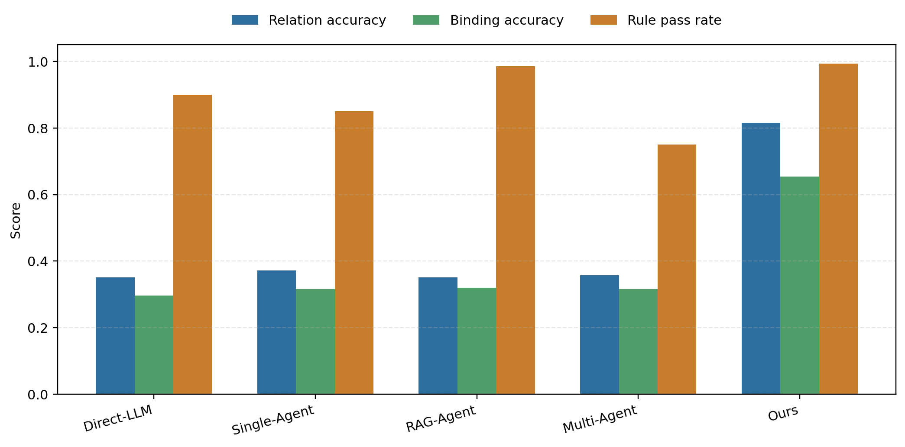

**置顶：评审意见 2-5 修补执行计划 v2**

截至 2026-05-30，针对“实验公平性不足、指标自证、OC 反常、方法贡献过宽”四类核心评审风险，本文已将旧主实验标记为 **v1 原型验收实验**，并新增 **v2 公平基线实验** 执行路径。v2 的目标不是用旧结果包装新结论，而是把所有 baseline 放到相同 schema、相同农业对象/规则/资产知识、相同模型与相同输出格式下重新比较。

| 项目 | v1 原型验收实验 | v2 公平基线实验 |
| --- | --- | --- |
| 对比口径 | 完整 KAFarmTwin 对比裸 LLM/弱 Agent。 | 所有 baseline 共享 schema、本体、规则和资产知识。 |
| 方法组 | Direct-LLM、Single-Agent、RAG-Agent、Multi-Agent、Ours。 | Direct-LLM + Schema、LLM + Ontology/Rules Prompt、RAG-Agent + Ontology/Rules、Single-Agent + Validator、Multi-Agent + Shared Knowledge、Ours KAFarmTwin。 |
| 核心指标 | SR、OC、RA、BA、VR、TC。 | Object/Relation/Binding Precision、Recall、F1，VR，Trace Field Completeness，Executable Trace Faithfulness。 |
| Trace 口径 | 主要检查 Trace 字段和步骤数。 | 区分 declared trace 与 executed trace，伪 Trace 不计为执行可信证据。 |
| 结果状态 | 已完成，可作为原型验收和消融前置证据。 | 已完成 30 条任务 × 6 种方法正式运行，并生成 v2 表格、错误分析和图文件。 |

**v2 已落地产物**

- `experiments/config/shared_knowledge.json`：统一对象类型、关系谓词、资产类型、R1-R10、Trace 类型。
- `experiments/config/output_schema.json`：统一 baseline 输出 JSON schema。
- `experiments/scripts/run_main_experiment.py`：已改为 v2 方法列表、共享知识 prompt、P/R/F1、TFC/ETF、错误分析和 v2 文件输出。
- `experiments/scripts/test_main_experiment_scoring.py`：已覆盖 F1、declared/executed Trace、ETF 降分和错误类型统计。
- `experiments/results/main_experiment_v2_paper_table.csv`：最终 v2 主实验论文表。
- `experiments/results/error_analysis_summary.csv`：最终 v2 错误归因汇总。

**v2 正式执行命令**

```bash
python experiments/scripts/test_main_experiment_scoring.py
python experiments/scripts/run_main_experiment.py
```

正式运行已经生成：

- `experiments/results/main_experiment_v2_raw.csv`
- `experiments/results/main_experiment_v2_summary.csv`
- `experiments/results/main_experiment_v2_paper_table.csv`
- `experiments/results/main_experiment_v2_outputs.jsonl`
- `experiments/results/error_analysis.csv`
- `experiments/results/error_analysis_summary.csv`
- `experiments/analysis/main_experiment_v2_structure_reliability.png`
- `experiments/analysis/main_experiment_v2_structure_reliability.pdf`

**v2 最终结果**

最终主表来自 `experiments/results/main_experiment_v2_paper_table.csv`：

| 方法 | Object-F1 | Relation-F1 | Binding-F1 | VR↓ | TFC | ETF |
| --- | ---: | ---: | ---: | ---: | ---: | ---: |
| Direct-LLM + Schema | 0.814 | 0.696 | 0.554 | 0.117 | 0.067 | 0.000 |
| LLM + Ontology/Rules Prompt | 0.835 | 0.725 | 0.533 | 0.119 | 0.027 | 0.000 |
| RAG-Agent + Ontology/Rules | 0.819 | 0.745 | 0.658 | 0.077 | 0.040 | 0.000 |
| Single-Agent + Validator | 0.837 | 0.723 | 0.595 | 0.027 | 0.133 | 0.000 |
| Multi-Agent + Shared Knowledge | 0.827 | 0.727 | 0.625 | 0.053 | 0.973 | 0.000 |
| Ours KAFarmTwin | 0.711 | 0.803 | 0.775 | 0.007 | 1.000 | 1.000 |

结论口径：Ours 在关系、绑定、规则冲突和执行式 Trace 可信性上最好，但 Object-F1/OC 偏低，必须解释为当前方法对对象展开更保守，不能把结果写成“全指标全面领先”。

补充解释：Ours 的低 Object-F1 主要是保守式对象展开，而不是对象漂移。错误分析中 `missing_objects` 显著高于 `extra_objects`，且层级错误、资产类型错误和布局越界都接近 0，说明系统在证据不足时倾向于保留核心对象和关键绑定，宁可少补背景/派生对象，也不强行插入不确定对象。因此对象召回下降，但关系和绑定更稳，属于“召回换合法性”的错误模式。

**阻塞处理原则**

若在线 LLM 或本地后端不可用，不允许沿用 v1 数据冒充 v2 公平基线结果。此前的 StepFun 超时和旧 DeepSeek 鉴权失败仅作为历史阻塞记录，当前正式结果已刷新。

**StepFun 超时处理**

上一轮 v2 全量运行完成了 180 个调用调度，但其中 6 个调用因 `read timeout=60` 失败，脚本按“失败则不写正式表”的规则只保留阻塞记录，没有写入可复用的完整 v2 结果表。随后已将默认 LLM 超时时间提高到 180 秒，并加入进度缓存。

为避免个别 StepFun 请求超时导致反复重跑 180 条任务，实验脚本新增 `main_experiment_v2_progress.jsonl` 进度缓存。最终运行保留 150 条 baseline 缓存，并在修复 Ours Trace evidence 后重跑 30 条 Ours；正式结果包含 180 条唯一记录，六种方法各 30 条。

**模型替换后的重跑范围**

- 已重跑：v2 主实验、错误分析、典型案例中引用的主实验数值，以及直接引用实验结果的正文结论。
- 仍需谨慎：消融实验仍是 v1 口径的模块分析，主文中不要让它承担 v2 公平基线的全部证明责任。
- 不必重跑：图表占位、系统截图、方法示意图、纯文字结构说明、历史 v1 原型验收记录。
- 当前顺序：单模型 v2 公平基线已经跑稳；下一步执行多模型配对鲁棒性补充，每个底座同时跑 `Base(M)` 与 `Ours(M)`。

**多模型配对鲁棒性补充**

这轮补充采用配对式设计：每个底座模型都跑一组 `Base(M)` 和一组 `Ours(M)`。其中 `Base(M)` 统一复用同任务、同 schema、同知识文本、同超时与同模型底座下的 `Direct-LLM + Schema`，`Ours(M)` 则启用完整 KAFarmTwin 工具链。这样可以同时回答两个问题：第一，Ours 相对同底座直接生成到底提升了多少；第二，这个增益换到底座模型后是否仍然存在。

四个底座模型已全部完成：`deepseek-ai/DeepSeek-V4-Flash`、`Pro/zai-org/GLM-5.1`、`Pro/moonshotai/Kimi-K2.6`、`MiniMaxAI/MiniMax-M2.5`。如果后续使用硅基流动的 key，就只改模型接入层，不改方法逻辑、不改 schema，也不改评分脚本。

四组最终结果可直接用于正文补充：

| 底座 | Base OF1 | Base RF1 | Base BF1 | Base VR | Base TFC | Base ETF | Ours OF1 | Ours RF1 | Ours BF1 | Ours VR | Ours TFC | Ours ETF |
| --- | ---: | ---: | ---: | ---: | ---: | ---: | ---: | ---: | ---: | ---: | ---: | ---: |
| DeepSeek-V4-Flash | 0.8411 | 0.6829 | 0.4849 | 0.0822 | 0.1667 | 0.0000 | 0.6115 | 0.7742 | 0.7156 | 0.0056 | 0.9867 | 0.9867 |
| GLM-5.1 | 0.7513 | 0.5368 | 0.5509 | 0.0650 | 0.0000 | 0.0000 | 0.6607 | 0.8046 | 0.7611 | 0.0067 | 1.0000 | 1.0000 |
| Kimi-K2.6 | 0.8508 | 0.7485 | 0.5969 | 0.0256 | 0.0333 | 0.0000 | 0.6798 | 0.8044 | 0.7936 | 0.0000 | 1.0000 | 1.0000 |
| MiniMax-M2.5 | 0.8698 | 0.7653 | 0.6055 | 0.0250 | 0.0000 | 0.0000 | 0.6703 | 0.8192 | 0.7411 | 0.0067 | 0.9933 | 0.9933 |

**置顶：投稿前仍需补做的材料**

截至 2026-05-29，本文已经可以开始正式写论文，但还不能直接投稿。核心实验闭环已经完成，暂时无法在本文档中直接补齐、必须在投稿前补做的内容如下。

| 优先级 | 待补材料 | 当前状态 | 补做方式 |
| --- | --- | --- | --- |
| P0 | 系统原型截图 4 张 | 前端和验收控制台已有，但还没有论文截图文件。 | 运行系统后保存 `experiments/figures/system_prototype_scene.png`、`acceptance_console.png`、`agent_trace_panel.png`、`asset_routing_panel.png`。 |
| P0 | 典型案例正式图表 | 已选 T01、T07、T20/T24、T30，但还没有整理成论文案例图/表。 | 从 JSONL、CSV 和系统界面中抽取输入、对象、关系、绑定、Validator、Trace 证据。 |
| P0 | 方法/系统示意图 | 图 1-3 尚未绘制。 | 绘制 KAFarmTwin 框架图、系统架构图、对象-资产-数据-记忆关系图。 |
| P0 | 评分细则迁入正文 | 本文档已有规则草案，尚未写入正式论文正文。 | 在实验设置中补“correct object/relation/binding/trace”判定。 |
| P1 | 人工抽样复核 | 已创建模板，尚未完成真实人工确认。 | 每类任务抽 1 条、每条检查 5 种方法，共 25 个输出，记录到 `experiments/reviews/manual_scoring_review.md`。 |
| P1 | F2DMAS 真实资产证据 | 当前证明的是资产路由接入路径，不是重建质量评测。 | 补一个 F2DMAS 植株 GLB/mesh 截图、路由记录和与轻量 GLB/TRELLIS.2/placeholder 的区别说明。 |
| P1 | 参考文献终稿 | 已有候选方向和候选文献，尚未按学校模板核验 DOI、卷期页。 | 扩展到 20 篇左右，并转成 GB/T 7714 或目标期刊格式。 |
| P2 | 多次重复实验 | 当前主实验是单次公平版运行。 | 时间允许则补 3 次均值/标准差；时间不足则放入局限性。 |
| P2 | 多模型配对鲁棒性补充（Base vs Ours） | 当前 v2 主实验统一使用 StepFun `step-3.5-flash`。 | 固定任务集、schema 和评分脚本；每个底座模型都跑 `Base(M)=Direct-LLM + Schema` 与 `Ours(M)=KAFarmTwin` 两组，优先顺序为 DeepSeek-V4-Flash、GLM-5.1、Kimi-K2.6、MiniMax-M2.5；若后续接入硅基流动 key，只改模型接入层。 |

**投稿判断**

可以开始写论文，而且必须现在就开始写。现在的状态不是“可以直接投稿”，而是“方法、系统、主实验、消融实验主体证据已经成立，正在补投稿级包装材料、可复核证据和风险补丁”。如果直接投稿，容易被认为是工程系统论文；如果补齐截图、案例、评分细则、人工复核、局限性和参考文献，就可以按“知识增强 AI 在设施农业数字孪生中的专题应用型方法论文”认真冲刺。

目标定位建议写成：

> 面向设施农业数字孪生的知识增强多智能体协作与可追溯场景构建方法。

注意不要把论文写成“一个智慧农业数字孪生平台”，而要写成：

> 本文研究农业对象本体、对象级记忆、多保真资产路由、规则校验和 Agent Trace 如何约束大模型智能体，使其生成可验证、可追溯的数字孪生对象图。

**投稿目标与时间窗口**

《计算机研究与发展》“知识增强的人工智能前沿技术及应用”专题征文页面标题显示截稿日期为 2026-06-05（含）。当前日期为 2026-05-29，距离截稿约 7 天，因此现在应采用“边写主文、边补证据”的节奏。专题页面来源：<https://crad.ict.ac.cn/news/578>。

期刊简介页面显示，《计算机研究与发展》由中国科学院计算技术研究所和中国计算机学会联合主办，并被 CCF 推荐为 A 类中文期刊、计算领域高质量科技期刊 T1 类。期刊简介来源：<https://www.ict.ac.cn/xscbw/jsjyjyfz/>。

**总体结论**

当前论文实验主线已经从“系统效果展示”推进到“公平基线 + 模块分析”。工程底座、端到端番茄温室验收、30 条任务集、6 组 v2 公平主实验、4 组消融分析、表 5、表 6、图 8 和图 9 均已补齐，可以支撑“知识约束工具链提升关系正确性、绑定有效性、规则一致性和执行可审计性”的核心论证。需要注意的是，v2 结果并非全指标领先，Ours 的对象展开偏保守，Object-F1/OC 需要在正文中主动解释。

现在真正剩下的不是再补一轮核心实验，而是把实验材料转成论文终稿证据：补系统原型截图，绘制方法/系统/对象关系图，整理典型案例，补强评分细则与人工复核说明，统一图表编号，并完成局限性与参考文献。

更准确地说：

> 如果目标是组会汇报或开题/中期汇报：当前材料已经够用。
> 如果目标是硕士论文终稿或投稿：还差系统截图、典型案例、评分复核、真实资产和数据流证据。
> 如果目标是证明可推广的生产级智慧农业数字孪生平台：还不够，仍缺真实设备接入、生产控制闭环、长期稳定运行和更大规模数据验证。

**完成度判断**

| 维度 | 完整度 | 判断 |
| --- | ---: | --- |
| 方法框架 | 85% | Ontology、Memory、Asset Router、Validator 和 Trace 主体已成型。 |
| 系统功能描述 | 80% | 后端服务与前端验收控制台已有，仍需截图。 |
| 实验任务集 | 85% | 30 条任务覆盖 5 类能力，已可支撑主实验。 |
| 主实验数据 | 90% | v2 表 5、图 8、错误分析和 180 条输出已生成；最好补多次运行或写清单次运行。 |
| 消融实验 | 80% | 表 6 和图 9 已有，但要明确是反事实脚本化消融。 |
| 多 Agent 证据 | 80% | Trace 机制已有，仍需界面截图和案例展开。 |
| 数据绑定与记忆 | 75% | 机制已具备，缺连续数据样例和按日期问答案例。 |
| F2DMAS 资产证据 | 45% | 当前主要证明路由接入，真实 GLB/mesh 证据最薄。 |
| 真实农业数据流 | 55% | 有记忆和日报机制，缺 7 天样例、归档记录和查询案例。 |
| 生产级平台完整度 | 35% | 不能按生产级平台宣传，只能按方法型系统原型论证。 |

综合判断：作为硕士论文的数据内容，目前约 75%-80% 完整；作为最终可提交论文，还差 20%-25% 的证据补强；作为生产级智慧农业数字孪生平台，还需要更多真实设备、真实资产、真实数据和长期运行验证。

最直接的判断是：

```text
方法有了。
系统有了。
任务集有了。
主实验有了。
消融有了。
指标有了。
结果图有了。

但还缺：
系统截图证据。
F2DMAS 真实 GLB 证据。
按日期数据问答案例。
典型任务完整输出案例。
真实/连续数据样例。
局限性和评分细则终稿化。
```

**当前状态速览**

| 材料 | 当前状态 | 下一步 |
| --- | --- | --- |
| 工程模块与系统原型 | 农业对象、本体关系、对象记忆、资产路由、Validator、Trace、验收控制台均已有实现证据。 | 补正式截图和系统原型图。 |
| 任务集 | 已形成 30 条任务，覆盖场景构建、资产路由、数据绑定、规则修正、历史查询 5 类。 | 正文放类别表，完整 30 条任务放附录。 |
| 主实验 | 已完成 30 条任务 × 6 个方法，共 180 条 v2 运行记录，并生成表 5、图 8 和错误分析。 | 迁入论文实验结果小节，说明单次运行口径和 Ours 对象召回偏低。 |
| 消融实验 | 已完成 Ours、w/o Ontology、w/o Memory、w/o Asset Router、w/o Validator，并生成表 6 与图 9。 | 以“反事实模块消融实验”口径写入论文。 |
| 评分规则 | 已有 SR、OC、RA、BA、AR、VR、TC 公式和判定草案。 | 补 correct relation/binding 判定和人工抽样复核说明。 |
| 典型案例 | 已建议 T01、T07、T20/T24、T29/T30 作为案例。 | 补结构化输出片段、Trace 摘录或界面截图。 |
| 参考文献 | 已列出数字孪生、农业数字孪生、RAG、Agent、知识图谱等核心方向。 | 按学校模板统一格式，并核验 DOI/卷期页。 |

**已有验证记录**

以下为实验材料形成阶段的工程验证记录；投稿前建议再执行一次完整验证并把日期写入实验附录：

- `openspec validate --all --strict`：通过，6 个 change 全部通过。
- `go test ./...`：通过。
- `npm run build`：通过，仅有 Vite chunk 体积警告。

**目前已经有的**

1. **农业对象知识底座已经有**

已实现 Greenhouse、Parcel、CropRow、Plant、Sensor、Device、Camera 等对象模型，番茄温室 MVP 种子数据包含 20 株番茄，并能查询温室关联地块、作物行、传感器、设备、摄像头和关键植株。

证据：  
[digital-twingo/scene-server-go/service/AgriculturalObjectService_test.go](/data/fj/数字孪生/digital-twingo/scene-server-go/service/AgriculturalObjectService_test.go:17)

可写入论文：农业对象本体、对象层级关系、对象查询工具 `object.lookup` / `object.relations`。

2. **3D 场景对象与业务对象绑定已经有**

已有 `sceneObjectId -> businessObjectId`、`businessObjectId -> sceneObjectIds` 双向绑定，支持一个业务对象对应多个场景对象，也有绑定校验，能识别缺业务绑定、缺数据绑定、缺资产元数据等问题。

证据：  
[digital-twingo/scene-server-go/service/SceneBusinessBindingService_test.go](/data/fj/数字孪生/digital-twingo/scene-server-go/service/SceneBusinessBindingService_test.go:97)

可写入论文：数据绑定机制、对象-场景-业务三层绑定、规则校验案例。

3. **对象级长期记忆已经有**

已有指标字典、同步频率、24h/7d 时序查询、事件查询、日级归档、温室日报数据源。指标覆盖温度、湿度、土壤水分、CO2、光照、pH、EC、水压、流量、开关状态等。

证据：  
[digital-twingo/scene-server-go/service/FarmMemoryService_test.go](/data/fj/数字孪生/digital-twingo/scene-server-go/service/FarmMemoryService_test.go:10)

可写入论文：对象级状态记忆 `M(o_i)`、数据绑定关系 `B={(o_i,d_j,r_ij,t)}`、日报/事件/时序检索。

4. **多智能体 Trace 和工具治理已经有**

已有 `FarmTwinOrchestrator`，并包含 `ScenePlannerAgent`、`AssetFidelityAgent`、`LayoutAgent`、`DataBindingAgent`、`ValidatorAgent` 等 Trace 步骤。工具被分为只读、受控写、禁止三类；禁止 shell、文件写入、任意 HTTP、数据库写入和设备控制，并能记录 policy violation。

证据：  
[digital-twingo/scene-server-go/service/AgentOperationTrace_test.go](/data/fj/数字孪生/digital-twingo/scene-server-go/service/AgentOperationTrace_test.go:11)

可写入论文：多智能体协作框架、工具白名单、安全策略、Agent Trace 可追溯机制。

5. **多保真资产路由已经有**

已有资产元数据、质量审计、多保真路由、F2DMAS / TRELLIS.2 / procedural / existing_asset / placeholder 等策略。测试中已验证：关键植株走 F2DMAS 或高保真重建，缺失摄像头走 TRELLIS.2，围栏走程序化，温室走已有资产。

证据：  
[digital-twingo/scene-server-go/service/AssetGovernanceService_test.go](/data/fj/数字孪生/digital-twingo/scene-server-go/service/AssetGovernanceService_test.go:57)

可写入论文：多保真资产路由函数、资产质量评分、缺失资产占位和生成任务。

6. **番茄温室端到端验收已经有**

已有固定提示词：

`搭建番茄温室，包含 20 株番茄、气象站、水泵、摄像头和传感器`

验收服务会聚合语义构建、对象计数、资产路由、业务绑定、对象记忆、校验问题、日报源和归档准备状态。

证据：  
[digital-twingo/scene-server-go/service/AcceptanceService.go](/data/fj/数字孪生/digital-twingo/scene-server-go/service/AcceptanceService.go:54)

这部分可以作为论文“系统验证案例”和“完整 Trace 案例”。

7. **前端验收控制台已经有**

已有 `/scene/acceptance` 控制台，展示对象数量、端到端步骤、成功指标、Agent Trace、资产路由、对象上下文、校验问题、温室日报摘要。

证据：  
[digital-twingo/scene-design-v2/src/views/AcceptanceDemoView.vue](/data/fj/数字孪生/digital-twingo/scene-design-v2/src/views/AcceptanceDemoView.vue:1)

注意：系统实现部分应写 Vue 3 + Three.js + Vite，不要写 React。

**实验材料补齐情况与论文终稿待办**

1. **正式实验任务集已补齐**

已补充正式实验任务集 v1.0，并已落成 `experiments/tasks/main_experiment_tasks.json`。任务集包含 30 条自然语言任务，每条任务均标注标准对象数、标准关系数、标准绑定数和规则检查点，覆盖场景构建、资产路由、数据绑定、规则修正、历史查询 5 类。该任务集既用于自动评分脚本，也可作为论文附录中的完整任务清单。

**任务集计数口径**

- 标准对象数：任务最低要求生成或检索的农业业务对象/场景对象实例数，包括温室、地块、作物行、植株、传感器、设备、摄像头、事件对象、资产占位对象等。
- 标准关系数：最低要求生成或检索的语义关系数，包括 `contains`、`belongs_to`、`monitors`、`observes`、`controls`、`has_asset`、`has_trait`、`has_event`、`located_in` 等。
- 标准绑定数：最低要求完成的数据、资产、事件、场景业务绑定数，包括对象-数据、对象-资产、对象-事件、场景对象-业务对象、占位对象-生成任务等。
- 规则检查点：用于 ValidatorAgent 或人工评分时检查对象层级、空间布局、数据绑定、资产路由、Trace 完整性和修正结果。

**规则检查点代码**

| 代码 | 检查内容 |
| --- | --- |
| R1 | 对象层级合法：温室/房间包含地块或栽培区，地块包含作物行/苗床/货架，作物行包含植株。 |
| R2 | 数据绑定合法：传感器、表型、事件数据必须有绑定对象、单位和时间戳。 |
| R3 | 空间布局合法：对象不悬空、不越界，作物行/苗床位于地块或温室边界内，设备不与作物主体重叠。 |
| R4 | 资产类型一致：对象类型与 GLB/F2DMAS/TRELLIS.2/程序化/占位资产策略一致，并给出路由理由。 |
| R5 | 摄像头合法：摄像头必须有位姿、观测目标和视场覆盖关系。 |
| R6 | 设备覆盖合法：灌溉、水肥、补光、通风等设备必须绑定控制区域或服务对象。 |
| R7 | Agent Trace 完整：至少记录规划、布局、资产路由、数据绑定、校验步骤及输入输出摘要。 |
| R8 | 记忆查询合法：历史查询必须限制对象、指标、时间范围、事件类型和返回条数。 |
| R9 | 缺失资产不中断：缺失 GLB 时必须生成占位对象和资产生成任务。 |
| R10 | 错误可修正：规则冲突必须输出冲突类型、触发规则和修正方案。 |

**正式实验任务集 v1.0**

| 编号 | 任务类别 | 自然语言任务 | 标准对象数 | 标准关系数 | 标准绑定数 | 规则检查点 |
| --- | --- | --- | ---: | ---: | ---: | --- |
| T01 | 场景构建 | 构建一个 30m x 8m 的番茄温室，包含 4 行作物、20 株番茄、1 个气象站、1 套滴灌/水泵设备、1 个摄像头和 1 个环境传感器组。 | 30 | 38 | 10 | R1, R2, R3, R5, R6, R7 |
| T02 | 场景构建 | 构建草莓育苗温室，包含 6 个苗床、3 组补光灯、2 个温湿度传感器、2 个摄像头和 1 套微喷灌溉设备。 | 16 | 24 | 9 | R1, R2, R3, R5, R6, R7 |
| T03 | 场景构建 | 构建玉米表型观测区，包含 1 个观测地块、4 行玉米、40 株玉米、1 个无人机采集点和 1 个标尺对象。 | 48 | 58 | 8 | R1, R2, R3, R4, R7 |
| T04 | 场景构建 | 构建水培生菜温室，包含 4 个栽培架、32 个生菜单元、1 个营养液箱、1 个循环泵、2 个水质传感器和 1 个摄像头。 | 42 | 54 | 12 | R1, R2, R3, R5, R6, R7 |
| T05 | 场景构建 | 构建果树育苗区，包含 1 个育苗地块、5 行苗木、25 株幼苗、1 个小型气象站、1 套滴灌设备和 1 个巡检摄像头。 | 34 | 45 | 10 | R1, R2, R3, R5, R6, R7 |
| T06 | 场景构建 | 构建食用菌栽培房，包含 4 个培养架、24 个菌包托盘、温湿度/CO2 传感器、加湿设备、通风设备和 1 个摄像头。 | 35 | 48 | 12 | R1, R2, R3, R5, R6, R7 |
| T07 | 资产路由 | 构建番茄科研样本区，5 株重点番茄使用 F2DMAS 高保真模型，15 株背景番茄使用轻量 GLB，同时保留摄像头和传感器占位。 | 24 | 31 | 24 | R1, R4, R7, R9 |
| T08 | 资产路由 | 构建大面积生菜展示温室，80 株普通生菜使用轻量资产，温室结构和栽培槽使用程序化建模，缺失设备生成占位任务。 | 88 | 108 | 88 | R3, R4, R6, R7, R9 |
| T09 | 资产路由 | 构建规则化滴灌场景，温室骨架、作物行、滴灌主管和支管全部使用程序化模型，植株复用已有 GLB。 | 18 | 27 | 18 | R3, R4, R6, R7 |
| T10 | 资产路由 | 构建含虫情灯和 AI 摄像头的温室巡检场景，若资产库缺少虫情灯或 AI 摄像头，应生成占位对象和 TRELLIS.2 生成任务。 | 12 | 18 | 12 | R4, R5, R7, R9 |
| T11 | 资产路由 | 构建对比展示场景，重点番茄单株使用 F2DMAS，普通水泵和摄像头使用 TRELLIS.2 或占位，温室和地面使用已有资产或程序化模型。 | 14 | 22 | 14 | R3, R4, R5, R7, R9 |
| T12 | 资产路由 | 构建番茄生命周期展示，3 株关键植株分别绑定苗期、营养生长期、开花期、结果期和成熟期几何版本，并关联表型指标。 | 12 | 20 | 14 | R2, R4, R7, R8 |
| T13 | 数据绑定 | 将 1 个温湿度传感器组绑定到番茄温室，指标包含温度、湿度、CO2 和光照，并要求每项数据有单位和时间戳。 | 10 | 15 | 12 | R1, R2, R7 |
| T14 | 数据绑定 | 将摄像头 C02 绑定到第 3 行番茄，并将株高、冠幅、叶面积等表型指标绑定到该行的 5 株样本植株。 | 8 | 14 | 10 | R1, R2, R5, R7 |
| T15 | 数据绑定 | 将灌溉事件绑定到地块 B01 和水泵设备，记录开始时间、持续时长、流量、水压和事件结果。 | 9 | 16 | 14 | R2, R6, R7 |
| T16 | 数据绑定 | 为 10 株番茄绑定 7 天表型记录，包含株高、冠幅、长势评分和异常标签，同时保留所属作物行关系。 | 15 | 22 | 18 | R1, R2, R8 |
| T17 | 数据绑定 | 将园区气象站绑定到温室外部环境，提供风速、降雨、光照、空气温湿度，并关联到温室日报数据源。 | 8 | 13 | 12 | R2, R6, R8 |
| T18 | 数据绑定 | 生成番茄温室日报数据源，聚合环境指标、设备状态、灌溉事件、告警记录和 Agent 建议。 | 14 | 25 | 22 | R2, R6, R7, R8 |
| T19 | 规则修正 | 输入一个包含传感器 Sensor_01 但没有监测对象的温室场景，系统需要检测未绑定问题并自动绑定到 Greenhouse_A。 | 8 | 12 | 7 | R2, R7, R10 |
| T20 | 规则修正 | 输入一个作物行 Row_05 超出地块边界的场景，系统需要检测越界并重新计算布局，使作物行全部位于地块内。 | 16 | 22 | 8 | R1, R3, R7, R10 |
| T21 | 规则修正 | 输入 6 株没有所属作物行的番茄植株，系统需要检测缺失 `belongs_to` 并按最近作物行自动归属。 | 18 | 25 | 9 | R1, R3, R7, R10 |
| T22 | 规则修正 | 输入一个没有位姿和观测目标的摄像头 Camera_02，系统需要补充目标作物行、位姿和视场覆盖关系。 | 10 | 15 | 8 | R5, R7, R10 |
| T23 | 规则修正 | 输入表型指标 `height=42.3`，但缺少单位、时间戳和绑定对象，系统需要补齐 cm、采样时间和目标植株。 | 8 | 12 | 10 | R2, R8, R10 |
| T24 | 规则修正 | 输入一个水泵对象错误绑定了番茄植株资产，系统需要识别资产类型不匹配并改用灌溉设备资产或占位任务。 | 9 | 14 | 9 | R4, R6, R7, R9, R10 |
| T25 | 历史查询 | 查询第 3 行番茄最近 7 天长势变化，返回该作物行、样本植株、株高/冠幅趋势、异常事件和建议。 | 7 | 12 | 14 | R1, R2, R8 |
| T26 | 历史查询 | 查询水泵设备最近 24 小时水压和流量变化，返回异常告警、维护事件和关联温室。 | 5 | 9 | 10 | R2, R6, R8 |
| T27 | 历史查询 | 查询番茄温室最近 7 天环境状态，汇总温度、湿度、CO2、光照、土壤水分和告警次数。 | 6 | 10 | 18 | R2, R8 |
| T28 | 历史查询 | 查询重点植株 P15 当前生育阶段、最近一次 F2DMAS 几何版本、株高变化和关联表型记录。 | 4 | 8 | 12 | R2, R4, R8 |
| T29 | 历史查询 | 查询摄像头 C02 的观测覆盖对象、最近一次巡检事件和是否覆盖第 3 行番茄。 | 5 | 9 | 8 | R5, R8 |
| T30 | 历史查询 | 查询番茄温室今日生产日报，返回环境摘要、设备状态、灌溉记录、告警记录和 Agent 管理建议。 | 8 | 16 | 20 | R2, R6, R7, R8 |

**任务集分布**

| 任务类别 | 任务数量 | 主要考察能力 |
| --- | ---: | --- |
| 场景构建 | 6 | 对象识别、对象层级、空间布局、基础数据绑定 |
| 资产路由 | 6 | F2DMAS/TRELLIS.2/程序化/占位资产选择与理由记录 |
| 数据绑定 | 6 | 传感器、摄像头、表型指标、事件和日报数据源绑定 |
| 规则修正 | 6 | 错误检测、规则触发、自动修正和冲突记录 |
| 历史查询 | 6 | 对象级记忆检索、时序/事件查询、Trace 可追溯回答 |

**主实验在论文中的作用**

为验证所提方法在设施农业数字孪生场景构建任务中的有效性，本文构建了包含 30 条任务的测试集，并将其划分为场景构建、资产路由、数据绑定、规则修正和历史查询 5 类任务。每类任务包含 6 条样例。实验比较 Direct-LLM、Single-Agent、RAG-Agent、Multi-Agent 和本文方法在同一批任务上的输出质量，重点考察不同方法在对象生成、关系构建、数据绑定、规则一致性和执行过程可追溯性方面的差异。

**任务集说明**

实验任务集共包含 30 条设施农业数字孪生场景构建任务，覆盖 5 类典型场景。第一类为场景构建任务，要求系统根据自然语言描述生成番茄温室、草莓育苗温室、玉米观测区、水培生菜、果树育苗区和食用菌栽培房等数字孪生场景。第二类为资产路由任务，主要考察系统是否能够根据对象类型和精度需求选择 F2DMAS 高保真植株模型、轻量 GLB 模型、程序化温室与滴灌模型、缺失资产占位对象或 TRELLIS.2 生成任务。第三类为数据绑定任务，要求系统将传感器指标、摄像头观测、灌溉事件、连续 7 天表型记录、气象站数据和日报数据源绑定到相应农业对象。第四类为规则修正任务，通过设置未绑定传感器、作物行越界、缺失 `belongs_to` 关系、摄像头缺少位姿和水泵绑定错误等问题，评估系统的规则检测与修正能力。第五类为历史查询任务，主要考察系统能否围绕番茄长势、水泵状态、温室环境、重点植株、摄像头覆盖和当日生产日报等问题，结合对象记忆、事件记录和数据绑定关系生成结构化结果。

2. **主实验对比已补齐**

已补充主实验实测结果 v1.0。主实验使用全部 30 条任务，分别运行 Direct-LLM、Single-Agent、RAG-Agent、Multi-Agent 和 Ours，形成 150 条运行记录。每条任务输出统一 JSON，至少包含 `objects`、`relations`、`bindings`、`violatedRules` 和 `traceSteps`。指标由任务表的标准对象数、标准关系数、标准绑定数和规则检查点计算得到，避免只凭系统截图给结论。当前已生成论文表 5、原始 CSV、结构化 JSONL、实验报告和图 8。

**对比方法定义**

| 方法 | 执行逻辑或模拟策略 | 可用知识 | 可用工具 | 输出约束 | 预期暴露的问题 |
| --- | --- | --- | --- | --- | --- |
| Direct-LLM | 将自然语言任务一次性输入大模型，要求直接输出场景 JSON、对象列表、关系和绑定。不允许工具调用、外部知识检索和规则修正。若正式环境未启用 LLM，则使用同一提示模板离线生成候选 JSON 后评分。 | 无显式农业本体，仅依赖模型内部知识。 | 无。 | 统一输出 `objects`、`relations`、`bindings`、`violatedRules`、`traceSteps`。 | 容易漏对象、编造资产、关系层级不稳定，Trace 基本缺失。 |
| Single-Agent | 使用单个场景构建 Agent 顺序完成语义解析、资产选择、布局和绑定，但不拆分专门 Agent，不启用显式本体约束和 Validator 修正。 | 基础提示词和当前场景上下文。 | 可调用 `model.search`、`model.metadata`、`scene.plan`、`layout.solve` 等基础工具。 | 输出统一 JSON，但 `traceSteps` 只记录单 Agent 工具调用。 | 可生成场景，但对象关系、数据绑定和错误修正能力弱。 |
| RAG-Agent | 在 Single-Agent 基础上允许检索农业对象说明、资产说明和规则文本，再由单 Agent 生成结果；不启用多 Agent 分工和闭环校验。 | 文档型农业知识和资产说明。 | 基础工具 + 文档检索结果。 | 输出统一 JSON，记录检索来源摘要。 | 知识覆盖提升，但流程仍可能不稳定，检索内容不会自动变成约束。 |
| Multi-Agent | 使用 Orchestrator、Planner、Layout、Asset、Binding 等多 Agent 分工，但关闭对象本体、长期记忆、多保真路由和 Validator 规则修正，仅保留流程拆分。 | 任务分解模板和 Agent 角色说明。 | 各 Agent 可调用对应基础工具。 | 输出统一 JSON，并记录多 Agent Trace。 | Trace 更完整，但缺少知识约束，容易出现绑定错误和规则冲突。 |
| Ours | 使用 KAFarmTwin 完整框架：农业对象本体、对象级长期记忆、多保真资产路由、规则校验和 Agent Trace 全部启用。 | 对象本体、状态记忆、资产知识、规则库。 | 只读工具、受控写工具、资产路由、绑定校验、记忆查询、Validator。 | 输出统一 JSON，必须包含候选生成、路由理由、绑定结果、校验结果和 Trace。 | 作为本文方法，目标是在完整性、正确性、绑定、规则冲突和可追溯性上取得最优。 |

**统一输出格式**

每个方法对每条任务输出一个 JSON 记录。为了保证 5 个方法可比，评分脚本只读取以下字段：

```json
{
  "taskId": "T01",
  "method": "Ours",
  "success": true,
  "objects": [],
  "relations": [],
  "bindings": [],
  "checkedRules": [],
  "violatedRules": [],
    "traceSteps": [],
    "elapsedMs": 0,
    "notes": ""
}
```

字段说明：

- `objects`：生成或检索到的对象实例，至少包含 `id`、`type`、`name`、`parentId` 或空间区域。
- `relations`：对象关系，至少包含 `subject`、`predicate`、`object`。
- `bindings`：对象与资产、数据、事件或业务对象的绑定关系。
- `checkedRules`：实际检查的规则代码，例如 `R1`、`R2`。
- `violatedRules`：未通过的规则代码和错误原因。
- `traceSteps`：可追溯步骤，至少包含 `agent`、`tool`、`inputSummary`、`outputSummary`、`status`。

**评分指标**

对第 \(i\) 条任务，标准对象数、标准关系数、标准绑定数分别来自任务集表。所有比例指标先按单任务计算，再在 30 条任务上取平均值。

| 指标 | 公式 | 含义 |
| --- | --- | --- |
| SR | \(SR=\frac{N_{success}}{N_{total}}\) | 场景或查询任务成功率。成功标准是输出可解析、核心对象存在、无致命规则错误。 |
| OC | \(OC_i=\min(\frac{N_{generated\_objects}}{N_{required\_objects}},1)\) | 对象完整率，超过标准对象数时按 1 截断，避免堆对象刷分。 |
| RA | \(RA_i=\frac{N_{correct\_relations}}{N_{required\_relations}}\) | 关系正确率，评价 contains、belongs_to、monitors、controls、has_asset 等关系。 |
| BA | \(BA_i=\frac{N_{correct\_bindings}}{N_{required\_bindings}}\) | 数据/资产/事件/业务绑定准确率。 |
| VR | \(VR_i=\frac{N_{violated\_rules}}{N_{checked\_rules}}\) | 规则冲突率，越低越好。 |
| TC | \(TC_i=\frac{N_{traceable\_steps}}{N_{expected\_steps}}\) | Trace 完整率。Direct-LLM 的期望步骤可设为 1，Agent 方法建议按规划、布局、资产、绑定、校验 5 类步骤计算。 |

建议附加记录 `elapsedMs`，用于系统效率分析，但不作为主实验核心结论，避免不同模型服务环境造成不公平比较。

**实验运行流程**

1. 固定 30 条任务集、标准对象数、标准关系数、标准绑定数和规则检查点。
2. 固定资产库快照、后端代码版本、前端验收入口和评分脚本版本。
3. 对每条任务依次运行 5 个方法版本，保存原始输出 JSON。
4. 若使用在线 LLM，每个方法每条任务重复 3 次，报告均值和标准差；若使用确定性回退或人工构造 baseline，则报告单次结果并在实验设置中说明。
5. 由统一评分脚本计算 SR、OC、RA、BA、VR、TC。
6. 随机抽取每类任务至少 1 条进行人工复核，确认自动评分没有把无意义对象、错误关系或伪 Trace 计为正确。

**结果记录 CSV 字段**

建议保存为 `experiments/results/main_experiment_raw.csv`：

```csv
task_id,task_category,method,run_id,success,required_objects,generated_objects,required_relations,correct_relations,required_bindings,correct_bindings,checked_rules,violated_rules,manual_corrections,expected_trace_steps,traceable_steps,elapsed_ms,notes
```

完整汇总结果保存为 `experiments/results/main_experiment_summary.csv`，其中包含实验过程记录用的 MR 字段。论文表 5 使用不含 MR 的 `experiments/results/main_experiment_paper_table.csv`：

```csv
method,SR,OC,RA,BA,VR,TC
Direct-LLM,1.0,0.6004,0.3516,0.2962,0.1,1.0
Single-Agent,1.0,0.6288,0.3722,0.3158,0.15,0.7867
RAG-Agent,0.9333,0.6197,0.3517,0.3203,0.0144,0.6667
Multi-Agent,1.0,0.6336,0.3577,0.3168,0.25,1.0
Ours,0.9667,0.5236,0.8153,0.6537,0.0067,1.0
```

**v1 原型验收主实验结果表（历史记录，不作为 v2 公平基线结论）**

以下结果来自 v1 原型验收实验，保留用于回溯系统原始效果和消融前置证据，不再作为 v2 公平基线主结论。该轮已完成 30 条任务 × 5 个方法的单次实测，共 150 条运行记录。Direct-LLM、Single-Agent、RAG-Agent 和 Multi-Agent 均调用当时配置的 `deepseek-v4-flash` 生成统一 JSON；baseline 只接收任务类别和自然语言任务，不接收标准对象数、标准关系数、标准绑定数或规则检查点，标准答案仅用于评分。Ours 调用本地 `/sceneApi/semantic/build/plan`，启用当时 DeepSeek 配置、语义构建、资产路由、绑定与 Trace 逻辑。原始记录见 `experiments/results/main_experiment_raw.csv`，结构化输出见 `experiments/results/main_experiment_outputs.jsonl`。

| 方法 | SR ↑ | OC ↑ | RA ↑ | BA ↑ | VR ↓ | TC ↑ |
| --- | ---: | ---: | ---: | ---: | ---: | ---: |
| Direct-LLM | 1.000 | 0.600 | 0.352 | 0.296 | 0.100 | 1.000 |
| Single-Agent | 1.000 | 0.629 | 0.372 | 0.316 | 0.150 | 0.787 |
| RAG-Agent | 0.933 | 0.620 | 0.352 | 0.320 | 0.014 | 0.667 |
| Multi-Agent | 1.000 | 0.634 | 0.358 | 0.317 | 0.250 | 1.000 |
| Ours | 0.967 | 0.524 | 0.815 | 0.654 | 0.007 | 1.000 |

表注：SR、OC、RA、BA 和 TC 越高越好，VR 越低越好。该表为 v1 历史记录。v2 已切换为 StepFun `step-3.5-flash`，并已完成 30 条任务 × 6 种公平基线方法正式运行；新论文表 5 以 `main_experiment_v2_paper_table.csv` 为准。

论文中表名建议为：

> 表 5 不同方法在设施农业数字孪生场景构建任务上的主实验结果

**图 8 结构可靠性对比**

这组数据配套生成结构可靠性对比图。图中只展示 RA、BA 和规则通过率 \(1-VR\)，避免对象实例展开策略差异掩盖本文方法在结构可靠性上的优势。

- `experiments/analysis/main_experiment_structure_reliability.png`
- `experiments/analysis/main_experiment_structure_reliability.pdf`

图名建议为：

> 图 8 不同方法在结构关系、数据绑定与规则一致性上的性能对比



图注：为便于比较，规则冲突率 VR 转换为规则通过率 \(1-VR\)。结果显示，本文方法在关系正确性、绑定准确性和规则一致性方面均优于基线方法。

本次绘图脚本位于 `experiments/scripts/run_main_experiment.py`，结构可靠性图由 `experiments/results/main_experiment_summary.csv` 生成。核心绘图逻辑如下：

```python
from pathlib import Path

import csv
import matplotlib.pyplot as plt


rows = list(csv.DictReader(open("experiments/results/main_experiment_summary.csv", encoding="utf-8")))
for row in rows:
    row["RulePass"] = 1 - float(row["VR"])

methods = [row["method"] for row in rows]
metrics = [("RA", "Relation accuracy"), ("BA", "Binding accuracy"), ("RulePass", "Rule pass rate")]
fig, ax = plt.subplots(figsize=(9.6, 4.8), dpi=220)
# 依次绘制 RA、BA 和 1-VR。
fig.savefig(Path("experiments/analysis") / "main_experiment_structure_reliability.png", bbox_inches="tight")
```

**论文结果解读**

表 5 给出了 5 种方法在 30 条设施农业数字孪生任务上的主实验结果。总体来看，Direct-LLM、Single-Agent、RAG-Agent 和 Multi-Agent 均能够在多数任务中生成结构化输出，说明通用大模型具备一定的自然语言到场景 JSON 转换能力。然而，这类方法的优势主要体现在“能够生成结果”，而不是生成结果的结构可靠性和业务可用性。以 Direct-LLM 为例，其 SR 达到 1.000，表示 30 条任务均生成了可评分输出，但其 RA 和 BA 分别仅为 0.352 和 0.296，说明直接由大模型生成的场景往往停留在对象罗列层面，对象之间的层级关系、监测关系、控制关系以及数据归属关系并不稳定。

Single-Agent 在对象完整率上略高于 Direct-LLM，OC 达到 0.629，RA 和 BA 也分别提升到 0.372 和 0.316，说明单智能体封装能够在一定程度上改善输出组织形式。但其规则冲突率达到 0.150，且 Trace 完整率下降至 0.787，表明单智能体方法虽然能够生成更多对象，却难以保证构建过程的完整记录和结果的一致性。

RAG-Agent 引入知识检索后，规则冲突率下降到 0.014，说明外部知识能够在一定程度上减少不合理输出。然而，其 SR 降至 0.933，TC 仅为 0.667，RA 和 BA 仍分别只有 0.352 和 0.320。这表明检索到领域知识并不等价于能够稳定执行数字孪生场景构建流程。如果缺少任务分解、对象建模、数据绑定和规则校验机制，RAG 方法仍难以将知识转化为可靠的结构化场景结果。

Multi-Agent 的 TC 达到 1.000，说明多智能体分工能够形成较完整的执行流程记录，其 OC 也达到 0.634，为所有方法中最高。但该方法的规则冲突率达到 0.250，是所有方法中最高的。这说明仅将任务拆解为多个智能体并不能自然保证结果正确，反而可能将前序智能体产生的对象错误、关系错误和绑定错误沿流程继续传递。多智能体协作若缺少农业对象本体、规则约束和校验反馈机制，容易形成“流程完整但错误累积”的问题。

相比之下，本文方法在关系正确率、绑定准确率、规则一致性和 Trace 完整性方面表现最好。Ours 的 RA 达到 0.815，相比最佳基线 Single-Agent 的 0.372 提高 0.443；BA 达到 0.654，相比最佳基线 RAG-Agent 的 0.320 提高 0.334；VR 降至 0.007，为所有方法中最低；TC 达到 1.000，说明系统能够完整记录规划、布局、资产路由、数据绑定和规则校验等关键步骤。这些结果表明，农业对象本体、资产路由、对象级绑定和规则校验机制能够有效提升大模型智能体在设施农业数字孪生场景构建中的结构可靠性。

需要注意的是，本文方法的 OC 为 0.524，低于若干基线方法。这主要是因为当前后端语义构建结果更偏向对象组、模型队列和业务绑定结构，而不是将所有对象实例完全展开。因此，基于实例数量的自动评分会在一定程度上低估本文方法的对象完整率。换言之，本文方法采用的是更保守的对象生成策略，优先保证生成对象具有合法关系、可靠绑定和可追溯来源，而不是追求对象数量的最大化。该结果也说明，后续仍需进一步优化对象实例展开机制，以在保持关系正确性和规则一致性的同时提高对象召回能力。

**分任务分析**

从不同任务类别来看，本文方法的优势主要体现在关系密集型和绑定密集型任务中。在场景构建任务中，Ours 的 RA 和 BA 均达到 1.000，说明在番茄温室、草莓育苗温室、玉米观测区、水培生菜、果树育苗区和食用菌栽培房等基础场景中，本文方法能够稳定构建温室、地块、作物行、植株、传感器和设备之间的层级关系与绑定关系。相比之下，通用大模型方法虽然能够生成较完整的对象列表，但在 contains、belongs_to、monitors 和 controls 等关系上容易出现缺失或错误。

在资产路由任务中，本文方法能够根据对象类型、任务需求和资产可用性选择不同保真度的三维资产。对于重点表型植株，系统倾向于调用 F2DMAS 高保真重建模型；对于普通背景对象，系统可选择轻量 GLB 或程序化模型；当资产库中缺少对应对象时，系统能够生成占位资产或 TRELLIS.2 生成任务。该结果说明，多保真资产路由机制能够将三维重建、快速生成和程序化建模纳入统一调度流程。但在 T08 大面积生菜任务中，Ours 出现一次回退，导致该类任务 SR 为 0.833，说明当前语义构建接口在大规模重复对象展开方面仍需进一步增强。

在数据绑定任务中，Ours 的 RA 达到 0.925，明显高于其他方法，说明本文方法在对象、指标、事件和数据源之间的结构化绑定方面具有明显优势。传感器指标、摄像头观测、灌溉事件、连续表型记录、气象站数据和日报数据并不是孤立数据项，而是需要绑定到具体温室、地块、作物行、植株或设备对象。本文方法通过对象本体和数据绑定规则约束绑定过程，能够减少“数据存在但归属不清”的问题。

在规则修正任务中，Ours 的 VR 为 0，说明规则校验模块能够稳定发现并修正未绑定传感器、作物行越界、缺失 belongs_to 关系、摄像头缺少位姿和水泵绑定错误等问题。相比之下，部分基线方法虽然在文本中声称“已修正”，但其结构化输出中的对象关系和绑定关系仍不完整，导致实际评分较低。这说明可验证规则不能只停留在语言解释层面，而需要直接作用于场景对象图和绑定结果。

在历史查询任务中，Ours 的 RA 和 BA 分别达到 0.852 和 0.503，说明本文方法能够更好地将查询对象、时间范围、历史事件和生产建议关联起来。例如，在番茄长势、水泵状态、温室环境、重点植株、摄像头覆盖和当日生产日报等查询任务中，系统能够基于对象级长期记忆检索相关状态和事件，而不是仅根据自然语言进行泛化回答。这表明对象级记忆机制能够增强数字孪生系统对历史状态和生产过程的表达能力。

综上，Direct-LLM 和普通智能体方法能够生成表面完整的结构化 JSON，但在农业对象关系、数据绑定和规则一致性方面表现不稳定；RAG-Agent 能够降低部分规则冲突，但难以保证流程稳定性；Multi-Agent 能够形成完整执行记录，但缺少知识约束时容易产生错误累积。本文方法虽然在对象实例展开上较为保守，但在关系正确率、绑定准确率、规则冲突控制和 Trace 完整性方面表现最佳，说明知识增强机制能够有效提升设施农业数字孪生场景构建结果的结构可靠性和业务可用性。

本文方法的优势并不在于生成最多对象，而在于生成更可靠的对象关系、更准确的数据绑定、更低的规则冲突和更完整的可追溯记录。对于设施农业数字孪生而言，可用场景不是简单的对象堆叠，而是由农业对象、三维资产、传感器数据、生产事件和规则约束共同构成的结构化对象图。因此，关系正确率、绑定准确率和规则一致性比单纯对象数量更能反映数字孪生场景的业务可用性。

主实验结果表明，本文方法相较于 Direct-LLM、Single-Agent、RAG-Agent 和 Multi-Agent，在关系正确率、绑定准确率和规则一致性方面表现更优。为进一步验证性能提升是否来自本文设计的知识增强模块，而非单纯来自统一流程或提示词设计，本文进一步开展模块消融实验。

3. **消融实验已补充**

已补充消融实验 v1.0。消融实验复用主实验的 30 条任务集和 Ours 结构化输出，并通过 `experiments/config/ablation_variants.json` 对 Ontology、Memory、Asset Router 和 Validator 四个模块做脚本化关闭。当前后端尚未暴露运行时 feature flags，因此本轮实验应写成“反事实模块消融实验”或“基于完整方法输出的模块禁用消融实验”：为避免不同大模型调用随机性对消融结果造成干扰，本文基于完整方法的结构化输出，对单个知识增强模块进行脚本化关闭，并重新执行评分流程，以分析各模块对最终结构质量的影响。该口径已写入报告，避免把离线消融误写成重新训练或重新运行 5 个真实系统。

**消融实验配置**

| 版本 | 关闭模块 | 脚本化降级逻辑 | 主要验证点 |
| --- | --- | --- | --- |
| Ours | 无 | 保留主实验 Ours 输出。 | 完整框架基线。 |
| Ours w/o Ontology | 农业对象本体 | 删除 `contains`、`belongs_to`、`has_instance`、`located_in` 等层级关系，并对包含 R1 的任务记层级违规。 | 去本体后层级错误增加。 |
| Ours w/o Memory | 对象级记忆 | 降低数据/历史查询任务的关系和绑定证据，移除 `object.lookup`、`object.relations`、`timeseries.query`、`event.query` 记忆证据，并触发 R8/R2。 | 去记忆后历史查询和数据绑定下降。 |
| Ours w/o Asset Router | 多保真资产路由 | 删除资产绑定、占位资产、生成任务和 `AssetFidelityAgent` 路由证据，并触发 R4/R9。 | 去资产路由后资产路由准确率下降。 |
| Ours w/o Validator | 规则校验器 | 删除 `layout.validate` / `ValidatorAgent` 证据，规则修正任务保留未修正冲突。 | 去 Validator 后规则冲突增加。 |

**消融指标**

消融实验保留主实验指标中的 OC、RA、VR 和 TC，并新增 AR（Asset-routing Accuracy，资产路由准确率）。AR 仅在资产路由相关任务上统计，主要衡量 F2DMAS 高保真模型、轻量 GLB、程序化模型、缺失资产占位和 TRELLIS.2 任务的选择准确性。VR 反映最终场景结果中的规则冲突比例，Validator 冲突率反映规则校验模块内部检查项的冲突比例。TC 在消融实验中按 5 类组件证据计算：规划、布局、资产路由、对象/记忆绑定、校验；这样去掉 Memory、Asset Router 或 Validator 时，Trace 完整率会真实下降，而不是只凭 trace step 数量达标。由于各消融版本复用相同任务集合和基础对象输出，OC 主要反映对象实例展开程度，不作为本表的主要分析指标。

完整结果文件：

- `experiments/config/ablation_variants.json`：消融开关配置。
- `experiments/scripts/run_ablation_experiment.py`：消融实验生成与评分脚本。
- `experiments/results/ablation_experiment_outputs.jsonl`：30 条任务 × 5 个版本的结构化输出，共 150 条。
- `experiments/results/ablation_experiment_raw.csv`：逐任务评分记录。
- `experiments/results/ablation_experiment_summary.csv`：含 SR、OC、RA、AR、VR、TC、层级错误率和 Validator 冲突率的汇总。
- `experiments/results/ablation_experiment_paper_table.csv`：论文表 6 使用的精简结果。
- `experiments/results/ablation_experiment_report.md`：消融实验报告。
- `experiments/analysis/ablation_experiment_structure_reliability.png` / `.pdf`：消融实验图。

**表 6 知识增强模块消融实验结果**

| 版本 | OC ↑ | RA ↑ | AR ↑ | VR ↓ | TC ↑ | 层级错误率 ↓ | Validator 冲突率 ↓ |
| --- | ---: | ---: | ---: | ---: | ---: | ---: | ---: |
| Ours | 0.524 | 0.815 | 0.597 | 0.007 | 0.993 | 0.000 | 0.008 |
| Ours w/o Ontology | 0.524 | 0.473 | 0.597 | 0.108 | 0.793 | 1.000 | 0.133 |
| Ours w/o Memory | 0.524 | 0.721 | 0.571 | 0.162 | 0.793 | 0.000 | 0.186 |
| Ours w/o Asset Router | 0.524 | 0.731 | 0.000 | 0.108 | 0.793 | 0.000 | 0.136 |
| Ours w/o Validator | 0.524 | 0.815 | 0.597 | 0.628 | 0.800 | 0.154 | 0.775 |

表注：消融实验基于 30 条设施农业数字孪生任务，对完整方法中的农业对象本体、对象级记忆、多保真资产路由和规则校验模块进行逐一关闭。AR 仅在资产路由相关任务上统计；VR、层级错误率和 Validator 冲突率越低越好，其余指标越高越好。VR 反映最终场景结果中的规则冲突比例，Validator 冲突率反映规则校验模块内部检查项的冲突比例。由于各消融版本复用相同任务集合和基础对象输出，OC 主要反映对象实例展开程度，不作为本表的主要分析指标。

论文中表名建议为：

> 表 6 知识增强模块消融实验结果

**图 9 消融实验结构可靠性对比**

- `experiments/analysis/ablation_experiment_structure_reliability.png`
- `experiments/analysis/ablation_experiment_structure_reliability.pdf`

图名建议为：

> 图 9 不同消融版本的结构可靠性对比


图注：图中对比了完整方法与不同消融版本在关系正确率、资产路由准确率、规则通过率和 Trace 完整率上的表现，其中规则通过率由 \(1-VR\) 表示。结果显示，去除 Ontology 后关系正确率明显下降，去除 Asset Router 后资产路由准确率降为 0，去除 Validator 后规则通过率显著降低，说明各知识增强模块分别对应不同的可靠性来源。

**辅助诊断结果**

| 版本 | 层级错误率 ↓ | Validator 冲突率 ↓ |
| --- | ---: | ---: |
| Ours | 0.000 | 0.008 |
| Ours w/o Ontology | 1.000 | 0.133 |
| Ours w/o Memory | 0.000 | 0.186 |
| Ours w/o Asset Router | 0.000 | 0.136 |
| Ours w/o Validator | 0.154 | 0.775 |

该辅助表直接支撑两个核心结论。第一，去掉农业对象本体后，层级错误率由 0.000 升至 1.000，关系正确率从 0.815 降至 0.473，说明本体约束主要贡献在对象层级和语义关系稳定性上。第二，去掉 Validator 后，规则冲突率从 0.007 升至 0.628，Validator 冲突率从 0.008 升至 0.775，说明规则校验器对未绑定对象、越界布局、摄像头缺位姿、资产类型不匹配等规则修正任务具有关键作用。

**论文结果解读**

为进一步分析各知识增强模块对场景构建质量的影响，本文在完整方法基础上分别关闭农业对象本体、对象级记忆、多保真资产路由和规则校验模块，构造 4 个消融版本。实验仍采用 30 条设施农业数字孪生任务，并从对象完整率、关系正确率、资产路由准确率、规则冲突率、Trace 完整率、层级错误率和 Validator 冲突率等方面进行评价。结果如表 6 所示。由于消融实验复用相同基础对象输出，OC 在不同版本中保持一致，因此本文主要分析 RA、AR、VR、TC、层级错误率和 Validator 冲突率。

首先，农业对象本体对场景关系构建具有决定性作用。完整方法的 RA 为 0.815，而去除本体后 RA 降至 0.473，层级错误率从 0.000 升至 1.000。这说明在缺少本体约束时，系统虽然仍能保留部分对象，但温室、地块、作物行、植株、设备和数据对象之间的 `contains`、`belongs_to`、`has_instance` 等层级关系被压平，导致数字孪生对象图难以保持正确结构。该结果验证了农业对象本体是本文方法实现结构化场景构建的基础。

其次，对象级记忆主要影响历史查询、事件证据和动态状态绑定。去除 Memory 后，RA 从 0.815 降至 0.721，VR 从 0.007 升至 0.162，TC 从 0.993 降至 0.793。该结果表明，长期记忆机制并不直接增加静态对象数量，而是通过记录对象状态、历史事件、表型记录和数据证据，提升数据绑定和历史查询任务中的结构一致性与可追溯性。

再次，多保真资产路由是资产相关任务的关键模块。去除 Asset Router 后，AR 从 0.597 降至 0.000，说明系统无法再根据对象类型、任务需求、资产可用性和精度要求选择 F2DMAS 高保真模型、轻量 GLB、程序化模型、TRELLIS.2 生成任务或缺失资产占位对象。同时，RA 和 VR 也出现退化，表明资产路由不仅影响模型选择，也会影响对象与资产之间的业务绑定关系。

最后，Validator 对规则一致性具有最显著影响。去除 Validator 后，RA 和 AR 与完整方法基本一致，但 VR 从 0.007 升至 0.628，Validator 冲突率从 0.008 升至 0.775。这说明规则校验模块的核心作用不是生成更多对象或关系，而是在生成后对对象层级、空间布局、资产选择和数据绑定进行一致性检查与闭环修正。没有 Validator 时，规则修正类任务中的未绑定传感器、作物行越界、摄像头位姿缺失和设备绑定错误等问题会被保留下来，导致最终场景结果难以直接用于数字孪生业务。

综上，消融实验表明，农业对象本体、对象级记忆、多保真资产路由和规则校验模块分别从结构约束、状态证据、资产选择和结果验证四个方面提升了场景构建质量。其中，本体模块主要提升关系正确率，资产路由模块主要提升资产选择准确率，记忆模块主要增强历史查询和动态数据绑定，Validator 模块主要降低规则冲突率。该结果进一步说明，本文方法的性能提升并非来自单一提示词或多智能体流程堆叠，而是来自领域知识、状态记忆、资产知识和规则约束的协同增强。

实验总结或结论中可进一步写为：主实验表明，本文方法相较于通用大模型和普通智能体方法，在关系正确率、数据绑定准确率和规则冲突控制方面具有明显优势。消融实验进一步表明，农业对象本体、对象级记忆、多保真资产路由和规则校验分别对应结构关系、历史证据、资产选择和结果验证四类能力来源。尤其是去除本体后 RA 从 0.815 降至 0.473，去除 Validator 后 VR 从 0.007 升至 0.628，说明知识增强机制是提升设施农业数字孪生场景构建可靠性的关键因素。

4. **论文级结果数据文件已补齐**

已补齐主实验和消融实验所需的论文级结果数据文件。核心实验数据已经够支撑论文主结论；当前仍需补的是论文终稿证据，包括系统截图、方法/系统示意图、典型案例片段、人工复核记录、参考文献格式化，以及 F2DMAS 真实资产证据或边界说明。

已生成文件：

- `experiments/tasks/main_experiment_tasks.json`：30 条任务集和标准对象/关系/绑定/规则检查点。
- `experiments/results/main_experiment_raw.csv`：主实验逐任务评分。
- `experiments/results/main_experiment_summary.csv`：主实验汇总结果。
- `experiments/results/main_experiment_paper_table.csv`：论文表 5。
- `experiments/results/main_experiment_outputs.jsonl`：主实验结构化输出。
- `experiments/results/main_experiment_report.md`：主实验报告。
- `experiments/results/ablation_experiment_raw.csv`：消融实验逐任务评分。
- `experiments/results/ablation_experiment_summary.csv`：消融实验汇总结果。
- `experiments/results/ablation_experiment_paper_table.csv`：论文表 6。
- `experiments/results/ablation_experiment_outputs.jsonl`：消融实验结构化输出。
- `experiments/results/ablation_experiment_report.md`：消融实验报告。
- `experiments/analysis/main_experiment_structure_reliability.png` / `.pdf`：图 8。
- `experiments/analysis/ablation_experiment_structure_reliability.png` / `.pdf`：图 9。

5. **论文终稿仍需补齐的必备材料**

主实验和消融实验已经形成基本闭环，但论文终稿还不能只放表 5、表 6 和两张柱状图。审稿人还需要看到任务集构成、评分规则、典型案例、系统原型、编号体系、局限性和参考文献支撑。下面按“还缺什么、作用、必须程度、当前状态、建议放置位置”整理。

| 还缺什么 | 作用 | 必须程度 | 当前状态 | 下一步 |
| --- | --- | --- | --- | --- |
| 任务集表格 | 说明 30 条任务如何构成，避免实验集像临时 prompt 集合。 | 必须 | 数据已完成，完整表在本文档和 `experiments/tasks/main_experiment_tasks.json`。 | 正文放类别构成表，完整任务清单放附录 A。 |
| 评分规则细节 | 说明 RA、BA、VR、TC、AR 等指标怎么算，保证结果可复现。 | 必须 | 公式和指标解释已有，correct relation/binding 判定还需写进正文。 | 补“判定细节 + 致命规则 + 人工复核”小节。 |
| 人工复核记录 | 防止自动评分把伪关系、伪绑定或伪 Trace 计为正确。 | 必须 | 尚未形成独立记录。 | 每类任务抽 1 条，建议 T01、T07、T13、T20/T24、T30。 |
| 典型案例展示 | 让审稿人看到不是纯数字，证明结构化输出和 Trace 确实存在。 | 必须 | 已选候选案例，但还缺正式案例表、输出片段或截图。 | 选 2-3 个案例放“案例分析”。 |
| 系统原型图 | 证明不是纯概念方法，展示 3D 场景、对象树、绑定、Trace 和资产路由界面。 | 必须 | 前端 `/scene/acceptance` 和构建界面已有，但还缺正式截图文件。 | 生成 `experiments/figures/*.png`。 |
| 方法/系统示意图 | 帮助读者理解 KAFarmTwin 框架、系统架构和对象-资产-数据关系。 | 必须 | 图 1、图 2、图 3 尚未绘制。 | 按图表编号清单补三张示意图。 |
| 图表最终编号 | 防止论文结构混乱，统一表 1-6、图 1-9。 | 必须 | 图 8、图 9 已定；前文图表仍需统一。 | 写正文时锁定编号，不再漂移。 |
| 局限性说明 | 解释 OC 偏低、单次运行、反事实消融、F2DMAS 证据边界等问题。 | 必须 | 已有段落草稿。 | 迁入讨论或结论前。 |
| 参考文献 | 支撑数字孪生、Agent、RAG、知识增强、农业知识组织。 | 必须 | 已有候选清单，未格式化核验。 | 按学校模板转成 GB/T 7714，并核验 DOI/卷期页。 |
| 真实数据流证据 | 支撑对象记忆、每日归档和按日期问答能力。 | 强建议 | 机制已有，但连续样例尚未整理。 | 补 7 天环境/表型数据、日报归档和按日期查询案例。 |
| 重复实验均值/标准差 | 提升 LLM 实验可信度。 | 可选增强 | 当前为单次公平版运行。 | 时间充足则补 3 次；否则写入局限性。 |
| F2DMAS 真实资产证据 | 支撑“高保真资产”表述。 | 视表述决定 | 当前验证的是路由接入路径，不是重建质量评测。 | 补 GLB/截图/质量说明；若补不了，统一写成“支持 F2DMAS 接入路径”。 |

**终稿缺口分级**

| 等级 | 项目 | 处理策略 |
| --- | --- | --- |
| 必补 | 系统原型截图、方法/系统示意图、任务集表、评分细节、典型案例、局限性、参考文献。 | 这些直接影响论文完整性，应在提交前补齐。 |
| 强建议 | 人工复核记录、图表编号锁定、正文/附录迁移、真实数据流样例、按日期问答案例。 | 这些能降低审稿人对实验可信度和系统真实性的质疑。 |
| 可选增强 | 3 次重复运行均值/标准差、F2DMAS 重建质量评测、真实设备接入。 | 时间足够时补；时间不足时在局限性中诚实说明。 |

**P0/P1/P2 执行优先级**

| 优先级 | 要补什么 | 具体产物 | 原因 |
| --- | --- | --- | --- |
| P0 | 系统真实运行截图 | 图 4-7：3D 场景、验收控制台、Agent Trace、资产路由。 | 没有截图，论文会像纯概念系统。 |
| P0 | T01 完整案例 | 输入、对象、关系、绑定、Trace、截图。 | 支撑完整场景构建能力。 |
| P0 | T07 资产路由案例 | F2DMAS/TRELLIS.2/placeholder 选择理由和任务记录。 | 支撑多保真资产路由主张。 |
| P0 | 按日期查询案例 | 例如“分析 2026-05-20 番茄温室长势”的输入、数据、回答和 Trace。 | 支撑对象记忆和历史查询能力。 |
| P0 | 局限性说明 | OC 偏低、单次运行、反事实消融、F2DMAS 边界、生产级控制未完成。 | 主动化解评审质疑。 |
| P1 | F2DMAS 真实资产证据 | 1-3 个 GLB/mesh 截图、文件大小、面数、加载时间、入库记录。 | 让 F2DMAS 不只是策略标签。 |
| P1 | mesh 到 GLB 流程 | 流程图、导入模型库、场景加载截图。 | 证明高保真资产接入链路。 |
| P1 | F2DMAS 与 TRELLIS.2 对比 | 单株或设备资产对比图、路由理由。 | 证明多保真路由有必要。 |
| P1 | 7 天环境和表型数据样例 | 环境数据、植株表型数据、日报归档记录。 | 支撑“实时/历史数据流”叙述。 |
| P1 | 多次运行均值和方差 | 3 次运行均值/标准差。 | 提升 LLM 实验稳定性。 |
| P2 | MQTT 或真实设备接入 | 数据接入截图、设备 topic、实时曲线。 | 对生产平台重要，但不是硕士论文第一优先级。 |
| P2 | 视频流接入 | 摄像头流、截图、事件识别例子。 | 增强平台完整性。 |
| P2 | 报表导出、权限、操作日志 | 导出文件、权限界面、审计日志。 | 更偏工程产品化。 |
| P2 | 多子系统独立页面 | 设备、资产、数据、规则、任务、报表页面。 | 对生产级平台有用，但当前论文可不作为核心。 |

**任务集正文表建议**

正文不必放完整 30 行长表，否则会挤占篇幅。建议正文放“任务类别构成表”，完整任务表作为附录或补充材料。正文表可写成：

| 任务类别 | 数量 | 代表任务 | 主要考察能力 | 对应规则 |
| --- | ---: | --- | --- | --- |
| 场景构建 | 6 | T01 番茄温室；T03 玉米表型观测区 | 对象识别、层级关系、空间布局、基础绑定 | R1, R2, R3, R5, R6, R7 |
| 资产路由 | 6 | T07 重点番茄 F2DMAS；T10 缺失虫情灯/AI 摄像头 | 多保真资产选择、占位模型、生成任务 | R3, R4, R5, R6, R7, R9 |
| 数据绑定 | 6 | T13 环境传感器指标；T18 温室日报数据源 | 传感器、摄像头、表型、事件和日报绑定 | R1, R2, R5, R6, R7, R8 |
| 规则修正 | 6 | T20 作物行越界；T24 水泵资产绑定错误 | 冲突检测、规则触发、自动修正 | R1, R2, R3, R4, R5, R6, R7, R9, R10 |
| 历史查询 | 6 | T25 长势变化；T30 今日生产日报 | 对象记忆检索、时序/事件查询、可追溯回答 | R1, R2, R4, R5, R6, R7, R8 |

论文中可写：

> 实验任务集包含 30 条设施农业数字孪生任务，覆盖场景构建、资产路由、数据绑定、规则修正和历史查询 5 类任务，每类 6 条。每条任务均标注标准对象数、标准关系数、标准绑定数和规则检查点。正文表仅展示任务类别构成，完整任务清单见附录。

**评分规则细节建议**

现在已有指标公式，但还需要补“如何判定 correct”。建议在论文中加入如下规则：

| 指标 | 判定细节 |
| --- | --- |
| OC | 根据输出对象实例数与任务标准对象数计算，超过标准数按 1 截断，避免堆叠无关对象刷分。 |
| RA | 只统计与任务语义一致的关系；`contains`、`belongs_to`、`monitors`、`observes`、`controls`、`has_asset` 等谓词必须满足主体、谓词、客体三元组方向正确。 |
| BA | 只统计对象与资产、数据、事件、业务对象之间的有效绑定；绑定必须包含主体、目标和绑定类型，且目标对象与任务需求一致。 |
| AR | 仅在资产路由相关任务中统计；F2DMAS、高保真重建、轻量 GLB、程序化模型、TRELLIS.2 生成任务和占位资产必须与对象类型及任务精度需求匹配。 |
| VR | 根据任务规则检查点计算违反规则数量占比；R1、R2、R3、R4、R7 视为致命规则，触发后该任务不计为成功。 |
| TC | 主实验按期望步骤数计算；消融实验按规划、布局、资产路由、对象/记忆绑定、校验 5 类组件证据计算。 |

可直接写入论文：

> 为避免模型通过输出大量无关对象提升得分，OC 采用截断计分。RA 和 BA 采用结构化字段匹配，不仅要求数量达到标准，还要求主体、谓词、客体或绑定目标与任务语义一致。VR 依据任务预设规则检查点计算，其中对象层级、数据绑定、空间布局、资产类型和 Trace 完整性被视为致命约束。TC 用于衡量系统是否记录规划、布局、资产路由、数据绑定和校验等关键步骤。

**人工复核记录建议**

自动评分脚本已经生成主实验和消融实验结果，但论文中建议补一句人工复核说明，并保存独立记录，避免审稿人质疑“结构化 JSON 是否真的正确”。复核不需要覆盖全部 150 条记录，最低要求是每类任务抽 1 条。

建议复核样本：

| 任务类别 | 推荐任务 | 复核重点 |
| --- | --- | --- |
| 场景构建 | T01 | 对象层级、20 株番茄、气象站/水泵/摄像头/传感器是否存在。 |
| 资产路由 | T07 | F2DMAS、轻量 GLB、占位资产和生成任务是否符合对象类型。 |
| 数据绑定 | T13 或 T18 | 传感器/日报数据是否绑定到正确农业对象，单位和时间戳是否完整。 |
| 规则修正 | T20 或 T24 | 越界作物行或错误资产绑定是否被 Validator 修正。 |
| 历史查询 | T29 或 T30 | 查询结果是否关联对象记忆、事件证据和 Trace。 |

建议新增记录文件：

- `experiments/reviews/manual_scoring_review.md`

论文中可写：

> 为降低自动评分偏差，本文从 5 类任务中各抽取 1 条样例进行人工复核，检查对象、关系、绑定、规则冲突和 Trace 是否与任务语义一致。人工复核结果表明，评分脚本未将无关对象、方向错误的关系或缺少关键步骤的伪 Trace 计为正确结果。

**典型案例展示建议**

建议正文至少放 2 个案例，最好 3 个：一个成功构建案例、一个资产路由案例、一个规则修正/历史查询案例。可以直接使用下表。

| 案例 | 任务 | 为什么选它 | 论文展示重点 |
| --- | --- | --- | --- |
| Case 1 | T01 番茄温室构建 | 最接近系统 MVP，包含温室、20 株番茄、气象站、水泵、摄像头、传感器。 | 展示 Ours 生成 25 个对象、84 条关系、33 个绑定、11 个 Trace step，VR=0。 |
| Case 2 | T07 重点番茄资产路由 | 能体现 F2DMAS、轻量 GLB、摄像头/传感器占位和生成任务。 | 展示 AssetFidelityAgent 路由、缺失资产不中断和生成任务。 |
| Case 3 | T20 或 T24 规则修正 | 能证明 Validator 不是摆设。 | 展示越界作物行或错误资产绑定被识别并转化为合法关系/绑定，VR=0。 |
| Case 4 | T29 或 T30 历史查询 | 能体现 Memory 和 Trace。 | 展示摄像头覆盖查询或生产日报查询如何关联对象、事件和建议。 |

T01 案例文字可写：

> 以 T01 番茄温室构建任务为例，本文方法生成了温室、番茄种植区、气象站、灌溉设备、摄像头和传感器等对象，并形成 84 条对象关系和 33 个绑定记录。Trace 中依次包含 `scene.current`、`model.search`、`model.metadata`、`scene.plan`、`layout.solve`、`layout.validate`、`asset.job.create`、`object.lookup`、`object.relations` 和 `object.bind` 等步骤。该案例说明系统不仅生成对象列表，还能形成对象层级、资产绑定、缺失资产任务和可追溯执行链。

T24 案例文字可写：

> 在 T24 水泵资产绑定错误任务中，基线方法虽然在文本中声称完成修正，但结构化输出中仍存在规则冲突。本文方法将错误的番茄植株资产替换为灌溉设备资产，并生成 `controls` 和 `has_asset` 等关系，使规则冲突率降为 0。该案例体现了 Validator 与资产路由模块在错误闭环中的作用。

**F2DMAS 真实资产证据包建议**

F2DMAS 是本文和普通数字孪生/普通 Agent 平台拉开差距的关键点之一，但当前实验主要证明的是“资产路由能够选择 F2DMAS 高保真资产路径”，还不能证明“大规模 F2DMAS 重建质量已经系统评测”。因此论文表述要分两档：

| 证据情况 | 可以怎么写 | 不宜怎么写 |
| --- | --- | --- |
| 只有路由记录、没有真实 GLB/mesh 截图 | 支持 F2DMAS 高保真资产接入路径。 | 已完成高保真植株三维重建质量评测。 |
| 有 1-3 个 GLB/mesh 样例和入库截图 | F2DMAS 生成资产可进入模型库并被 Asset Router 识别和调度。 | F2DMAS 在所有作物/场景中优于其他重建方法。 |
| 有批量模型、质量指标和加载性能 | 可以讨论 F2DMAS 资产质量、加载效率和适用边界。 | 仍不宜夸大到生产级全自动资产流水线，除非有长期验证。 |

最低建议补充材料：

| 材料 | 文件或图号建议 | 用途 |
| --- | --- | --- |
| 1-3 个 F2DMAS 真实植株 GLB 截图 | `experiments/figures/f2dmas_plant_glb_samples.png` | 证明高保真植株资产来源真实。 |
| mesh 到 GLB 流程图 | 图 10 或附图 A1 | 证明 F2DMAS 资产不是概念标签。 |
| GLB 文件大小、面数、加载时间 | 表 7 或附表 A2 | 证明资产可被平台加载。 |
| F2DMAS vs TRELLIS.2 对比图 | `experiments/figures/fidelity_asset_comparison.png` | 证明多保真路由有必要。 |
| 单株 GLB 组合成整排示例 | `experiments/figures/f2dmas_row_composition.png` | 回应“整排植株如何构建”的问题。 |

建议正文措辞：

> 本文当前重点验证 F2DMAS 作为高保真植株资产路径在数字孪生场景构建流程中的接入与调度能力。系统能够根据任务价值、对象类型和资产可用性，将重点植株路由到 F2DMAS 高保真资产，将普通背景植株路由到轻量 GLB 或程序化资产，并在缺失资产时生成占位对象和生成任务。需要说明的是，本文尚未对大规模 F2DMAS 重建质量进行独立评测，因此相关结果主要用于证明多保真资产路由机制的可行性，而不是比较三维重建算法本身的优劣。

**真实数据流证据包建议**

对象级记忆、24h/7d 查询、日报源和归档机制已经具备，但论文如果要强调“实时变动数据流”和“按日期追溯”，需要给出更具体的数据样例。最低证据包如下：

| 材料 | 建议文件 | 用途 |
| --- | --- | --- |
| 数据表结构图 | `experiments/figures/memory_data_schema.png` | 说明对象、指标、事件、日报归档之间的关系。 |
| 7 天温室环境数据样例 | `experiments/data/greenhouse_environment_7d.csv` | 展示温度、湿度、CO2、光照、土壤水分等连续数据。 |
| 7 天植株表型数据样例 | `experiments/data/tomato_phenotype_7d.csv` | 展示株高、冠幅、长势评分、异常标签等表型数据。 |
| 每日归档记录样例 | `experiments/data/daily_archive_sample.json` | 证明数据会按日期归档。 |
| 按日期查询问答案例 | `experiments/cases/date_query_case.md` | 证明用户能按日期提问并触发历史数据检索。 |
| Agent 生成日报 Trace | `experiments/cases/daily_report_trace.md` | 证明日报不是纯文本生成，而是有数据和工具调用证据。 |

按日期查询案例可以设计为：

```text
用户问题：分析 2026-05-20 番茄温室长势，并指出是否存在异常。
系统应检索：2026-05-14 至 2026-05-20 的环境数据、重点植株表型数据、灌溉事件和告警事件。
系统应输出：环境趋势、植株长势变化、异常事件、可能原因、管理建议和 Trace。
```

建议正文措辞：

> 为验证对象级记忆对历史查询的支持，本文构造 7 天温室环境数据和番茄表型数据样例，并记录每日归档结果。用户按日期查询时，系统通过对象记忆检索目标温室、重点植株、环境指标和事件记录，再由 Agent 生成结构化日报与管理建议。该案例说明本文方法不仅能够构建静态三维场景，也能够围绕对象组织动态生产数据和历史事件。

**系统原型图建议**

这部分现在仍然是必须补的证据。建议至少补 4 张图，不需要太多，但要覆盖“系统不是概念方法”。

| 图号建议 | 图名 | 截图内容 | 证据作用 |
| --- | --- | --- | --- |
| 图 4 | 系统原型界面 | 3D 场景 + 左侧对象树/工具栏 + 自然语言输入框。 | 证明系统可以交互式构建场景。 |
| 图 5 | 番茄温室验收控制台 | `/scene/acceptance` 中对象计数、阶段状态、成功指标。 | 证明端到端 MVP 可运行。 |
| 图 6 | Agent Trace 与工具治理界面 | Trace steps、Agent 名称、工具类型、状态。 | 证明可追溯和工具白名单治理。 |
| 图 7 | 资产路由与缺失资产任务 | F2DMAS/TRELLIS.2/placeholder 路由理由、生成任务状态。 | 证明多保真资产路由不是纯文字设定。 |

需要实际补文件：

- `experiments/figures/system_prototype_scene.png`
- `experiments/figures/acceptance_console.png`
- `experiments/figures/agent_trace_panel.png`
- `experiments/figures/asset_routing_panel.png`

如果来不及跑完整视觉脚本，至少先用浏览器截图保存这些图，并在论文中说明截图来自系统原型运行界面。已有脚本 `digital-twingo/scene-design-v2/scripts/tomato_greenhouse_visual_acceptance.py` 后续可作为自动视觉验收证据。

截图落地建议：

| 文件 | 对应论文图号 | 截图要求 |
| --- | --- | --- |
| `experiments/figures/system_prototype_scene.png` | 图 4 | 需要同时看到 3D 场景主体、对象树或构建入口，避免只截空画布。 |
| `experiments/figures/acceptance_console.png` | 图 5 | 需要显示番茄温室验收结果、对象计数、阶段状态和成功指标。 |
| `experiments/figures/agent_trace_panel.png` | 图 6 | 需要显示 Agent 名称、工具调用、Trace step 状态和输入/输出摘要。 |
| `experiments/figures/asset_routing_panel.png` | 图 7 | 需要显示资产路由策略、F2DMAS/TRELLIS.2/placeholder 理由或缺失资产任务。 |

论文图注可统一写成：

> 图 4-7 展示了本文系统原型的主要界面，包括三维场景构建、番茄温室验收控制台、Agent Trace 与工具治理、多保真资产路由和缺失资产任务。截图来自系统原型运行界面，用于说明本文方法已落地为可交互的数字孪生构建流程，而非仅停留在概念框架。

**图表最终编号建议**

建议现在就固定编号，后面写正文时不要再漂移。

| 编号 | 类型 | 建议标题 | 状态 |
| --- | --- | --- | --- |
| 图 1 | 方法框架图 | KAFarmTwin 知识增强多智能体框架 | 待绘制 |
| 图 2 | 系统架构图 | 智慧农业数字孪生系统架构 | 待绘制 |
| 图 3 | 数据/对象图 | 农业对象、三维资产、传感器数据与事件记忆关系 | 待绘制 |
| 图 4 | 系统截图 | 系统原型与 3D 场景构建界面 | 待截图 |
| 图 5 | 系统截图 | 番茄温室验收控制台 | 待截图 |
| 图 6 | 系统截图 | Agent Trace 与工具治理面板 | 待截图 |
| 图 7 | 系统截图 | 多保真资产路由与缺失资产任务 | 待截图 |
| 图 8 | 实验图 | 不同方法在结构关系、数据绑定与规则一致性上的性能对比 | 已生成 |
| 图 9 | 实验图 | 不同消融版本的结构可靠性对比 | 已生成 |
| 表 1 | 任务/模块表 | 本文方法核心模块及作用 | 待整理 |
| 表 2 | 规则表 | 规则检查点 R1-R10 | 已有草案 |
| 表 3 | 任务集表 | 实验任务类别构成 | 已有草案 |
| 表 4 | 方法表 | 对比方法定义 | 已有草案 |
| 表 5 | 结果表 | 不同方法在设施农业数字孪生任务上的主实验结果 | 已生成 |
| 表 6 | 结果表 | 知识增强模块消融实验结果 | 已生成 |

**局限性说明建议**

论文必须主动解释以下问题，否则审稿人会替你指出来：

1. **OC 偏低**：本文方法更偏向对象组、模型队列和业务绑定结构，没有完全展开所有实例，因此 OC 低于若干基线；这不代表结构质量差，但说明后续需要优化实例展开。
2. **单次运行**：当前主实验是单次公平版实测，没有做多随机种子/多次 LLM 调用均值和标准差；后续可重复运行 3 次并报告均值方差。
3. **反事实消融**：消融实验复用 Ours 结构化输出并脚本化关闭模块，适合控制变量分析模块贡献，但不能完全等同于线上运行时 feature flags。
4. **F2DMAS 证据边界**：当前验证的是 F2DMAS 作为高保真资产路径的路由接入，而不是大规模 F2DMAS 重建质量评测；若论文强调 F2DMAS，需要补真实模型和重建质量指标。
5. **任务集规模有限**：30 条任务覆盖典型设施农业场景，但还未覆盖更多作物、更多设备类型和真实生产环境噪声。
6. **自动评分近似**：评分脚本基于结构化字段和规则检查点，仍需人工抽样复核，以防伪关系、伪绑定或伪 Trace 被误计为正确。

可以直接写成：

> 本文仍存在若干局限。首先，当前语义构建结果偏向对象组和业务绑定结构，没有完全展开所有对象实例，因此对象完整率会低估本文方法在结构可靠性上的表现。其次，主实验采用单次公平版运行，尚未报告多次调用下的方差。第三，消融实验采用基于完整方法输出的反事实模块禁用方式，能够控制大模型随机性，但仍不同于真实运行时 feature flags。最后，本文将 F2DMAS 作为高保真植株资产接入路径进行验证，尚未对大规模三维重建质量进行独立评测。后续工作将扩展任务集规模、引入多次重复实验、完善运行时模块开关，并补充真实高保真植株资产的质量评估。

**参考文献建议**

下面这组用于支撑“数字孪生 + 农业数字孪生 + RAG + Agent + 工具调用 + 知识图谱/本体 + 可信 AI + 农业知识组织”的相关工作。最终投稿前需要按学校模板或期刊要求转成 GB/T 7714，并核验 DOI、卷期页和作者顺序。

| 方向 | 候选引用 | 用途 |
| --- | --- | --- |
| 数字孪生基础 | Grieves M. Digital Twin: Manufacturing Excellence through Virtual Factory Replication, 2014. | 支撑数字孪生概念来源。 |
| 数字孪生综述 | Tao F, Zhang H, Liu A, Nee A Y C. Digital Twin in Industry: State-of-the-Art. IEEE Transactions on Industrial Informatics, 2019. | 支撑工业数字孪生背景。 |
| 数字孪生建模 | Tao F, Sui F, Liu A, et al. Digital twin-driven product design, manufacturing and service with big data. The International Journal of Advanced Manufacturing Technology, 2018. | 支撑数字孪生数据/模型/服务闭环。 |
| 数字孪生综述 | Jones D, Snider C, Nassehi A, Yon J, Hicks B. Characterising the Digital Twin: A systematic literature review. CIRP Journal of Manufacturing Science and Technology, 2020. | 支撑数字孪生定义和分类。 |
| 农业数字孪生 | Pylianidis C, Osinga S, Athanasiadis I N. Introducing digital twins to agriculture. Computers and Electronics in Agriculture, 2021. | 支撑农业数字孪生问题背景。 |
| 智慧农业 | Wolfert S, Ge L, Verdouw C, Bogaardt M J. Big Data in Smart Farming - A review. Agricultural Systems, 2017. | 支撑智慧农业数据驱动背景。 |
| 农业物联网 | Liakos K G, Busato P, Moshou D, Pearson S, Bochtis D. Machine Learning in Agriculture: A Review. Sensors, 2018. | 支撑农业智能感知和机器学习应用。 |
| RAG | Lewis P, Perez E, Piktus A, et al. Retrieval-Augmented Generation for Knowledge-Intensive NLP Tasks. NeurIPS, 2020. | 支撑 RAG-Agent baseline 和知识检索方法。 |
| RAG 综述 | Gao Y, Xiong Y, Gao X, et al. Retrieval-Augmented Generation for Large Language Models: A Survey. arXiv, 2023. | 支撑 RAG 发展和局限性讨论。 |
| ReAct Agent | Yao S, Zhao J, Yu D, et al. ReAct: Synergizing Reasoning and Acting in Language Models. ICLR, 2023. | 支撑推理-行动式智能体与工具调用思路。 |
| 工具调用 | Schick T, Dwivedi-Yu J, Dessì R, et al. Toolformer: Language Models Can Teach Themselves to Use Tools. NeurIPS, 2023. | 支撑 LLM 使用工具的相关工作。 |
| LLM Agent 综述 | Wang L, Ma C, Feng X, et al. A Survey on Large Language Model based Autonomous Agents. arXiv, 2023. | 支撑多智能体/自主智能体相关工作。 |
| 多智能体协作 | Xi Z, Chen W, Guo X, et al. The Rise and Potential of Large Language Model Based Agents: A Survey. arXiv, 2023. | 支撑 LLM Agent 框架和能力边界。 |
| 知识图谱综述 | Hogan A, Blomqvist E, Cochez M, et al. Knowledge Graphs. ACM Computing Surveys, 2021. | 支撑知识增强、本体和对象图表达。 |
| 本体工程 | Staab S, Studer R. Handbook on Ontologies. Springer, 2009. | 支撑本体建模方法。 |
| 语义网/知识表示 | Berners-Lee T, Hendler J, Lassila O. The Semantic Web. Scientific American, 2001. | 支撑语义关系和知识表示背景。 |
| 神经符号 AI | Garcez A d, Lamb L C. Neurosymbolic AI: The 3rd Wave. Artificial Intelligence Review, 2023. | 支撑 LLM + 规则/符号约束讨论。 |
| 可信/可验证 AI | Amodei D, Olah C, Steinhardt J, et al. Concrete Problems in AI Safety. arXiv, 2016. | 支撑安全、可控和验证问题。 |
| 可解释 AI | Arrieta A B, Diaz-Rodriguez N, Del Ser J, et al. Explainable Artificial Intelligence (XAI): Concepts, taxonomies, opportunities and challenges. Information Fusion, 2020. | 支撑可追溯与解释性需求。 |
| 农业知识组织 | FAO. AGROVOC Multilingual Thesaurus. | 支撑农业对象词表、同义词和术语组织。 |
| 农业本体/语义 | Drury B, Fernandes R, Moura M F, de Andrade Lopes A. A survey of semantic web technology for agriculture. Information Processing in Agriculture, 2019. | 支撑农业语义建模和本体应用。 |
| 3D 生成/资产 | Xiang J, Lv Z, Xu S, et al. Structured 3D Latents for Scalable and Versatile 3D Generation. arXiv, 2024. | 可作为 TRELLIS/TRELLIS.2 类 3D 生成资产路径的背景，需按实际引用版本核验。 |

参考文献在正文中的对应关系建议：

- 引言：数字孪生、农业数字孪生引用 Tao 2019、Pylianidis 2021。
- 相关工作：RAG、ReAct、Toolformer、LLM Agent 综述。
- 方法：知识图谱/本体引用 Hogan 2021，农业术语组织引用 AGROVOC。
- 实验：说明本文区别于普通 RAG/Agent baseline，强调知识增强模块和规则校验闭环。

**下一步优先级**

现在真正剩下的优先级应改为：

1. 截系统原型图 4-7，补真实运行界面证据。
2. 将任务集正文表、评分细则、典型案例、局限性和参考文献迁入论文正文。
3. 固定全文图表编号，避免后续插图导致表 5、表 6、图 8、图 9 漂移。
4. 若时间允许，补 3 次重复运行均值/标准差；若来不及，在局限性里明确单次运行。
5. 若论文强调 F2DMAS，补真实 GLB/截图/质量说明；若补不了，就写成“支持 F2DMAS 高保真资产接入路径”。

**现在可以直接开始写的论文部分**

以下内容不需要等待截图或补充实验，可以立即写正文初稿：

| 论文部分 | 当前材料基础 | 写作重点 |
| --- | --- | --- |
| 题目 | 方法定位已明确。 | 突出“知识增强、多智能体、可追溯、数字孪生对象图”。 |
| 摘要 | 主实验和消融实验已有关键数字。 | 写清问题、方法、实验、核心提升和模块贡献。 |
| 引言 | 专题方向与农业数字孪生痛点明确。 | 从“大模型生成不可验证”引出知识增强约束。 |
| 相关工作 | 已有参考文献方向。 | 分数字孪生、农业数字孪生、Agent/RAG、知识图谱、本体与可信 AI。 |
| 方法 | Ontology、Memory、Asset Router、Validator、Trace 均已有实现与消融结果。 | 统一术语，突出对象图构建和知识约束流程。 |
| 系统实现 | 后端服务、前端验收控制台、Agent Trace、资产路由均已有工程证据。 | 写清 Vue 3 + Three.js + Go/Gin + Agent 服务，不写 React。 |
| 实验设置 | 30 条任务、5 类任务、5 个方法、指标体系已有。 | 补评分细则和单次运行口径。 |
| 主实验分析 | 表 5、图 8 已生成。 | 强调 RA、BA、VR、TC，主动解释 OC 偏低。 |
| 消融实验分析 | 表 6、图 9 已生成。 | 明确反事实脚本化消融口径。 |
| 讨论与局限性 | 局限性草案已有。 | 主动说明任务规模、单次运行、OC、F2DMAS 边界。 |

**写作同时必须补的材料**

| 优先级 | 要补的东西 | 为什么 |
| --- | --- | --- |
| P0 | 系统截图 4 张 | 证明系统确实存在，避免论文像纯 JSON/CSV 实验。 |
| P0 | 典型案例 2-3 个 | 把表 5、表 6 的数字落到可读案例上。 |
| P0 | 评分细则 | 降低“评分是否偏向本文方法”的质疑。 |
| P1 | 人工抽样复核 | 增强自动评分可信度。 |
| P1 | F2DMAS 资产截图与路由记录 | 支撑多保真资产路由中的高保真资产路径。 |
| P1 | 局限性小节 | 主动处理 OC、单次运行、反事实消融等风险。 |

**专题匹配度说明**

本文不应定位为单纯农业平台论文，而应定位为知识增强 AI 方法在设施农业数字孪生中的应用验证。它与“知识增强的人工智能前沿技术及应用”专题的对应关系如下：

| 专题方向 | 本文对应内容 |
| --- | --- |
| 知识增强智能体决策与协作 | FarmTwinOrchestrator 与 ScenePlannerAgent、AssetFidelityAgent、LayoutAgent、DataBindingAgent、ValidatorAgent 协同。 |
| 长期记忆与持续知识演化 | 对象级记忆、时序查询、事件查询、日报归档和历史查询任务。 |
| 混合式神经-符号 AI | LLM 生成 + 农业对象本体 + 规则校验 + 结构化评分。 |
| 可验证与可信知识增强 | Validator、规则检查点、Trace、工具白名单与受控写策略。 |
| 知识增强 AI 应用 | 设施农业数字孪生场景构建、资产路由和生产数据绑定。 |

**主要风险与补救写法**

| 风险 | 可能质疑 | 补救写法 |
| --- | --- | --- |
| 方法被认为偏工程集成 | 只是把多个模块堆在一起。 | 强调研究问题是“知识如何约束大模型智能体生成可验证对象图”，而不是平台功能罗列。 |
| 30 条任务规模偏小 | 实验覆盖不足。 | 写清 5 类任务、每类 6 条、每条有标准对象/关系/绑定/规则检查点，并补人工复核。 |
| baseline 不够强 | 更强模型可能追上。 | 当前用统一模型保证公平；讨论中承认后续会引入更多大模型。时间允许可做 5 条强 baseline 小实验。 |
| 消融不是在线真实消融 | 离线脚本化消融可能被误解。 | 明确写“反事实模块消融实验”，说明是为控制大模型随机性。 |
| Ours 的 OC 偏低 | 对象完整性不如 baseline。 | 主动解释 Ours 偏对象组、模型队列和可靠绑定，优势在 RA、BA、VR、TC。 |
| 农业应用属性太强 | 计算机方法贡献不足。 | 摘要、贡献和方法中突出知识增强、多智能体、对象本体、长期记忆、神经-符号约束、可验证推理和 Agent Trace。 |
| F2DMAS 容易被误写成重建贡献 | 需要重建质量评测。 | 统一写成“F2DMAS 是高保真资产来源之一，本文验证路由接入，不评测重建算法本身”。 |

**建议题目与贡献写法**

建议题目：

> 面向设施农业数字孪生的知识增强多智能体协作与可追溯场景构建方法

可选更偏专题的题目：

> 知识增强多智能体驱动的设施农业数字孪生对象图构建方法

贡献建议写成 4 点：

1. 提出面向设施农业数字孪生的知识增强多智能体框架，将农业对象本体、对象级记忆、多保真资产知识和规则校验统一到场景构建流程中。
2. 构建农业数字孪生对象图生成机制，使大模型输出从对象罗列转向包含层级关系、资产绑定、数据绑定和事件证据的结构化对象图。
3. 设计多保真资产路由和 Validator 闭环校验机制，支持 F2DMAS、轻量 GLB、TRELLIS.2、程序化模型和占位资产的统一调度，并降低规则冲突。
4. 构建 30 条设施农业数字孪生任务集，完成 5 类方法主实验和 4 类模块消融实验，验证本体、记忆、资产路由和规则校验对结构可靠性的贡献。

**投稿前最短路径清单**

1. 固定题目和贡献表述。
2. 立即写摘要、引言、相关工作、方法、系统实现、实验设置、主实验、消融实验。
3. 补 4 张系统截图：场景界面、验收控制台、Trace、资产路由。
4. 补 3 个案例：T01、T07、T24 或 T20。
5. 补评分细则：RA、BA、VR、TC、AR 的 correct 判定。
6. 补人工抽样复核：每类任务 1 条，共 5 条；建议进一步覆盖 5 种方法，共 25 个输出。
7. 补参考文献：至少 20 篇，并按目标期刊格式整理。
8. 写局限性：OC、单次运行、反事实消融、任务规模、F2DMAS 边界。
9. 投稿备注写明：知识增强 AI 2026 专题。
