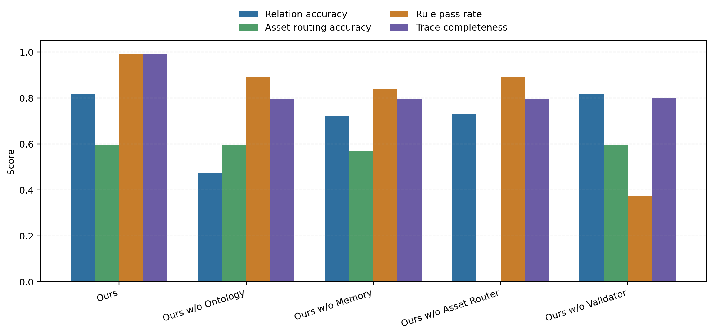

# 面向设施农业数字孪生的知识增强多智能体协作与可追溯场景构建方法

【投稿信息占位】
作者姓名：待填
作者单位：待填
通讯作者邮箱：待填
基金项目：待填
收稿日期：待填
修回日期：待填
DOI：待填
作者照片与简介：见文末占位区

<!-- 图位标记：FIG-1 到 FIG-9；后续插图可直接搜索这些编号定位。 -->

## 摘要

设施农业数字孪生的价值不只在于三维展示，更在于把温室、作物、设备、传感器和生产事件组织成可查询、可追踪、可校验的对象网络。现有场景构建依赖人工建模与配置，通用大模型智能体虽能生成候选场景，但层级缺失、绑定错误、资产不匹配和过程不可审计，使结果难以支撑对象级监测、异常定位和生产复盘。本文提出 KAFarmTwin 知识约束多智能体方法，将对象本体、长期记忆、资产知识、规则校验和执行轨迹引入规划、布局、资产路由与数据绑定闭环，使错误关系和无证据绑定在构建阶段被发现并收敛。30 条任务评测表明，KAFarmTwin 的关系 F1、绑定 F1、规则冲突率和可执行轨迹可信度分别为 0.803、0.775、0.007 和 1.000；对象 F1 为 0.711，体现其优先保证可验证核心对象而非无约束扩张。该方法可推进设施农业数字孪生从可视化搭建走向对象级查询、运维诊断和可审计管理。

**关键词**：设施农业；数字孪生；知识增强人工智能；多智能体；对象本体；长期记忆；规则校验；可追溯构建

## Abstract

The value of protected-agriculture digital twins is not limited to 3D visualization; it depends on organizing greenhouses, crops, devices, sensors and production events into queryable, traceable and verifiable object networks. Existing construction pipelines still rely on manual modelling and configuration. Although LLM agents can generate candidate scenes from natural-language requests, missing hierarchies, invalid bindings, mismatched assets and unauditable steps make the outputs difficult to use for object-level monitoring, fault localization and production review. This paper presents KAFarmTwin, a knowledge-constrained multi-agent method that introduces an agricultural object ontology, long-term memory, asset knowledge, rule validation and executable traces into planning, layout generation, asset routing and data-binding loops, so that relation errors and unsupported bindings can be exposed and converged during construction. On 30 protected-agriculture tasks, KAFarmTwin achieves 0.803 Relation-F1, 0.775 Binding-F1, 0.007 rule violation rate and 1.000 executable-trace faithfulness; its Object-F1 is 0.711, reflecting a conservative preference for verifiable core objects over unconstrained expansion. KAFarmTwin provides a reusable path from visual scene construction to object-level query, operational diagnosis and auditable farm management.

**Keywords**: protected agriculture; digital twin; knowledge-augmented AI; multi-agent system; object ontology; long-term memory; rule validation; traceable construction

## 1 引言

数字孪生通过虚拟模型、物理对象和运行数据之间的动态映射，为复杂系统的状态感知、过程分析和决策支持提供了重要技术路径[1-4]。在设施农业中，温室生产管理正在从环境级监测走向对象级、过程化和可追溯管理[5-7,22-24]。传统监控系统通常以温度、湿度、光照和设备状态等指标为中心，能够描述局部生产环境，却难以统一表示温室、地块、作物行、单株、传感器、摄像头、灌溉设备、表型指标和生产事件之间的空间、语义和时序关系。三维数字孪生为上述对象提供了共同的空间载体，使传感器数据、表型记录、灌溉事件和历史状态能够绑定到具体农业对象，从而支撑对象级查询、异常定位和生产过程复盘。

然而，现有农业数字孪生和三维可视化系统主要强调监测、展示和数据汇聚[5,8,22]，场景构建仍高度依赖人工建模、人工拖拽和人工配置。开发者需要从自然语言或业务需求中识别农业对象，手工建立温室、地块、作物行和植株之间的层级关系，再为传感器、摄像头和设备配置数据接口、资产模型和空间位置。该过程效率低、复用性差，并且容易造成对象关系断裂。例如，同一传感器在三维场景中存在模型对象，在业务系统中存在设备对象，在时序数据库中又存在数据源对象。若缺少统一对象图和绑定规则，后续问答或决策系统很难判断数据究竟归属于哪个温室、作物行或植株。

大模型智能体（Agent）为数字孪生场景构建提供了新的自动化可能。智能体可以理解“构建一个 30m x 8m 的番茄温室，包含作物行、传感器、摄像头和滴灌设备”等自然语言需求，并通过工具调用生成对象列表、三维布局和数据绑定[9-14,28-33]。但是，直接使用通用大模型或普通智能体仍面临 3 个关键挑战：1）对象图结构难以保证，模型可能漏掉地块、作物行等中间层级，或生成方向错误的包含（contains）、监测（monitors）和控制（controls）关系；2）三维资产、业务对象和运行数据难以一致绑定，例如将水泵资产绑定为植株模型，或生成缺少单位、时间戳和对象归属的表型指标；3）执行过程缺少可复核证据，声明式执行轨迹（Trace）可以描述“做了校验”，但无法证明系统实际调用了哪些工具、使用了哪些知识以及是否通过规则检查。

针对上述挑战，本文提出 KAFarmTwin，一种面向设施农业数字孪生的知识增强多智能体协作与可追溯场景构建方法。其基本思想是：大模型负责语义理解和候选生成，农业对象本体、对象级记忆、多保真资产知识和规则约束负责结构化约束、数据绑定和结果校验；多智能体协作负责将候选对象图转化为可加载、可绑定、可校验和可审计的数字孪生场景。本文主要贡献包括 3 个方面：

1. 提出设施农业数字孪生对象图表示与规则体系，统一描述温室、地块、作物行、植株、传感器、摄像头、设备、表型指标、生产事件和三维资产之间的层级、绑定和校验约束。
2. 提出知识约束的多智能体场景构建流程，使农业对象本体、对象级记忆、资产元数据和规则库进入场景规划、空间布局、资产路由、数据绑定和规则校验器（Validator）闭环，并通过执行式轨迹（Trace）记录可审计证据。
3. 构建设施农业对象图评测协议和 30 条任务集，使用对象、关系和绑定的精确率/召回率/F1 值，规则冲突率，以及声明式轨迹和执行式轨迹的双层可追溯指标评估场景构建可靠性。实验结果表明，KAFarmTwin 在关系 F1 值（Relation-F1）、绑定 F1 值（Binding-F1）、规则冲突率（VR）和可执行轨迹可信度（ETF）上分别达到 0.803、0.775、0.007 和 1.000，但对象展开仍偏保守，对象 F1 值（Object-F1）为 0.711。

## 2 相关工作

### 2.1 农业数字孪生与三维场景构建

数字孪生研究从制造领域逐步扩展到农业生产过程建模和智能农场管理[1-5,22-23]。在农业场景中，相关工作通常关注传感器数据汇聚、作物状态监测、农机或温室设备管理以及三维可视化展示[5-8,24]。这些研究证明了数字孪生在农业状态感知中的价值，但多数系统仍以数据看板或可视化场景为核心，场景中的对象、业务实体和历史事件之间缺少可计算的语义关系。对于“温室-地块-作物行-植株-传感器-事件”这类多层对象关系，若三维模型仅作为展示元素存在，就难以支持对象级查询、历史追踪和规则校验。因此，本文关注的不是三维可视化质量本身，而是如何自动构建包含对象层级、数据绑定、资产来源和规则校验结果的数字孪生对象图。

### 2.2 大模型智能体与工具调用

大模型智能体通过结合语言理解、任务分解、工具调用和结果汇总，使模型从单轮文本生成扩展到交互式任务执行[9-14,28-33]。推理-行动框架（ReAct）强调推理与行动的交替组织[11]，工具学习框架（Toolformer）表明语言模型可以学习调用外部工具[12]，链式思维、零样本推理和树状搜索进一步增强了大模型的问题分解和候选探索能力[31-33]，多智能体研究则进一步讨论了角色分工、任务调度和协作执行[13-14,30]。对于数字孪生场景构建，智能体可以调用模型检索、布局求解、对象查询、数据绑定和规则校验等工具，将自然语言需求转化为可执行配置。问题在于，通用智能体通常缺少设施农业对象层级和业务规则，可能生成表面完整但结构不合法的场景。仅增加智能体数量也不能自然保证正确性，错误对象和错误绑定可能在多个智能体（Agent）之间继续传播。因此，多智能体协作需要与可执行知识约束和可回流校验机制结合。

### 2.3 知识增强与神经符号融合

知识增强人工智能通过检索增强生成（Retrieval-Augmented Generation, RAG）、知识图谱、本体、规则系统和外部记忆等方式，将符号知识引入神经模型推理过程[9-10,15-18]。RAG 方法能够缓解模型知识不足问题，但检索到的文档并不自动成为可执行约束[9-10]。知识图谱和本体能够显式表示概念、属性和关系，适合描述设施农业中的对象层级、设备控制关系和数据归属关系[15-17,25-27]。其中，农业领域本体库和传感器语义本体为农业概念、观测指标、传感器、执行器和采样过程的规范化表示提供了参考[25-27]。神经符号融合进一步强调，神经模型可负责感知、语言理解和候选生成，符号知识可负责结构约束、规则校验和错误修正[18]。本文将这一思想落实到数字孪生对象图构建任务中，使知识不只作为提示词或检索材料出现，而是进入规划、布局、资产路由、绑定和校验全过程。

### 2.4 长期记忆与可追溯推理

长期记忆和可解释性研究关注模型输出是否具有可追踪证据、可复核过程和明确的适用边界[13,19-20,28-29]。在设施农业中，植株长势、环境状态、灌溉事件、设备维护和异常告警都具有时间属性。如果系统只生成静态三维场景，就无法回答“第 3 行番茄最近 7 天长势如何”或“水泵最近 24 小时是否异常”等对象级问题。另一方面，可追溯推理要求记录智能体在每一步使用了哪些知识、调用了哪些工具、产生了哪些输出以及是否通过校验。本文将对象级记忆和智能体执行轨迹（Agent Trace）纳入数字孪生构建流程，使场景不仅可见，而且可查、可验、可追踪；同时在评测中区分声明式轨迹和带有证据编号（evidenceId）或调用编号（callId）的执行式轨迹，避免将模型自述过程误认为真实执行证据。

## 3 KAFarmTwin 知识增强多智能体场景构建方法

图 1 给出 KAFarmTwin 的总体框架。框架由需求输入、知识层、智能体层、数字孪生对象图和应用层构成：自然语言需求首先被解析为场景构建任务；对象本体、对象级记忆、资产知识和规则库为智能体执行提供约束；多个专门智能体（Agent）分别完成规划、布局、资产路由、数据绑定和校验；最终输出可加载、可绑定、可校验、可追溯的数字孪生对象图。

<!-- FIG-1: KAFarmTwin 总体框架图 -->
【图 1 占位：KAFarmTwin 总体框架图】  

KAFarmTwin 的设计围绕引言中提出的 3 类挑战展开。针对对象图结构不稳定问题，系统在规划阶段引入农业对象本体和 R1-R3 层级/空间规则；针对资产、业务和数据绑定不一致问题，系统在资产路由和数据绑定阶段引入多保真资产元数据、对象级记忆和 R4-R6、R8-R9 规则；针对执行过程不可复核问题，系统在每个智能体步骤中记录工具调用、输入输出摘要、策略状态和证据编号（evidenceId），并由 R7 和 R10 检查轨迹完整性与错误修正链条。

### 3.1 问题定义

本文将设施农业数字孪生场景构建定义为受知识约束的对象图生成任务。给定用户需求、已有数据、资产库、对象记忆和规则集合，系统需要生成可加载到三维场景、可映射到业务对象、可连接运行数据且可被规则复核的对象图。输入定义为

\[
Q=\{q,D_s,A,M_t,R\},
\]

其中，\(q\) 表示用户自然语言需求，\(D_s\) 表示已有传感器数据、表型数据和生产事件，\(A\) 表示三维资产库，\(M_t\) 表示对象级长期记忆，\(R\) 表示农业规则库。三维资产库包含已有 GLB 格式模型、F2DMAS 高保真植株资产路径、TRELLIS.2 三维快速生成任务、程序化模型和占位资产。

输出定义为

\[
Y=\{G,B,V,T\},
\]

其中，\(G\) 表示三维数字孪生场景图，\(B\) 表示对象与资产、数据、事件和业务对象之间的绑定关系，\(V\) 表示规则校验结果，\(T\) 表示智能体执行轨迹（Agent Trace）。本文目标是在农业知识集合 \(K\) 的约束下生成综合评分较高的数字孪生对象图：

\[
Y^*=\arg\max_Y S(Y|Q,K),
\]

其中 \(K\) 包含农业对象本体、资产知识、对象级记忆和规则约束。与直接生成场景结构化数据（JSON）不同，本文强调输出的可使用性：一个结果只有同时满足对象层级、资产来源、数据绑定、规则校验和可追溯执行记录，才被认为是可用于后续查询和管理的数字孪生场景。

### 3.2 农业对象知识表示

本文将设施农业对象知识表示为

\[
K_o=(C,R_o,P,I),
\]

其中，\(C\) 表示对象类别集合，\(R_o\) 表示对象关系集合，\(P\) 表示属性集合，\(I\) 表示对象实例集合。对象类别覆盖温室（Greenhouse）、地块（Plot）、作物行（CropRow）、植株（Plant）、传感器（Sensor）、摄像头（Camera）、设备（Device）、性状（Trait）、事件（Event）和资产（Asset）。典型关系包括包含（contains）、隶属（belongs_to）、监测（monitors）、观测（observes）、控制（controls）、关联资产（has_asset）、具有关联性状（has_trait）和关联事件（has_event）。

图 2 展示设施农业对象本体与关系。温室（Greenhouse）作为空间根对象向下包含地块（Plot）、作物行（CropRow）和植株（Plant）；传感器（Sensor）、摄像头（Camera）和设备（Device）分别通过监测（monitors）、观测（observes）和控制（controls）关系关联到空间对象或生物对象；性状（Trait）与事件（Event）记录对象状态和生产过程；资产（Asset）通过关联资产（has_asset）关系表示对象的三维资产来源。该本体的作用不是替代大模型理解自然语言，而是为“番茄温室”“作物行”“传感器”“灌溉设备”等候选对象提供可计算的类型边界和关系约束。

<!-- FIG-2: 设施农业对象本体与关系图 -->
【图 2 占位：设施农业对象本体与关系图】  

表 1 给出了本文方法中主要知识增强模块及其作用。

**表 1 本文方法核心模块及作用**

| 模块 | 主要知识 | 作用 | 对应实验指标 |
| --- | --- | --- | --- |
| 农业对象本体 | 对象类别、层级关系、语义关系 | 约束温室、地块、作物行、植株和设备之间的对象图结构 | 关系正确率（RA）、层级错误率 |
| 对象级长期记忆 | 时序指标、事件、日报、历史状态 | 支持历史查询、数据绑定和对象状态追踪 | 绑定准确率（BA）、轨迹完整率（TC）、R8 |
| 多保真资产路由 | 资产元数据、保真度、成本、缺失任务 | 选择 F2DMAS 高保真资产、GLB 格式模型、TRELLIS.2 生成任务、程序化或占位资产 | 资产路由准确率（AR）、规则冲突率（VR） |
| 规则校验器（Validator） | 对象规则、空间规则、绑定规则、资产规则 | 发现并修正对象层级、空间布局和资产绑定冲突 | 规则冲突率（VR）、规则校验器冲突率 |
| 智能体执行轨迹（Agent Trace） | 智能体、工具、输入输出、状态、策略 | 记录规划、布局、资产、绑定和校验全过程 | 轨迹完整率（TC） |

### 3.3 多智能体协作框架

KAFarmTwin 将场景构建流程拆分为 6 类智能体（Agent）。农场孪生编排智能体（FarmTwinOrchestrator）负责理解用户目标、生成任务计划并调度其他智能体；场景规划智能体（ScenePlannerAgent）根据自然语言和对象本体生成农业对象清单及初始对象图；布局智能体（LayoutAgent）根据温室尺寸、作物行规则和空间约束生成三维坐标；资产保真度智能体（AssetFidelityAgent）根据对象类型、任务重要性和资产库状态进行多保真资产路由；数据绑定智能体（DataBindingAgent）将传感器、摄像头、设备、表型指标和事件绑定到农业对象；校验智能体（ValidatorAgent）根据规则库检查对象层级、空间关系、数据绑定和资产一致性。

图 3 给出多智能体协作流程。编排器（Orchestrator）将用户需求拆解为规划、布局、资产、绑定和校验子任务；各智能体输出的结构化结果被写入轨迹记录器（Trace Logger），并由记忆更新器（Memory Updater）更新对象级记忆。规则校验器（Validator）位于流程末端，同时具有回流修正能力：当检测到对象缺失、关系方向错误、资产类型不匹配或数据绑定缺失时，冲突会被路由回相应智能体重新生成。

<!-- FIG-3: 多智能体协作流程图 -->
【图 3 占位：多智能体协作流程图】  

该流程的关键在于将智能体候选生成与符号约束闭环结合起来。大模型负责从自然语言中提出候选对象、候选关系和候选操作，本体和规则负责判定这些候选是否符合设施农业数字孪生语义。若发现对象缺失、关系错误、资产不匹配或数据绑定缺失，冲突会返回对应智能体修正。最终结果只有在对象图、资产绑定、数据绑定和执行轨迹均满足要求后，才作为可用数字孪生场景输出。由此，多智能体不只是角色拆分机制，而是将“生成、校验、修正、留痕”组织为可复核流程。

### 3.4 多保真资产路由机制

设施农业数字孪生并不要求所有对象都使用同一精度的三维模型。重点科研植株、异常植株和表型测量样本需要较高几何可信度；背景植株和普通设备更关注加载效率；温室结构、地面、管道和作物行等规则对象适合程序化生成；资产库缺失时应生成占位对象和补资产任务，而不是中断整个构建流程。

本文将资产选择定义为

\[
a_i^*=\arg\max_{a\in A}(\alpha S_f(o_i,a)+\beta S_q(a)+\gamma S_e(o_i)-\lambda C(a)),
\]

其中，\(S_f\) 表示对象与资产的语义匹配度，\(S_q\) 表示资产质量评分，\(S_e\) 表示对象在任务中的重要性，\(C(a)\) 表示调用或生成成本，\(\alpha,\beta,\gamma,\lambda\) 为权重。资产保真度智能体（AssetFidelityAgent）根据该策略在 F2DMAS 高保真资产路径、TRELLIS.2 三维快速生成任务、轻量 GLB 格式模型、程序化模型和占位任务之间做选择。

图 4 展示多保真资产路由机制。系统将对象类型、任务重要性、精度需求、资产质量、资产可用性和调用成本作为决策依据，将对象路由到 F2DMAS 高保真资产路径、TRELLIS.2 三维生成任务、轻量 GLB 格式模型、程序化模型或占位任务。

<!-- FIG-4: 多保真资产路由机制图 -->
【图 4 占位：多保真资产路由机制图】  

本文将 F2DMAS 作为重点植株的高保真资产路由接入路径：当对象被识别为重点植株、异常植株或论文样本时，资产保真度智能体（AssetFidelityAgent）生成指向 F2DMAS 的路由决策，并在路由理由字段（routingReason）、轨迹证据编号（Trace evidenceId）和资产任务创建工具（asset.job.create）任务契约中记录该决策；系统将 F2DMAS 资产路径绑定到植株对象（Plant）并写入对象图。对于普通缺失设备或背景对象，系统生成 TRELLIS.2 类三维（3D）生成任务并保留占位模型[21,34-40]。因此，资产库不完备不会中断场景构建，而是转化为可追踪的占位对象和后续补资产任务。

### 3.5 对象级长期记忆与数据绑定

设施农业数字孪生对象不仅是三维模型，也是状态记忆单元。传感器语义网和轻量化观测本体已表明，传感器、观测、采样和执行器可被统一建模为可查询的语义资源[26-27]。本文将对象 \(o_i\) 的记忆定义为

\[
M(o_i)=\{P_i,S_i^t,E_i^t,A_i,T_i\},
\]

其中，\(P_i\) 表示静态属性，如对象类型、位置和尺寸；\(S_i^t\) 表示动态状态，如温度、湿度、光照、二氧化碳（CO2）、株高和冠幅；\(E_i^t\) 表示事件记录，如灌溉、施肥、病害、采样和告警；\(A_i\) 表示关联三维资产；\(T_i\) 表示智能体操作记录。

数据绑定关系定义为

\[
B=\{(o_i,d_j,r_{ij},t)\},
\]

表示对象 \(o_i\) 在时间 \(t\) 与数据 \(d_j\) 建立关系 \(r_{ij}\)。例如，传感器对象 Sensor_01 与温室对象 Greenhouse_A 建立监测（monitors）关系，摄像头对象 Camera_02 与作物行对象 CropRow_03 建立观测（observes）关系，植株对象 Plant_15 通过具有关联性状（has_trait）关系绑定株高 42.3 cm，地块对象 Plot_01 通过关联事件（has_event）关系绑定 2026-05-28 灌溉事件。通过这种绑定，系统能够围绕对象检索历史状态，而不是仅生成无来源的文本回答。

图 5 给出对象级长期记忆与动态数据绑定机制。每个农业对象不仅包含静态属性和三维资产，还关联时序传感器数据、表型指标、生产事件、规则校验记录和智能体操作记录。由此，后续查询可以围绕具体对象展开，而不是在无对象边界的文本或表格中检索；例如历史状态查询必须同时限定对象、指标、时间范围和事件类型，避免生成缺少来源边界的概括性回答。

<!-- FIG-5: 对象级长期记忆与动态数据绑定机制图 -->
【图 5 占位：对象级长期记忆与动态数据绑定机制图】  

### 3.6 规则校验与智能体执行轨迹

本文规则库包含对象层级、数据绑定、空间布局、资产类型、摄像头、设备覆盖、执行轨迹（Trace）、记忆查询、缺失资产和错误修正 10 类规则。表 2 给出规则检查点定义。

**表 2 规则检查点 R1-R10**

| 规则 | 检查内容 |
| --- | --- |
| R1 | 对象层级合法：温室包含地块或栽培区，地块包含作物行或苗床，作物行包含植株。 |
| R2 | 数据绑定合法：传感器、表型和事件数据必须有绑定对象、单位和时间戳。 |
| R3 | 空间布局合法：对象不悬空、不越界，作物行或苗床位于地块或温室边界内。 |
| R4 | 资产类型一致：对象类型与 GLB 格式模型、F2DMAS 高保真资产、TRELLIS.2 三维生成任务、程序化或占位资产策略一致。 |
| R5 | 摄像头合法：摄像头必须有位姿、观测目标和视场覆盖关系。 |
| R6 | 设备覆盖合法：灌溉、水肥、补光和通风设备必须绑定控制区域或服务对象。 |
| R7 | 智能体执行轨迹完整：至少记录规划、布局、资产路由、数据绑定和校验步骤。 |
| R8 | 记忆查询合法：历史查询必须限制对象、指标、时间范围、事件类型和返回条数。 |
| R9 | 缺失资产不中断：缺失 GLB 格式模型时必须生成占位对象和资产生成任务。 |
| R10 | 错误可修正：规则冲突必须输出冲突类型、触发规则和修正方案。 |

规则冲突数量定义为

\[
V(Y)=\sum_{r_k\in R} I[r_k(Y)=false],
\]

目标是在保持对象语义完整的前提下降低 \(V(Y)\)。智能体执行轨迹（Agent Trace）记录每一步的智能体、工具、工具类别、输入摘要、输出摘要、状态和耗时。受大模型智能体可追溯执行和自我反思研究启发[28-29]，工具被划分为只读、受控写和禁止三类；文件系统写入、任意超文本传输协议（HTTP）请求、直接数据库写入和真实设备控制等高风险操作被禁止或仅允许以预览（preview）方式返回计划。本文将执行轨迹设计为规则校验对象，而不是附加日志：若关键步骤缺失、工具调用没有证据编号（evidenceId）、冲突没有修正建议，则输出不能被视为完整可审计结果。

图 6 展示规则校验与智能体执行轨迹记录流程。系统先对生成场景执行对象层级、空间布局、数据绑定、资产一致性和轨迹完整性检查，再将冲突类型、触发规则、修正建议和执行状态写入轨迹。该设计使错误不仅能够被发现，还能够被定位到具体智能体和工具调用步骤。

<!-- FIG-6: 规则校验与 Agent Trace 记录流程图 -->
【图 6 占位：规则校验与 Agent Trace 记录流程图】  

## 4 系统实现

本文在智慧农业数字孪生原型系统中实现 KAFarmTwin，用于验证知识约束多智能体流程能否落地为可调用的场景构建服务。系统前端基于 Vue 3、TypeScript、Vite、Three.js、Pinia 和 Element Plus，负责三维场景展示、对象树、属性面板、自然语言输入、验收控制台、Agent Trace 和资产路由结果展示。系统后端基于 Go、Gin、sqlx 和 MySQL，提供农业对象管理、场景对象绑定、对象级记忆、资产元数据、资产质量审计、资产路由、语义构建和验收聚合接口。

后端服务采用对象管理、场景绑定、记忆管理、资产治理和 Agent 编排分层实现。农业对象服务维护 Greenhouse、Plot、CropRow、Plant、Sensor、Device 和 Camera 等业务对象；场景绑定服务维护 sceneObjectId 与 businessObjectId 的双向映射；记忆服务提供指标字典、时序查询、事件查询和日报归档；资产服务维护 GLB 元数据、质量审计和 F2DMAS/TRELLIS.2/程序化/占位策略，其中 F2DMAS 以高保真植株资产路径和补资产任务契约的形式接入资产路由，路由结果返回策略类型、路由理由、占位引用和后续生成任务；Agent 编排服务将 SceneBuilderAgent 兼容入口扩展为 FarmTwinOrchestrator，并在 trace.steps 中暴露 ScenePlannerAgent、LayoutAgent、AssetFidelityAgent、DataBindingAgent 和 ValidatorAgent 的执行证据。

为支撑可重复验证，原型实现提供固定验收任务，提示词为“搭建番茄温室，包含 20 株番茄、气象站、水泵、摄像头和传感器”。验收服务聚合语义构建、对象计数、资产路由、业务绑定、对象记忆、校验问题、日报源和归档准备状态。前端 `/scene/acceptance` 控制台展示端到端阶段状态、对象数量、Agent Trace、资产路由、对象上下文、校验问题和温室日报摘要。

图 7 展示系统原型界面，包括三维场景视图、验收控制台、Agent Trace 面板和资产路由面板。四类界面分别对应本文方法的场景输出、端到端验收、可追溯执行记录和多保真资产选择证据。

<!-- FIG-7: 系统原型界面多面板图 -->
【图 7 占位：系统原型界面多面板图】  
绘制要求：采用四宫格或上下分栏截图布局，分别展示三维场景视图、验收控制台、Agent Trace 面板和资产路由面板。截图应保留标题、关键指标和左侧导航，避免裁切掉对象树、步骤列表或路由说明。整体风格保持系统原型的暗色玻璃拟态界面，使读者能够直接识别为可运行的数字孪生构建界面，而不是概念草图。

系统实现与实验任务共同验证知识增强机制如何约束大模型智能体生成可验证、可追溯的数字孪生对象图。需要说明的是，原型系统用于验证对象图构建、资产路由、数据绑定和 Trace 机制，不等同于完整生产级农业控制平台；真实设备闭环控制、长期运行稳定性和更大规模作物数据将在后续工作中扩展。

## 5 实验与分析

### 5.1 实验设置

本文实验围绕 3 个问题展开：1）在共享输出结构（schema）、对象知识和规则文本的公平条件下，KAFarmTwin 是否比直接生成或普通智能体（Agent）更能生成合法对象图；2）农业对象本体、对象级记忆、资产路由和规则校验器（Validator）分别贡献哪些能力；3）方法收益是否依赖单一底座模型。为此，本文构建 30 条设施农业数字孪生任务，覆盖场景构建、资产路由、数据绑定、规则修正和历史查询 5 类，每类 6 条。表 3 概述任务类别构成。

**表 3 实验任务类别构成**

| 任务类别 | 数量 | 代表任务 | 主要考察能力 | 对应规则 |
| --- | ---: | --- | --- | --- |
| 场景构建 | 6 | T01 番茄温室；T03 玉米表型观测区 | 对象识别、层级关系、空间布局、基础绑定 | R1、R2、R3、R5、R6、R7 |
| 资产路由 | 6 | T07 重点番茄 F2DMAS；T10 缺失虫情灯/AI 摄像头 | 多保真资产选择、占位模型、生成任务 | R3、R4、R5、R6、R7、R9 |
| 数据绑定 | 6 | T13 环境传感器指标；T18 温室日报数据源 | 传感器、摄像头、表型、事件和日报绑定 | R1、R2、R5、R6、R7、R8 |
| 规则修正 | 6 | T20 作物行越界；T24 水泵资产绑定错误 | 冲突检测、规则触发、自动修正 | R1、R2、R3、R4、R5、R6、R7、R9、R10 |
| 历史查询 | 6 | T25 长势变化；T30 今日生产日报 | 对象记忆检索、时序/事件查询、可追溯回答 | R1、R2、R4、R5、R6、R7、R8 |

### 5.2 对比方法

为避免“完整工程系统对比裸大模型”的不公平设置，本文采用 v2 公平基线实验。所有非本文方法（Ours）均调用同一模型 `step-3.5-flash`，并接收相同的输出结构（JSON schema）、农业对象类型、关系谓词、资产类型和 R1-R10 规则文本；标准对象数、标准关系数、标准绑定数仅用于离线评分，不提供给模型。本文方法调用本地 `/sceneApi/semantic/build/plan`，并使用同一模型配置作为语言模型底座，同时启用工具化场景规划、资产路由、对象绑定、规则校验和执行式轨迹（Trace）。由此，主实验比较的重点从“是否能看到知识”转为“知识是否进入可审计的工具化执行流程”。表 4 给出各对比方法的共享输入、差异设置及其用于暴露的问题。

**表 4 对比方法定义**

| 方法 | 共享输入 | 差异设置 | 预期暴露的问题 |
| --- | --- | --- | --- |
| 直接大模型（Direct-LLM）+ 结构约束（Schema） | 统一 JSON schema、对象类型、关系谓词、资产类型、R1-R10 | 一次性直接生成，不允许检索、工具调用或规则校验器（Validator）。 | 检验只有结构约束时的大模型直接生成能力。 |
| 大模型+本体/规则提示（LLM + Ontology/Rules Prompt） | 同上 | 将对象本体和规则作为提示词（prompt）显式注入，但不执行工具。 | 检验“看到规则文本”是否足以形成可靠对象图。 |
| 检索增强生成智能体（RAG-Agent）+ 本体/规则 | 同上 | 单智能体（Agent）可检索同一份对象本体、规则和资产说明。 | 检验检索知识能否转化为结构化约束。 |
| 单智能体（Single-Agent）+ 规则校验器（Validator） | 同上 | 单智能体生成后执行一次离线规则校验器检查，但不回流修正。 | 检验一次性校验与闭环修正的差异。 |
| 多智能体（Multi-Agent）+ 共享知识 | 同上 | 多智能体分工，均可读取共享知识，但无闭环修正（repair）。 | 检验角色分工在缺少闭环约束时的上限。 |
| 本文方法（Ours, KAFarmTwin） | 同上 | 启用对象本体、记忆、资产路由、规则校验器闭环和执行式轨迹（Trace）。 | 检验知识约束工具链对对象图可靠性的贡献。 |

### 5.3 评价指标与评分细则

本文使用对象、关系和绑定三个层面的精确率（Precision）、召回率（Recall）和 F1 值作为主指标，同时报告规则冲突率（VR）、轨迹字段完整率（Trace Field Completeness, TFC）和可执行轨迹可信度（Executable Trace Faithfulness, ETF）。对对象、关系或绑定集合 \(X\)，精确率、召回率和 F1 值定义为：

\[
P_X=\frac{N_{correct,X}}{N_{generated,X}},\quad
R_X=\frac{N_{correct,X}}{N_{required,X}},\quad
F1_X=\frac{2P_XR_X}{P_X+R_X}.
\]

其中 \(N_{correct,X}\) 由标准对象、标准关系和标准绑定进行结构化匹配得到。对象匹配要求对象类型和任务语义一致；关系匹配要求主体、谓词和客体均正确，contains、belongs_to、monitors、observes、controls 和 has_asset 等谓词必须方向正确；绑定匹配要求主体、目标和绑定类型完整，且数据、资产、事件或业务对象归属正确。该指标同时惩罚乱生成和漏生成，避免仅用对象完整率 OC 时掩盖选择性输出问题。

VR 根据任务预设规则检查点计算违反规则数量占比，R1、R2、R3、R4 和 R7 视为致命约束。轨迹（Trace）进一步拆分为 TFC 和 ETF：TFC 检查输出是否覆盖规划、布局、资产路由、数据绑定和校验等步骤字段；ETF 仅统计来自系统工具调用链、带有证据编号（evidenceId）或调用编号（callId）的执行式轨迹。直接大模型（Direct-LLM）或普通智能体（Agent）生成的声明式轨迹可计入 TFC，但不计入高 ETF。自动评分脚本保留旧版 SR、OC、RA、BA 和 TC 作为兼容字段，但主文分析以对象 F1 值（Object-F1）、关系 F1 值（Relation-F1）、绑定 F1 值（Binding-F1）、规则冲突率（VR）、TFC 和 ETF 为核心。在最终 v2 运行中，本文方法（Ours）的轨迹步骤已携带 evidenceId，因此 ETF 达到 1.000；其余基线仍主要停留在声明式轨迹，ETF 维持为 0。

### 5.4 主实验结果

表 5 列出 v2 公平基线实验结果，用于比较不同方法在对象、关系、绑定、规则一致性和轨迹可信性上的表现。

**表 5 v2 公平基线实验结果**

| 方法 | 对象 F1 值（Object-F1）↑ | 关系 F1 值（Relation-F1）↑ | 绑定 F1 值（Binding-F1）↑ | 规则冲突率（VR）↓ | 轨迹字段完整率（TFC）↑ | 可执行轨迹可信度（ETF）↑ |
| --- | ---: | ---: | ---: | ---: | ---: | ---: |
| Direct-LLM + Schema | 0.814 | 0.696 | 0.554 | 0.117 | 0.067 | 0.000 |
| LLM + Ontology/Rules Prompt | 0.835 | 0.725 | 0.533 | 0.119 | 0.027 | 0.000 |
| RAG-Agent + Ontology/Rules | 0.819 | 0.745 | 0.658 | 0.077 | 0.040 | 0.000 |
| Single-Agent + Validator | 0.837 | 0.723 | 0.595 | 0.027 | 0.133 | 0.000 |
| Multi-Agent + Shared Knowledge | 0.827 | 0.727 | 0.625 | 0.053 | 0.973 | 0.000 |
| Ours KAFarmTwin | 0.711 | 0.803 | 0.775 | 0.007 | 1.000 | 1.000 |

图 8 进一步以结构可靠性视角对比不同方法，重点展示关系 F1 值（Relation-F1）、绑定 F1 值（Binding-F1）、规则通过率 \(1-VR\) 和可执行轨迹可信度（ETF）。

<!-- FIG-8: 主实验结构可靠性对比图 -->
【图 8 占位：主实验结构可靠性对比图】  
已生成图文件 `experiments/analysis/main_experiment_v2_structure_reliability.png`。图表采用分组柱状图，横轴为方法名，纵轴统一归一化到 0-1 区间，展示关系 F1 值（Relation-F1）、绑定 F1 值（Binding-F1）、规则通过率 \(1-VR\) 和可执行轨迹可信度（ETF）。类别标签可轻微倾斜，背景保持浅色网格，避免过度装饰。

<!-- FIG-8-CAPTION: 不同方法在结构关系、数据绑定、规则一致性和执行式 Trace 可信性上的性能对比 -->
【图 8 图注占位：不同方法在结构关系、数据绑定、规则一致性和执行式 Trace 可信性上的性能对比】

表 5 给出主实验结果。KAFarmTwin 的关系 F1 值（Relation-F1）和绑定 F1 值（Binding-F1）分别达到 0.803 和 0.775，高于最佳非本文方法的 0.745 和 0.658；规则冲突率（VR）降至 0.007，说明规则冲突减少；轨迹字段完整率（TFC）和可执行轨迹可信度（ETF）均达到 1.000，说明轨迹字段完整且可由工具调用证据复核。相比之下，多智能体（Multi-Agent）+ 共享知识（Shared Knowledge）虽然 TFC 达到 0.973，但 ETF 仍为 0，表明多智能体可以生成较完整的过程描述，却不能证明这些过程来自真实执行链。

同时，本文方法的对象 F1 值（Object-F1）为 0.711，低于若干直接生成式基线。该结果说明本文方法的优势不在于生成更多对象，而在于提高已生成对象之间的关系、绑定和规则一致性。换言之，知识约束闭环会抑制缺少资产证据、布局证据或绑定证据的对象扩张。该现象在农业数字孪生对象图构建中具有实际意义：对于后续查询和管理，错误绑定和错误层级往往比少量背景对象缺失更难修复。

### 5.5 消融实验
主实验采用对象、关系和绑定的 F1 值衡量整体输出质量；消融实验关注单个模块关闭后的机制性退化，因此沿用模块级诊断指标，包括关系正确率、资产路由准确率、层级错误率和 Validator 冲突率。两类指标分别服务于整体性能比较和模块贡献归因。
为验证性能变化来自哪些知识增强模块，并减少不同大模型调用随机性对消融分析的干扰，本文基于完整方法的结构化输出进行模块禁用消融，并重新计算相关评分指标。消融实验沿用原型模块指标，重点观察关系正确率、资产路由准确率、规则冲突率、轨迹完整率和典型错误类型的变化。表 6 汇总各模块关闭后的诊断指标。

**表 6 知识增强模块消融实验结果**

| 版本 | 对象完整率（OC）↑ | 关系正确率（RA）↑ | 资产路由准确率（AR）↑ | 规则冲突率（VR）↓ | 轨迹完整率（TC）↑ | 层级错误率 ↓ | 规则校验器冲突率 ↓ |
| --- | ---: | ---: | ---: | ---: | ---: | ---: | ---: |
| Ours | 0.524 | 0.815 | 0.597 | 0.007 | 0.993 | 0.000 | 0.008 |
| Ours w/o Ontology | 0.524 | 0.473 | 0.597 | 0.108 | 0.793 | 1.000 | 0.133 |
| Ours w/o Memory | 0.524 | 0.721 | 0.571 | 0.162 | 0.793 | 0.000 | 0.186 |
| Ours w/o Asset Router | 0.524 | 0.731 | 0.000 | 0.108 | 0.793 | 0.000 | 0.136 |
| Ours w/o Validator | 0.524 | 0.815 | 0.597 | 0.628 | 0.800 | 0.154 | 0.775 |

图 9 从结构可靠性的角度展示各模块的独立贡献，便于直接比较完整方法与消融版本。

表 6 表明，农业对象本体、对象级记忆、多保真资产路由和规则校验分别影响不同层面的可靠性。去除本体后，关系正确率（RA）从 0.815 降至 0.473，层级错误率升至 1.000，说明对象本体主要负责温室、地块、作物行、植株和设备之间的结构约束。去除对象级记忆（Memory）后，RA、VR 和 TC 同步变化，说明长期记忆主要支撑历史状态、事件证据和数据绑定的一致性。去除资产路由器（Asset Router）后，AR 降为 0，说明资产路由直接决定高保真、轻量化、程序化和占位资产的选择。去除规则校验器（Validator）后，VR 从 0.007 升至 0.628，规则校验器冲突率升至 0.775，说明规则校验是冲突收敛和错误闭环的关键环节。

### 5.6 错误归因与典型案例分析

为解释对象完整率、关系可靠性和轨迹可信性之间的差异，v2 实验脚本进一步输出错误归因表。错误类型包括缺失对象、多余对象、层级关系错误、关系方向错误、缺失关系、缺失绑定、绑定字段不完整、资产类型错误、布局越界、伪轨迹、轨迹不可审计和记忆查询缺时间范围。该表用于回答两个问题：第一，方法是否通过少生成对象换取较高关系正确性；第二，轨迹是否来自真实工具执行，而不是模型声明式文本。

在最终结果中，本文方法（Ours）的 `trace_not_auditable` 已降为 0，说明补齐证据编号（evidenceId）之后，执行式轨迹可以通过评分脚本复核；相对地，直接大模型（Direct-LLM）与普通智能体（Agent）仍主要停留在声明式轨迹，因此 ETF 维持为 0。

从错误分布看，本文方法（Ours）的低对象 F1 值（Object-F1）主要来自保守式对象展开而不是对象漂移：`missing_objects` 为 309，而 `extra_objects` 仅 12，且 `hierarchy_errors`、`asset_type_errors` 和 `layout_boundary_errors` 均为 0。换言之，系统在资产证据或布局证据不足时，会优先保留可验证的核心对象与关系，宁可少生成背景/派生对象，也不强行补入不确定对象；因此对象召回下降，但已生成对象的关系和绑定更稳定，形成了“召回换合法性”的错误模式。该模式提示后续优化应优先提升对象召回，而不是放松规则约束。

**案例 1：T01 番茄温室构建。** T01 要求构建 30m x 8m 的番茄温室，包含 4 行作物、20 株番茄、气象站、滴灌/水泵设备、摄像头和环境传感器组。本文方法在自动评分中完成 38/38 条正确关系、10/10 项绑定、0/6 项规则冲突和 5/5 类轨迹。轨迹中包含场景当前状态（scene.current）、模型检索（model.search）、模型元数据（model.metadata）、场景规划（scene.plan）、布局求解（layout.solve）、布局校验（layout.validate）、资产任务创建（asset.job.create）、对象查询（object.lookup）、对象关系（object.relations）和对象绑定（object.bind）等工具调用。该案例说明系统不仅生成三维对象，还形成对象层级、资产绑定、缺失资产任务和可追溯执行链。

**案例 2：T07 重点番茄资产路由。** T07 要求 5 株重点番茄使用 F2DMAS 高保真模型路径，15 株背景番茄使用轻量 GLB 格式模型，并保留摄像头和传感器占位。本文方法完成 31/31 条关系和 24/24 项绑定，规则冲突为 0。资产保真度智能体（AssetFidelityAgent）的轨迹显示，重点番茄产生了 F2DMAS 高保真资产路由决策：策略字段指向 F2DMAS，高保真接入理由写入路由理由字段（routingReason），并通过资产任务创建工具（asset.job.create）与轨迹证据编号（Trace evidenceId）形成可审计任务契约；摄像头和传感器因资产库缺失进入 TRELLIS.2 任务契约并保留占位模型。该案例体现了多保真资产路由的作用：高价值对象优先进入高保真资产路径，普通对象优先使用轻量资产，缺失资产以任务契约形式进入后续补全流程，从而不阻断场景构建。

**案例 3：T24 水泵资产绑定错误修正。** T24 输入一个水泵对象错误绑定番茄植株资产的场景，要求识别资产类型不匹配并改用灌溉设备资产或占位任务。本文方法通过模型检索（model.search）、场景规划（scene.plan）、布局求解（layout.solve）、布局校验（layout.validate）和资产任务创建（asset.job.create）识别资产类型错误，将对象改为灌溉（irrigation）设备资产，并在规则校验器（Validator）输出中记录“已自动纠正为灌溉设备资产”。该任务最终违反规则为 0，说明规则校验器和资产路由能够将文本中的错误描述转化为结构化修正。

**案例 4：T30 今日生产日报查询。** T30 要求查询番茄温室今日生产日报，返回环境摘要、设备状态、灌溉记录、告警记录和智能体管理建议。本文方法完成 16/16 条关系和 14/20 项绑定，规则冲突为 0，并记录对象、传感器、摄像头、灌溉设备和缺失资产任务，表明对象级记忆能够支撑围绕具体对象的查询与汇总。

### 5.7 多模型配对鲁棒性补充

为进一步证明 KAFarmTwin 的增益并非只来自某一个底座模型，补充实验采用配对式设计：对每个底座模型分别运行 `Base(M)` 和 `Ours(M)` 两组。`Base(M)` 统一使用“直接大模型+结构约束（Direct-LLM + Schema）”口径，而 `Ours(M)` 启用完整 KAFarmTwin 工具链。这样可以直接比较同一底座上“无工具链”和“有工具链”的差异，同时观察该增益在不同模型上的稳定性。

四个底座模型均已完成：`deepseek-ai/DeepSeek-V4-Flash`、`Pro/zai-org/GLM-5.1`、`Pro/moonshotai/Kimi-K2.6` 和 `MiniMaxAI/MiniMax-M2.5`。所有模型只替换模型接入层，不改变输出结构（schema）、评分脚本与方法流程。

表 7 给出四组配对结果。可以看到，`Ours(M)` 在四个底座上都提高了关系 F1 值（Relation-F1）、绑定 F1 值（Binding-F1）与执行式轨迹可信性（ETF），并将规则冲突率（VR）控制在 0.007 以内；与此同时，对象 F1 值（Object-F1）并未总是同步上升，说明 KAFarmTwin 的优势主要体现在对象关系与工具闭环的可靠性，而不是盲目扩大对象数目。这个现象与主实验中的结论一致，即系统更倾向于保守生成核心对象与合法关系，而不是无约束地追求对象铺满。

**表 7 多模型配对鲁棒性补充结果**

| 底座模型 | 设置 | 对象 F1 值（Object-F1）↑ | 关系 F1 值（Relation-F1）↑ | 绑定 F1 值（Binding-F1）↑ | 规则冲突率（VR）↓ | 轨迹字段完整率（TFC）↑ | 可执行轨迹可信度（ETF）↑ |
| --- | --- | ---: | ---: | ---: | ---: | ---: | ---: |
| DeepSeek-V4-Flash | Base(M) | 0.841 | 0.683 | 0.485 | 0.082 | 0.167 | 0.000 |
| DeepSeek-V4-Flash | Ours(M) | 0.612 | 0.774 | 0.716 | 0.006 | 0.987 | 0.987 |
| GLM-5.1 | Base(M) | 0.751 | 0.537 | 0.551 | 0.065 | 0.000 | 0.000 |
| GLM-5.1 | Ours(M) | 0.661 | 0.805 | 0.761 | 0.007 | 1.000 | 1.000 |
| Kimi-K2.6 | Base(M) | 0.851 | 0.749 | 0.597 | 0.026 | 0.033 | 0.000 |
| Kimi-K2.6 | Ours(M) | 0.680 | 0.804 | 0.794 | 0.000 | 1.000 | 1.000 |
| MiniMax-M2.5 | Base(M) | 0.870 | 0.765 | 0.606 | 0.025 | 0.000 | 0.000 |
| MiniMax-M2.5 | Ours(M) | 0.670 | 0.819 | 0.741 | 0.007 | 0.993 | 0.993 |

## 6 结论

本文提出 KAFarmTwin，一种面向设施农业数字孪生对象图构建的知识约束多智能体框架。该方法将农业对象本体、对象级长期记忆、多保真资产知识、规则校验和智能体执行轨迹（Agent Trace）注入智能体规划、布局、资产路由、数据绑定和验证全过程，使大模型输出从对象罗列转向可验证、可追溯的数字孪生对象图。本文进一步将评测协议从单纯对象数量和轨迹字段完整性扩展为对象、关系和绑定的精确率/召回率/F1 值、规则冲突率，以及声明式轨迹与执行式轨迹的双层可追溯指标。公平基线结果表明，在统一模型和统一知识输入下，KAFarmTwin 在关系正确性、绑定有效性、规则一致性和执行式轨迹可信性上具有优势；多模型配对实验进一步表明，该优势在不同底座模型上保持稳定。消融实验说明，农业对象本体、对象级记忆、多保真资产路由和规则校验器分别对应层级关系、历史证据、资产选择和规则收敛等关键环节。

本文仍存在 3 点局限。第一，当前方法对对象展开较保守，对象 F1 值（Object-F1）低于若干直接生成式基线，后续需要在保持规则一致性的前提下提升对象召回和对象图覆盖范围。第二，原型验证主要围绕番茄温室和设施农业典型任务展开，仍需在更多作物类型、设备类型和生产流程上扩展任务集。第三，本文重点验证对象图构建、数据绑定、资产路由和轨迹机制，尚未覆盖真实设备闭环控制和长期生产运行验证。后续工作将进一步完善对象级记忆、资产治理和验收控制台之间的联动，并引入更大规模的真实农业数据流进行持续评估。

## 作者简介与照片占位

【作者照片占位 1】  
建议放置：第一作者照片。

【作者简介占位 1】  
第一作者：姓名、出生年份、学位、单位、研究方向。

【作者照片占位 2】  
建议放置：通信作者照片。

【作者简介占位 2】  
通信作者：姓名、出生年份、学位、单位、研究方向。

【作者照片占位 3】  
建议放置：其余作者合影或分列小图。

【作者简介占位 3】  
其余作者：姓名、学位、单位、研究方向。

## 参考文献

[1] Grieves M. Digital Twin: Manufacturing Excellence through Virtual Factory Replication[R]. 2014.

[2] Tao F, Zhang H, Liu A, Nee A Y C. Digital Twin in Industry: State-of-the-Art[J]. IEEE Transactions on Industrial Informatics, 2019, 15(4): 2405-2415. DOI: 10.1109/TII.2018.2873186.

[3] Tao F, Sui F, Liu A, et al. Digital twin-driven product design, manufacturing and service with big data[J]. The International Journal of Advanced Manufacturing Technology, 2018, 94(9-12): 3563-3576. DOI: 10.1007/s00170-017-0233-1.

[4] Jones D, Snider C, Nassehi A, Yon J, Hicks B. Characterising the Digital Twin: A systematic literature review[J]. CIRP Journal of Manufacturing Science and Technology, 2020, 29: 36-52. DOI: 10.1016/j.cirpj.2020.02.002.

[5] Pylianidis C, Osinga S, Athanasiadis I N. Introducing digital twins to agriculture[J]. Computers and Electronics in Agriculture, 2021, 184: 105942. DOI: 10.1016/j.compag.2020.105942.

[6] Wolfert S, Ge L, Verdouw C, Bogaardt M J. Big Data in Smart Farming: A review[J]. Agricultural Systems, 2017, 153: 69-80. DOI: 10.1016/j.agsy.2017.01.023.

[7] Liakos K G, Busato P, Moshou D, Pearson S, Bochtis D. Machine Learning in Agriculture: A Review[J]. Sensors, 2018, 18(8): 2674. DOI: 10.3390/s18082674.

[8] Drury B, Fernandes R, Moura M F, de Andrade Lopes A. A survey of semantic web technology for agriculture[J]. Information Processing in Agriculture, 2019, 6(4): 487-501. DOI: 10.1016/j.inpa.2019.02.001.

[9] Lewis P, Perez E, Piktus A, et al. Retrieval-Augmented Generation for Knowledge-Intensive NLP Tasks[C]//Advances in Neural Information Processing Systems 33. 2020: 9459-9474.

[10] Gao Y, Xiong Y, Gao X, et al. Retrieval-Augmented Generation for Large Language Models: A Survey[EB/OL]. arXiv:2312.10997, 2023.

[11] Yao S, Zhao J, Yu D, et al. ReAct: Synergizing Reasoning and Acting in Language Models[C]//International Conference on Learning Representations. 2023.

[12] Schick T, Dwivedi-Yu J, Dessi R, et al. Toolformer: Language Models Can Teach Themselves to Use Tools[C]//Advances in Neural Information Processing Systems 36. 2023: 68539-68551. DOI: 10.52202/075280-2997.

[13] Wang L, Ma C, Feng X, et al. A Survey on Large Language Model based Autonomous Agents[EB/OL]. arXiv:2308.11432, 2023.

[14] Xi Z, Chen W, Guo X, et al. The Rise and Potential of Large Language Model Based Agents: A Survey[EB/OL]. arXiv:2309.07864, 2023.

[15] Hogan A, Blomqvist E, Cochez M, et al. Knowledge Graphs[J]. ACM Computing Surveys, 2021, 54(4): 1-37. DOI: 10.1145/3447772.

[16] Staab S, Studer R. Handbook on Ontologies[M]. Berlin: Springer, 2009. DOI: 10.1007/978-3-540-92673-3.

[17] Berners-Lee T, Hendler J, Lassila O. The Semantic Web[J]. Scientific American, 2001, 284(5): 34-43. DOI: 10.1038/scientificamerican0501-34.

[18] d'Avila Garcez A, Lamb L C. Neurosymbolic AI: The 3rd wave[J]. Artificial Intelligence Review, 2023, 56(11): 12387-12406. DOI: 10.1007/s10462-023-10448-w.

[19] Arrieta A B, Diaz-Rodriguez N, Del Ser J, et al. Explainable Artificial Intelligence (XAI): Concepts, taxonomies, opportunities and challenges toward responsible AI[J]. Information Fusion, 2020, 58: 82-115. DOI: 10.1016/j.inffus.2019.12.012.

[20] Amodei D, Olah C, Steinhardt J, et al. Concrete Problems in AI Safety[EB/OL]. arXiv:1606.06565, 2016.

[21] Xiang J, Lv Z, Xu S, et al. Structured 3D Latents for Scalable and Versatile 3D Generation[C]//Proceedings of the IEEE/CVF Conference on Computer Vision and Pattern Recognition. 2025. DOI: 10.1109/CVPR52734.2025.02000.

[22] Verdouw C, Tekinerdogan B, Beulens A, Wolfert S. Digital twins in smart farming[J]. Agricultural Systems, 2021, 189: 103046. DOI: 10.1016/j.agsy.2020.103046.

[23] Walter A, Finger R, Huber R, Buchmann N. Smart farming is key to developing sustainable agriculture[J]. Proceedings of the National Academy of Sciences, 2017, 114(24): 6148-6150. DOI: 10.1073/pnas.1707462114.

[24] Kamilaris A, Prenafeta-Boldú F X. Deep learning in agriculture: A survey[J]. Computers and Electronics in Agriculture, 2018, 147: 70-90. DOI: 10.1016/j.compag.2018.02.016.

[25] Jonquet C, Toulet A, Arnaud E, et al. AgroPortal: A vocabulary and ontology repository for agronomy[J]. Computers and Electronics in Agriculture, 2018, 144: 126-143. DOI: 10.1016/j.compag.2017.10.012.

[26] Compton M, Barnaghi P, Bermudez L, et al. The SSN ontology of the W3C semantic sensor network incubator group[J]. Journal of Web Semantics, 2012, 17: 25-32. DOI: 10.1016/j.websem.2012.05.003.

[27] Janowicz K, Haller A, Cox S J D, Le Phuoc D, Lefrançois M. SOSA: A lightweight ontology for sensors, observations, samples, and actuators[J]. Journal of Web Semantics, 2019, 56: 1-10. DOI: 10.1016/j.websem.2018.06.003.

[28] Park J S, O'Brien J, Cai C J, Morris M R, Liang P, Bernstein M S. Generative Agents: Interactive Simulacra of Human Behavior[C]//Proceedings of the 36th Annual ACM Symposium on User Interface Software and Technology. 2023: 1-22. DOI: 10.1145/3586183.3606763.

[29] Shinn N, Cassano F, Gopinath A, Narasimhan K, Yao S. Reflexion: Language Agents with Verbal Reinforcement Learning[C]//Advances in Neural Information Processing Systems 36. 2023: 8634-8652. DOI: 10.52202/075280-0377.

[30] Li G, Hammoud H, Itani H, Khizbullin D, Ghanem B. CAMEL: Communicative Agents for "Mind" Exploration of Large Language Model Society[C]//Advances in Neural Information Processing Systems 36. 2023: 51991-52008. DOI: 10.52202/075280-2264.

[31] Wei J, Wang X, Schuurmans D, et al. Chain-of-Thought Prompting Elicits Reasoning in Large Language Models[C]//Advances in Neural Information Processing Systems 35. 2022: 24824-24837. DOI: 10.52202/068431-1800.

[32] Kojima T, Gu S S, Reid M, Matsuo Y, Iwasawa Y. Large Language Models Are Zero-Shot Reasoners[C]//Advances in Neural Information Processing Systems 35. 2022: 22199-22213. DOI: 10.52202/068431-1613.

[33] Yao S, Yu D, Zhao J, et al. Tree of Thoughts: Deliberate Problem Solving with Large Language Models[C]//Advances in Neural Information Processing Systems 36. 2023: 11809-11822. DOI: 10.52202/075280-0517.

[34] Lin C H, Gao J, Tang L, et al. Magic3D: High-Resolution Text-to-3D Content Creation[C]//Proceedings of the IEEE/CVF Conference on Computer Vision and Pattern Recognition. 2023: 300-309. DOI: 10.1109/CVPR52729.2023.00037.

[35] Höllein L, Cao A, Owens A, Johnson J, Nießner M. Text2Room: Extracting Textured 3D Meshes from 2D Text-to-Image Models[C]//Proceedings of the IEEE/CVF International Conference on Computer Vision. 2023: 7875-7886. DOI: 10.1109/ICCV51070.2023.00727.

[36] Kerbl B, Kopanas G, Leimkühler T, Drettakis G. 3D Gaussian Splatting for Real-Time Radiance Field Rendering[J]. ACM Transactions on Graphics, 2023, 42(4): 139. DOI: 10.1145/3592433.

[37] Yang Y, Sun F Y, Weihs L, et al. Holodeck: Language Guided Generation of 3D Embodied AI Environments[C]//Proceedings of the IEEE/CVF Conference on Computer Vision and Pattern Recognition. 2024: 16277-16287. DOI: 10.1109/CVPR52733.2024.01536.

[38] Zhai G, Örnek E P, Wu S C, et al. CommonScenes: Generating Commonsense 3D Indoor Scenes with Scene Graph Diffusion[C]//Advances in Neural Information Processing Systems 36. 2023: 30026-30038. DOI: 10.52202/075280-1307.

[39] Tang J, Nie Y, Markhasin L, et al. DiffuScene: Denoising Diffusion Models for Generative Indoor Scene Synthesis[C]//Proceedings of the IEEE/CVF Conference on Computer Vision and Pattern Recognition. 2024: 20507-20518. DOI: 10.1109/CVPR52733.2024.01938.

[40] Ding L, Dong S, Huang Z, et al. Text-to-3D Generation with Bidirectional Diffusion Using Both 2D and 3D Priors[C]//Proceedings of the IEEE/CVF Conference on Computer Vision and Pattern Recognition. 2024: 5115-5124. DOI: 10.1109/CVPR52733.2024.00489.
