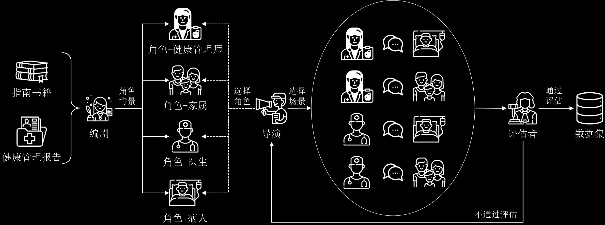
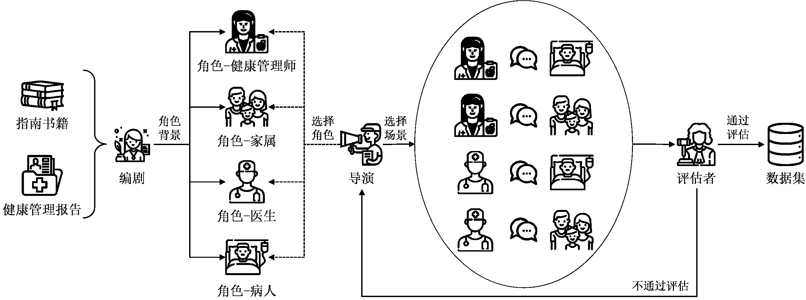
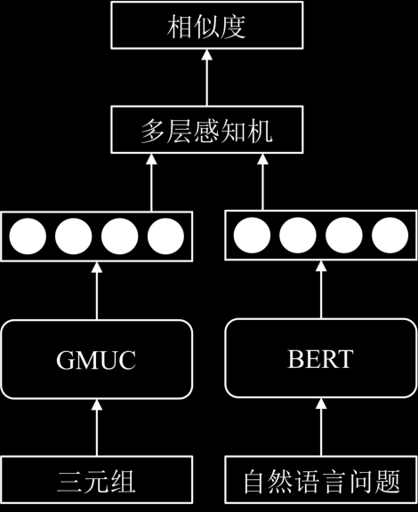
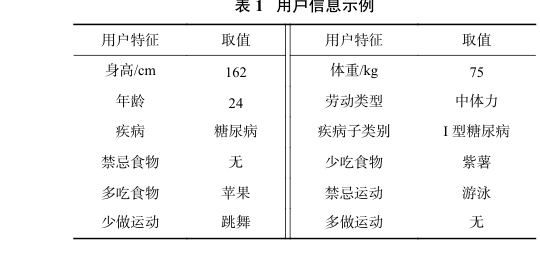
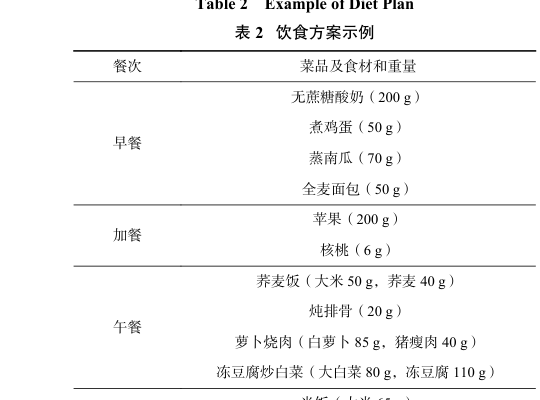
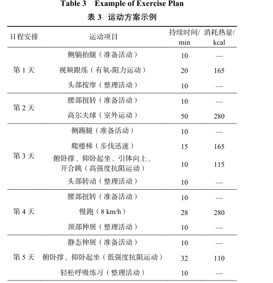
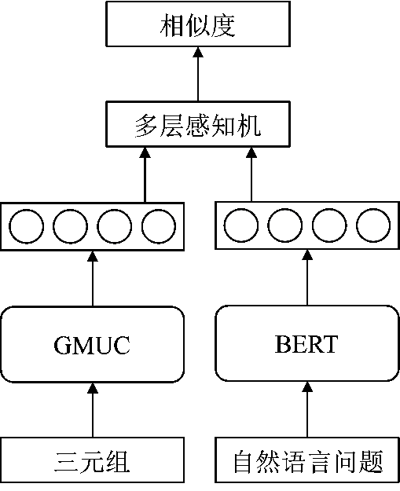
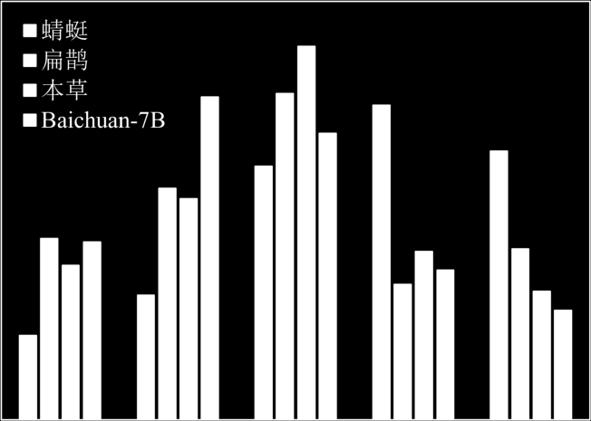

# 基于大语言模型的重大慢病健康管理信息系统构建

## Constructing Health Management Information System for Major Chronic Diseases Based on Large Language Model

---

**Journal:** 计算机研究与发展 (Journal of Computer Research and Development)  
**Volume/Issue/Pages:** Vol. 62, No. 7, pp. 1653-1667, 2025  
**DOI:** 10.7544/issn1000-1239.202440570  
**CSTR:** 32373.14.issn1000-1239.202440570  
**Article Type:** Research Paper  
**Received:** 2024-06-21 | **Revised:** 2025-01-13  
**Chinese Library Classification:** TP18; TP391.1; R319  

### Authors

| Name | Name (CN) | Affiliation(s) | Email |
|------|-----------|----------------|-------|
| Wu Tianxing | 吴天星 | 1,2 | tianxingwu@seu.edu.cn |
| Cao Xudong | 曹旭东 | 1 | — |
| Bi Sheng | 毕胜 | 3 | — |
| Chen Ya | 陈亚 | 4 | — |
| Cai Pingqiang | 蔡平强 | 5 | — |
| Sha Hangyu | 沙航宇 | 1 | — |
| Qi Guilin | 漆桂林 | 1,2 | — |
| Wang Haofen | 王昊奋 | 6 | — |

### Affiliations
1. School of Computer Science and Engineering, Southeast University, Nanjing 211189
2. Key Laboratory of New Generation Artificial Intelligence Technology and Its Interdisciplinary Applications (Southeast University), Ministry of Education, Nanjing 211189
3. School of Law, Southeast University, Nanjing 211189
4. Jiangsu Yahuan Software Co., Ltd., Nanjing 210024
5. Medical School, Nanjing University, Nanjing 210008
6. College of Design and Innovation, Tongji University, Shanghai 200092

### Funding
National Natural Science Foundation of China (62376058, 52378009, 62276063); Fundamental Research Funds for the Central Universities (2242022R40045)

---

## 页面/章节索引 Page/Section Index

| Section ID | Page | Section Title |
|------------|------|---------------|
| Title | 1653 | 标题、摘要、关键词 (Title, Abstract, Keywords) |
| Intro | 1654-1655 | 引言 (Introduction) |
| Sec1 | 1655-1656 | 1 相关工作 (Related Work) |
| Sec2 | 1656 | 2 系统框架 (System Framework) |
| Sec3 | 1656-1658 | 3 大语言模型训练 (LLM Training) |
| Sec3.1 | 1656-1657 | 3.1 健康管理场景 (Health Management Scenarios) |
| Sec3.2 | 1657-1658 | 3.2 多智能体场景模拟对话数据生成 (Multi-Agent Dialogue Generation) |
| Sec3.3 | 1658 | 3.3 模型训练 (Model Training) |
| Sec4 | 1658-1661 | 4 大语言模型增强 (LLM Enhancement) |
| Sec4.1 | 1658-1660 | 4.1 基于定量分析模型的工具增强 (Tool Enhancement) |
| Sec4.2 | 1660-1661 | 4.2 基于不确定性知识图谱的检索增强 (UKG-RAG) |
| Sec5 | 1661-1665 | 5 实验与分析 (Experiments and Analysis) |
| Sec5.1 | 1661 | 5.1 实验数据 (Experimental Data) |
| Sec5.2 | 1661-1663 | 5.2 蜻蜓大模型评估 (QingTing Model Evaluation) |
| Sec5.3 | 1663-1665 | 5.3 大语言模型增强评估 (LLM Enhancement Evaluation) |
| Sec6 | 1665 | 6 总结与展望 (Conclusion and Outlook) |
| Ref | 1665-1666 | 参考文献 (References) |
| Bio | 1666-1667 | 作者简介 (Author Biographies) |

---

**Source:** p.1653 S001

**原文 (Original Chinese):** 随着全球人口老龄化和生活方式的变化，慢性病（慢病）的管理和治疗变得日益重要。慢病包括心血管疾病、糖尿病、慢性呼吸系统疾病等，它们通常需要长期甚至终身的健康管理，其核心在于制定和执行长期的健康计划，包括合理饮食、适量运动、定期检查和用药管理等。近年来，大语言模型在医疗领域取得了一定的进展，但并未关注慢病健康管理领域，因此在个性化健康管理建议方面缺乏对中国特定饮食习惯和文化背景的深入理解，在处理数字信息方面的能力有限。为解决这些问题，构建了基于大语言模型的重大慢病健康管理信息系统。其中，通过整合慢病基础知识、健康管理指导原则以及实际的健康管理计划作为领域数据，训练蜻蜓大模型作为系统的核心，用于健康相关问题的有效回答。此外，系统引入了工具增强策略，通过调用工具增强蜻蜓大模型对健康数据中数字信息的处理能力。同时，系统采用了基于不确定性知识图谱的检索增强生成技术，进一步提升蜻蜓大模型在答复慢病管理相关问题时的精确性和可信度。对基于大语言模型的重大慢病健康管理信息系统的测试实验显示，蜻蜓大模型在健康管理对话中的表现明显优于其他大语言模型，并验证了工具增强与检索增强方法的有效性。

**English:** With the global population aging and lifestyle changing, the management and treatment of chronic diseases become increasingly important. Chronic diseases include cardiovascular diseases, diabetes, chronic respiratory diseases, etc. They require long-term or even lifelong health management, the core of which is to design and implement long-term health plans, including balanced dieting, appropriate exercising, regular inspection, and medication management. In recent years, large language models have made progress in the medical field but haven't focused on chronic disease health management. Therefore, they lack understanding of Chinese dietary habits and culture. These medical large language models also have limited capabilities in handling numerical information. To address these issues, we construct a chronic disease health management information system based on large language model. By integrating foundational knowledge of chronic diseases, health management guidelines, and actual health management plans as domain data, we train QingTing large language model as the core of the system for effectively answering health-related questions. Additionally, the system introduces a tool enhancement strategy, improving QingTing's ability to handle numerical information in health data by invoking tools. The system also adopts a retrieval-augmented generation technology based on uncertain knowledge graph to enhance the accuracy and reliability of QingTing. Experiments on the chronic disease health management information system based on a large language model demonstrate that QingTing significantly outperforms other baseline large language models in health management dialogues, and verifies the effectiveness of the designed tool enhancement and retrieval-augmented methods.

---

**Source:** p.1653 S002

**原文 (Original Chinese):** 关键词：信息系统；大语言模型；健康管理；慢病；检索增强生成（RAG）；蜻蜓

**English:** Key words: information system; large language model; health management; chronic disease; retrieval-augmented generation (RAG); QingTing

---

## 引言 Introduction

**Source:** p.1654 S003

**原文 (Original Chinese):** 在当前全球医疗健康领域，慢性病（慢病）的管理和治疗正变得越来越重要。慢病包括但不限于心血管疾病、糖尿病、慢性呼吸系统疾病等，它们通常需要长期甚至终身的健康管理，其严重性不仅在于对患者健康的直接影响，更在于对医疗资源的持续需求和造成社会经济的长期负担。在中国，随着人口老龄化的加剧和生活方式的改变，慢病的患病率正逐年上升，成为公共健康领域的一大挑战。

**English:** In the current global medical and health field, the management and treatment of chronic diseases are becoming increasingly important. Chronic diseases include but are not limited to cardiovascular diseases, diabetes, chronic respiratory diseases, etc. They usually require long-term or even lifelong health management. Their severity lies not only in the direct impact on patient health, but also in the continuous demand for medical resources and the long-term burden on society and economy. In China, with the intensification of population aging and changes in lifestyle, the prevalence of chronic diseases is rising year by year, becoming a major challenge in the field of public health.

---

**Source:** p.1654 S004

**原文 (Original Chinese):** 慢病管理的核心在于制定和执行长期的健康计划，这包括合理饮食、适量运动、定期检查和用药管理等 [1]。在医疗领域，大语言模型已经展现出了应用潜力，例如在辅助诊断、患者沟通和医疗信息检索等方面均取得了一定的成果。这些模型通过训练大量医疗文献和病历数据，能够提供基本的医疗咨询与建议，但是在提供个性化健康管理建议时存在一些局限性。首先，这些模型往往缺乏对中国特定饮食习惯和文化背景的深入理解，难以生成符合中国国情的饮食和运动推荐。其次，慢病管理中涉及的部分决策需要基于精确的量化分析，而现有的大语言模型在处理数字信息方面的能力有限，难以满足制定精确健康计划的需求。此外，慢病管理还需考虑个体差异，包括患者的年龄、性别、体重、活动水平、并发症等，这些因素对健康管理计划的制定均具有重要影响。而现有的大语言模型在面对这种高度个性化的需求时，往往难以达到预期效果。

**English:** The core of chronic disease management lies in designing and executing long-term health plans, including balanced diet, appropriate exercise, regular check-ups, and medication management [1]. In the medical field, large language models have already demonstrated application potential, for example, achieving certain results in assisted diagnosis, patient communication, and medical information retrieval. These models, trained on large amounts of medical literature and medical record data, can provide basic medical consultation and advice. However, they have several limitations in providing personalized health management recommendations. First, these models often lack deep understanding of China's specific dietary habits and cultural background, making it difficult to generate diet and exercise recommendations suited to Chinese national conditions. Second, some decisions involved in chronic disease management require precise quantitative analysis, yet existing large language models have limited ability to process numerical information, making it hard to meet the needs of formulating precise health plans. Furthermore, chronic disease management must also account for individual differences, including age, gender, weight, activity level, comorbidities, etc., all of which significantly impact health management plan formulation. Existing large language models often struggle to achieve expected results when facing such highly personalized demands.

---

**Source:** p.1654 S005

**原文 (Original Chinese):** 因此，开发一种能够理解中国特定文化背景并精确定量化分析，还能提供个性化健康管理建议的信息系统，对于提升慢病管理的质量和效率具有重要意义。这不仅能够为患者提供更加科学、合理的健康管理方案，还能够帮助医疗专业人员更高效地进行慢病管理工作，从而减轻医疗系统的压力，提高社会的健康管理水平。

**English:** Therefore, developing an information system that can understand China's specific cultural background, perform precise quantitative analysis, and provide personalized health management recommendations is of great significance for improving the quality and efficiency of chronic disease management. This can not only provide patients with more scientific and reasonable health management plans, but also help medical professionals conduct chronic disease management work more efficiently, thereby reducing the pressure on the medical system and improving society's health management level.

---

**Source:** p.1654-1655 S006

**原文 (Original Chinese):** 本文的主要贡献包括 4 个方面：1）构建了一个基于大语言模型的重大慢病健康管理信息系统，该系统专注于慢病的日常管理，通过对话交互为用户提供个性化的健康咨询与饮食运动计划。2）研发重大慢病健康管理大语言模型——蜻蜓，作为系统的核心，此处以开源大语言模型为基座，通过所收集的慢病基础知识、健康管理指导原则和健康管理计划等数据进行全量微调。蜻蜓大模型对健康管理类问题具有较好的理解力和答复质量，确保了对话的合理性和实用性。3）为了进一步提升系统的性能，本文引入了 2 种大语言模型增强策略。一方面通过工具调用增强了蜻蜓大模型对健康数据中数字信息的处理能力。另一方面，通过基于不确定性知识图谱的检索增强生成技术，增强了回答的精确性和可信度。4）为了验证信息系统的有效性，本文综合运用了专业健康管理师提出的评价指标，对基于大语言模型构建的慢病健康管理信息系统进行了全面测试实验。实验结果表明蜻蜓大模型在健康管理对话方面的表现明显优于其他大语言模型，同时证实了本文所提出的工具增强和检索增强方法的有效性。

**English:** The main contributions of this paper include four aspects: 1) We construct a chronic disease health management information system based on large language models, which focuses on the daily management of chronic diseases and provides users with personalized health consultations and diet/exercise plans through dialogue interaction. 2) We develop QingTing, a large language model for major chronic disease health management, as the core of the system. Using an open-source large language model as the base, we perform full-parameter fine-tuning on collected data including foundational knowledge of chronic diseases, health management guidelines, and health management plans. QingTing demonstrates strong comprehension and response quality for health management questions, ensuring the rationality and practicality of dialogues. 3) To further enhance system performance, this paper introduces two LLM enhancement strategies. On one hand, tool invocation enhances QingTing's ability to process numerical information in health data. On the other hand, a retrieval-augmented generation technology based on uncertain knowledge graphs enhances answer precision and credibility. 4) To verify the system's effectiveness, this paper comprehensively tests the chronic disease health management information system using evaluation metrics proposed by professional health managers. Experimental results show that QingTing significantly outperforms other large language models in health management dialogues and confirm the effectiveness of the tool enhancement and retrieval-augmented methods proposed in this paper.

---

## 1 相关工作 Related Work

**Source:** p.1655 S007

**原文 (Original Chinese):** 近年来，通用大语言模型（如 PaLM [2]，LLaMA [3]，GPT-4 [4] 等）不断发展，一般基于 Transformer 架构构建，拥有数千亿乃至更多参数。这些模型通过在大规模文本数据上预训练，学习到丰富的语言知识，不仅在语言生成任务上表现出色，还在复杂推理任务上展现了强大的能力。但是大语言模型依旧存在知识更新困难和幻觉问题，因此研究者们提出了各类知识增强方法。

**English:** In recent years, general-purpose large language models (such as PaLM [2], LLaMA [3], GPT-4 [4], etc.) have continuously developed. They are generally built on the Transformer architecture with hundreds of billions or more parameters. These models learn rich linguistic knowledge through pre-training on large-scale text data, performing well not only on language generation tasks but also demonstrating strong capabilities on complex reasoning tasks. However, large language models still suffer from knowledge-updating difficulties and hallucination problems, leading researchers to propose various knowledge enhancement methods.

---

**Source:** p.1655 S008

**原文 (Original Chinese):** 为了进一步弥补大语言模型的缺陷，特别针对大语言模型知识更新困难和幻觉问题，研究者们提出了大语言模型增强的方法。其中，检索增强生成（retrieval-augmented generation，RAG）[5] 是一种普遍有效的方法，它通过集成外部知识库解决大语言模型在面对最新知识查询与实时复杂任务的不足，检索相关信息并将其结合到生成过程中，从而提高大语言模型输出的准确性和可靠性。RAG 框架允许模型参与多个检索周期，增强获得信息的深度和相关性，例如迭代检索、递归检索和自适应检索等技术已被提出以优化 RAG 的性能。此外，工具增强也是知识增强的一种方式，它允许模型在生成回答时调用外部工具或数据库，以获取更加准确与实时的信息。

**English:** To further address the deficiencies of large language models, particularly the problems of knowledge updating difficulties and hallucinations, researchers have proposed LLM enhancement methods. Among them, retrieval-augmented generation (RAG) [5] is a generally effective approach. It addresses the shortcomings of large language models in facing the latest knowledge queries and real-time complex tasks by integrating external knowledge bases, retrieving relevant information and incorporating it into the generation process, thereby improving the accuracy and reliability of LLM outputs. The RAG framework allows models to participate in multiple retrieval cycles, enhancing the depth and relevance of obtained information. For example, techniques such as iterative retrieval, recursive retrieval, and adaptive retrieval have been proposed to optimize RAG performance. Additionally, tool enhancement is also a form of knowledge enhancement, allowing models to invoke external tools or databases when generating responses to obtain more accurate and real-time information.

---

**Source:** p.1655 S009

**原文 (Original Chinese):** 然而，在面对复杂且专业的医疗领域时，通用大语言模型面临着回答问题过于宽泛且不准确的挑战。而研究人员通常采取 2 种策略研发医疗大语言模型：一是基于包含医疗数据的大规模语料从头训练医疗大语言模型；二是在通用大语言模型的基础上，利用医疗数据进行微调。前者的典型代表是 GatorTron [6] 和 GatorTronGPT [7]，它们完全基于医学数据集进行训练，注重医疗领域知识覆盖的全面性。随着通用大语言模型取得长足进展 [8-9]，后一种基于微调的方式逐渐成为主流，这方面的代表性工作有：Med-PaLM [10] 和 Med-PaLM2 [11]，它们分别基于谷歌 PaLM [2] 和 PaLM2 [12] 模型微调而来；ChatDoctor [13] 和 MedAlpaca [14] 则使用了 Meta 的 LLaMA 模型进行微调 [3]，DoctorGLM [15] 和 BianQue [16] 等工作则是基于 GLM [17] 进行微调，HuatuoGPT [18] 则是在 Baichuan2 [19] 的基础上微调训练而得。这些医疗大语言模型，不仅具备各类医学问答的能力，还在领域特定任务上展现出超越人类的水平。

**English:** However, when facing the complex and professional medical domain, general-purpose large language models face the challenge of providing overly broad and inaccurate answers. Researchers typically adopt two strategies to develop medical large language models: first, training medical LLMs from scratch based on large-scale corpora containing medical data; second, fine-tuning on top of general-purpose LLMs using medical data. Typical representatives of the former are GatorTron [6] and GatorTronGPT [7], which are entirely trained on medical datasets, emphasizing comprehensive coverage of medical domain knowledge. With the significant progress of general-purpose large language models [8-9], the latter fine-tuning approach has gradually become mainstream. Representative works in this area include: Med-PaLM [10] and Med-PaLM2 [11], fine-tuned from Google's PaLM [2] and PaLM2 [12] respectively; ChatDoctor [13] and MedAlpaca [14] fine-tuned using Meta's LLaMA model [3]; DoctorGLM [15] and BianQue [16] fine-tuned based on GLM [17]; and HuatuoGPT [18] fine-tuned on the basis of Baichuan2 [19]. These medical large language models not only possess various medical question-answering capabilities but also demonstrate superhuman levels on domain-specific tasks.

---

**Source:** p.1655 S010

**原文 (Original Chinese):** 然而，由于大多数医疗大语言模型专注于临床医学领域，其在回答慢病健康管理问题的能力仍显不足，本土化程度有待提高，这是本文工作需要关注和突破的重点。例如 Med-PaLM 和 Med-PaLM2 在解答医疗诊断和治疗方面表现卓越，但在回答如何通过运动和饮食预防某些慢病方面能力有限，缺乏针对性指导。ChatDoctor 虽涉及日常健康建议，但由于缺乏专门的训练数据，其建议往往过于笼统和模糊，难以真正指导用户的健康实践。这些模型在推荐饮食等方面也存在较大的本土化不足。以 DoctorGLM 为例，由于预训练语料主要来自英文数据，在推荐中国饮食方面存在明显缺陷。比如对于"吃燕窝有什么好处"这样的问题，它给出的回答往往过于西化，难以真正契合中国的饮食文化和习惯。

**English:** However, because most medical large language models focus on the clinical medicine domain, their ability to answer chronic disease health management questions remains insufficient, and the degree of localization needs improvement. This is the key focus and breakthrough of this paper's work. For example, Med-PaLM and Med-PaLM2 excel in answering medical diagnosis and treatment questions, but have limited ability to answer how to prevent certain chronic diseases through exercise and diet, lacking targeted guidance. ChatDoctor, although involving daily health advice, due to lack of specialized training data, its suggestions are often too general and vague, making it difficult to truly guide users' health practices. These models also suffer from significant localization deficiencies in recommending diets. Taking DoctorGLM as an example, since its pre-training corpora mainly come from English data, it has obvious shortcomings in recommending Chinese diets. For instance, for the question "What are the benefits of eating bird's nest?", its answers are often overly Westernized, making it difficult to truly align with Chinese dietary culture and habits.

---

**Source:** p.1655-1656 S011

**原文 (Original Chinese):** 近期一些专注于慢病管理方面的医疗大语言模型研究也取得了相应进展。例如，Montagna 等人 [20] 提出了一种基于大语言模型的聊天系统架构，旨在帮助慢病患者进行健康管理，同时解决隐私和安全问题，已开发用于血压管理。Dao 等人 [21] 开发了一套综合数字解决方案，在糖尿病预防方面展示了大语言模型的潜力。这些研究充分体现了大语言模型在慢病管理中的创新和应用潜力。然而，目前的研究仍局限于单一慢病的特定应用，在本土化等方面也存在不足。

**English:** Some recent medical large language model research focusing on chronic disease management has also made corresponding progress. For example, Montagna et al. [20] proposed a chatbot system architecture based on large language models, aiming to help chronic disease patients with health management while addressing privacy and security issues, and developed it for blood pressure management. Dao et al. [21] developed a comprehensive digital solution demonstrating the potential of large language models in diabetes prevention. These studies fully reflect the innovation and application potential of large language models in chronic disease management. However, current research is still limited to specific applications for single chronic diseases and also has deficiencies in localization and other aspects.

---

**Source:** p.1655 S012

**原文 (Original Chinese):** 同时，针对一些需要定量分析的健康问题时，现有医疗大语言模型的数值敏感性也有待提高。在生成个人的 BMI（body mass index）值、基础代谢率、建议饮食热量时，现有医疗大语言模型常常出现明显的数值偏差和错误。例如提出问题"我的身高是 167 cm，体重是 67 kg，请问我的 BMI 是多少?"时，HuatuoGPT 回答为"您的 BMI 值约为 24.53，属于正常范围（18.5~24.9）。"但是正确的 BMI 值为 24.02，并且根据 WHO 的亚洲标准，BMI 大于 23 属于超重。HuatuoGPT 的回答既没有获得准确的 BMI 数值，也未针对 BMI 值是否正常进行准确判断，难以提供有效的健康评估。

**English:** At the same time, when addressing health problems requiring quantitative analysis, the numerical sensitivity of existing medical large language models also needs improvement. When generating personal BMI (body mass index) values, basal metabolic rate, and recommended dietary calories, existing medical large language models often exhibit significant numerical deviations and errors. For example, when asking "My height is 167 cm, weight is 67 kg, what is my BMI?", HuatuoGPT answered "Your BMI value is approximately 24.53, falling within the normal range (18.5-24.9)." However, the correct BMI value is 24.02, and according to the WHO Asian standards, a BMI greater than 23 is considered overweight. HuatuoGPT's answer neither obtained an accurate BMI value nor made an accurate judgment on whether the BMI value was normal, making it difficult to provide effective health assessment.

---

**Source:** p.1655-1656 S013

**原文 (Original Chinese):** 目前，尽管通用的大语言模型增强方法如 RAG 在其他领域取得了显著成效，但未见其在健康管理领域的应用。直接使用 RAG 检索外部知识库增强大语言模型回答的方式，在健康管理这一细分领域并不适用，它无法解决用户个性化的健康问题，且缺乏定量分析能力。为了弥补现有医疗大语言模型在健康管理方面的不足，提高本土化和定量分析能力，本文提出了一个基于大语言模型的重大慢病健康管理信息系统构建方法。对现有通用大语言模型进行微调的同时，探索了适用于健康管理领域的大语言模型增强方法，以实现更准确、个性化的健康指导和评估。

**English:** Currently, although general LLM enhancement methods such as RAG have achieved significant results in other domains, their application in the health management domain has not been seen. The approach of directly using RAG to retrieve external knowledge bases to enhance LLM responses is not applicable in the health management sub-domain; it cannot solve users' personalized health problems and lacks quantitative analysis capability. To compensate for the deficiencies of existing medical LLMs in health management and to improve localization and quantitative analysis capabilities, this paper proposes a construction method for a major chronic disease health management information system based on large language models. While fine-tuning existing general-purpose LLMs, we explore LLM enhancement methods applicable to the health management domain to achieve more accurate and personalized health guidance and assessment.

---

## 2 系统框架 System Framework

**Source:** p.1656 S014

**原文 (Original Chinese):** 本文旨在构建一个基于大语言模型的重大慢病健康管理信息系统，系统框架如图 1 所示，以实现针对慢病管理问题的智能回答。其中蜻蜓大模型为本文特别训练的面向重大慢病健康管理的大语言模型，训练过程将在后文详细介绍。

**English:** This paper aims to construct a chronic disease health management information system based on large language models. The system framework is shown in Fig. 1, which realizes intelligent answering for chronic disease management questions. QingTing is a large language model specially trained in this paper for major chronic disease health management, and the training process will be introduced in detail later.

---

### Fig. 1. The system framework / 图 1 系统框架

**Placed near:** p.1656 S014
**Source:** p.1656 C001

**原文图注 (Original caption):** 图 1 系统框架
**English caption:** Fig. 1 The system framework

---

**Source:** p.1656 S015

**原文 (Original Chinese):** 系统首先利用分类器对输入的问题进行分类，将问题分为饮食、运动和其他类别。为了实现分类过程，本文采用了 FastText [22] 模型，它能够将问题文本转换为向量形式，从而训练出分类器，实现问题分类以便得到相应的专业回答。

**English:** The system first uses a classifier to categorize input questions into diet, exercise, and other categories. To implement the classification process, this paper adopts the FastText [22] model, which can convert question text into vector form, thereby training a classifier to achieve question classification so as to obtain corresponding professional answers.

---

**Source:** p.1656 S016

**原文 (Original Chinese):** 由于通用大语言模型在非医疗问题理解和指令遵循上具有优势，系统利用通用大语言模型 Baichuan2-7B [19] 从用户问题中抽取用户的健康状态信息，包括身高、体重、患病史等。这些信息将作为定量分析模型（包括饮食与运动推荐模型，即待调用的工具）和不确定性知识图谱检索的输入参数。

**English:** Since general-purpose large language models have advantages in understanding non-medical questions and following instructions, the system uses the general-purpose large language model Baichuan2-7B [19] to extract users' health status information from user questions, including height, weight, disease history, etc. This information serves as input parameters for the quantitative analysis models (including diet and exercise recommendation models, i.e., the tools to be invoked) and the uncertain knowledge graph retrieval.

---

**Source:** p.1656 S017

**原文 (Original Chinese):** 对于饮食和运动相关的问题，系统采用工具增强策略，调用对应的定量分析模型进行知识补充。定量分析模型针对饮食或运动领域的专业知识进行了训练和优化，能够提供更加精确与个性化的推荐内容。对于其他类别的问题，系统采用基于不确定性知识图谱的检索增强生成技术，通过检索不确定性知识图谱中的相关三元组，将三元组拼接为文本信息输入到蜻蜓大模型，从而增强蜻蜓大模型回答的准确性。

**English:** For diet and exercise related questions, the system adopts a tool enhancement strategy, invoking the corresponding quantitative analysis models for knowledge supplementation. The quantitative analysis models are trained and optimized for professional knowledge in the diet or exercise domains, capable of providing more precise and personalized recommendation content. For questions of other categories, the system adopts a retrieval-augmented generation technology based on uncertain knowledge graphs, by retrieving relevant triples from the uncertain knowledge graph, concatenating the triples into textual information and inputting them to the QingTing large language model, thereby enhancing the accuracy of QingTing's answers.

---

## 3 大语言模型训练 LLM Training

**Source:** p.1656 S018

**原文 (Original Chinese):** 为了使大语言模型能够更准确地回答健康管理问题，本文整合了慢病基础知识与健康管理指导原则（来源于指南书籍），以及实际的健康管理计划（来源于健康管理报告），得到健康管理文本数据。接着，设计了基于多智能体协作的对话数据生成方法，将文本数据集转化为对话数据集。最后以开源大语言模型 Baichuan2 为基座，在对话数据集上进行全量微调，从而训练面向重大慢病健康管理的蜻蜓大模型作为系统的核心。

**English:** To enable the large language model to more accurately answer health management questions, this paper integrates foundational knowledge of chronic diseases and health management guidelines (from guide books), as well as actual health management plans (from health management reports), to obtain health management text data. Next, a dialogue data generation method based on multi-agent collaboration is designed to convert the text dataset into a dialogue dataset. Finally, using the open-source large language model Baichuan2 as the base, full-parameter fine-tuning is conducted on the dialogue dataset, thereby training the QingTing large language model oriented toward major chronic disease health management as the core of the system.

---

### 3.1 健康管理场景 Health Management Scenarios

**Source:** p.1656-1657 S019

**原文 (Original Chinese):** 为了更全面地获取重大慢病对话数据，本文根据健康专家和临床医师的专业知识，结合中国卫健委的相关指导原则，将健康管理场景分类为 7 个通用主题。这些主题涵盖了慢病管理的核心领域，因此构建的重大慢病健康管理对话数据集应覆盖上述主题场景。以下是以糖尿病、高血压、高血脂、肥胖、营养不良、痛风、慢性阻塞性肺病（慢阻肺）、脂肪肝、骨质疏松这 9 种慢病为例的 7 个通用主题的详细解释。

**English:** To more comprehensively obtain major chronic disease dialogue data, this paper classifies health management scenarios into 7 general topics based on the professional knowledge of health experts and clinicians, combined with the relevant guiding principles of China's National Health Commission. These topics cover the core areas of chronic disease management, so the constructed major chronic disease health management dialogue dataset should cover these topic scenarios. The following is a detailed explanation of the 7 general topics, illustrated with 9 chronic diseases: diabetes, hypertension, hyperlipidemia, obesity, malnutrition, gout, chronic obstructive pulmonary disease (COPD), fatty liver, and osteoporosis.

---

**Source:** p.1656 S020

**原文 (Original Chinese):** 1）评估与诊断。评估患者是否有相关疾病的典型症状或体征，进行必要的医学检查和化验，如血糖、血压、血脂、BMI 指数、肾功能、肝功能等检查，以确定疾病的类型和程度。

**English:** 1) Assessment and Diagnosis. Assess whether the patient has typical symptoms or signs of the relevant disease, conduct necessary medical examinations and laboratory tests, such as blood glucose, blood pressure, blood lipids, BMI index, kidney function, liver function, etc., to determine the type and severity of the disease.

---

**Source:** p.1656 S021

**原文 (Original Chinese):** 2）治疗。根据患者的具体情况，制定个性化的治疗方案，包括药物治疗、饮食调整、运动计划等。强调遵医嘱服药的重要性，并关注药物的副作用与相互作用。

**English:** 2) Treatment. Based on the patient's specific situation, formulate a personalized treatment plan, including medication, dietary adjustments, exercise plans, etc. Emphasize the importance of medication adherence and pay attention to drug side effects and interactions.

---

**Source:** p.1656-1657 S022

**原文 (Original Chinese):** 3）生活方式调整。鼓励患者采用健康的生活方式，包括均衡的饮食、适当的运动、戒烟限酒等。针对每种疾病的特点，提供具体的饮食和运动建议。

**English:** 3) Lifestyle Adjustment. Encourage patients to adopt healthy lifestyles, including balanced diet, appropriate exercise, smoking cessation and alcohol limitation, etc. Provide specific dietary and exercise recommendations based on the characteristics of each disease.

---

**Source:** p.1657 S023

**原文 (Original Chinese):** 4）监测与评估。定期进行相关指标的监测，如血糖、血压、血脂等，以评估疾病的控制情况。根据监测结果，及时调整治疗方案和生活方式。

**English:** 4) Monitoring and Assessment. Regularly monitor relevant indicators, such as blood glucose, blood pressure, blood lipids, etc., to assess disease control status. Based on monitoring results, promptly adjust treatment plans and lifestyle.

---

**Source:** p.1657 S024

**原文 (Original Chinese):** 5）并发症管理。针对每种慢病可能引起的并发症，制定预防措施和应急预案。密切关注并发症的发生，并采取相应的治疗措施。

**English:** 5) Complication Management. For complications that each chronic disease may cause, formulate preventive measures and emergency plans. Closely monitor the occurrence of complications and take corresponding treatment measures.

---

**Source:** p.1657 S025

**原文 (Original Chinese):** 6）药物管理。对于需要药物治疗的慢病，强调遵医嘱服药的重要性。提供药物使用指导，包括药物的剂量、服用时间、注意事项等。

**English:** 6) Medication Management. For chronic diseases requiring medication treatment, emphasize the importance of medication adherence. Provide medication usage guidance, including drug dosage, administration time, precautions, etc.

---

**Source:** p.1657 S026

**原文 (Original Chinese):** 7）体检与教育。鼓励患者定期到医院进行体检，了解病情变化情况。提供健康教育，使患者及其家属了解疾病的相关知识，如病因、症状、治疗方法、预防措施等。教授患者自我管理的技能，如饮食管理、运动管理、药物管理等，以便更好地控制病情。

**English:** 7) Physical Examination and Education. Encourage patients to regularly visit the hospital for physical examinations to understand changes in their condition. Provide health education to help patients and their families understand disease-related knowledge, such as etiology, symptoms, treatment methods, preventive measures, etc. Teach patients self-management skills, such as dietary management, exercise management, medication management, etc., to better control their condition.

---

### 3.2 多智能体场景模拟对话数据生成 Multi-Agent Scenario-Simulated Dialogue Data Generation

**Source:** p.1657 S027

**原文 (Original Chinese):** 由于缺乏健康管理场景的对话数据，不足以覆盖 3.1 节所述的 7 个主题场景，为了获得高质量、多样化的健康管理对话数据集，本文设计了一种新的基于多智能体协作的对话数据生成方法，其中包括 4 种智能体角色：导演、编剧、执行者、评估者，通过分工合作的方式模拟不同场景生成对话数据，其中每一个智能体均是一个通用大语言模型。

**English:** Due to the lack of dialogue data for health management scenarios, insufficient to cover the 7 topic scenarios described in Section 3.1, to obtain a high-quality, diverse health management dialogue dataset, this paper designs a new dialogue data generation method based on multi-agent collaboration, which includes four types of agent roles: Director, Screenwriter, Executor, and Evaluator. By dividing work and cooperating, different scenarios are simulated to generate dialogue data, where each agent is a general-purpose large language model.

---

#### 3.2.1 智能体角色设定 Agent Role Definitions

**Source:** p.1657 S028

**原文 (Original Chinese):** 1）导演。引导对话发展。导演智能体负责引导整个对话的发展方向和情节进程。它根据当前对话内容，合理安排下一步的对话主题、参与角色及其指令。导演还可以决定在适当的时机加入新的角色（如家属或健康管理师），使对话更加丰富多元。

**English:** 1) Director: Guiding dialogue development. The Director agent is responsible for guiding the development direction and plot progression of the entire dialogue. Based on the current dialogue content, it reasonably arranges the next dialogue topic, participating roles, and their instructions. The Director can also decide to introduce new roles at appropriate times (such as family members or health managers), making the dialogue richer and more diverse.

---

**Source:** p.1657 S029

**原文 (Original Chinese):** 2）编剧。生成背景。编剧智能体的任务是根据对话主题和提供的素材，为每个角色生成合理的背景和指令。例如为医生角色准备专业知识背景，为患者角色设定症状体征和疾病史等。编剧还需考虑每个角色的个性特点，使其更加立体生动，图 2 为编剧的指令示例。

**English:** 2) Screenwriter: Generating background. The Screenwriter agent's task is to generate reasonable backgrounds and instructions for each role based on the dialogue topic and provided materials. For example, preparing professional knowledge background for the doctor role, and setting symptoms, signs, and disease history for the patient role. The Screenwriter also needs to consider the personality characteristics of each role to make them more dimensional and vivid. Fig. 2 is an example of the Screenwriter's instructions.

---

### Fig. 2. An example of screenwriter instruction / 图 2 编剧指令示例

**Placed near:** p.1657 S029
**Source:** p.1657 C002

**原文图注 (Original caption):** 图 2 编剧指令示例
**English caption:** Fig. 2 An example of screenwriter instruction

---

**Source:** p.1657 S030

**原文 (Original Chinese):** 3）执行者。进行多回合对话。设计医生、患者、健康管理师以及家属 4 种角色的执行者，智能体根据编剧和导演的设置，以多回合的形式进行对话。它们需要准确理解指令，并基于自身背景知识做出合理的语言回复，推动对话自然流畅地进行，图 3 为执行者中医生的指令示例。

**English:** 3) Executor: Conducting multi-turn dialogues. Four types of role executors are designed: doctor, patient, health manager, and family member. The agents conduct multi-turn dialogues according to the Screenwriter's and Director's settings. They need to accurately understand instructions and make reasonable linguistic responses based on their background knowledge, driving the dialogue forward naturally and smoothly. Fig. 3 is an example of the Doctor executor's instructions.

---

### Fig. 3. An example of doctor instruction / 图 3 医生指令示例

**Placed near:** p.1657 S030
**Source:** p.1657 C003

**原文图注 (Original caption):** 图 3 医生指令示例
**English caption:** Fig. 3 An example of doctor instruction

---

**Source:** p.1657 S031

**原文 (Original Chinese):** 4）评估者。进行质量审核。对话生成后，评估者智能体会对其质量进行全面评估。评审的维度包括：对话内容是否符合背景知识、是否合乎逻辑连贯、是否具有建设性等。如果发现问题，评估者会对编剧和导演进行反馈，向其提供优化数据生成策略。

**English:** 4) Evaluator: Conducting quality review. After the dialogue is generated, the Evaluator agent conducts a comprehensive quality assessment. Review dimensions include: whether the dialogue content aligns with background knowledge, whether it is logically coherent, whether it is constructive, etc. If problems are found, the Evaluator provides feedback to the Screenwriter and Director, offering them optimization strategies for data generation.

---

#### 3.2.2 多智能体场景模拟对话生成 Multi-Agent Scenario-Simulated Dialogue Generation

**Source:** p.1657-1658 S032

**原文 (Original Chinese):** 具体的对话生成流程如图 4 所示，编剧智能体首先根据得到的健康管理报告（包含健康管理计划）与指南书籍（包含慢病基础知识与健康管理指导原则），全面理解该文档的核心内容。然后为每个角色生成背景，角色包括医生、患者、家属、健康管理师，每个角色都需要赋予合理的身份特征、专业知识和所处情景，使得对话内容更加立体生动。

**English:** The specific dialogue generation process is shown in Fig. 4. The Screenwriter agent first comprehensively understands the core content of the document based on the obtained health management report (containing health management plans) and guide books (containing foundational knowledge of chronic diseases and health management guidelines). It then generates backgrounds for each role, including doctor, patient, family member, and health manager. Each role needs to be given reasonable identity characteristics, professional knowledge, and situational context to make the dialogue content more dimensional and vivid.

---

### Fig. 4. Flowchart of dialogue data generation method based on multi-agent cooperation / 图 4 基于多智能体协作对话数据生成方法流程图

**Placed near:** p.1657 S032
**Source:** p.1657 C004

**原文图注 (Original caption):** 图 4 基于多智能体协作对话数据生成方法流程图
**English caption:** Fig. 4 Flowchart of dialogue data generation method based on multi-agent cooperation

---

**Source:** p.1658 S033

**原文 (Original Chinese):** 接着由导演选择对话主题，并且具体安排在这一主题下对话的情节进程和内容走向。它需要决定对话的起因、节点和预期结果，合理确定每个环节的参与角色。导演还需要根据当前对话进展，及时为参与角色制定符合角色设定的个性化对话指令，指导每一轮对话的具体表现。导演可以灵活决定对话是否结束、是否加入新的角色，从而引导整个对话沿着设定的方向前进。

**English:** Next, the Director selects the dialogue topic and specifically arranges the plot progression and content direction of the dialogue under this topic. It needs to determine the cause, nodes, and expected results of the dialogue, and reasonably determine the participating roles for each segment. The Director also needs to promptly formulate personalized dialogue instructions that conform to the role settings for participating roles based on the current dialogue progress, guiding the specific performance of each dialogue turn. The Director can flexibly decide whether to end the dialogue and whether to introduce new roles, thereby guiding the entire dialogue along the set direction.

---

**Source:** p.1658 S034

**原文 (Original Chinese):** 根据编剧和导演的设置，扮演不同角色的执行者智能体开始进行多回合的交互式对话。每个执行者需要根据自身的角色指令和背景设定，做出合理的语义和情感反应。对话过程中，执行者需要时刻关注场景发展，自然流畅地推动对话进行。同时也要注意把控对话的主题范围和知识覆盖面，避免过度离题或知识缺失。当这一轮的 2 个角色对话完成以后，将有导演继续选择对话的主题和对应的角色，如此迭代，直到导演控制停止或者是对话轮次达到预设值。

**English:** According to the Screenwriter's and Director's settings, Executor agents playing different roles begin multi-turn interactive dialogues. Each Executor needs to make reasonable semantic and emotional responses based on its own role instructions and background settings. During the dialogue process, Executors need to constantly pay attention to scenario development and drive the dialogue forward naturally and smoothly. They also need to control the topic scope and knowledge coverage of the dialogue, avoiding excessive digression or knowledge gaps. After the dialogue between two roles in one round is completed, the Director will continue to select the dialogue topic and corresponding roles, iterating in this way until the Director controls the stop or the number of dialogue turns reaches a preset value.

---

**Source:** p.1658 S035

**原文 (Original Chinese):** 对话生成后，评估者智能体会对其质量进行多维度、全方位的审核。审核维度包括：对话内容是否符合背景知识、是否合乎逻辑连贯；角色的语言行为是否契合其身份设定；知识覆盖面是否全面、专业；是否存在明显的错误知识、违背伦理的内容等。评估者需要给出定量的评分，并及时反馈存在的问题。如果对话内容未达到质量要求，则需要重新反馈给编剧和导演，对环节设置、角色指令等进行相应的优化调整，直到通过评审。经过评估者的把关，高质量的对话内容将被纳入最终的数据集。

**English:** After dialogue generation, the Evaluator agent conducts a multi-dimensional, comprehensive review of its quality. Review dimensions include: whether the dialogue content aligns with background knowledge and is logically coherent; whether the role's linguistic behavior matches its identity setting; whether knowledge coverage is comprehensive and professional; whether there are obvious erroneous knowledge or ethically inappropriate content, etc. The Evaluator needs to provide quantitative scores and promptly feedback existing problems. If the dialogue content does not meet quality requirements, it must be fed back to the Screenwriter and Director for corresponding optimization and adjustments to segment settings, role instructions, etc., until it passes review. After the Evaluator's quality control, high-quality dialogue content will be incorporated into the final dataset.

---

**Source:** p.1658 S036

**原文 (Original Chinese):** 以上环节中多个部分可以持续迭代执行。导演每次持续创新对话的情节安排，增加新的分支发展。执行者每次的回答和表现不会完全相同。通过上述分工合作且互为促进的闭环流程，可以持续积累高质量、多样化的对话数据集。

**English:** Multiple parts in the above segments can be continuously and iteratively executed. The Director continuously innovates the plot arrangement of the dialogue each time, adding new branching developments. The Executor's responses and performance will not be exactly the same each time. Through the above closed-loop process with division of labor and mutual promotion, high-quality, diverse dialogue datasets can be continuously accumulated.

---

### 3.3 模型训练 Model Training

**Source:** p.1658 S037

**原文 (Original Chinese):** 由于 Baichuan2-7B 的预训练数据包含了医疗数据集，使得模型在医疗领域具有先天的优势。同时 Baichuan2-7B 在医疗领域的问答表现尤为出色，能够准确理解医疗相关的复杂问题和情境。本文选择 Baichuan2-7B 模型作为基础模型进行微调，在监督微调阶段，本文利用多智能体（每一个智能体为一个独立的 Baichuan2-7B）协作生成数据集，这些数据集涵盖了丰富的交互场景和对话内容，进一步增强了模型在健康管理场景下的理解和响应能力。通过使用全量微调技术，模型能够全面优化其参数，确保在保持原有医疗领域知识的基础上，更好地适应健康管理领域的特定需求，从而在健康管理的不同场景中生成更合理、更准确的响应，为用户提供优质的医疗咨询服务。

**English:** Because Baichuan2-7B's pre-training data includes medical datasets, the model has inherent advantages in the medical domain. At the same time, Baichuan2-7B performs particularly well in medical question-answering, accurately understanding complex medical-related questions and contexts. This paper selects the Baichuan2-7B model as the base model for fine-tuning. In the supervised fine-tuning stage, this paper utilizes multi-agent collaboration (each agent being an independent Baichuan2-7B) to generate datasets. These datasets cover rich interaction scenarios and dialogue content, further enhancing the model's understanding and response capabilities in health management scenarios. Through full-parameter fine-tuning, the model can comprehensively optimize its parameters, ensuring better adaptation to the specific needs of the health management domain while maintaining the original medical domain knowledge, thereby generating more reasonable and accurate responses in different health management scenarios and providing users with high-quality medical consultation services.

---

**Source:** p.1658 S038

**原文 (Original Chinese):** 在微调过程中，本文使用了 8 张 A100 Nvidia GPU 来加速训练。通过调整学习率、批次大小、迭代次数等超参数，使得模型能够在较短的时间内学习到数据的特征，并提升其在健康管理场景下的准确性。

**English:** During the fine-tuning process, this paper used 8 Nvidia A100 GPUs to accelerate training. By adjusting hyperparameters such as learning rate, batch size, and number of iterations, the model can learn data features in a relatively short time and improve its accuracy in health management scenarios.

---

## 4 大语言模型增强 LLM Enhancement

**Source:** p.1658 S039

**原文 (Original Chinese):** 大语言模型增强是一种通过外部信息来优化大语言模型回答的方法。本文通过工具增强和检索增强 2 种方式进行大语言模型增强。工具增强是调用特定领域的定量分析模型，为大语言模型提供可直接应用的专业知识；检索增强是从不确定性知识图谱中检索相关信息，从而增强大语言模型在回答时的准确性和可靠性。这 2 种方式共同作用于大语言模型，使其在健康管理领域问题回答时能够给出更加专业且精确的建议。

**English:** Large language model enhancement is a method of optimizing LLM responses through external information. This paper enhances large language models through two approaches: tool enhancement and retrieval augmentation. Tool enhancement involves invoking domain-specific quantitative analysis models to provide LLMs with directly applicable professional knowledge; retrieval augmentation involves retrieving relevant information from uncertain knowledge graphs, thereby enhancing the accuracy and reliability of LLM responses. These two approaches work together on the large language model, enabling it to provide more professional and precise recommendations when answering questions in the health management domain.

---

**Source:** p.1658 S040

**原文 (Original Chinese):** 在调用流程上，当系统的分类器识别到用户问题涉及饮食领域时，会自动调用饮食模型以获取相应的食谱建议；同理，当问题涉及运动领域时，则调用运动模型以生成运动计划。随后，系统将这 2 部分信息以提示的形式拼接，引导大语言模型在回答用户问题时参考这些专业、个性化的计划，从而提供更加准确、有针对性的解答。

**English:** In terms of the invocation process, when the system's classifier identifies that a user question involves the diet domain, it automatically invokes the diet model to obtain corresponding recipe recommendations; similarly, when the question involves the exercise domain, it invokes the exercise model to generate an exercise plan. Subsequently, the system concatenates these two parts of information in the form of prompts, guiding the LLM to refer to these professional, personalized plans when answering user questions, thereby providing more accurate and targeted responses.

---

### 4.1 基于定量分析模型的工具增强 Tool Enhancement Based on Quantitative Analysis Models

**Source:** p.1658 S041

**原文 (Original Chinese):** 在工具增强中，本文引入了 2 个定量分析模型作为工具以供调用，即饮食模型和运动模型。它们基于定量分析方法，旨在为大语言模型提供更精准、更个性化的参考内容。本文使用多目标优化技术分别构建了饮食模型和运动模型。

**English:** In tool enhancement, this paper introduces two quantitative analysis models as tools for invocation, namely the diet model and the exercise model. Based on quantitative analysis methods, they are designed to provide the large language model with more precise and personalized reference content. This paper uses multi-objective optimization techniques to construct the diet model and exercise model respectively.

---

#### 4.1.1 多目标优化遗传算法 Multi-Objective Optimization Genetic Algorithm

**Source:** p.1658-1659 S042

**原文 (Original Chinese):** 多目标优化是一种同时优化多个相互冲突目标的方法。饮食模型旨在生成满足用户多样营养需求的饮食方案，而运动模型则平衡了健身效果与时间和强度之间的关系来给出适宜的运动计划。多目标优化的应用能够综合考虑这些复杂的要求，提供最优解，从而为个体量身定制科学、有效的健康方案。

**English:** Multi-objective optimization is a method for simultaneously optimizing multiple conflicting objectives. The diet model aims to generate diet plans that satisfy users' diverse nutritional needs, while the exercise model balances the relationship between fitness effects, time, and intensity to provide suitable exercise plans. The application of multi-objective optimization can comprehensively consider these complex requirements and provide optimal solutions, thereby tailoring scientific and effective health plans for individuals.

---

**Source:** p.1659 S043

**原文 (Original Chinese):** 上述 2 个模型的多目标优化通过遗传算法 [23] 实现，如算法 1 所示。遗传算法是一种基于自然选择和遗传机制的进化算法，适用于复杂的优化问题。在该算法中，给定模型所需的用户信息集合 E，首先根据 E 从由健康管理师预定义的健康方案（饮食方案或运动计划）模板集合 T 中选择最合适的模板 T_c，并从健康方案元素（菜品或运动项目）集合 D 中随机选取元素并填入 T_c 生成由多个健康方案个体组成的初始健康方案集合 P，每个个体可以表示为一个向量 G_d = (g_1, g_2, ..., g_n)，其中 g_1 到 g_n 代表健康方案中各元素的编号。然后根据设定的模型优化目标集合 T 设计适应度函数：

**English:** The multi-objective optimization of the above two models is implemented through a genetic algorithm [23], as shown in Algorithm 1. Genetic algorithm is an evolutionary algorithm based on natural selection and genetic mechanisms, suitable for complex optimization problems. In this algorithm, given the user information set E required by the model, first, the most suitable template T_c is selected from the health plan (diet plan or exercise plan) template set T predefined by health managers based on E. Then, elements are randomly selected from the health plan element (dishes or exercise items) set D and filled into T_c to generate an initial health plan set P consisting of multiple health plan individuals. Each individual can be represented as a vector G_d = (g_1, g_2, ..., g_n), where g_1 to g_n represent the indices of elements in the health plan. Then, a fitness function is designed based on the set model optimization objectives set T:

---

**Source:** p.1659 S044

**原文 (Original Chinese):** F_f(r) = Σ_{i=1}^{n} w_i × S_i(r), （1）其中 r 表示健康方案集合 P 中的个体，w_i 是对应个体第 i 个特征的权重，反映了该个体特征对总体适应度的相对重要性。S_i(r) 则是衡量个体在第 i 个特征上的评分函数，通过对不同特征进行评分来综合评估该个体的适应度。

**English:** F_f(r) = Σ_{i=1}^{n} w_i × S_i(r), (1) where r represents an individual in the health plan set P, w_i is the weight corresponding to the i-th feature of the individual, reflecting the relative importance of that feature to the overall fitness. S_i(r) is the scoring function measuring the individual on the i-th feature, comprehensively evaluating the individual's fitness by scoring different features.

---

**Source:** p.1659 S045

**原文 (Original Chinese):** 算法 1. 模型多目标优化遗传算法。输入：用户信息集合 E，预定义健康方案模板集合 T，健康方案元素（菜品或运动项目）集合 D，模型优化目标集合 T，最大迭代数 N；输出：优化后的健康方案 R（饮食方案或运动计划）。① 根据 E 从 T 中选择健康方案模板 T_c；② 从 D 中随机选取元素填入 T_c，得到初始健康方案集合 P；③ while（迭代数小于 N ∨ 适应度值未收敛）do；④ 根据 T 计算 P 中每个个体的适应度值；⑤ R ← arg max_{r∈P} F_f(r)；⑥ 使用锦标赛选择法从 P 中选择个体；⑦ 将被选择的个体重组，得到新的健康方案集合 P′；⑧ 调整 P′ 中个体的构成；⑨ P = P′；⑩ end while；⑪ 输出推荐健康方案 R。

**English:** Algorithm 1. Model multi-objective optimization genetic algorithm. Input: User information set E, predefined health plan template set T, health plan element (dish or exercise item) set D, model optimization objectives set T, maximum iterations N; Output: Optimized health plan R (diet plan or exercise plan). ① Select health plan template T_c from T based on E; ② Randomly select elements from D and fill into T_c to obtain initial health plan set P; ③ while (iteration count < N ∨ fitness value not converged) do; ④ Calculate fitness value for each individual in P based on T; ⑤ R ← arg max_{r∈P} F_f(r); ⑥ Use tournament selection method to select individuals from P; ⑦ Recombine selected individuals to obtain new health plan set P′; ⑧ Adjust the composition of individuals in P′; ⑨ P = P′; ⑩ end while; ⑪ Output recommended health plan R.

---

**Source:** p.1659 S046

**原文 (Original Chinese):** 为了在初始阶段保持算法的多样性，本文设定初始种群规模为 180。此外，控制种群规模在 20~50 之间，以避免因种群过大而导致的时间开销过高。在选择个体进行交叉和变异时，本文采用锦标赛 [24] 规模为 5 的策略，从种群中随机选择 5 个个体进行竞争。变异率设定为 0.015，以控制新个体基因变异的幅度，从而在引入多样性的同时保持已有解的优良特性。最大迭代次数设定为 1 000，确保算法有足够的机会收敛到最优解。本文还设置了最大停滞代数为 80，以避免陷入局部最优。这些参数共同确保了遗传算法能够有效地优化饮食方案和运动计划。本文通过网格搜索 [25] 优化得到上述模型参数，并在实验过程中得到了健康管理师的参与和反馈，确保了参数设置的合理性和有效性。

**English:** To maintain algorithm diversity in the initial stage, this paper sets the initial population size to 180. Additionally, the population size is controlled between 20-50 to avoid excessive time overhead due to overly large populations. When selecting individuals for crossover and mutation, this paper adopts a tournament [24] size of 5 strategy, randomly selecting 5 individuals from the population for competition. The mutation rate is set to 0.015 to control the magnitude of genetic variation in new individuals, thereby introducing diversity while maintaining the excellent characteristics of existing solutions. The maximum number of iterations is set to 1,000, ensuring the algorithm has sufficient opportunities to converge to the optimal solution. This paper also sets the maximum stagnation generations to 80 to avoid falling into local optima. These parameters jointly ensure that the genetic algorithm can effectively optimize diet plans and exercise plans. This paper obtained the above model parameters through grid search [25] optimization, and received participation and feedback from health managers during the experimental process, ensuring the rationality and effectiveness of the parameter settings.

---

**Source:** p.1659 S047

**原文 (Original Chinese):** 通过遗传算法，模型能够在庞大的搜索空间中找到满足多目标优化的最佳饮食方案及运动计划。这种方法不仅提高了计算效率，还确保了生成的饮食方案及运动计划符合用户的个性化需求。接下来将对饮食模型和运动模型的细节进行进一步介绍。

**English:** Through the genetic algorithm, the model can find the optimal diet plan and exercise plan satisfying multi-objective optimization in the vast search space. This method not only improves computational efficiency but also ensures that the generated diet plans and exercise plans meet the personalized needs of users. The following will further introduce the details of the diet model and exercise model.

---

#### 4.1.2 饮食模型 Diet Model

**Source:** p.1659 S048

**原文 (Original Chinese):** 饮食模型首先根据用户的身高、体重等信息计算其 BMI 值和每日推荐能量摄入总量 E_r。然后，依据用户所患慢病的饮食原则，参考营养师建议和中国营养学会指导 [26]，确定每日碳水化合物、蛋白质、脂肪的摄入比例，并据此计算各营养素的推荐摄入克重 C_r，P_r，F_r。假设生成的饮食方案中有 n 道菜品，菜品 f_i（i = 1, 2, …, n）又由 m_i 种食材构成，则菜品 f_i 能提供的碳水化合物、蛋白质和脂肪的质量分别为 C_i，P_i，F_i。菜品 f_i 中每种食材的用量为 X_{ij}，j = 1, 2, …, m_i，则生成的饮食方案所能提供的总营养素为

**English:** The diet model first calculates the user's BMI value and daily recommended total energy intake E_r based on information such as height and weight. Then, based on the dietary principles of the user's chronic disease, referencing nutritionist recommendations and the Chinese Nutrition Society guidelines [26], it determines the daily intake ratios of carbohydrates, protein, and fat, and accordingly calculates the recommended gram weights of each nutrient: C_r, P_r, F_r. Assuming the generated diet plan contains n dishes, where dish f_i (i = 1, 2, …, n) is composed of m_i ingredients, then the masses of carbohydrates, protein, and fat that dish f_i can provide are C_i, P_i, F_i respectively. The quantity of each ingredient in dish f_i is X_{ij}, j = 1, 2, …, m_i, and the total nutrients provided by the generated diet plan are:

---

**Source:** p.1659 S049

**原文 (Original Chinese):** C = Σ_{i=1}^{n} Σ_{j=1}^{m_i} C_{ij} X_{ij}, P = Σ_{i=1}^{n} Σ_{j=1}^{m_i} P_{ij} X_{ij}, F = Σ_{i=1}^{n} Σ_{j=1}^{m_i} F_{ij} X_{ij}. （2）

**English:** C = Σ_{i=1}^{n} Σ_{j=1}^{m_i} C_{ij} X_{ij}, P = Σ_{i=1}^{n} Σ_{j=1}^{m_i} P_{ij} X_{ij}, F = Σ_{i=1}^{n} Σ_{j=1}^{m_i} F_{ij} X_{ij}. (2)

---

**Source:** p.1659 S050

**原文 (Original Chinese):** 为使模型生成的饮食方案满足用户需求，模型的优化目标设计为：min |C - C_r|/C_r；min |P - P_r|/P_r；min |F - F_r|/F_r；（3）min N_d；T_d = {t_i | i = 1, 2, …, n_d}。其中，N_d 为饮食方案中出现的重复菜品数量；T_d 为优化目标集合，包含除其他明确标明的优化目标外，根据用户的饮食喜好以及所患慢病的特殊饮食需求，在多目标优化过程中所生成饮食方案需要满足的数量未定的条件和限制。这些优化目标确保生成的饮食方案不仅营养均衡，而且符合用户的个性化需求。例如，对于一名糖尿病患者，T_d 中的优化目标包括：饮食方案中高升糖指数食材的菜品数量应尽可能少、避免患者不喜爱的食材等。

**English:** To make the diet plan generated by the model meet user needs, the model's optimization objectives are designed as: min |C - C_r|/C_r; min |P - P_r|/P_r; min |F - F_r|/F_r; (3) min N_d; T_d = {t_i | i = 1, 2, …, n_d}. Here, N_d is the number of repeated dishes in the diet plan; T_d is the set of optimization objectives, including, in addition to other explicitly stated optimization objectives, conditions and constraints of undetermined quantity that the generated diet plan must satisfy during the multi-objective optimization process based on the user's dietary preferences and the special dietary needs of the chronic disease. These optimization objectives ensure that the generated diet plan is not only nutritionally balanced but also meets the user's personalized needs. For example, for a diabetic patient, the optimization objectives in T_d include: the number of dishes with high glycemic index ingredients in the diet plan should be as few as possible, avoiding ingredients the patient dislikes, etc.

---

**Source:** p.1660 S051

**原文 (Original Chinese):** 得到饮食模型的优化目标后，使用算法 1 进行求解即可得到根据用户的饮食需求和健康状况生成的个性化饮食方案。在算法 1 中，对饮食方案个体进行调整操作的方法为交换不同方案个体中的菜品，并且对菜品及食材成分和重量进行随机调整。表 1 是一个用户信息示例，表 2 是为其生成的饮食方案示例。

**English:** After obtaining the optimization objectives of the diet model, using Algorithm 1 to solve them yields a personalized diet plan generated based on the user's dietary needs and health status. In Algorithm 1, the method for adjusting diet plan individuals is to swap dishes between different plan individuals and randomly adjust the dishes, ingredient composition, and weights. Table 1 is an example of user information, and Table 2 is an example of the diet plan generated for it.

---

### Table 1. Example of User Information / 表 1 用户信息示例

**Placed near:** p.1660 S051
**Source:** p.1660 C005

**原文表注 (Original caption):** 表 1 用户信息示例
**English caption:** Table 1 Example of User Information

---

### Table 2. Example of Diet Plan / 表 2 饮食方案示例

**Placed near:** p.1660 S051
**Source:** p.1660 C006

**原文表注 (Original caption):** 表 2 饮食方案示例
**English caption:** Table 2 Example of Diet Plan

---

#### 4.1.3 运动模型 Exercise Model

**Source:** p.1660 S052

**原文 (Original Chinese):** 运动模型与饮食模型相似，但更加关注用户的运动需求。该模型通过梅脱值（metabolic equivalent of task，MET）衡量体力活动的强度。运动模型首先根据用户的身高、体重以及慢病的运动建议等信息，计算用户每周所需的运动总量 S_r（单位为 MET·min）。假设生成的运动计划中有 n 种运动项目，运动项目 e_i（i = 1, 2, …, n）能提供的运动量为 S_i，则生成的运动计划所能提供的总运动量为

**English:** The exercise model is similar to the diet model, but focuses more on the user's exercise needs. This model measures the intensity of physical activity through MET (metabolic equivalent of task) values. The exercise model first calculates the total weekly exercise amount S_r (in MET·min) required by the user based on information such as height, weight, and exercise recommendations for chronic diseases. Assuming the generated exercise plan contains n types of exercise items, and exercise item e_i (i = 1, 2, …, n) can provide an exercise amount of S_i, the total exercise amount that the generated exercise plan can provide is:

---

**Source:** p.1660 S053

**原文 (Original Chinese):** S = Σ_{i=1}^{n} S_i. （4）

**English:** S = Σ_{i=1}^{n} S_i. (4)

---

**Source:** p.1660 S054

**原文 (Original Chinese):** 为使模型生成的运动计划满足用户需求，模型的优化目标设计为 min |S - S_r|/S_r；min N_s；T_s = {t_i | i = 1, 2, …, n_s}。（5）其中，N_s 为运动计划中出现的重复运动项目数量；T_s 为优化目标集合，包含除其他明确标明的优化目标外，根据用户的运动喜好以及所患慢病的特殊运动需求，在多目标优化过程中所生成的运动计划需要满足的数量未定的条件和限制。例如，对于一名糖尿病患者，运动计划应避免包括跑步等高强度腿部运动的项目以及避免患者不喜爱的运动项目等。

**English:** To make the exercise plan generated by the model meet user needs, the model's optimization objectives are designed as: min |S - S_r|/S_r; min N_s; T_s = {t_i | i = 1, 2, …, n_s}. (5) Here, N_s is the number of repeated exercise items in the exercise plan; T_s is the set of optimization objectives, including, in addition to other explicitly stated optimization objectives, conditions and constraints of undetermined quantity that the generated exercise plan must satisfy during the multi-objective optimization process based on the user's exercise preferences and the special exercise needs of the chronic disease. For example, for a diabetic patient, the exercise plan should avoid items including high-intensity leg exercises such as running, and avoid exercise items the patient dislikes, etc.

---

**Source:** p.1660 S055

**原文 (Original Chinese):** 得到运动模型的优化目标后，使用算法 1 进行求解即可得到根据用户的运动需求和健康状况生成的个性化运动计划。在算法 1 中，对运动计划个体进行调整操作的方法为交换不同计划个体中的运动项目，并且对运动项目及持续时间进行随机调整。表 3 是为表 1 用户生成的运动计划示例。

**English:** After obtaining the optimization objectives of the exercise model, using Algorithm 1 to solve them yields a personalized exercise plan generated based on the user's exercise needs and health status. In Algorithm 1, the method for adjusting exercise plan individuals is to swap exercise items between different plan individuals, and randomly adjust the exercise items and duration. Table 3 is an example of the exercise plan generated for the user in Table 1.

---

### Table 3. Example of Exercise Plan / 表 3 运动方案示例

**Placed near:** p.1660 S055
**Source:** p.1660 C007

**原文表注 (Original caption):** 表 3 运动方案示例 注："—"表示对应运动项目不参与消耗热量计算。
**English caption:** Table 3 Example of Exercise Plan. Note: "—" indicates that the corresponding exercise item does not participate in calorie consumption calculation.

---

### 4.2 基于不确定性知识图谱的检索增强 Retrieval Augmentation Based on Uncertain Knowledge Graph

**Source:** p.1660-1661 S056

**原文 (Original Chinese):** 在提升大语言模型回答效果的过程中，传统检索增强中直接对文档进行编码的方法往往效果不尽如人意，因其忽略信息之间的深层关联和不确定性。为了缓解该问题，本文提出了一种基于不确定性知识图谱的检索增强生成技术，充分利用不确定性知识图谱中实体、关系及三元组置信度，对检索过程进行优化。

**English:** In the process of improving the effectiveness of large language model responses, the traditional retrieval augmentation method of directly encoding documents often yields unsatisfactory results, because it ignores deep correlations and uncertainty between information. To alleviate this problem, this paper proposes a retrieval-augmented generation technology based on uncertain knowledge graphs, fully utilizing entities, relations, and triple confidence in the uncertain knowledge graph to optimize the retrieval process.

---

**Source:** p.1661 S057

**原文 (Original Chinese):** 不确定性知识图谱 G = {(h, r, t, s) | h, t ∈ E, r ∈ R, s ∈ [0, 1]}，其中 E 是实体集合，R 是关系集合。在每个四元组（h, r, t, s）中 h 是头实体，r 是关系，t 是尾实体，s 是（h, r, t）为真的置信度（即不确定性）。本文依据所设计的重大慢病健康管理本体，面向结构化数据库与非结构化文本抽取三元组知识，并基于 KGTtm 模型 [27] 计算三元组置信度以构成四元组。利用图谱中的不确定性信息做知识扩展，能够更准确地覆盖与答案相关的三元组知识，从而显著增强大语言模型在回答问题时的准确性。

**English:** An uncertain knowledge graph G = {(h, r, t, s) | h, t ∈ E, r ∈ R, s ∈ [0, 1]}, where E is the entity set and R is the relation set. In each quadruple (h, r, t, s), h is the head entity, r is the relation, t is the tail entity, and s is the confidence (i.e., uncertainty) that (h, r, t) is true. This paper extracts triple knowledge from structured databases and unstructured text based on the designed major chronic disease health management ontology, and computes triple confidence based on the KGTtm model [27] to form quadruples. Using uncertainty information in the graph for knowledge expansion can more accurately cover knowledge triples relevant to the answer, thereby significantly enhancing the accuracy of the large language model in answering questions.

---

**Source:** p.1661 S058

**原文 (Original Chinese):** 本文首先采用小样本不确定性知识图谱嵌入学习方法 GMUC [28] 获取每个实体与关系的向量表示。然后当用户输入自然语言问题时，基于 RNG-KBQA [29] 中的实体抽取技术获得问题中的实体，并在不确定性知识图谱中检索这些实体，以获取包含它们的三元组，置信度要求不低于 0.5。如图 5 所示，通过拼接三元组 t 中的头实体向量、关系向量、尾实体向量，从而获得三元组的向量表示 T。与此同时，利用预训练语言模型 BERT 对用户问题 q 进行编码，使用 [CLS] 标记对应的用户问题向量表示 Q 来表示自然语言问题。用户问题与三元组相似度计算方式为：

**English:** This paper first adopts GMUC [28], a few-shot uncertain knowledge graph embedding learning method, to obtain vector representations of each entity and relation. Then, when a user inputs a natural language question, entity extraction techniques from RNG-KBQA [29] are used to obtain entities in the question, and these entities are retrieved in the uncertain knowledge graph to obtain triples containing them, with a confidence requirement of no less than 0.5. As shown in Fig. 5, by concatenating the head entity vector, relation vector, and tail entity vector in triple t, the vector representation T of the triple is obtained. At the same time, the pre-trained language model BERT is used to encode the user question q, using the [CLS] token's corresponding user question vector representation Q to represent the natural language question. The similarity between the user question and the triple is calculated as:

---

**Source:** p.1661 S059

**原文 (Original Chinese):** sim(q, t) = σ(MLP(T || Q)), （6）其中，函数 MLP 表示多层感知机，包括一个全连接单隐层与单神经元输出层；σ 表示 logistic sigmoid 函数，将相似度映射到区间（0, 1）；|| 表示向量拼接。最终，通过相似度排序，选取与查询问题最相关的 Top-K 个三元组作为结果输出。

**English:** sim(q, t) = σ(MLP(T || Q)), (6) where the function MLP represents a multi-layer perceptron, including a fully connected single hidden layer and a single-neuron output layer; σ represents the logistic sigmoid function, mapping the similarity to the interval (0, 1); || represents vector concatenation. Finally, through similarity ranking, the Top-K triples most relevant to the query question are selected as result output.

---

### Fig. 5. Workflow diagram of similarity computation between natural language question and triple / 图 5 自然语言问题与三元组相似度计算流程图

**Placed near:** p.1661 S059
**Source:** p.1661 C008

**原文图注 (Original caption):** 图 5 自然语言问题与三元组相似度计算流程图
**English caption:** Fig. 5 Workflow diagram of similarity computation between natural language question and triple

---

**Source:** p.1661 S060

**原文 (Original Chinese):** 最后将输出的每个三元组的头实体、关系和尾实体组合起来，形成自然语言描述的句子，将这些句子拼接成一个完整的知识段落后，嵌入到提示模板中，得到一个完整的提示："以下是一些事实：[知识段落]。根据这些事实，请回答以下问题：[问题]。"基于此，即为大语言模型提供了一个结构化的知识补充，帮助它更好地理解问题并给出准确的回答。

**English:** Finally, the head entity, relation, and tail entity of each output triple are combined to form sentences described in natural language. These sentences are concatenated into a complete knowledge paragraph and then embedded into a prompt template, yielding a complete prompt: "The following are some facts: [knowledge paragraph]. Based on these facts, please answer the following question: [question]." Based on this, the large language model is provided with structured knowledge supplementation, helping it better understand the question and provide accurate answers.

---

## 5 实验与分析 Experiments and Analysis

**Source:** p.1661 S061

**原文 (Original Chinese):** 本文将从蜻蜓大模型和大语言模型增强 2 个方面评估本文提出的基于大语言模型的重大慢病健康管理信息系统。

**English:** This paper will evaluate the proposed chronic disease health management information system based on large language models from two aspects: the QingTing large language model and LLM enhancement.

---

### 5.1 实验数据 Experimental Data

**Source:** p.1661 S062

**原文 (Original Chinese):** 本文邀请了 200 位用户体检，每个用户针对自己的健康状况提出 10 个问题。为了保证实验数据的全面性，体检用户的选取基于他们可能面临的慢病风险，通过筛选体检用户的健康状况和慢病风险类型，以确保实验数据涵盖了糖尿病、高血压、高血脂、肥胖、营养不良、痛风、慢性阻塞性肺病、脂肪肝和骨质疏松这 9 种常见慢病。除去针对慢病的问题，问题中也包含其他健康管理的常见问题。具体的数据分布和统计结果在表 4 中详细展示。

**English:** This paper invited 200 users for physical examinations, with each user posing 10 questions about their own health status. To ensure the comprehensiveness of the experimental data, the selection of physical examination users was based on the chronic disease risks they might face. By screening the health status and chronic disease risk types of physical examination users, the experimental data covered nine common chronic diseases: diabetes, hypertension, hyperlipidemia, obesity, malnutrition, gout, chronic obstructive pulmonary disease, fatty liver, and osteoporosis. Apart from questions targeting chronic diseases, the questions also included other common health management questions. The specific data distribution and statistical results are shown in detail in Table 4.

---

### Table 4. Experimental Data Statistics and Examples / 表 4 实验数据统计及示例

**Placed near:** p.1662 S062
**Source:** p.1662 C009

**原文表注 (Original caption):** 表 4 实验数据统计及示例
**English caption:** Table 4 Experimental Data Statistics and Examples

---

### 5.2 蜻蜓大模型评估 QingTing Large Language Model Evaluation

**Source:** p.1661 S063

**原文 (Original Chinese):** 本文将全面评估蜻蜓大模型在回答慢病健康管理问题的能力，并与已有大语言模型进行对比。

**English:** This paper will comprehensively evaluate QingTing's ability to answer chronic disease health management questions and compare it with existing large language models.

---

#### 5.2.1 评价指标 Evaluation Metrics

**Source:** p.1661 S064

**原文 (Original Chinese):** 在健康管理领域，为了全面评估提出的健康建议的可执行性、个体差异性和安全性，本文设定了以下一系列评价指标。这些指标旨在确保健康管理方案能够紧密结合中国国情，符合个体的生活习惯和身体状况，同时确保所有建议均基于科学证据和专业指南。

**English:** In the health management domain, to comprehensively evaluate the executability, individual specificity, and safety of the proposed health recommendations, this paper establishes the following series of evaluation metrics. These metrics aim to ensure that health management plans can closely align with China's national conditions, conform to individual living habits and physical conditions, while ensuring that all recommendations are based on scientific evidence and professional guidelines.

---

**Source:** p.1661-1662 S065

**原文 (Original Chinese):** 本文从可执行性、个体差异性和安全性这 3 个方面构建健康管理对话的 6 个评价指标。1）可执行性。本文关注健康建议的可执行性。在这方面，本文特别强调了符合国情和符合日常生活 2 个重要方面。指标 1：符合国情。健康策略和建议必须考虑到本国的饮食文化、经济条件、医疗资源、生活方式和社会习惯。指标 2：符合日常生活。健康管理计划应能够融入个人的日常生活习惯，易于执行和长期坚持。指标 3：多样性。本文还考虑了健康建议的多样性，确保同一情况下，有多种建议可以让用户根据时间和生活节奏进行调整。

**English:** This paper constructs six evaluation metrics for health management dialogues from three aspects: executability, individual specificity, and safety. 1) Executability. This paper focuses on the executability of health recommendations. In this regard, two important aspects are particularly emphasized: alignment with national conditions and alignment with daily life. Metric 1: Alignment with national conditions. Health strategies and recommendations must consider the country's dietary culture, economic conditions, medical resources, lifestyle, and social habits. Metric 2: Alignment with daily life. Health management plans should be able to integrate into an individual's daily living habits, be easy to implement and maintain long-term. Metric 3: Diversity. This paper also considers the diversity of health recommendations, ensuring that in the same situation, multiple recommendations are available for users to adjust according to time and life rhythm.

---

**Source:** p.1662 S066

**原文 (Original Chinese):** 2）个体差异性。本文关注健康建议的个性化程度。在这方面，本文特别强调了身体情况和习惯偏好 2 个重要方面。指标 4：身体情况。本文认识到每个人的健康状况、体质、疾病史等生理参数都是独特的。指标 5：习惯偏好。本文也关注个人长期形成的饮食和运动习惯及个人喜好。3）安全性。本文特别关注健康建议的安全性。在医疗健康领域，任何建议都不应包含可能对用户造成损害的内容。指标 6：循证性。本文强调所有建议的健康管理和干预措施必须基于最新的医学研究和专业指南。

**English:** 2) Individual specificity. This paper focuses on the degree of personalization of health recommendations. In this regard, two important aspects are particularly emphasized: physical condition and habit preferences. Metric 4: Physical condition. This paper recognizes that each person's health status, constitution, disease history, and other physiological parameters are unique. Metric 5: Habit preferences. This paper also focuses on long-term formed dietary and exercise habits and personal preferences. 3) Safety. This paper particularly focuses on the safety of health recommendations. In the medical and health domain, no recommendation should contain content that may cause harm to users. Metric 6: Evidence-based. This paper emphasizes that all recommended health management and intervention measures must be based on the latest medical research and professional guidelines.

---

#### 5.2.2 对比模型 Comparison Models

**Source:** p.1662 S067

**原文 (Original Chinese):** 本文选择了蜻蜓大模型的基座模型 Baichuan2-7B 为对比模型。同时在医疗大语言模型的研究中，本文选择了扁鹊（BianQue）和本草（BenTsao）作为对照模型，以评估蜻蜓大模型在健康管理领域的应用性能，选择对比的基线模型在参数量上保持相当。本草是一个基于医学知识图谱和医学文献指令微调的 LLaMA-7B 模型。而扁鹊则是一个以 ChatGLM-6B 作为初始化模型，针对医疗领域进行优化，利用大量的医学数据和专家知识进行微调的开源医疗问答模型。

**English:** This paper selects the base model of QingTing, Baichuan2-7B, as a comparison model. Additionally, in the study of medical large language models, this paper selects BianQue and BenTsao as control models to evaluate the application performance of QingTing in the health management domain, with the selected baseline models being comparable in parameter count. BenTsao is a LLaMA-7B model fine-tuned with instructions from medical knowledge graphs and medical literature. BianQue is an open-source medical question-answering model initialized with ChatGLM-6B, optimized for the medical domain, and fine-tuned using a large amount of medical data and expert knowledge.

---

#### 5.2.3 评价方法 Evaluation Methods

**Source:** p.1662 S068

**原文 (Original Chinese):** 为了精准地评价大语言模型在上述评价指标中的具体表现，本文采用了人工评估与自动评估相结合的混合评价方法。

**English:** To precisely evaluate the specific performance of large language models on the above evaluation metrics, this paper adopts a hybrid evaluation method combining manual evaluation and automatic evaluation.

---

**Source:** p.1662 S069

**原文 (Original Chinese):** 1) 人工评估方法。本文将所有指标分为 1~5 级进行打分，分数越高说明表现越佳。对于符合日常生活、习惯偏好、多样性 3 项指标而言，均属于用户主观判断的内容，由提出问题的体检用户对模型的回答进行打分。而符合国情、身体情况以及循证性 3 项指标需要专业知识支持判断，因此由 10 位有健康管理资质的健康管理师进行专业的打分。

**English:** 1) Manual evaluation method. This paper grades all metrics on a scale of 1-5, with higher scores indicating better performance. For the three metrics of alignment with daily life, habit preferences, and diversity, which are all matters of user subjective judgment, the physical examination users who posed the questions score the model's responses. For the three metrics of alignment with national conditions, physical condition, and evidence-based nature, which require professional knowledge to support judgment, 10 health managers with health management qualifications conduct professional scoring.

---

**Source:** p.1662 S070

**原文 (Original Chinese):** 2）自动评估方法。受到 QLoRA [30] 中评价方法的启发，本文决定利用 GPT-4 进行自动化评估。然而，由于 GPT-4 对于每次回答打分时可能采用的标准不完全一致，导致每次输出的分数都有所不同，这给本文的评估带来了一定的困扰。为了解决这一问题，本文修改了评估方案，将原本的打分机制转化为一个胜负平的三分类问题。具体而言，每次给 GPT-4 呈现一对文本，这对文本分别由 2 个不同的大语言模型针对同一个问题生成回答。然后，引导 GPT-4 从中选出最佳的回答，或者在某些情况下宣布平局，并要求 GPT-4 给出相应解释。通过这样的方式，能够更加稳定和准确地评估不同大语言模型的性能。

**English:** 2) Automatic evaluation method. Inspired by the evaluation method in QLoRA [30], this paper decides to use GPT-4 for automated evaluation. However, because the standards GPT-4 may adopt when scoring each response are not completely consistent, leading to different scores each time, this has posed certain difficulties for this paper's evaluation. To solve this problem, this paper modifies the evaluation scheme, transforming the original scoring mechanism into a three-class win-loss-tie problem. Specifically, each time GPT-4 is presented with a pair of texts, where the pair of texts are responses generated by two different large language models for the same question. Then, GPT-4 is guided to select the best response, or in some cases declare a tie, and is asked to provide corresponding explanations. Through this approach, the performance of different large language models can be evaluated more stably and accurately.

---

#### 5.2.4 实验分析 Experimental Analysis

**Source:** p.1662 S071

**原文 (Original Chinese):** 与以前的开源大语言模型相比，蜻蜓大模型有更好的性能。本文单独分析了人工打分评估的结果，如图 6 所示，可以发现开源大语言模型的回答以 3 分居多，反映了目前开源大语言模型的回答虽然能够解决部分健康管理问题，但是依然存在细节上的不足。同时本文将蜻蜓大模型与 Baichuan2-7B、扁鹊以及本草分别对比打分情况，蜻蜓大模型在回答打分中有着更好的评价，获得的 5 分的数量最多，并且大部分分数都集中在 3 分以上，与对比模型相比，蜻蜓大模型的回答让用户更加满意，也更加符合健康管理判断，这是因为蜻蜓大模型的训练数据考虑了健康管理所需要的特征，并且训练数据更加符合真实场景。

**English:** Compared with previous open-source large language models, the QingTing large language model has better performance. This paper individually analyzes the results of the manual scoring evaluation. As shown in Fig. 6, it can be found that the responses of open-source large language models mostly score 3 points, reflecting that although the responses of current open-source large language models can solve some health management problems, they still have deficiencies in details. At the same time, this paper compares the scoring situations of QingTing with Baichuan2-7B, BianQue, and BenTsao respectively. QingTing has better evaluations in response scoring, obtaining the highest number of 5-point scores, and most scores are concentrated above 3 points. Compared with the comparison models, QingTing's responses make users more satisfied and are more consistent with health management judgments. This is because QingTing's training data considers the features required for health management, and the training data is more aligned with real scenarios.

---

### Fig. 6. Artificial evaluation score distribution statistics of different models / 图 6 不同模型的人工评估分数分布统计

**Placed near:** p.1662 S071
**Source:** p.1662 C010

**原文图注 (Original caption):** 图 6 不同模型的人工评估分数分布统计
**English caption:** Fig. 6 Artificial evaluation score distribution statistics of different models

---

**Source:** p.1663 S072

**原文 (Original Chinese):** 在图 7 中，本文在健康管理领域的 6 个评价指标上比较了蜻蜓大模型与 3 个对比模型的性能。本文利用自动评估和人工评估混合的方式，与 Baichuan2-7B、扁鹊以及本草相比，蜻蜓大模型在所有指标上表现出色，获胜数量均为最多，体现了蜻蜓大模型的回答更加符合健康管理领域的要求。具体而言，在多样性和循证性方面的优势较小，因为目前的对比大语言模型也基于专业的医疗知识进行训练和微调。而在符合国情和符合日常生活 2 个指标中蜻蜓大模型遥遥领先，这是因为传统的大语言模型语料往往来源于 GPT-4 等一些通用大语言模型的生成，多为英文语料翻译而成，而蜻蜓大模型则使用真实的健康管理场景语料。

**English:** In Fig. 7, this paper compares the performance of QingTing with three comparison models on six evaluation metrics in the health management domain. Using a hybrid of automatic and manual evaluation, compared with Baichuan2-7B, BianQue, and BenTsao, QingTing performs excellently on all metrics, with the highest number of wins, demonstrating that QingTing's responses are more aligned with the requirements of the health management domain. Specifically, the advantages in diversity and evidence-based nature are smaller, because the current comparison large language models are also trained and fine-tuned based on professional medical knowledge. However, in the two metrics of alignment with national conditions and alignment with daily life, QingTing is far ahead. This is because traditional large language model corpora often come from the generation of general-purpose large language models such as GPT-4, mostly translated from English corpora, while QingTing uses real health management scenario corpora.

---

### Fig. 7. Evaluation results of QingTing big model on six health management indicators / 图 7 蜻蜓大模型在 6 个健康管理指标上的评估结果

**Placed near:** p.1663 S072
**Source:** p.1663 C011

**原文图注 (Original caption):** 图 7 蜻蜓大模型在 6 个健康管理指标上的评估结果
**English caption:** Fig. 7 Evaluation results of QingTing big model on six health management indicators

---

### 5.3 大语言模型增强评估 LLM Enhancement Evaluation

**Source:** p.1663 S073

**原文 (Original Chinese):** 本文的大语言模型增强分为基于定量分析模型的工具增强和基于不确定性知识图谱的检索增强。

**English:** This paper's LLM enhancement is divided into tool enhancement based on quantitative analysis models and retrieval augmentation based on uncertain knowledge graphs.

---

#### 5.3.1 基于定量分析模型的工具增强评估 Tool Enhancement Evaluation Based on Quantitative Analysis Models

**Source:** p.1663 S074

**原文 (Original Chinese):** 本文设计了 2 个定量分析模型，分别适用于饮食方案推荐和运动计划生成，是健康管理中常见的任务。

**English:** This paper designs two quantitative analysis models, applicable to diet plan recommendation and exercise plan generation respectively, which are common tasks in health management.

---

**Source:** p.1663 S075

**原文 (Original Chinese):** 1）饮食模型。为了评估饮食方案推荐任务中定量分析模型的作用，本文使用 2022 年发布的《中国居民膳食指南》[31] 中修订的中国膳食平衡指数 DBI_22 作为饮食方案推荐的评价依据。DBI_22 主要包括 3 个指标：正端分（high-bound score，HBS）反映膳食中摄入过量的程度；负端分（low-bound score，LBS）反映膳食中摄入不足的程度；膳食质量距（diet quality distance，DQD）综合反映一个特定膳食中的问题。以上指标数值越大代表膳食中的不平衡越严重。本文给 200 名体检用户进行饮食方案推荐，将计算的平均分填入表 5。

**English:** 1) Diet model. To evaluate the role of the quantitative analysis model in the diet plan recommendation task, this paper uses the Chinese Diet Balance Index DBI_22, revised in the "Chinese Dietary Guidelines" [31] published in 2022, as the evaluation basis for diet plan recommendations. DBI_22 mainly includes three indicators: high-bound score (HBS) reflecting the degree of excessive intake in the diet; low-bound score (LBS) reflecting the degree of insufficient intake in the diet; and diet quality distance (DQD) comprehensively reflecting problems in a specific diet. Larger values of the above indicators represent more severe dietary imbalance. This paper provides diet plan recommendations to 200 physical examination users and fills the calculated average scores into Table 5.

---

### Table 5. Diet Model Evaluation / 表 5 饮食模型评估

**Placed near:** p.1663 S075
**Source:** p.1663 C012

**原文表注 (Original caption):** 表 5 饮食模型评估 注：黑体值表示最优值。
**English caption:** Table 5 Diet Model Evaluation. Note: Bold values indicate optimal values.

---

**Source:** p.1664 S076

**原文 (Original Chinese):** 从评估数据中可以看出，与用户日常生活相比，大语言模型往往能够给出比较合适的饮食方案推荐，去纠正用户的一些摄入，但是调整的能力有限，而本文设计的饮食模型可以更贴近《中国居民膳食指南》的要求，达到增强大语言模型在饮食方案推荐任务效果的目的，同时基于健康管理数据训练的蜻蜓大模型和饮食模型搭配的效果最好。

**English:** From the evaluation data, it can be seen that compared with users' daily lives, large language models can often provide relatively appropriate diet plan recommendations to correct some of the users' intake, but their adjustment capability is limited. The diet model designed in this paper can more closely align with the requirements of the "Chinese Dietary Guidelines," achieving the goal of enhancing the effectiveness of large language models in the diet plan recommendation task. Moreover, the QingTing large language model trained on health management data combined with the diet model achieves the best results.

---

**Source:** p.1664 S077

**原文 (Original Chinese):** 2）运动模型。为了评估运动计划生成任务中定量分析模型的作用，由 10 位健康管理师依据国家体育总局提出的制定运动计划要遵循 FITT-VP 的基本原则进行是否符合原则的评估投票，FITT-VP 原则包括运动频率、运动强度、运动方式、运动时间、运动总量和运动进阶 6 个方面的基本内容。具体评估结果如表 6 所示。

**English:** 2) Exercise model. To evaluate the role of the quantitative analysis model in the exercise plan generation task, 10 health managers conducted evaluation voting on whether the plans conform to principles, based on the FITT-VP basic principles for formulating exercise plans proposed by the General Administration of Sport of China. The FITT-VP principles include six basic aspects: exercise frequency, exercise intensity, exercise mode, exercise time, exercise volume, and exercise progression. The specific evaluation results are shown in Table 6.

---

### Table 6. Exercise Model Evaluation / 表 6 运动模型评估

**Placed near:** p.1664 S077
**Source:** p.1664 C013

**原文表注 (Original caption):** 表 6 运动模型评估
**English caption:** Table 6 Exercise Model Evaluation

---

**Source:** p.1664 S078

**原文 (Original Chinese):** 从表 6 可以看出，单纯依靠大语言模型自身能力，无法对运动总量有准确的估计，通常生成的运动计划仅包含运动方式和运动时间。在经过运动模型的增强后，所有模型都能较为全面地考虑运动计划的各个原则，特别是补充了大语言模型本身不具备的运动量计算能力。

**English:** From Table 6, it can be seen that relying solely on the large language model's own capability, accurate estimation of total exercise volume cannot be achieved. Typically, the generated exercise plan only includes exercise mode and exercise time. After enhancement by the exercise model, all models can more comprehensively consider the various principles of exercise planning, particularly supplementing the exercise volume calculation capability that large language models themselves lack.

---

#### 5.3.2 基于不确定性知识图谱的检索增强评估 Retrieval Augmentation Evaluation Based on Uncertain Knowledge Graph

**Source:** p.1664 S079

**原文 (Original Chinese):** 针对检索增强的评估方法已经有很多尝试，基于本文仅有真实问题而缺乏标准答案的情况，本文选择 RAGAs [32] 框架评估基于高斯度量学习的不确定性知识图谱的检索增强（GMUC RAG），此处 GMUC RAG 通过不确定性知识推理工具 unKR [33] 实现。RAGAs 不需要人工进行标注，就可以自动依据忠实度（faithfulness）、答案相关性（answer relevance）、上下文相关性（context relevance）三个指标评估检索增强模块。本文使用 RAGAs 工具，通过筛选体检用户提出的问题，对 536 个与慢病常识相关的问题进行测试。

**English:** There have been many attempts at evaluation methods for retrieval augmentation. Based on the situation that this paper only has real questions and lacks standard answers, this paper selects the RAGAs [32] framework to evaluate the retrieval augmentation based on Gaussian metric learning for uncertain knowledge graphs (GMUC RAG), where GMUC RAG is implemented through the uncertain knowledge reasoning tool unKR [33]. RAGAs can automatically evaluate the retrieval augmentation module based on three metrics — faithfulness, answer relevance, and context relevance — without requiring manual annotation. This paper uses the RAGAs tool to test 536 questions related to common knowledge about chronic diseases by filtering questions raised by physical examination users.

---

**Source:** p.1664 S080

**原文 (Original Chinese):** 本文的对比方法为朴素的基于向量检索的知识增强（Naive RAG）[5]。为了进一步验证 GMUC RAG 的性能，本文计划增加 3 种确定性知识图谱的检索增强方法作为对比。这些方法分别采用 TransE [34]，ComplEx [35]，RotatE [36] 算法对确定性知识图谱进行编码，并通过检索来获取相关的三元组。

**English:** The comparison method in this paper is the naive vector-retrieval-based knowledge augmentation (Naive RAG) [5]. To further verify the performance of GMUC RAG, this paper plans to add three deterministic knowledge graph retrieval augmentation methods as comparisons. These methods respectively adopt TransE [34], ComplEx [35], and RotatE [36] algorithms to encode deterministic knowledge graphs and obtain relevant triples through retrieval.

---

**Source:** p.1664 S081

**原文 (Original Chinese):** 表 7 展示了最终的评估结果。在这些结果中，忠实度衡量答案是否严格依据给定的上下文生成。这一指标对于预防幻觉至关重要，并且确保检索到的上下文能够作为生成答案的可靠基础。评估结果显示，蜻蜓大模型生成的答案确实严格依据检索增强的内容，这体现了其在忠实度方面的表现。

**English:** Table 7 shows the final evaluation results. Among these results, faithfulness measures whether the answer is strictly generated based on the given context. This metric is crucial for preventing hallucinations and ensures that the retrieved context can serve as a reliable basis for generating answers. The evaluation results show that the answers generated by the QingTing large language model indeed strictly rely on the retrieval-augmented content, demonstrating its performance in terms of faithfulness.

---

### Table 7. Retrieval Augmentation Evaluation / 表 7 检索增强评估

**Placed near:** p.1664 S081
**Source:** p.1664 C014

**原文表注 (Original caption):** 表 7 检索增强评估 注：黑体数值表示最优值。
**English caption:** Table 7 Retrieval Augmentation Evaluation. Note: Bold values indicate optimal values.

---

**Source:** p.1664-1665 S082

**原文 (Original Chinese):** 答案相关性衡量的是生成答案与问题之间的相关程度。实验结果表明，所有基于知识图谱的检索增强方法在答案相关性上都优于朴素方法。原因在于基于知识图谱的方法能够更精准地检索到与查询直接相关的知识，使得答案更有针对性。而基于不确定性知识图谱的 GMUC RAG 对知识的不确定性进行编码，能够定位更可靠的相关知识，因此在答案相关性上又优于确定性知识图谱的检索增强方法。

**English:** Answer relevance measures the degree of relevance between the generated answer and the question. Experimental results show that all knowledge graph-based retrieval augmentation methods outperform the naive method in answer relevance. The reason is that knowledge graph-based methods can more precisely retrieve knowledge directly related to the query, making answers more targeted. Moreover, GMUC RAG based on uncertain knowledge graphs encodes knowledge uncertainty, enabling it to locate more reliable relevant knowledge, and thus outperforms deterministic knowledge graph retrieval augmentation methods in answer relevance.

---

**Source:** p.1664 S083

**原文 (Original Chinese):** 上下文相关性衡量的是检索到的信息与问题之间的贴合度。基于不确定性知识图谱的 GMUC RAG 在这一指标上表现尤为突出，这是因为朴素方法在检索后通常将整个文档作为知识输入，可能包含大量与问题无关的信息。而基于不确定性知识图谱的方法通过精确输入三元组，确保每一句生成内容紧密围绕问题，提高了上下文的相关性。此外，确定性知识图谱的检索增强方法虽然也优于朴素方法，但在上下文相关性上与基于不确定性知识图谱的方法相比，差距更加明显。

**English:** Context relevance measures the degree of alignment between the retrieved information and the question. GMUC RAG based on uncertain knowledge graphs performs particularly outstandingly on this metric. This is because the naive method typically inputs the entire document as knowledge after retrieval, which may contain a large amount of information unrelated to the question. In contrast, the uncertain knowledge graph-based method, by precisely inputting triples, ensures that every piece of generated content closely revolves around the question, improving context relevance. Furthermore, although deterministic knowledge graph retrieval augmentation methods also outperform the naive method, the gap is even more apparent when compared with uncertain knowledge graph-based methods in terms of context relevance.

---

**Source:** p.1664 S084

**原文 (Original Chinese):** 综上所述，基于知识图谱的检索增强方法在答案相关性和上下文相关性上普遍优于朴素方法，而基于不确定性知识图谱的 GMUC RAG 则在这些方面表现更佳。这表明，结合大语言模型的理解和生成能力，以及面向不确定性知识图谱的精确检索，可以显著提升检索增强任务的性能。

**English:** In summary, knowledge graph-based retrieval augmentation methods generally outperform the naive method in both answer relevance and context relevance, while GMUC RAG based on uncertain knowledge graphs performs even better in these aspects. This indicates that combining the understanding and generation capabilities of large language models with precise retrieval oriented toward uncertain knowledge graphs can significantly improve the performance of retrieval augmentation tasks.

---

## 6 总结与展望 Conclusion and Outlook

**Source:** p.1665 S085

**原文 (Original Chinese):** 本文构建了一个基于大语言模型的重大慢病健康管理信息系统，该系统以蜻蜓大模型为核心。通过整合慢病的基础知识、健康管理指导原则和健康管理计划，赋予了蜻蜓大模型深入理解用户需求并给出科学、合理建议的能力。系统融合 2 种大模型增强策略，一是基于定量分析模型的工具增强，它显著提升了系统处理健康数据中数字信息的能力；二是基于不确定性知识图谱的检索增强，提高了系统答复的精确性和可信度。

**English:** This paper constructs a chronic disease health management information system based on large language models, with the QingTing large language model as the core. By integrating foundational knowledge of chronic diseases, health management guidelines, and health management plans, QingTing is endowed with the ability to deeply understand user needs and provide scientific and reasonable recommendations. The system integrates two LLM enhancement strategies: first, tool enhancement based on quantitative analysis models, which significantly improves the system's ability to process numerical information in health data; second, retrieval augmentation based on uncertain knowledge graphs, which improves the precision and credibility of the system's responses.

---

**Source:** p.1665 S086

**原文 (Original Chinese):** 该信息系统的优势有 2 点：1）适用于复杂的健康管理对话场景。健康管理领域涉及到不同的慢病和日常生活方式，衍生出不同的对话场景，而且通过多智能体场景模拟对话生成，训练数据较为全面地覆盖了这些场景，使得不同场景下的系统对话均具有较高的质量。2）能够给出实用的本土化饮食建议和运动建议。以饮食为例，通过对于定量分析模型的调用，在考虑到患病、喜好等因素的前提下，从本土化的菜品集合中挑选搭配当季家常菜品，并给出具体的食材重量和对应的营养元素含量，使得系统的饮食建议有更强的可实行性。然而，系统也存在着一些不足，例如个性化健康管理除了饮食和运动外还可以增加更多方面的服务，以及系统的实时处理和反馈速度有待提高。

**English:** The information system has two advantages: 1) Applicability to complex health management dialogue scenarios. The health management domain involves different chronic diseases and daily lifestyles, generating different dialogue scenarios. Moreover, through multi-agent scenario-simulated dialogue generation, the training data relatively comprehensively covers these scenarios, ensuring high quality of system dialogues across different scenarios. 2) Ability to provide practical localized dietary recommendations and exercise suggestions. Taking diet as an example, by invoking quantitative analysis models, while considering factors such as illness and preferences, seasonal home-style dishes are selected and matched from a localized dish collection, with specific ingredient weights and corresponding nutrient content provided, making the system's dietary recommendations more implementable. However, the system also has some shortcomings. For example, personalized health management could add services in more aspects beyond diet and exercise, and the system's real-time processing and feedback speed needs improvement.

---

**Source:** p.1665 S087

**原文 (Original Chinese):** 未来，系统将持续进行技术迭代和功能优化。一方面，系统将进一步丰富和完善面向重大慢病的不确定性知识图谱，吸收最新的医疗健康管理研究成果，并且通过增加真实的对话数据和健康管理档案作为训练数据，不断更新蜻蜓大模型。另一方面，系统将分析用户需求，通过深度学习用户的健康数据和行为模式，增加例如睡眠、心理等个性化服务。同时，系统将探索最新的部署和推理优化方法，从而提高模型的计算效率和反馈速度。通过这些改进和扩展，系统将不断提升其在重大慢病健康管理中的应用价值，为用户提供更加个性化的健康管理服务。

**English:** In the future, the system will continue to undergo technical iteration and functional optimization. On one hand, the system will further enrich and improve the uncertain knowledge graph for major chronic diseases, absorb the latest medical health management research results, and continuously update the QingTing large language model by adding real dialogue data and health management archives as training data. On the other hand, the system will analyze user needs, and by deep learning users' health data and behavior patterns, add personalized services such as sleep and psychological support. At the same time, the system will explore the latest deployment and inference optimization methods, thereby improving the model's computational efficiency and feedback speed. Through these improvements and expansions, the system will continuously enhance its application value in major chronic disease health management, providing users with more personalized health management services.

---

## 作者贡献声明 Author Contributions

**Source:** p.1665 S088

**原文 (Original Chinese):** 吴天星、曹旭东、毕胜、沙航宇提出了算法思路和实验方案；吴天星、曹旭东、沙航宇完成实验并撰写论文；陈亚、蔡平强、漆桂林、王昊奋提出指导意见并修改论文。

**English:** Wu Tianxing, Cao Xudong, Bi Sheng, and Sha Hangyu proposed the algorithm ideas and experimental plans; Wu Tianxing, Cao Xudong, and Sha Hangyu completed the experiments and wrote the paper; Chen Ya, Cai Pingqiang, Qi Guilin, and Wang Haofen provided guidance and revised the paper.

---

## 参考文献 References

**Source:** p.1665-1666 R001

**原文 (Original Chinese):** ［1］ He Kai, Mao Rui, Lin Qika, et al. A survey of large language models for healthcare: From data, technology, and applications to accountability and ethics[J]. arXiv preprint, arXiv: 2310.05694, 2023

**English:** ［1］ He Kai, Mao Rui, Lin Qika, et al. A survey of large language models for healthcare: From data, technology, and applications to accountability and ethics[J]. arXiv preprint, arXiv: 2310.05694, 2023

---

**Source:** p.1665 R002

**原文 (Original Chinese):** ［2］ Chowdhery A, Narang S, Devlin J, et al. PaLM: Scaling language modeling with pathways[J]. Journal of Machine Learning Research, 2023, 24(240): 1−113

**English:** ［2］ Chowdhery A, Narang S, Devlin J, et al. PaLM: Scaling language modeling with pathways[J]. Journal of Machine Learning Research, 2023, 24(240): 1−113

---

**Source:** p.1665 R003

**原文 (Original Chinese):** ［3］ Touvron H, Lavril T, Izacard G, et al. LLaMA: Open and efficient foundation language models[J]. arXiv preprint, arXiv: 2302.13971, 2023

**English:** ［3］ Touvron H, Lavril T, Izacard G, et al. LLaMA: Open and efficient foundation language models[J]. arXiv preprint, arXiv: 2302.13971, 2023

---

**Source:** p.1665 R004

**原文 (Original Chinese):** ［4］ Achiam J, Adler S, Agarwal S, et al. GPT-4 technical report[J]. arXiv preprint, arXiv: 2303.08774, 2023

**English:** ［4］ Achiam J, Adler S, Agarwal S, et al. GPT-4 technical report[J]. arXiv preprint, arXiv: 2303.08774, 2023

---

**Source:** p.1665 R005

**原文 (Original Chinese):** ［5］ Gao Yunfan, Xiong Yun, Gao Xinyu, et al. Retrieval-augmented generation for large language models: A survey[J]. arXiv preprint, arXiv: 2312.10997, 2023

**English:** ［5］ Gao Yunfan, Xiong Yun, Gao Xinyu, et al. Retrieval-augmented generation for large language models: A survey[J]. arXiv preprint, arXiv: 2312.10997, 2023

---

**Source:** p.1665 R006

**原文 (Original Chinese):** ［6］ Yang Xi, Chen Aokun, PourNejatian N, et al. GatorTron: A large clinical language model to unlock patient information from unstructured electronic health records[J]. arXiv preprint, arXiv: 2203.03540, 2022

**English:** ［6］ Yang Xi, Chen Aokun, PourNejatian N, et al. GatorTron: A large clinical language model to unlock patient information from unstructured electronic health records[J]. arXiv preprint, arXiv: 2203.03540, 2022

---

**Source:** p.1665 R007

**原文 (Original Chinese):** ［7］ Peng Cheng, Yang Xi, Chen Aokun, et al. A study of generative large language model for medical research and healthcare[J]. NPJ Digital Medicine, 2023, 6(1): No. 210

**English:** ［7］ Peng Cheng, Yang Xi, Chen Aokun, et al. A study of generative large language model for medical research and healthcare[J]. NPJ Digital Medicine, 2023, 6(1): No. 210

---

**Source:** p.1665 R008

**原文 (Original Chinese):** ［8］ Brown T, Mann B, Ryder N, et al. Language models are few-shot learners[C]//Proc of the 34th Int Conf on Neural Information Processing Systems. Red Hook, NY: Curran Associates Inc, 2020, 33: 1877−1901

**English:** ［8］ Brown T, Mann B, Ryder N, et al. Language models are few-shot learners[C]//Proc of the 34th Int Conf on Neural Information Processing Systems. Red Hook, NY: Curran Associates Inc, 2020, 33: 1877−1901

---

**Source:** p.1665 R009

**原文 (Original Chinese):** ［9］ Ouyang Long, Wu J, Jiang Xu, et al. Training language models to follow instructions with human feedback[C]//Proc of the 36th Int Conf on Neural Information Processing Systems. Red Hook, NY: Curran Associates Inc, 2022, 35: 27730−27744

**English:** ［9］ Ouyang Long, Wu J, Jiang Xu, et al. Training language models to follow instructions with human feedback[C]//Proc of the 36th Int Conf on Neural Information Processing Systems. Red Hook, NY: Curran Associates Inc, 2022, 35: 27730−27744

---

**Source:** p.1665 R010

**原文 (Original Chinese):** ［10］ Singhal K, Azizi S, Tu Tao, et al. Large language models encode clinical knowledge[J]. Nature, 2023, 620(7972): 172−180

**English:** ［10］ Singhal K, Azizi S, Tu Tao, et al. Large language models encode clinical knowledge[J]. Nature, 2023, 620(7972): 172−180

---

**Source:** p.1665 R011

**原文 (Original Chinese):** ［11］ Singhal K, Tu Tao, Gottweis J, et al. Towards expert-level medical question answering with large language models[J]. arXiv preprint, arXiv: 2305.09617, 2023

**English:** ［11］ Singhal K, Tu Tao, Gottweis J, et al. Towards expert-level medical question answering with large language models[J]. arXiv preprint, arXiv: 2305.09617, 2023

---

**Source:** p.1665 R012

**原文 (Original Chinese):** ［12］ Anil R, Dai A, Firat O, et al. PaLM2 technical report[J]. arXiv preprint, arXiv: 2305.10403, 2023

**English:** ［12］ Anil R, Dai A, Firat O, et al. PaLM2 technical report[J]. arXiv preprint, arXiv: 2305.10403, 2023

---

**Source:** p.1665 R013

**原文 (Original Chinese):** ［13］ Li Yunxiang, Li Zihan, Zhang Kai, et al. ChatDoctor: A medical chat model fine-tuned on a large language model meta-AI (LLaMA) using medical domain knowledge[J]. Cureus, 2023, 15(6): e40895

**English:** ［13］ Li Yunxiang, Li Zihan, Zhang Kai, et al. ChatDoctor: A medical chat model fine-tuned on a large language model meta-AI (LLaMA) using medical domain knowledge[J]. Cureus, 2023, 15(6): e40895

---

**Source:** p.1665 R014

**原文 (Original Chinese):** ［14］ Han Tianyu, Adams L C, Papaioannou J M, et al. MedAlpaca — An open-source collection of medical conversational AI models and training data[J]. arXiv preprint, arXiv: 2304.08247, 2023

**English:** ［14］ Han Tianyu, Adams L C, Papaioannou J M, et al. MedAlpaca — An open-source collection of medical conversational AI models and training data[J]. arXiv preprint, arXiv: 2304.08247, 2023

---

**Source:** p.1665 R015

**原文 (Original Chinese):** ［15］ Xiong Honglin, Wang Sheng, Zhu Yitao, et al. DoctorGLM: Fine-tuning your chinese doctor is not a herculean task[J]. arXiv preprint, arXiv: 2304.01097, 2023

**English:** ［15］ Xiong Honglin, Wang Sheng, Zhu Yitao, et al. DoctorGLM: Fine-tuning your chinese doctor is not a herculean task[J]. arXiv preprint, arXiv: 2304.01097, 2023

---

**Source:** p.1665 R016

**原文 (Original Chinese):** ［16］ Chen Yirong, Wang Zhenyu, Zheng Huimin, et al. BianQue: Balancing the questioning and suggestion ability of health LLMs with multi-turn health conversations polished by ChatGPT[J]. arXiv preprint, arXiv: 2310.15896, 2023

**English:** ［16］ Chen Yirong, Wang Zhenyu, Zheng Huimin, et al. BianQue: Balancing the questioning and suggestion ability of health LLMs with multi-turn health conversations polished by ChatGPT[J]. arXiv preprint, arXiv: 2310.15896, 2023

---

**Source:** p.1666 R017

**原文 (Original Chinese):** ［17］ Du Zhengxiao, Qian Yujie, Liu Xiao, et al. GLM: General language model pretraining with autoregressive blank infilling[C]//Proc of the 60th Annual Meeting of the Association for Computational Linguistics (Volume 1: Long Papers). Stroudsburg, PA: ACL, 2022: 320−335

**English:** ［17］ Du Zhengxiao, Qian Yujie, Liu Xiao, et al. GLM: General language model pretraining with autoregressive blank infilling[C]//Proc of the 60th Annual Meeting of the Association for Computational Linguistics (Volume 1: Long Papers). Stroudsburg, PA: ACL, 2022: 320−335

---

**Source:** p.1666 R018

**原文 (Original Chinese):** ［18］ Zhang Hongbo, Chen Junying, Jiang Feng, et al. HuatuoGPT, towards taming language model to be a doctor[C]//Findings of the Association for Computational Linguistics (EMNLP 2023). Stroudsburg, PA: ACL, 2023: 10859−10885

**English:** ［18］ Zhang Hongbo, Chen Junying, Jiang Feng, et al. HuatuoGPT, towards taming language model to be a doctor[C]//Findings of the Association for Computational Linguistics (EMNLP 2023). Stroudsburg, PA: ACL, 2023: 10859−10885

---

**Source:** p.1666 R019

**原文 (Original Chinese):** ［19］ Yang Aiyuan, Xiao Bin, Wang Bingning, et al. Baichuan2: Open large-scale language models[J]. arXiv preprint, arXiv: 2309.10305, 2023

**English:** ［19］ Yang Aiyuan, Xiao Bin, Wang Bingning, et al. Baichuan2: Open large-scale language models[J]. arXiv preprint, arXiv: 2309.10305, 2023

---

**Source:** p.1666 R020

**原文 (Original Chinese):** ［20］ Montagna S, Ferretti S, Klopfenstein L C, et al. Data decentralisation of LLM-based chatbot systems in chronic disease self-management[C]//Proc of the 2023 ACM Conf on Information Technology for Social Good. New York: ACM, 2023: 205−212

**English:** ［20］ Montagna S, Ferretti S, Klopfenstein L C, et al. Data decentralisation of LLM-based chatbot systems in chronic disease self-management[C]//Proc of the 2023 ACM Conf on Information Technology for Social Good. New York: ACM, 2023: 205−212

---

**Source:** p.1666 R021

**原文 (Original Chinese):** ［21］ Dao Dung, Teo J Y C, Wang Wenru, et al. LLM-powered multimodal AI conversations for diabetes prevention[C]//Proc of the 1st ACM Workshop on AI-Powered Q&A Systems for Multimedia. New York: ACM, 2024: 1−6

**English:** ［21］ Dao Dung, Teo J Y C, Wang Wenru, et al. LLM-powered multimodal AI conversations for diabetes prevention[C]//Proc of the 1st ACM Workshop on AI-Powered Q&A Systems for Multimedia. New York: ACM, 2024: 1−6

---

**Source:** p.1666 R022

**原文 (Original Chinese):** ［22］ Joulin A, Grave E, Bojanowski P, et al. Bag of tricks for efficient text classification[C]//Proc of the 15th Conf of the European Chapter of the Association for Computational Linguistics (Volume 2: Short Papers). Stroudsburg, PA: ACL, 2017: 427−431

**English:** ［22］ Joulin A, Grave E, Bojanowski P, et al. Bag of tricks for efficient text classification[C]//Proc of the 15th Conf of the European Chapter of the Association for Computational Linguistics (Volume 2: Short Papers). Stroudsburg, PA: ACL, 2017: 427−431

---

**Source:** p.1666 R023

**原文 (Original Chinese):** ［23］ Lambora A, Gupta K, Chopra K. Genetic algorithm — A literature review[C]//Proc of the 2019 Int Conf on Machine Learning, Big Data, Cloud and Parallel Computing. Piscataway, NJ: IEEE, 2019: 380−384

**English:** ［23］ Lambora A, Gupta K, Chopra K. Genetic algorithm — A literature review[C]//Proc of the 2019 Int Conf on Machine Learning, Big Data, Cloud and Parallel Computing. Piscataway, NJ: IEEE, 2019: 380−384

---

**Source:** p.1666 R024

**原文 (Original Chinese):** ［24］ Shukla A, Pandey H M, Mehrotra D. Comparative review of selection techniques in genetic algorithm[C]//Proc of the 1st Int Conf on Futuristic Trends on Computational Analysis and Knowledge Management. Piscataway, NJ: IEEE, 2015: 515−519

**English:** ［24］ Shukla A, Pandey H M, Mehrotra D. Comparative review of selection techniques in genetic algorithm[C]//Proc of the 1st Int Conf on Futuristic Trends on Computational Analysis and Knowledge Management. Piscataway, NJ: IEEE, 2015: 515−519

---

**Source:** p.1666 R025

**原文 (Original Chinese):** ［25］ Alibrahim H, Ludwig S A. Hyperparameter optimization: Comparing genetic algorithm against grid search and Bayesian optimization[C]//Proc of the 2021 IEEE Congress on Evolutionary Computation. Piscataway, NJ: IEEE, 2021: 1551−1559

**English:** ［25］ Alibrahim H, Ludwig S A. Hyperparameter optimization: Comparing genetic algorithm against grid search and Bayesian optimization[C]//Proc of the 2021 IEEE Congress on Evolutionary Computation. Piscataway, NJ: IEEE, 2021: 1551−1559

---

**Source:** p.1666 R026

**原文 (Original Chinese):** ［26］ 中国营养学会. 中国居民膳食营养素参考摄入量（2023 版）[M]. 北京：人民卫生出版社，2023

**English:** ［26］ Chinese Nutrition Society. Reference Intake of Dietary Nutrients for Chinese Residents (2023 Edition)[M]. Beijing: People's Medical Publishing House, 2023

---

**Source:** p.1666 R027

**原文 (Original Chinese):** ［27］ Jia Shengbin, Xiang Yang, Chen Xiaojun. Triple trustworthiness measurement for knowledge graph[C]//Proc of the World Wide Web Conf. New York: ACM, 2019: 2865−2871

**English:** ［27］ Jia Shengbin, Xiang Yang, Chen Xiaojun. Triple trustworthiness measurement for knowledge graph[C]//Proc of the World Wide Web Conf. New York: ACM, 2019: 2865−2871

---

**Source:** p.1666 R028

**原文 (Original Chinese):** ［28］ Zhang Jiatao, Wu Tianxing, Qi Guilin. Gaussian metric learning for few-shot uncertain knowledge graph completion[C]//Proc of the 26th Int Conf on Database Systems for Advanced Applications, Part I. Berlin: Springer, 2021: 256−271

**English:** ［28］ Zhang Jiatao, Wu Tianxing, Qi Guilin. Gaussian metric learning for few-shot uncertain knowledge graph completion[C]//Proc of the 26th Int Conf on Database Systems for Advanced Applications, Part I. Berlin: Springer, 2021: 256−271

---

**Source:** p.1666 R029

**原文 (Original Chinese):** ［29］ Ye Xi, Yavuz S, Hashimoto K, et al. RNG-KBQA: Generation augmented iterative ranking for knowledge base question answering[C]//Proc of the 60th Annual Meeting of the Association for Computational Linguistics (Volume 1: Long Papers). Stroudsburg, PA: ACL, 2022: 6032−6043

**English:** ［29］ Ye Xi, Yavuz S, Hashimoto K, et al. RNG-KBQA: Generation augmented iterative ranking for knowledge base question answering[C]//Proc of the 60th Annual Meeting of the Association for Computational Linguistics (Volume 1: Long Papers). Stroudsburg, PA: ACL, 2022: 6032−6043

---

**Source:** p.1666 R030

**原文 (Original Chinese):** ［30］ Dettmers T, Pagnoni A, Holtzman A, et al. QLoRA: Efficient finetuning of quantized LLMs[C]//Proc of the 37th Int Conf on Neural Information Processing Systems. Red Hook, NY: Curran Associates Inc, 2024: 10088−10115

**English:** ［30］ Dettmers T, Pagnoni A, Holtzman A, et al. QLoRA: Efficient finetuning of quantized LLMs[C]//Proc of the 37th Int Conf on Neural Information Processing Systems. Red Hook, NY: Curran Associates Inc, 2024: 10088−10115

---

**Source:** p.1666 R031

**原文 (Original Chinese):** ［31］ 何宇纳，叶晨，房玥晖，等. 中国膳食平衡指数的修订：DBI_22[J]. 营养学报，2024，46（3）：209−214

**English:** ［31］ He Yuna, Ye Chen, Fang Yuehui, et al. Revised Chinese dietary balance index: DBI_22[J]. Acta Nutrimenta Sinica, 2024, 46(3): 209−214

---

**Source:** p.1666 R032

**原文 (Original Chinese):** ［32］ Es S, James J, Anke L, et al. RAGAs: Automated evaluation of retrieval augmented generation[C]//Proc of the 18th Conf of the European Chapter of the Association for Computational Linguistics: System Demonstrations. Stroudsburg, PA: ACL, 2024: 150−158

**English:** ［32］ Es S, James J, Anke L, et al. RAGAs: Automated evaluation of retrieval augmented generation[C]//Proc of the 18th Conf of the European Chapter of the Association for Computational Linguistics: System Demonstrations. Stroudsburg, PA: ACL, 2024: 150−158

---

**Source:** p.1666 R033

**原文 (Original Chinese):** ［33］ Wang Jingting, Wu Tianxing, Chen Shilin, et al. unKR: A Python library for uncertain knowledge graph reasoning by representation learning[C]//Proc of the 47th Int ACM SIGIR Conf on Research and Development in Information Retrieval. New York: ACM, 2024: 2822−2826

**English:** ［33］ Wang Jingting, Wu Tianxing, Chen Shilin, et al. unKR: A Python library for uncertain knowledge graph reasoning by representation learning[C]//Proc of the 47th Int ACM SIGIR Conf on Research and Development in Information Retrieval. New York: ACM, 2024: 2822−2826

---

**Source:** p.1666 R034

**原文 (Original Chinese):** ［34］ Bordes A, Usunier N, Garcia-Durán A, et al. Translating embeddings for modeling multi-relational data[C]//Proc of the 26th Int Conf on Neural Information Processing Systems (Volume 2). Red Hook, NY: Curran Associates Inc, 2013: 2787−2795

**English:** ［34］ Bordes A, Usunier N, Garcia-Durán A, et al. Translating embeddings for modeling multi-relational data[C]//Proc of the 26th Int Conf on Neural Information Processing Systems (Volume 2). Red Hook, NY: Curran Associates Inc, 2013: 2787−2795

---

**Source:** p.1666 R035

**原文 (Original Chinese):** ［35］ Trouillon T, Welbl J, Riedel S, et al. Complex embeddings for simple link prediction[C]//Proc of the 33rd Int Conf on Machine Learning. New York: JMLR, 2016: 2071−2080

**English:** ［35］ Trouillon T, Welbl J, Riedel S, et al. Complex embeddings for simple link prediction[C]//Proc of the 33rd Int Conf on Machine Learning. New York: JMLR, 2016: 2071−2080

---

**Source:** p.1666 R036

**原文 (Original Chinese):** ［36］ Sun Zhiqing, Deng Zhihong, Nie Jianyun, et al. RotatE: Knowledge graph embedding by relational rotation in complex space[C/OL]//Proc of the 7th Int Conf on Learning Representations. New Orleans, LA: OpenReview.net, 2019[2024-07-10]. https://openreview.net/forum?id=HkgEQnRqYQ

**English:** ［36］ Sun Zhiqing, Deng Zhihong, Nie Jianyun, et al. RotatE: Knowledge graph embedding by relational rotation in complex space[C/OL]//Proc of the 7th Int Conf on Learning Representations. New Orleans, LA: OpenReview.net, 2019[2024-07-10]. https://openreview.net/forum?id=HkgEQnRqYQ

---

## 阅读提示 Reading Notes

### 1. 论文定位与创新点
本文发表于《计算机研究与发展》(Journal of Computer Research and Development)，属CCF中文A类期刊。论文构建了面向重大慢病健康管理的垂直领域LLM系统——蜻蜓(QingTing)，核心创新包括：(1) 多智能体协作的对话数据生成方法；(2) 基于多目标优化遗传算法的饮食/运动定量分析模型；(3) 基于不确定性知识图谱(GMUC)的RAG方法。

### 2. 关键技术解读
- **蜻蜓大模型**: 基于Baichuan2-7B全量微调，使用8张A100 GPU训练，训练数据整合了慢病基础知识、健康管理指南和实际健康管理计划。
- **工具增强**: 饮食模型基于DBI_22膳食平衡指数评估，运动模型基于FITT-VP原则和MET值。
- **检索增强(GMUC RAG)**: 利用KGTtm模型计算三元组置信度构成四元组，通过GMUC获取嵌入表示，使用BERT编码查询问题，MLP+sigmoid计算相似度检索Top-K三元组。

### 3. 实验发现
- 蜻蜓大模型在6个指标上均优于Baichuan2-7B、扁鹊(BianQue)、本草(BenTsao)，尤其在"符合国情"和"符合日常生活"两指标上遥遥领先。
- 饮食模型搭配蜻蜓的DBI_22得分为HBS=10.6、LBS=11.2、DQD=21.8，均为最优。
- GMUC RAG在答案相关性(0.90)和上下文相关性(0.83)上显著优于Naive RAG和其他确定性KG RAG方法。

### 4. 数据集信息
- 200位体检用户，每用户10个问题，覆盖9种慢病：糖尿病、高血压、高血脂、肥胖、营养不良、痛风、慢性阻塞性肺病(慢阻肺)、脂肪肝、骨质疏松。
- 对话生成采用4种智能体角色协作：导演(Director)、编剧(Screenwriter)、执行者(Executor)、评估者(Evaluator)。

### 5. 潜在阅读注意
- 论文中BMI计算示例(身高167cm, 体重67kg)给出正确答案24.02，Bhaskar公式应为67/(1.67^2)≈24.02，验证正确。
- 实验数据中部分指标依赖GPT-4自动评估，可能存在一定的评估偏差。
- 系统目前主要覆盖饮食和运动两个维度，论文明确表示未来将增加睡眠、心理等维度。

---

## 中英术语对照表 Terminology Table

| Chinese (中文) | English | Abbreviation |
|----------------|---------|--------------|
| 大语言模型 | Large Language Model | LLM |
| 慢病 / 慢性病 | Chronic Disease | — |
| 健康管理 | Health Management | — |
| 检索增强生成 | Retrieval-Augmented Generation | RAG |
| 不确定性知识图谱 | Uncertain Knowledge Graph | UKG |
| 知识图谱 | Knowledge Graph | KG |
| 蜻蜓大模型 | QingTing Large Language Model | QingTing |
| 工具增强 | Tool Enhancement | — |
| 定量分析模型 | Quantitative Analysis Model | — |
| 多目标优化 | Multi-Objective Optimization | — |
| 遗传算法 | Genetic Algorithm | GA |
| 全量微调 | Full-Parameter Fine-Tuning | — |
| 多智能体协作 | Multi-Agent Collaboration | — |
| 身体质量指数 | Body Mass Index | BMI |
| 梅脱值 | Metabolic Equivalent of Task | MET |
| 中国膳食平衡指数 | Chinese Diet Balance Index | DBI_22 |
| 正端分 | High-Bound Score | HBS |
| 负端分 | Low-Bound Score | LBS |
| 膳食质量距 | Diet Quality Distance | DQD |
| 忠实度 | Faithfulness | — |
| 答案相关性 | Answer Relevance | — |
| 上下文相关性 | Context Relevance | — |
| FITT-VP原则 | Frequency, Intensity, Time, Type, Volume, Progression | FITT-VP |
| 慢性阻塞性肺病 | Chronic Obstructive Pulmonary Disease | COPD |
| 三元组 | Triple | — |
| 四元组 | Quadruple | — |
| 置信度 | Confidence | — |
| 锦标赛选择法 | Tournament Selection | — |
| 网格搜索 | Grid Search | — |
| 多层感知机 | Multi-Layer Perceptron | MLP |

---

*This bilingual reader was generated from the full text of the paper published in Journal of Computer Research and Development (计算机研究与发展), Vol. 62, No. 7, pp. 1653-1667, 2025. The original paper is in Chinese; English translations preserve all technical terms, formulas, citations, and numerical values.*
