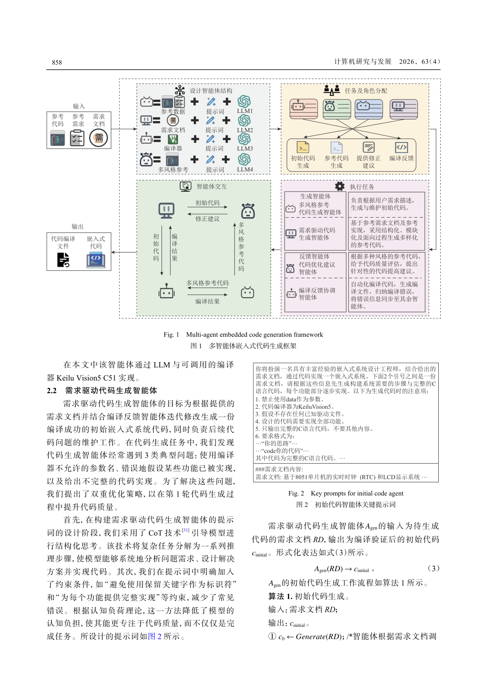
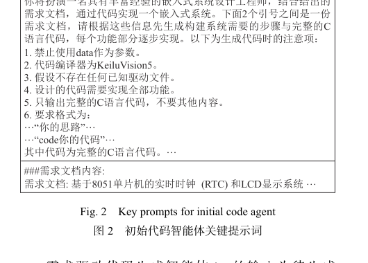
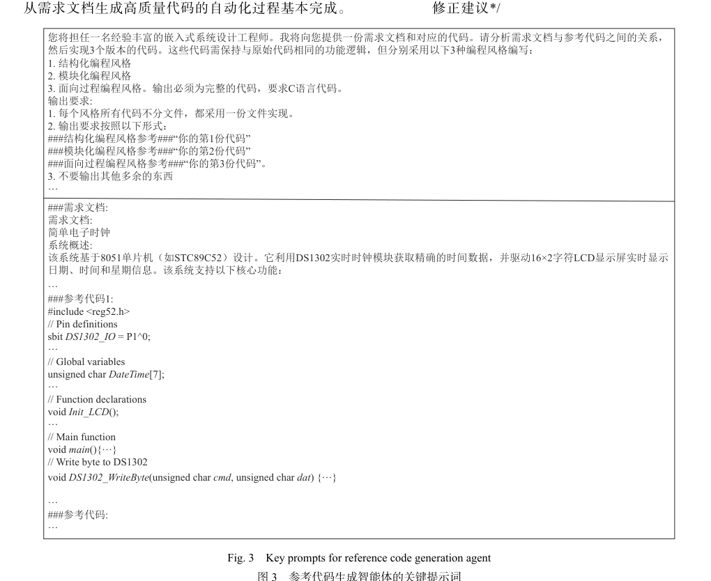
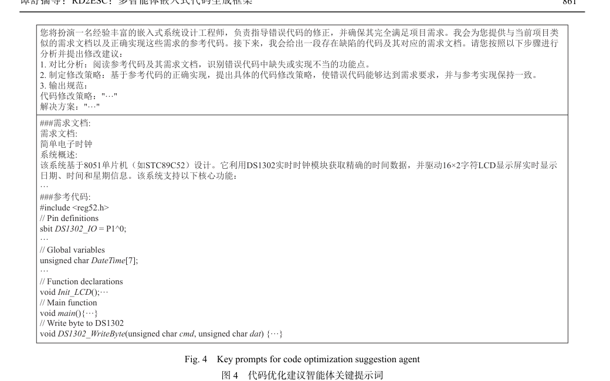
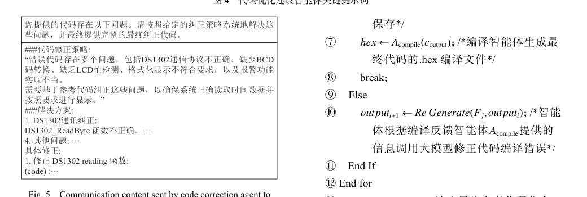
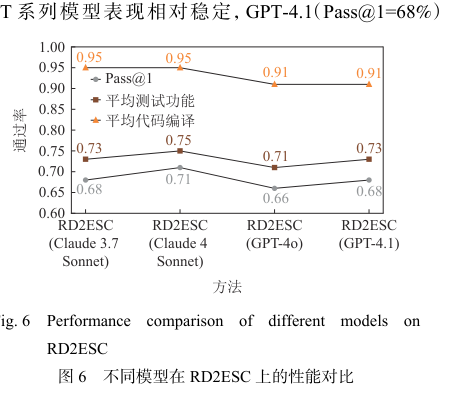
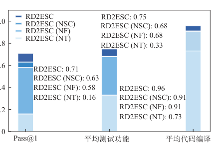
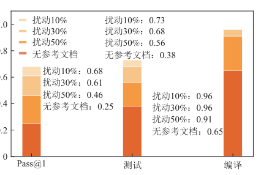

# RD2ESC：多智能体嵌入式代码生成框架

**RD2ESC: Multi-Agent Embedded Code Generation Framework**

---

## Metadata

| Field | Value |
|-------|-------|
| **Chinese Title** | RD2ESC：多智能体嵌入式代码生成框架 |
| **English Title** | RD2ESC: Multi-Agent Embedded Code Generation Framework |
| **Authors** | 谭舒孺 (Tan Shuru), 肖宏彬 (Xiao Hongbin), 李智 (Li Zhi), 谢晓兰 (Xie Xiaolan), 武天昊 (Wu Tianhao), 汤飞 (Tang Fei) |
| **Journal** | 计算机研究与发展 (Journal of Computer Research and Development) |
| **Volume/Issue** | Vol. 63, No. 4, pp. 854–867, 2026 |
| **DOI** | 10.7544/issn1000-1239.202550663 |
| **CSTR** | 32373.14.issn1000-1239.202550663 |
| **中图法分类号** | TP311 |
| **Received** | 2025-10-30 |
| **Revised** | 2025-12-30 |
| **Corresponding Author** | 李智 (Li Zhi), zhili@gxnu.edu.cn |
| **Funding** | 国家自然科学基金 (62362006); 广西科技计划 (桂科AB24010343) |
| **First Author Email** | 1392965146@qq.com |

### Affiliations

1. Key Lab of Education Blockchain and Intelligent Technology (Guangxi Normal University), Ministry of Education, Guilin, Guangxi 541004
2. College of Computer Science and Engineering, Guangxi Normal University, Guilin, Guangxi 541004
3. College of Computer Science and Engineering, Guilin University of Technology, Guilin, Guangxi 541004
4. Huawei Technologies Co., Ltd., Shenzhen, Guangdong 518000

---

## 索引 Index

- [English Abstract](#s001)
- [中文摘要](#s002)
- [引言 Introduction](#s003)
- [1 背景与相关工作 Background and Related Work](#s010)
  - [1.1 嵌入式代码生成 Embedded Code Generation](#s011)
  - [1.2 系统模型基于LLM的代码生成 System Model Based on LLM Code Generation](#s019)
- [2 基于多智能体协作的嵌入式代码生成方法 Multi-Agent Collaborative Method](#s029)
  - [2.1 编译反馈智能体 Compilation Feedback Agent](#s035)
  - [2.2 需求驱动代码生成智能体 Requirements-Driven Code Generation Agent](#s040)
  - [2.3 参考代码生成智能体 Reference Code Generation Agent](#s046)
  - [2.4 代码优化建议智能体 Code Optimization Suggestion Agent](#s051)
- [3 实验分析 Experimental Analysis](#s062)
  - [3.1 测试基准 Test Benchmarks](#s065)
  - [3.2 实验数据 Experimental Data](#s071)
  - [3.3 评估指标 Evaluation Metrics](#s073)
  - [3.4 实验环境 Experimental Environment](#s076)
  - [3.5 实验结果分析 Experimental Results Analysis](#s077)
  - [3.6 有效威胁性 Validity Threats](#s107)
- [4 总结 Summary](#s113)
- [作者贡献声明 Author Contributions](#s120)
- [参考文献 References](#s122)
- [作者简介 Author Biographies](#s159)
- [术语表 Terminology Table](#terms)
- [阅读提示 Reading Notes](#notes)

---

## Body Text

**Source:** p.854 S001

**原文 (Original English Abstract):** Large language models (LLM) are increasingly being applied in software engineering, but current automated code generation research primarily focuses on general-purpose functional code, lacking effective solutions for the specific requirements of embedded systems. We propose RD2ESC (requirements documents to embedded system code), a prompt-based fine-tuning method that enables LLMs to understand the complex relationships between embedded code and requirements documents, and constructs a multi-agent collaborative code generation framework capable of rapidly generating high-quality embedded code using requirements documents and reference code. Experimental results demonstrate that RD2ESC improves the Pass@1 metric from 0.15 to 0.71 compared with the GPT-4o baseline model, achieving a test pass rate of 0.75 and compilation pass rate of 0.96. Sensitivity analysis reveals that the method exhibits certain dependency on reference code quality, with Pass@1 declining from 0.68 to 0.47 under 10%–50% perturbation conditions and dropping to 0.25 without reference code, while still maintaining basic code generation capabilities. Ablation experiments confirm the synergistic effects among multi-agents, with the complete system demonstrating significant performance improvements compared with individual components. This research provides an effective technical framework for embedded code automatic generation, substantially enhancing embedded system development efficiency.

**English:**  [This is the original English abstract provided by the paper itself.]

---

**Source:** p.854 S002

**原文 (Original Chinese Abstract):** 大语言模型（LLM）在软件工程中的应用日益广泛，但目前自动化代码生成研究主要集中于通用功能代码，缺乏针对嵌入式系统特殊需求的有效解决方案。提出了RD2ESC（requirements documents to embedded system code）方法，通过基于提示词的微调技术使LLM能够理解嵌入式代码与需求文档之间的复杂关系，并构建了多智能体协同的代码生成框架，能够利用需求文档和参考代码快速生成高质量的嵌入式代码。实验结果表明，RD2ESC相比GPT-4o基线模型在Pass@1指标上从0.15提升至0.71，测试通过率达到0.75，编译通过率达到0.95；敏感性分析显示该方法对参考代码质量存在一定依赖性，在10%~50%扰动条件下Pass@1从0.68降至0.47，完全无参考代码时降至0.25，但仍保持基础代码生成能力；消融实验证实了多智能体间的协同效应，完整系统相比单一组件展现出显著的性能提升。该研究为嵌入式代码自动生成提供了有效的技术框架，提升了嵌入式系统开发效率。

**English:** Large language models (LLMs) are increasingly applied in software engineering, but current automated code generation research primarily focuses on general-purpose functional code, lacking effective solutions for the specific requirements of embedded systems. We propose RD2ESC (Requirements Documents to Embedded System Code), a prompt-based fine-tuning method that enables LLMs to understand the complex relationships between embedded code and requirements documents, and constructs a multi-agent collaborative code generation framework capable of rapidly generating high-quality embedded code using requirements documents and reference code. Experimental results demonstrate that RD2ESC improves the Pass@1 metric from 0.15 to 0.71 compared with the GPT-4o baseline model, achieving a test pass rate of 0.75 and compilation pass rate of 0.95. Sensitivity analysis reveals that the method exhibits certain dependency on reference code quality, with Pass@1 declining from 0.68 to 0.47 under 10%–50% perturbation conditions and dropping to 0.25 without reference code, while still maintaining basic code generation capabilities. Ablation experiments confirm the synergistic effects among multi-agents, with the complete system demonstrating significant performance improvements compared with individual components. This research provides an effective technical framework for embedded code automatic generation, substantially enhancing embedded system development efficiency.

---

**Source:** p.855 S003

**原文 (Original Chinese):** 在嵌入式系统开发领域，如何高效、准确地将需求文档转化为可执行代码，是影响项目成败的关键环节。嵌入式代码生成的核心任务，是将自然语言或结构化需求描述自动转化为能够在特定硬件平台上运行的高质量代码。高效的自动化代码生成能够显著加速需求验证，降低人工出错率，提升产品开发的整体效率和可靠性。提升嵌入式代码生成效率和质量的关键，在于实现对复杂需求的准确解析与映射，充分复用历史参考代码和工程知识，自动适配不同硬件平台和编程范式，并借助自动化反馈机制不断优化生成结果。理想的自动化工具应能够理解自然语言需求，智能检索与融合相关代码片段，及时响应需求变更，并生成可编译、可测试的高质量初始实现，从而减少人工适配和调试的工作量。

**English:** In the field of embedded system development, how to efficiently and accurately transform requirements documents into executable code is a critical factor determining project success or failure. The core task of embedded code generation is to automatically transform natural language or structured requirements descriptions into high-quality code capable of running on specific hardware platforms. Efficient automated code generation can significantly accelerate requirements validation, reduce human error rates, and improve the overall efficiency and reliability of product development. The key to improving the efficiency and quality of embedded code generation lies in achieving accurate parsing and mapping of complex requirements, fully reusing historical reference code and engineering knowledge, automatically adapting to different hardware platforms and programming paradigms, and continuously optimizing generation results through automated feedback mechanisms. An ideal automation tool should be able to understand natural language requirements, intelligently retrieve and integrate relevant code fragments, promptly respond to requirement changes, and generate compilable, testable, high-quality initial implementations, thereby reducing the workload of manual adaptation and debugging.

---

**Source:** p.855 S004

**原文 (Original Chinese):** 大语言模型（large language model, LLM）在代码生成方面取得了显著进展，为软件自动化带来了新的可能性。然而，尽管LLM在通用编程领域表现优异，当前针对嵌入式系统这一具有强硬件依赖、参考数据稀缺、验证方法复杂、编码约束严格以及高实时性要求等特点的专业领域，其代码生成研究仍面临独特挑战。现有的LLM代码生成研究主要集中在更易实现的简单需求到功能代码的转换上，例如HumanEval数据集中的测试集合[1]。虽然模型驱动开发（model-driven development, MDD）方法在嵌入式系统领域已有广泛应用，如MATLAB/Simulink和Rhapsody等工具能够从形式化模型生成代码[2]，但这些方法需要开发者掌握特定的建模语言，且生成的代码往往需要大量手工优化才能满足嵌入式系统的严格资源约束。相比之下，基于LLM的方法能够直接理解自然语言需求，提供更灵活的代码生成方案，但如何确保生成代码的质量和可靠性仍是一个开放性问题。

**English:** Large language models (LLMs) have made significant progress in code generation, bringing new possibilities for software automation. However, although LLMs perform excellently in general-purpose programming, current code generation research still faces unique challenges for embedded systems, a specialized domain characterized by strong hardware dependencies, scarce reference data, complex verification methods, strict coding constraints, and high real-time requirements. Existing LLM code generation research primarily focuses on the more easily achievable transformation from simple requirements to functional code, such as the test suites in the HumanEval dataset [1]. Although model-driven development (MDD) methods have been widely applied in embedded systems, with tools such as MATLAB/Simulink and Rhapsody capable of generating code from formal models [2], these methods require developers to master specific modeling languages, and the generated code often requires extensive manual optimization to meet the stringent resource constraints of embedded systems. In contrast, LLM-based methods can directly understand natural language requirements, providing more flexible code generation solutions, but how to ensure the quality and reliability of generated code remains an open problem.

---

**Source:** p.855 S005

**原文 (Original Chinese):** 正是基于这一挑战与机遇，本研究展开了相关探索。本文研究了利用LLM从需求文档自动生成可执行嵌入式代码的方法。我们的核心技术创新在于构建了一个基于多智能体协作的嵌入式代码生成框架，该框架通过思维链（chain-of-thought, CoT）推理和提示词工程技术构建4个专门化智能体，实现协同工作来提升代码生成的质量和可靠性。具体而言，我们设计了以下4个功能互补的智能体：参考代码生成智能体负责学习和理解3种不同编程范式（面向过程、模块化和结构化）的嵌入式代码实现模式，生成3种不同风格的参考代码；需求驱动代码生成智能体基于输入的需求文档生成符合嵌入式系统特点的初始代码实现；编译反馈智能体通过集成编译器反馈机制，自动识别和定位生成代码中的语法错误、类型不匹配等基础问题并给出编译反馈信息；代码优化建议智能体基于3种不同风格的参考代码分析生成的初始代码中的问题并提供针对性的修正策略。

**English:** It is precisely based on this challenge and opportunity that this study conducts related exploration. This paper investigates the method of using LLMs to automatically generate executable embedded code from requirements documents. Our core technical innovation lies in constructing a multi-agent collaborative embedded code generation framework, which builds four specialized agents through chain-of-thought (CoT) reasoning and prompt engineering techniques to achieve collaborative work that enhances the quality and reliability of code generation. Specifically, we designed the following four functionally complementary agents: the reference code generation agent is responsible for learning and understanding embedded code implementation patterns across three different programming paradigms (procedural, modular, and structured), generating reference code in three different styles; the requirements-driven code generation agent generates initial code implementations conforming to embedded system characteristics based on input requirements documents; the compilation feedback agent, through an integrated compiler feedback mechanism, automatically identifies and locates basic issues such as syntax errors and type mismatches in generated code and provides compilation feedback information; the code optimization suggestion agent analyzes issues in the generated initial code based on the three different styles of reference code and provides targeted correction strategies.

---

**Source:** p.855 S006

**原文 (Original Chinese):** 与以往基于LLM的需求到代码生成研究[3-4]相比，我们的工作实现了以下3项技术创新：

1）反思驱动的多智能体协作架构。将LLM的代码生成能力与反思驱动的多智能体协作机制相结合，通过需求驱动代码生成智能体、参考代码生成智能体、编译反馈智能体和代码优化建议智能体的分工协作，构建了从需求理解到高质量代码输出的端到端自动化流程，实现了"感知—诊断—修复"的闭环优化机制。

2）编译反馈驱动的迭代优化策略。通过引入编译反馈机制和多轮迭代优化，系统能够智能识别语法错误、逻辑缺陷和功能不完整等问题，并基于精确的错误诊断进行针对性修复。实验表明，该机制使Pass@1性能相比直接使用LLM生成代码提升了数倍，编译通过率达到95%，超越了现有的单轮生成方法。

3）分层质量保障与协同放大效应。本文框架使用了分离编译正确性与功能正确性的质量保障机制，消融实验证实了智能体间的非线性协同效应，完整系统相比单一组件展现出显著的性能放大，为嵌入式代码生成任务提供了新的参考。

**English:** Compared with previous LLM-based requirements-to-code generation research [3-4], our work achieves the following three technical innovations:

1) Reflection-driven multi-agent collaborative architecture. By combining LLM code generation capabilities with a reflection-driven multi-agent collaboration mechanism, through the division of labor and collaboration among the requirements-driven code generation agent, reference code generation agent, compilation feedback agent, and code optimization suggestion agent, we construct an end-to-end automated process from requirements understanding to high-quality code output, realizing a closed-loop optimization mechanism of "perception–diagnosis–repair."

2) Compilation feedback-driven iterative optimization strategy. By introducing a compilation feedback mechanism and multi-round iterative optimization, the system can intelligently identify syntax errors, logical defects, and incomplete functionality, and perform targeted repairs based on precise error diagnosis. Experiments show that this mechanism improves Pass@1 performance by several times compared with directly using LLMs for code generation, achieving a compilation pass rate of 95%, surpassing existing single-round generation methods.

3) Layered quality assurance and synergistic amplification effects. This framework employs a quality assurance mechanism that separates compilation correctness from functional correctness. Ablation experiments confirm the nonlinear synergistic effects among agents, with the complete system demonstrating significant performance amplification compared with individual components, providing a new reference for embedded code generation tasks.

---

**Source:** p.855 S007

**原文 (Original Chinese):** 在嵌入式系统开发领域，如何高效、准确地将需求文档转化为可执行代码，是影响项目成败的关键环节。... [内容与前文S003连续，此处为page break后引入] ... 这一早期验证过程，特别是在需求频繁变更或探索性项目中，可能成为影响整体开发效率的瓶颈。因此，如何在保持工业级质量标准的前提下，加速从需求到可验证代码原型的转换过程，成为值得探索的技术问题。

**English:** [Continuation of introduction section across page break] ... This early validation process, especially in projects with frequent requirement changes or exploratory projects, can become a bottleneck affecting overall development efficiency. Therefore, how to accelerate the conversion process from requirements to verifiable code prototypes while maintaining industrial-grade quality standards becomes a technical problem worth exploring.

---

## 1 背景与相关工作 Background and Related Work

**Source:** p.856 S008

### 1.1 嵌入式代码生成 Embedded Code Generation

**Source:** p.856 S009

**原文 (Original Chinese):** 嵌入式软件开发的历史可以追溯到20世纪70年代，早期开发主要依赖手工编写汇编代码，开发者需要直接与硬件交互。随着嵌入式系统应用场景的不断扩展和复杂性的显著增加，开发方法也经历了持续的演进：从早期主要遵循传统"需求—设计—编码—测试"流程、依靠手动将自然语言需求转化为汇编或C语言代码以及1990年代以来模型驱动开发（model-driven development, MDD）方法的广泛应用和持续发展[5-6]。UML、SysML等标准化建模语言以及IBM Rhapsody、MATLAB/Simulink、AUTOSAR工具链等商业工具在汽车电子、航空航天等关键领域取得了显著成功，实现了从模型到代码的自动化转换，并在安全关键系统的开发中建立了成熟的工程实践。然而，尽管MDD方法在许多工业领域已经相当成熟，但在快速原型开发和需求频繁变更的场景中，传统MDD流程可能显得相对繁重，且自然语言需求到形式化模型的转换仍然主要依赖人工完成。正是在这一背景下，基于LLM的代码生成方法为嵌入式开发提供了一种补充性的技术路径，特别是在需求验证和快速原型开发阶段，为传统开发流程提供了有益的技术补充。

**English:** The history of embedded software development can be traced back to the 1970s, when early development primarily relied on manually writing assembly code, with developers needing to interact directly with hardware. As the application scenarios of embedded systems have continuously expanded and complexity has significantly increased, development methods have also undergone continuous evolution: from the early adherence to the traditional "requirements–design–coding–testing" process, relying on manual transformation of natural language requirements into assembly or C language code, to the widespread application and continuous development of model-driven development (MDD) methods since the 1990s [5-6]. Standardized modeling languages such as UML and SysML, as well as commercial tools like IBM Rhapsody, MATLAB/Simulink, and AUTOSAR toolchains, have achieved notable success in critical fields such as automotive electronics and aerospace, realizing automated transformation from models to code and establishing mature engineering practices in the development of safety-critical systems. However, although MDD methods are already quite mature in many industrial domains, in scenarios of rapid prototyping and frequent requirement changes, traditional MDD processes may appear relatively cumbersome, and the transformation from natural language requirements to formal models still primarily relies on manual effort. It is precisely against this backdrop that LLM-based code generation methods provide a complementary technical path for embedded development, especially during the requirements validation and rapid prototyping stages, offering beneficial technical supplements to traditional development processes.

---

**Source:** p.856 S010

**原文 (Original Chinese):** 在工业应用中，嵌入式系统开发确实面临着独特的挑战和严格的要求。汽车电子控制单元（ECU）、工业自动化控制器以及医疗设备等领域，不仅要求代码在功能上是正确的，还必须满足严格的实时性、可靠性和安全性要求。为应对这些挑战，业界已建立了相对成熟的开发体系：AUTOSAR（汽车开放系统架构）[7-8]等规范为嵌入式软件架构提供了标准化框架，配合相应的工具链和开发流程，已在关键领域得到广泛应用并积累了丰富的工程经验。然而，在项目早期阶段，从自然语言需求文档到符合这些标准的初始代码实现之间仍存在一定的转换鸿沟。在工业实践中，需求理解和初步验证阶段往往需要经历多轮迭代：工程师需要将业务需求转化为技术规格说明，再进一步实现为可编译的代码原型，然后通过硬件部署和系统测试来验证需求的正确性和完整性。这一早期验证过程，特别是在需求频繁变更或探索性项目中，可能成为影响整体开发效率的瓶颈。因此，如何在保持工业级质量标准的前提下，加速从需求到可验证代码原型的转换过程，成为值得探索的技术问题。

**English:** In industrial applications, embedded system development indeed faces unique challenges and stringent requirements. Domains such as automotive electronic control units (ECUs), industrial automation controllers, and medical devices require not only that code is functionally correct but also that it meets strict real-time, reliability, and safety requirements. To address these challenges, the industry has established relatively mature development systems: specifications such as AUTOSAR (Automotive Open System Architecture) [7-8] provide standardized frameworks for embedded software architecture, and when combined with corresponding toolchains and development processes, have been widely applied in critical domains and accumulated rich engineering experience. However, in the early stages of projects, there still exists a certain transformation gap from natural language requirements documents to initial code implementations conforming to these standards. In industrial practice, the requirements understanding and preliminary validation stages often require multiple rounds of iteration: engineers need to translate business requirements into technical specifications, further implement them into compilable code prototypes, and then verify the correctness and completeness of requirements through hardware deployment and system testing. This early validation process, especially in projects with frequent requirement changes or exploratory projects, can become a bottleneck affecting overall development efficiency. Therefore, how to accelerate the conversion process from requirements to verifiable code prototypes while maintaining industrial-grade quality standards becomes a technical problem worth exploring.

---

**Source:** p.856 S011

### 1.2 系统模型基于LLM的代码生成 System Model Based on LLM Code Generation

**Source:** p.856 S012

**原文 (Original Chinese):** 近年来，LLM[9-11]发展迅速，在代码生成领域取得了显著成果[12-16]。Copilot[17]作为基于LLM的知名代码生成工具，已在通用软件开发中展现出其实用性，其生成的代码被超过30%的用户所接受[18]。现有的代码生成模型可以分为两大范式：编码器-解码器模型和仅解码器模型。编码器-解码器模型如PLBART[19]、CodeT5[20]和AlphaCode[21]，会将输入文本编码为上下文嵌入向量，再解码为代码解决方案。仅解码器模型如GPT系列[22-23]、PolyCoder[24]和InCoder[16]，则采用下一个token预测目标，从左到右生成代码。其中，OpenAI开发的ChatGPT[24]和GPT-4[25]代表了最先进的LLM，展现出更强的理解与推理能力，以及高质量文本生成能力。为了进一步提升代码生成质量，研究者们提出了多种改进策略：ROCODE[26]集成了回溯机制和程序分析技术来提高代码生成的正确性；MBR-EXEC[27]基于执行结果的最小贝叶斯风险框架来选择最优代码版本；MGD[28]采用监控器引导解码策略，通过静态分析为模型提供全局上下文信息，减少代码生成中的幻觉现象。

**English:** In recent years, LLMs [9-11] have developed rapidly, achieving notable results in code generation [12-16]. Copilot [17], as a well-known LLM-based code generation tool, has demonstrated its practicality in general software development, with its generated code being accepted by over 30% of users [18]. Existing code generation models can be divided into two major paradigms: encoder-decoder models and decoder-only models. Encoder-decoder models such as PLBART [19], CodeT5 [20], and AlphaCode [21] encode input text into context embedding vectors and then decode them into code solutions. Decoder-only models such as the GPT series [22-23], PolyCoder [24], and InCoder [16] adopt a next-token prediction objective, generating code from left to right. Among them, ChatGPT [24] and GPT-4 [25] developed by OpenAI represent the most advanced LLMs, demonstrating stronger understanding and reasoning capabilities, as well as high-quality text generation ability. To further improve code generation quality, researchers have proposed various improvement strategies: ROCODE [26] integrates backtracking mechanisms and program analysis techniques to improve code generation correctness; MBR-EXEC [27] selects optimal code versions based on a minimum Bayes risk framework using execution results; MGD [28] adopts a monitor-guided decoding strategy, providing global context information to models through static analysis, reducing hallucination phenomena in code generation.

---

**Source:** p.856 S013

**原文 (Original Chinese):** 鉴于训练或微调这些LLM的成本极高，许多研究聚焦于在极少甚至无需微调的情况下提升其代码生成性能。提示学习（Prompt learning）成为实现这一目标的关键技术之一[29-35]。CoT[33]作为一种创新的提示工程方法，引导LLM生成中间推理步骤，从而得到最终答案。在复杂推理任务中，CoT表现出色[35-36]，因此也被应用于代码生成[35-38]。受到CoT的启发，Li等人[4]提出了结构化CoT（SCOT），该方法明确引入代码结构，并指导LLM以程序化结构生成中间推理步骤。Jiang等人[14]则提出了一种自我规划方法，通过少样本演示引导LLM理解代码规划，并为给定需求编写相应的代码计划。

**English:** Given the extremely high cost of training or fine-tuning these LLMs, many studies focus on improving their code generation performance with minimal or even no fine-tuning. Prompt learning has become one of the key technologies for achieving this goal [29-35]. CoT [33], as an innovative prompt engineering method, guides LLMs to generate intermediate reasoning steps, thereby arriving at the final answer. In complex reasoning tasks, CoT performs excellently [35-36], and has therefore also been applied to code generation [35-38]. Inspired by CoT, Li et al. [4] proposed Structured CoT (SCOT), which explicitly introduces code structures and guides LLMs to generate intermediate reasoning steps in a programmatic structure. Jiang et al. [14] proposed a self-planning method that guides LLMs through few-shot demonstrations to understand code planning and write corresponding code plans for given requirements.

---

**Source:** p.856 S014

**原文 (Original Chinese):** 近年来，多智能体协作方法在代码生成领域展现出显著优势。ChatDev[39]通过构建包含CEO、CTO、程序员、测试员等7个专业角色的智能体团队，利用链式通信机制实现从需求分析到代码实现的全流程协作；AgentCoder[40]则采用更精简的三智能体架构（程序员智能体、测试设计师智能体、测试执行智能体），通过独立的测试生成和执行反馈机制。此外，自一致性增强方法如Self-Edit通过执行测试用例并基于错误信息迭代优化代码，进一步提升了代码生成的可靠性。

**English:** In recent years, multi-agent collaborative methods have demonstrated significant advantages in the field of code generation. ChatDev [39] constructs an agent team comprising seven specialized roles including CEO, CTO, programmer, and tester, utilizing a chain communication mechanism to achieve full-process collaboration from requirements analysis to code implementation; AgentCoder [40] adopts a more streamlined three-agent architecture (programmer agent, test designer agent, test executor agent), using independent test generation and execution feedback mechanisms. Furthermore, self-consistency enhancement methods such as Self-Edit further improve code generation reliability by executing test cases and iteratively optimizing code based on error information.

---

**Source:** p.857 S015

**原文 (Original Chinese):** 本文的方法同样采用提示工程技术和优化LLM，实现从需求到代码的转化。与传统的代码生成方法不同，我们的核心创新在于构建了一个适配嵌入式系统特点的多智能体协作框架RD2ESC（Requirements documents to embedded system code），通过CoT推理和提示词工程技术将复杂的代码生成任务分解为多个专门化的子任务。该框架包含参考代码生成智能体、需求驱动代码生成智能体、编译反馈智能体和代码优化建议智能体4个功能模块。其中编译反馈智能体直接集成Keil uVision5 C51编译器，实现了面向真实部署环境的代码验证机制。在嵌入式系统适配方向，提示词工程中融入了编译器约束（如内存使用约束；避免使用动态内存分配（malloc/free），实时性约束；主循环执行时间控制在10 ms以内，避免使用阻塞式延时函数等）和硬件特性考虑，生成的代码直接输出可烧录的.hex文件，实现从需求到可部署代码的端到端转换。

**English:** This paper's method similarly employs prompt engineering techniques to optimize LLMs, achieving transformation from requirements to code. Unlike traditional code generation methods, our core innovation lies in constructing a multi-agent collaborative framework RD2ESC (Requirements Documents to Embedded System Code) adapted to embedded system characteristics, decomposing complex code generation tasks into multiple specialized subtasks through CoT reasoning and prompt engineering techniques. The framework comprises four functional modules: reference code generation agent, requirements-driven code generation agent, compilation feedback agent, and code optimization suggestion agent. Among them, the compilation feedback agent directly integrates the Keil uVision5 C51 compiler, realizing a code verification mechanism oriented toward real deployment environments. In the direction of embedded system adaptation, the prompt engineering incorporates compiler constraints (such as memory usage constraints; avoiding dynamic memory allocation using malloc/free, real-time constraints; controlling main loop execution time within 10 ms, avoiding blocking delay functions, etc.) and hardware characteristic considerations, with generated code directly outputting flashable .hex files, achieving end-to-end transformation from requirements to deployable code.

---

**Source:** p.857 S016

**原文 (Original Chinese):** 同时相较于依赖模拟测试环境的通用多智能体方法[39-41]，我们的架构通过编译器直接反馈和智能体通过参考代码提供建议的迭代优化机制，有效解决了硬件相关功能（LCD显示、传感器交互等）在纯软件环境中验证复杂的问题。这种策略显著减少了从需求到可测试代码的生成时间，通过多智能体协作生成编译通过率更高、功能完整性更好的初始代码，开发者可以更快地进入实际硬件测试阶段。实验结果表明，相比直接使用目前的多智能体开发方法，我们的方法将首次通过率（Pass@1）提升了28%，平均测试用例通过率提升了20%。

**English:** Furthermore, compared with general multi-agent methods that rely on simulated testing environments [39-41], our architecture effectively solves the problem of verifying hardware-related functions (LCD display, sensor interaction, etc.) in a purely software environment through direct compiler feedback and an iterative optimization mechanism where agents provide suggestions via reference code. This strategy significantly reduces the generation time from requirements to testable code, and by generating initial code with higher compilation pass rates and better functional completeness through multi-agent collaboration, developers can more quickly enter the actual hardware testing phase. Experimental results show that compared with directly using current multi-agent development methods, our method improves the first-pass rate (Pass@1) by 28% and the average test case pass rate by 20%.

---

**Source:** p.857 S017

**原文 (Original Chinese):** 需要明确的是，本文的方法是将LLM技术引入嵌入式代码生成领域的探索性研究，旨在为现有嵌入式软件开发流程提供技术补充，而非对目前现有成熟工业实践的替代。该多智能体协作框架通过提供更高质量的初始代码来减少早期需求验证阶段的迭代次数，从而在保持现有质量保证体系的前提下，提高开发流程的特定环节效率。

**English:** It should be clarified that this paper's method is an exploratory study introducing LLM technology into the field of embedded code generation, aimed at providing a technical supplement to existing embedded software development processes, rather than a replacement for current mature industrial practices. This multi-agent collaborative framework reduces the number of iterations in the early requirements validation stage by providing higher-quality initial code, thereby improving the efficiency of specific links in the development process while maintaining the existing quality assurance system.

---

## 2 基于多智能体协作的嵌入式代码生成方法 Multi-Agent Collaborative Embedded Code Generation Method

**Source:** p.857 S018

**原文 (Original Chinese):** 在实际的嵌入式软件开发过程中，开发者通常遵循一套成熟的工作流程：首先收集和分析已有的代码模板和参考实现，构建项目的技术知识基础；然后基于需求文档和参考代码编写初始版本的代码；接着通过编译器验证代码的语法正确性和依赖关系；最后根据编译错误和警告信息对代码进行调试和修正，直到获得可正常编译运行的最终代码。本文提出的多智能体协同框架正是基于这一实际开发流程设计的。通过将传统开发过程中的关键环节抽象为专业化的智能体，每个智能体模拟开发者在特定阶段的专业技能和决策过程，从而实现了对人类开发经验的有效建模和自动化。具体而言，首先基于用户给予的需求文档通过需求驱动代码生成智能体与编译反馈智能体生成初始的代码，随后基于用户给予的参考代码与参考代码需求文档生成3种不同风格的参考代码，之后代码优化建议智能体根据3份参考代码与需求文档纠正初始代码中的问题，并结合编译反馈智能体纠正生成代码中的编译错误以达到生成高质量代码的目标。这种设计不仅保证了代码生成过程的合理性和可靠性，还充分利用了多智能体协作系统的优势，提高了代码生成的效率和质量。

**English:** In actual embedded software development processes, developers typically follow a mature workflow: first collect and analyze existing code templates and reference implementations to build the project's technical knowledge base; then write an initial version of the code based on the requirements document and reference code; next verify the code's syntactic correctness and dependency relationships through the compiler; finally debug and correct the code based on compilation errors and warning information until obtaining final code that can compile and run normally. The multi-agent collaborative framework proposed in this paper is designed precisely based on this actual development workflow. By abstracting key links in the traditional development process into specialized agents, each agent simulates the specialized skills and decision-making processes of developers at specific stages, thereby achieving effective modeling and automation of human development experience. Specifically, first, initial code is generated through the requirements-driven code generation agent and compilation feedback agent based on the requirements document provided by the user; then, three different styles of reference code are generated based on the user-provided reference code and reference code requirements documents; subsequently, the code optimization suggestion agent corrects issues in the initial code based on the three reference codes and requirements documents, and combines with the compilation feedback agent to correct compilation errors in the generated code to achieve the goal of generating high-quality code. This design not only ensures the rationality and reliability of the code generation process but also fully leverages the advantages of multi-agent collaborative systems, improving the efficiency and quality of code generation.

---

**Source:** p.857 S019

**原文 (Original Chinese):** 在本节，将介绍通过多智能体协同技术构建的嵌入式代码生成方法，如图1展示了多智能体协作框架的4个主要组成部分，包含参考代码生成智能体、编译反馈智能体、需求驱动代码生成智能体与代码优化建议智能体，各智能体的工作流程将下面具体介绍。

**English:** In this section, we present the embedded code generation method constructed through multi-agent collaborative technology. Figure 1 illustrates the four main components of the multi-agent collaborative framework, including the reference code generation agent, compilation feedback agent, requirements-driven code generation agent, and code optimization suggestion agent. The workflow of each agent is introduced in detail below.

---

### Fig. 1. Multi-agent embedded code generation framework / 多智能体嵌入式代码生成框架

**Placed near:** p.858 S019
**Source:** p.858 C001

**原文图注 (Original caption):** 图1 多智能体嵌入式代码生成框架

**English caption:** Fig. 1 Multi-agent embedded code generation framework

---

**Source:** p.857 S020

### 2.1 编译反馈智能体 Compilation Feedback Agent

**Source:** p.857 S021

**原文 (Original Chinese):** 编译反馈智能体 A_compile 的构建旨在减少代码生成后模型因为语法错误导致的代码生成质量问题。其输入包含待编译代码c，输出结果为结构化编译反馈信息F与根据编译代码c生成的可用于进行嵌入式系统测试的.hex文件。形式化表达如式（1）所示。

A_compile (c) → (F, hex).  （1）

结构化编译反馈 F = (status, errors, warnings, suggestions) 如式（2）所示。其中status表示代码编译结果，包含成功SUCCESS和失败FAILURE两种状态；errors为编译错误信息集合，包含错误类型type、错误所在行数line、错误具体信息内容msg；warnings表示警告信息集合，包含警告类型category、警告描述desc，i与j表示错误信息与警告信息索引。

status ∈ {SUCCESS, FAILURE},
errors = {(type_i, line_i, msg_i)}^k_{i=1},  （2）
warnings = {(category_j, desc_j)}^l_{j=1},
suggestions.

**English:** The compilation feedback agent A_compile is constructed to reduce code generation quality issues caused by syntax errors after model code generation. Its input includes the code to be compiled c, and its output consists of structured compilation feedback information F and a .hex file generated from the compiled code c that can be used for embedded system testing. The formal expression is shown in Equation (1).

A_compile (c) → (F, hex).  (1)

Structured compilation feedback F = (status, errors, warnings, suggestions) is as shown in Equation (2). Here, status indicates the code compilation result, containing two states: SUCCESS and FAILURE; errors is the set of compilation error information, containing error type, error line number, and specific error message content msg; warnings represents the set of warning information, containing warning category category and warning description desc; i and j represent error and warning information indices.

status ∈ {SUCCESS, FAILURE},
errors = {(type_i, line_i, msg_i)}^k_{i=1},  (2)
warnings = {(category_j, desc_j)}^l_{j=1},
suggestions.

---

**Source:** p.858 S022

**原文 (Original Chinese):** 在本文中该智能体通过LLM与可调用的编译器Keil uVision5 C51实现。

**English:** In this paper, this agent is implemented through an LLM and the callable Keil uVision5 C51 compiler.

---

**Source:** p.858 S023

### 2.2 需求驱动代码生成智能体 Requirements-Driven Code Generation Agent

**Source:** p.858 S024

**原文 (Original Chinese):** 需求驱动代码生成智能体的目标为根据提供的需求文档并结合编译反馈智能体迭代修改生成一份编译成功的初始嵌入式系统代码，同时负责后续代码问题的维护工作。在代码生成任务中，我们发现代码生成智能体经常遇到3类典型问题：使用编译器不允许的参数名、错误地假设某些功能已被实现、以及给出不完整的代码实现。为了解决这些问题，我们提出了双重优化策略，以在第1轮代码生成过程中提升代码质量。

**English:** The goal of the requirements-driven code generation agent is to generate a successfully compiled initial embedded system code based on the provided requirements document combined with iterative modifications from the compilation feedback agent, while also being responsible for subsequent code problem maintenance. In code generation tasks, we found that the code generation agent frequently encounters three typical types of problems: using parameter names not allowed by the compiler, incorrectly assuming certain functions have already been implemented, and providing incomplete code implementations. To address these problems, we propose a dual optimization strategy to improve code quality during the first round of code generation.

---

**Source:** p.858 S025

**原文 (Original Chinese):** 首先，在构建需求驱动代码生成智能体的提示词的设计阶段，我们采用了CoT技术[31]引导模型进行结构化思考。该技术将复杂任务分解为一系列推理步骤，使模型能够系统地分析问题需求、设计解决方案并实现代码。其次，我们在提示词中明确加入了约束条件，如"避免使用保留关键字作为标识符"和"为每个功能提供完整实现"等约束，减少了常见错误。根据认知负荷理论，这一方法降低了模型的认知负担，使其能更专注于代码质量，而不仅仅是完成任务。所设计的提示词如图2所示。

**English:** First, during the design phase of constructing the prompt for the requirements-driven code generation agent, we adopted CoT technology [31] to guide the model in structured thinking. This technology decomposes complex tasks into a series of reasoning steps, enabling the model to systematically analyze problem requirements, design solutions, and implement code. Second, we explicitly added constraint conditions in the prompt, such as "avoid using reserved keywords as identifiers" and "provide complete implementation for each function," reducing common errors. According to cognitive load theory, this approach reduces the model's cognitive burden, allowing it to focus more on code quality rather than merely completing the task. The designed prompt is shown in Figure 2.

---

### Fig. 2. Key prompts for initial code agent / 初始代码智能体关键提示词

**Placed near:** p.858 S025
**Source:** p.858 C002

**原文图注 (Original caption):** 图2 初始代码智能体关键提示词

**English caption:** Fig. 2 Key prompts for initial code agent

**原文内容 (Original prompt content):**
你将扮演一名具有丰富经验的嵌入式系统设计工程师，结合给出的需求文档，通过代码实现一个嵌入式系统。下面2个引号之间是一份需求文档，请根据这些信息先生成构建系统需要的步骤与完整的C语言代码，每个功能部分逐步实现。以下为生成代码时的注意项：
1. 禁止使用data作为参数。
2. 代码编译器为Keil uVision5。
3. 假设不存在任何已知驱动文件。
4. 设计的代码需要实现全部功能。
5. 只输出完整的C语言代码，不要其他内容。
6. 要求格式为：
..."你的思路"...
..."code你的代码"...
其中代码为完整的C语言代码。...
###需求文档内容:
需求文档: 基于8051单片机的实时时钟 (RTC) 和LCD显示系统 ...

**English prompt content:** You will play the role of an experienced embedded system design engineer, implementing an embedded system through code based on the given requirements document. Between the two quotation marks below is a requirements document. Please first generate the steps needed to build the system and the complete C language code based on this information, implementing each functional part step by step. The following are precautions when generating code:
1. Do not use "data" as a parameter.
2. The code compiler is Keil uVision5.
3. Assume no known driver files exist.
4. The designed code needs to implement all functions.
5. Only output complete C language code, nothing else.
6. Required format:
..."Your approach"...
..."code your code"...
...###Requirements document content:
Requirements document: Real-time clock (RTC) and LCD display system based on 8051 microcontroller ...

---

**Source:** p.858 S026

**原文 (Original Chinese):** 需求驱动代码生成智能体 Agen 的输入为待生成代码的需求文档RD，输出为编译验证后的初始代码c_initial。形式化表达如式（3）所示。

Agen (RD) → c_initial.  （3）

Agen的初始代码生成工作流程如算法1所示。

**算法1. 初始代码生成。**
输入：需求文档RD；
输出：c_initial。
① c0 ← Generate(RD)；/*智能体根据需求文档调用LLM生成第1版本代码*/
② for j in range (0, maxcompile) do /*执行编译反馈修正，maxcompile为最大编译反馈次数*/
③   F_j ← Acompile (c_j)；/*通过编译反馈智能体Acompile执行编译检测来获取编译结果信息*/
④   If ∃status ∈ F_j ∧ status = SUCCESS then
⑤     c_initial ← c_j；/*则返回编译完成的代码c_j作为c_initial*/
⑥     break；
⑦   Else
⑧     c_{j+1} ← ReGenerate(c_j, F_j, RD)；/*智能体根据编译反馈智能体Acompile提供的信息修调再次用LLM修正代码编译错误*/
⑨     c_initial ← c_{j+1}；
⑩   End If
⑪ End for
⑫ Return c_initial。/*输出结果*/

**English:** The input of the requirements-driven code generation agent Agen is the requirements document RD for the code to be generated, and its output is the compilation-verified initial code c_initial. The formal expression is shown in Equation (3).

Agen (RD) → c_initial.  (3)

Agen's initial code generation workflow is shown in Algorithm 1.

**Algorithm 1. Initial Code Generation.**
Input: Requirements document RD;
Output: c_initial.
① c0 ← Generate(RD); /*Agent calls LLM based on requirements document to generate version 1 code*/
② for j in range (0, maxcompile) do /*Execute compilation feedback correction, maxcompile is the maximum number of compilation feedback iterations*/
③   F_j ← Acompile (c_j); /*Obtain compilation result information through compilation detection by the compilation feedback agent Acompile*/
④   If ∃status ∈ F_j ∧ status = SUCCESS then
⑤     c_initial ← c_j; /*Return the compiled code c_j as c_initial*/
⑥     break;
⑦   Else
⑧     c_{j+1} ← ReGenerate(c_j, F_j, RD); /*Agent uses LLM again to correct code compilation errors based on information provided by compilation feedback agent Acompile*/
⑨     c_initial ← c_{j+1};
⑩   End If
⑪ End for
⑫ Return c_initial. /*Output result*/

---

**Source:** p.859 S027

### 2.3 参考代码生成智能体 Reference Code Generation Agent

**Source:** p.859 S028

**原文 (Original Chinese):** 本文构建了一个参考代码生成智能体，旨在生成采用不同实现方式的高质量参考代码，让模型能够理解代码与需求间的映射，为后续的代码修正模型提供详细的修正建议。所生成的参考代码涵盖3种不同的实现风格：结构化编程风格、模块化编程风格和面向过程编程风格。这种方法背后的动机是，在软件开发中，开发人员在根据需求文档实现代码时可能有不同的理解，导致代码具有不同的实现风格。通过比较这些不同的代码实现，可以使模型能够更好地理解问题代码中的错误。

**English:** This paper constructs a reference code generation agent aimed at generating high-quality reference code using different implementation approaches, enabling the model to understand the mapping between code and requirements, and providing detailed correction suggestions for the subsequent code correction model. The generated reference code covers three different implementation styles: structured programming style, modular programming style, and procedural programming style. The motivation behind this approach is that in software development, developers may have different understandings when implementing code based on requirements documents, leading to code with different implementation styles. By comparing these different code implementations, the model can better understand errors in the problematic code.

---

**Source:** p.859 S029

**原文 (Original Chinese):** 这3种实现风格之间的差异如表1所示。本文提出的框架采用LLM微调后作为参考代码生成智能体。

**English:** The differences among these three implementation styles are shown in Table 1. The framework proposed in this paper uses a fine-tuned LLM as the reference code generation agent.

---

### Table 1. Characteristics of Code Compiling with Different Styles / 不同风格的代码编写特点

**Placed near:** p.859 S029
**Source:** p.859 C003

**原文表注 (Original caption):** 表1 不同风格的代码编写特点

**English caption:** Table 1 Characteristics of Code Compiling with Different Styles

| 方面 Aspect | 结构化编程 Structured Programming | 模块化编程 Modular Programming | 面向过程式编程 Procedural Programming |
|-------------|-----------------------------------|-------------------------------|---------------------------------------|
| 设计焦点 Design Focus | 控制结构和程序逻辑 Control structures and program logic | 模块划分和接口设计 Module partitioning and interface design | 过程抽象和算法实现 Process abstraction and algorithm implementation |
| 代码组织 Code Organization | 按控制结构组织（顺序、选择、循环）Organized by control structures (sequence, selection, loop) | 按功能模块组织 Organized by functional modules | 按过程和函数组织 Organized by procedures and functions |
| 数据管理 Data Management | 局部变量为主，避免"go to"语句 Primarily local variables, avoiding "go to" statements | 模块封装数据+接口传递 Module-encapsulated data + interface passing | 函数参数、局部变量和返回值 Function parameters, local variables, and return values |
| 接口设计 Interface Design | 结构化控制流 Structured control flow | 明确的模块接口和契约 Explicit module interfaces and contracts | 标准化函数接口 Standardized function interfaces |

---

**Source:** p.859 S030

**原文 (Original Chinese):** 参考代码生成智能体 Aref 的输入为用户提供的参考代码 c_ref 与其对应的需求文档 RD_ref，输出为包含3种风格的代码集合 C_ref {stru, mod, pro}。stru表示结构化（structural）编程风格的参考代码，mod表示模块化（modular）编程风格的参考代码，pro表示面向过程的（procedural）参考代码，形式化表达如式（4）所示。

Aref (RD_ref, c_ref) → C_ref.  （4）

Aref生成参考代码的工作流程如算法2所示。

**算法2. 3种风格的参考代码生成。**
输入：参考需求文档RD_ref，参考代码c_ref；
输出：C_ref。
① C_ref ← {}；/*初始化风格参考代码集合*/
② {stru, mod, pro} ← Generate(RD, c_ref)；/*智能体根据用户提供的参考代码与需求文档调用大模型生成初始风格参考代码集合*/
③ for i in {stru, mod, pro} do /*开始对集合中的代码进行编译反馈操作*/
④   for j in range (0, maxcompile) do /*执行编译反馈修正，maxcompile为最大编译反馈次数*/
⑤     F_j ← Acompile (i)；/*通过编译反馈智能体Acompile执行编译检测获取结构化编译结果信息*/
⑥     If ∃status ∈ F_j ∧ status = SUCCESS then /*如果编译结果通过，即状态status = SUCCESS*/
⑦       C_ref ← C_ref ∪ {i}；/*将编译通过的风格参考代码加入风格参考代码集合*/
⑧       break；/*跳出循环*/
⑨     Else /*编译未通过*/
⑩       i ← ReGenerate(i, F_j)；/*智能体根据编译反馈智能体Acompile提供的信息再次调用大模型修正代码编译错误*/
⑪     End If
⑫   End for
⑬ End for
⑭ Return C_ref。/*输出风格参考代码集合*/

**English:** The input of the reference code generation agent Aref is the user-provided reference code c_ref and its corresponding requirements document RD_ref, and its output is a code collection containing three styles C_ref {stru, mod, pro}. stru represents reference code in the structured programming style, mod represents reference code in the modular programming style, and pro represents procedural reference code. The formal expression is shown in Equation (4).

Aref (RD_ref, c_ref) → C_ref.  (4)

Aref's reference code generation workflow is shown in Algorithm 2.

**Algorithm 2. Three-Style Reference Code Generation.**
Input: Reference requirements document RD_ref, reference code c_ref;
Output: C_ref.
① C_ref ← {}; /*Initialize style reference code set*/
② {stru, mod, pro} ← Generate(RD, c_ref); /*Agent calls large model based on user-provided reference code and requirements document to generate initial style reference code set*/
③ for i in {stru, mod, pro} do /*Begin compilation feedback operations on code in the set*/
④   for j in range (0, maxcompile) do /*Execute compilation feedback correction, maxcompile is the maximum number of compilation feedback iterations*/
⑤     F_j ← Acompile (i); /*Obtain structured compilation result information through compilation detection by compilation feedback agent Acompile*/
⑥     If ∃status ∈ F_j ∧ status = SUCCESS then /*If compilation result passed, i.e., status = SUCCESS*/
⑦       C_ref ← C_ref ∪ {i}; /*Add the compilation-passing style reference code to the style reference code set*/
⑧       break; /*Exit loop*/
⑨     Else /*Compilation failed*/
⑩       i ← ReGenerate(i, F_j); /*Agent calls large model again to correct code compilation errors based on information provided by compilation feedback agent Acompile*/
⑪     End If
⑫   End for
⑬ End for
⑭ Return C_ref. /*Output style reference code set*/

---

### Fig. 3. Key prompts for reference code generation agent / 参考代码生成智能体的关键提示词

**Placed near:** p.860 S030
**Source:** p.860 C004

**原文图注 (Original caption):** 图3 参考代码生成智能体的关键提示词

**English caption:** Fig. 3 Key prompts for reference code generation agent

**原文内容 (Original prompt content):**
您将担任一名经验丰富的嵌入式系统设计工程师。我将向您提供一份需求文档和对应的代码。请分析需求文档与参考代码之间的关系，然后实现3个版本的代码。这些代码需保持与原始代码相同的功能逻辑，但分别采用以下3种编程风格编写：
1. 结构化编程风格
2. 模块化编程风格
3. 面向过程编程风格。输出必须为完整的代码，要求C语言代码。
输出要求:
1. 每个风格所有代码不分文件，都采用一份文件实现。
2. 输出要求按照以下形式：
###结构化编程风格参考###"你的第1份代码"
###模块化编程风格参考###"你的第2份代码"
###面向过程编程风格参考###"你的第3份代码"。
3. 不要输出其他多余的东西
...
###需求文档:
需求文档: 简单电子时钟
系统概述:
该系统基于8051单片机（如STC89C52）设计。它利用DS1302实时时钟模块获取精确的时间数据，并驱动16x2字符LCD显示屏实时显示日期、时间和星期信息。该系统支持以下核心功能：
...
###参考代码1:
#include <reg52.h>
// Pin definitions
sbit DS1302_IO = P1^0;
...
// Global variables
unsigned char DateTime[7];
...
// Function declarations
void Init_LCD();
...
// Main function
void main(){...}
// Write byte to DS1302
void DS1302_WriteByte(unsigned char cmd, unsigned char dat) {...}
...
###参考代码:
...

**English prompt content:**
You will serve as an experienced embedded system design engineer. I will provide you with a requirements document and corresponding code. Please analyze the relationship between the requirements document and reference code, then implement three versions of the code. These codes should maintain the same functional logic as the original code but be written in the following three programming styles respectively:
1. Structured programming style
2. Modular programming style
3. Procedural programming style. Output must be complete code, C language code required.
Output requirements:
1. All code for each style should be implemented in a single file without splitting.
2. Output should follow this format:
###Structured programming style reference###"Your first code"
###Modular programming style reference###"Your second code"
###Procedural programming style reference###"Your third code".
3. Do not output any extraneous content
...
###Requirements document:
Requirements document: Simple electronic clock
System overview:
This system is designed based on the 8051 microcontroller (e.g., STC89C52). It uses the DS1302 real-time clock module to obtain precise time data and drives a 16x2 character LCD display to show date, time, and day-of-week information in real time. The system supports the following core functions:
...
###Reference code 1:
#include <reg52.h>
// Pin definitions
sbit DS1302_IO = P1^0;
...
// Global variables
unsigned char DateTime[7];
...
// Function declarations
void Init_LCD();
...
// Main function
void main(){...}
// Write byte to DS1302
void DS1302_WriteByte(unsigned char cmd, unsigned char dat) {...}
...
###Reference code:
...

---

**Source:** p.859 S031

### 2.4 代码优化建议智能体 Code Optimization Suggestion Agent

**Source:** p.859 S032

**原文 (Original Chinese):** 本文构建了一个代码优化建议智能体用于对初始生成的代码进行修复工作，旨在通过学习3种风格的参考代码理解需求与代码的映射关系，理解代码与需求间的映射为后续的代码修正模型提供详细的修正建议。为了确保响应保持专注并维持高质量的代码修改，本文设计了一个基于推理的提示来构建该智能体，旨在引导模型审查参考代码和需求文档，然后识别问题代码中的错误位置并提供适当的解决方案。

**English:** This paper constructs a code optimization suggestion agent for repairing initially generated code, aimed at understanding the mapping relationship between requirements and code by learning three styles of reference code, understanding the mapping between code and requirements to provide detailed correction suggestions for the subsequent code correction model. To ensure responses remain focused and maintain high-quality code modifications, this paper designs a reasoning-based prompt to construct this agent, aimed at guiding the model to review reference code and requirements documents, then identify error locations in problematic code and provide appropriate solutions.

---

**Source:** p.860 S033

**原文 (Original Chinese):** 如图3所示，设计的提示包含3个组成部分：1）描述希望模型解决任务的说明（识别代码错误并提供解决方案）；2）一小组示例<需求文档，参考代码>作为演示来帮助LLM理解和解决任务；3）由智能体生成解决方案。具体而言，我们构建了一个提示来引导模型通过理解参考代码和问题代码之间的不一致性来比较它们之间的差异，然后根据问题代码中的缺失元素提供相应的解决方案。为此阶段设计的提示如图4所示。

**English:** As shown in Figure 3, the designed prompt contains three components: 1) a description of the task the model is expected to solve (identify code errors and provide solutions); 2) a small set of examples <requirements document, reference code> as demonstrations to help the LLM understand and solve the task; 3) solutions generated by the agent. Specifically, we constructed a prompt to guide the model in comparing differences between reference code and problematic code by understanding inconsistencies between them, and then providing corresponding solutions based on missing elements in the problematic code. The prompt designed for this phase is shown in Figure 4.

---

### Fig. 4. Key prompts for code optimization suggestion agent / 代码优化建议智能体关键提示词

**Placed near:** p.861 S033
**Source:** p.861 C005

**原文图注 (Original caption):** 图4 代码优化建议智能体关键提示词

**English caption:** Fig. 4 Key prompts for code optimization suggestion agent

**原文内容 (Original prompt content):**
您将扮演一名经验丰富的嵌入式系统设计工程师，负责指导错误代码的修正，并确保其完全满足项目需求。我会为您提供与当前项目类似的需求文档以及正确实现这些需求的参考代码。接下来，我会给出一段存在缺陷的代码及其对应的需求文档。请您按照以下步骤进行分析并提出修改建议：
1. 对比分析：阅读参考代码及其需求文档，识别错误代码中缺失或实现不当的功能点。
2. 制定修改策略：基于参考代码的正确实现，提出具体的代码修改策略，使错误代码能够达到需求要求，并与参考实现保持一致。
3. 输出规范：
代码修改策略："..."
解决方案："..."
###需求文档:
需求文档: 简单电子时钟
系统概述:
该系统基于8051单片机（如STC89C52）设计。它利用DS1302实时时钟模块获取精确的时间数据，并驱动16x2字符LCD显示屏实时显示日期、时间和星期信息。该系统支持以下核心功能：
...
###参考代码:
#include <reg52.h>
// Pin definitions
sbit DS1302_IO = P1^0;
...
// Global variables
unsigned char DateTime[7];
...
// Function declarations
void Init_LCD();...
// Main function
void main(){...}
// Write byte to DS1302
void DS1302_WriteByte(unsigned char cmd, unsigned char dat) {...}

**English prompt content:**
You will play the role of an experienced embedded system design engineer, responsible for guiding the correction of erroneous code and ensuring it fully meets project requirements. I will provide you with a requirements document similar to the current project and reference code that correctly implements these requirements. Next, I will provide a piece of defective code and its corresponding requirements document. Please follow these steps for analysis and propose modification suggestions:
1. Comparative analysis: Read the reference code and its requirements document, identify functional points that are missing or improperly implemented in the erroneous code.
2. Formulate modification strategy: Based on the correct implementation in the reference code, propose specific code modification strategies so that the erroneous code can meet the requirements and remain consistent with the reference implementation.
3. Output specification:
Code modification strategy: "..."
Solution: "..."
###Requirements document:
Requirements document: Simple electronic clock
System overview:
This system is designed based on the 8051 microcontroller (e.g., STC89C52). It uses the DS1302 real-time clock module to obtain precise time data and drives a 16x2 character LCD display to show date, time, and day-of-week information in real time. The system supports the following core functions:
...
###Reference code:
#include <reg52.h>
// Pin definitions
sbit DS1302_IO = P1^0;
...
// Global variables
unsigned char DateTime[7];
...
// Function declarations
void Init_LCD();...
// Main function
void main(){...}
// Write byte to DS1302
void DS1302_WriteByte(unsigned char cmd, unsigned char dat) {...}

---

**Source:** p.860 S034

**原文 (Original Chinese):** 在智能体生成代码纠错策略后，智能体会将错误信息发送给需求驱动代码生成智能体处理已识别的问题并实施建议的修正，完成自动代码纠正过程，反馈交流过程如图5所示。在这些修正之后，需求驱动代码生成智能体会再次将代码发送给编译反馈智能体解决编译问题。该过程仅在代码没有任何"错误"警告时或达到最大编译纠正次数时结束。此时，从需求文档生成高质量代码的自动化过程基本完成。

**English:** After the agent generates code correction strategies, the agent sends error information to the requirements-driven code generation agent to handle the identified issues and implement the suggested corrections, completing the automatic code correction process. The feedback exchange process is shown in Figure 5. After these corrections, the requirements-driven code generation agent sends the code again to the compilation feedback agent to resolve compilation issues. This process ends only when the code has no "error" warnings or when the maximum number of compilation corrections is reached. At this point, the automated process of generating high-quality code from requirements documents is basically complete.

---

### Fig. 5. Communication content sent by code correction agent to requirement-driven code generation agent / 代码纠正智能体发送给需求驱动代码生成智能体的交流内容

**Placed near:** p.861 S034
**Source:** p.861 C006

**原文图注 (Original caption):** 图5 代码纠正智能体发送给需求驱动代码生成智能体的交流内容

**English caption:** Fig. 5 Communication content sent by code correction agent to requirement-driven code generation agent

**原文内容 (Original content):**
您提供的代码存在以下问题。请按照给定的纠正策略系统地解决这些问题，并最终提供完整的最终纠正代码。

###代码修正策略:
"错误代码存在多个问题，包括DS1302通信协议不正确、缺少BCD码转换、缺乏LCD忙检测、格式化显示不符合要求，以及报警功能实现不当。
需要基于参考代码纠正这些问题，以确保系统正确读取时间数据并按照要求进行显示。"

###解决方案:
1. DS1302通讯纠正:
DS1302_ReadByte 函数不正确。...
4. 其他问题: ...
具体修正:
1. 修正 DS1302 reading 函数:
(code):...

**English content:**
The code you provided has the following issues. Please systematically resolve these issues according to the given correction strategy, and ultimately provide the complete final corrected code.

###Code correction strategy:
"The erroneous code has multiple issues, including incorrect DS1302 communication protocol, missing BCD code conversion, lack of LCD busy detection, non-compliant formatted display, and improper alarm function implementation.
These issues need to be corrected based on the reference code to ensure the system correctly reads time data and displays it as required."

###Solution:
1. DS1302 communication correction:
DS1302_ReadByte function is incorrect. ...
4. Other issues: ...
Specific corrections:
1. Fix DS1302 reading function:
(code):...

---

**Source:** p.860 S035

**原文 (Original Chinese):** 代码优化建议智能体 A_correct 的输入为由需求驱动代码生成智能体 Agen 生成的代码 c_initial、需求文档RD、RD_ref、由参考代码生成智能体 Aref 生成的参考代码集合 C_ref，输出为格式化的参考修正建议 suggestions，在获得修正建议后进入初始代码修正流程，由需求驱动代码生成智能体 Agen 根据生成编译验证后的最终代码 c_output 与由编译反馈智能体生成最终代码的可进行嵌入式系统测试的.hex文件。形式化表达如式（5）所示。

A_correct (RD, c_initial, RD_ref, C_ref) → suggestions.  （5）

代码纠正工作流程如算法3所示。

**算法3. 初始代码纠正。**
输入：需求文档RD，初始代码c_initial，需求参考文档RD_ref，参考代码集合C_ref；
输出：最终代码c_output，最终代码的编译文件hex。
① suggestions ← A_correct (RD, c_initial, RD_ref, C_ref)；/*代码优化建议智能体根据输入信息生成代码修正建议*/
② output0 ← Agen (suggestion, c_initial)；/*需求驱动代码生成智能体根据修正建议生成修正后的代码*/
③ for j in range (0, maxcompile) do /*执行编译反馈修正，maxcompile为最大编译反馈次数*/
④   F_j ← Acompile (output0)；/*通过编译反馈智能体Acompile执行编译检测获取结构化编译结果信息*/
⑤   If ∃status ∈ F_j ∧ status = SUCCESS then
⑥     c_output ← output_i；/*将编译通过的最终代码保存*/
⑦     hex ← Acompile (c_output)；/*编译智能体生成最终代码的.hex编译文件*/
⑧     break；
⑨   Else
⑩     output_{i+1} ← ReGenerate(F_j, output_i)；/*智能体根据编译反馈智能体Acompile提供的信息调用大模型修正代码编译错误*/
⑪   End If
⑫ End for
⑬ Return c_output, hex。/*输出结果*/

**English:** The input of the code optimization suggestion agent A_correct is the code c_initial generated by the requirements-driven code generation agent Agen, the requirements document RD, RD_ref, and the reference code set C_ref generated by the reference code generation agent Aref; its output is formatted reference correction suggestions suggestions. After obtaining correction suggestions, the system enters the initial code correction flow, where the requirements-driven code generation agent Agen generates the final compilation-verified code c_output and the .hex file for embedded system testing generated by the compilation feedback agent. The formal expression is shown in Equation (5).

A_correct (RD, c_initial, RD_ref, C_ref) → suggestions.  (5)

The code correction workflow is shown in Algorithm 3.

**Algorithm 3. Initial Code Correction.**
Input: Requirements document RD, initial code c_initial, reference requirements document RD_ref, reference code set C_ref;
Output: Final code c_output, compilation file hex of final code.
① suggestions ← A_correct (RD, c_initial, RD_ref, C_ref); /*Code optimization suggestion agent generates code correction suggestions based on input information*/
② output0 ← Agen (suggestion, c_initial); /*Requirements-driven code generation agent generates corrected code based on correction suggestions*/
③ for j in range (0, maxcompile) do /*Execute compilation feedback correction, maxcompile is the maximum number of compilation feedback iterations*/
④   F_j ← Acompile (output0); /*Obtain structured compilation result information through compilation detection by compilation feedback agent Acompile*/
⑤   If ∃status ∈ F_j ∧ status = SUCCESS then
⑥     c_output ← output_i; /*Save the compilation-passing final code*/
⑦     hex ← Acompile (c_output); /*Compilation agent generates .hex compilation file of final code*/
⑧     break;
⑨   Else
⑩     output_{i+1} ← ReGenerate(F_j, output_i); /*Agent calls large model to correct code compilation errors based on information provided by compilation feedback agent Acompile*/
⑪   End If
⑫ End for
⑬ Return c_output, hex. /*Output result*/

---

## 3 实验分析 Experimental Analysis

**Source:** p.861 S036

**原文 (Original Chinese):** 为了评估所提出方法的有效性，本文进行了初步实验。本节描述了实验设计，包括研究问题、模型规格、基准测试、评估指标和实验细节。我们通过解决以下5个研究问题来评估所提出的模型。

RQ1：与基线方法相比，本文提出的方法在嵌入式系统代码生成质量上如何？

RQ2：本文提出的方法在不同的LLM上的表现如何？

RQ3：多智能体协作架构是否能够提升代码生成质量？

RQ4：对参考代码的依赖情况如何？

RQ5：本文提出的方法能否缩短嵌入式系统代码开发时间？

**English:** To evaluate the effectiveness of the proposed method, this paper conducts preliminary experiments. This section describes the experimental design, including research questions, model specifications, benchmark tests, evaluation metrics, and experimental details. We evaluate the proposed model by addressing the following five research questions.

RQ1: Compared with baseline methods, how does the proposed method perform in terms of embedded system code generation quality?

RQ2: How does the proposed method perform on different LLMs?

RQ3: Can the multi-agent collaborative architecture improve code generation quality?

RQ4: How dependent is the method on reference code?

RQ5: Can the proposed method shorten embedded system code development time?

---

**Source:** p.862 S037

### 3.1 测试基准 Test Benchmarks

**Source:** p.862 S038

**原文 (Original Chinese):** 在本研究中，我们选择了Claude 3.7 Sonnet、Claude 4.0 Sonnet、GPT-4.1、GPT-4o作为智能体的基础模型与对比基准，所有这些模型的调用均采用API形式进行。同时我们选择了现有的较为先进的基于LLM的代码生成方案作为对比基准。

SCOT[4]方法则通过结构化CoT提示，在生成代码之前，引导LLM以伪代码形式梳理和理解代码生成所需的中间步骤。

ROCODE[26]方法集成了回溯机制和程序分析技术，通过在LLM代码生成过程中引入回溯搜索策略，当生成的代码片段不满足程序分析约束时能够自动回退并尝试替代方案，从而提高代码生成的正确性和可靠性。

MBR-EXEC[27]方法基于执行结果的最小贝叶斯风险框架，通过生成多个候选代码解决方案并实际执行测试用例，利用执行结果来评估和选择最优的代码版本，有效提升了自然语言到代码翻译的准确性。

MGD[28]方法采用监控器引导解码策略，通过静态分析监控器在解码过程中实时检查类型一致性和对象解引用等约束条件，为LLM提供全局上下文信息，减少代码生成中的幻觉现象并提高生成代码的质量。

ChatDev[41]方法构建了一个基于聊天链的多智能体软件开发框架，通过将软件开发过程分解为设计、编码和测试等阶段，使用专业化的智能体（如CEO、CTO、程序员、测试员等）进行多轮对话协作，实现从需求到完整软件的自动化开发，并通过交流去幻觉机制减少代码生成中的错误。

AgentCoder[40]方法提出了一个精简的三智能体协作框架，包括程序员智能体、测试设计师智能体和测试执行器智能体，通过独立的测试用例生成和执行反馈机制，实现高效的代码生成和迭代优化，相比现有多智能体方法显著降低了token开销的同时提升了代码生成质量。

Codex[2]是OpenAI开发的专门针对代码生成任务的LLM，基于GPT架构并在大规模代码数据集上进行训练。Codex能够理解自然语言描述并生成相应的代码，支持多种编程语言，在代码补全、函数生成和程序合成等任务上表现出色，是GitHub Copilot等代码辅助工具的核心技术基础。

Cursor[41]是一款基于LLM的智能代码编辑器，集成了GPT-4等先进模型，提供实时代码生成、智能补全和代码重构等功能。Cursor通过上下文感知的代码理解能力，能够根据用户的自然语言描述或代码注释自动生成相应的代码片段，并支持多轮对话式的代码开发交互。

**English:** In this study, we selected Claude 3.7 Sonnet, Claude 4.0 Sonnet, GPT-4.1, and GPT-4o as the base models for agents and comparison baselines, with all model calls conducted via API. We also selected existing relatively advanced LLM-based code generation solutions as comparison baselines.

The SCOT [4] method, through structured CoT prompting, guides LLMs to organize and understand the intermediate steps required for code generation in the form of pseudocode before generating code.

The ROCODE [26] method integrates backtracking mechanisms and program analysis techniques, introducing backtracking search strategies in the LLM code generation process so that when generated code fragments do not satisfy program analysis constraints, the system can automatically backtrack and try alternative solutions, thereby improving the correctness and reliability of code generation.

The MBR-EXEC [27] method is based on a minimum Bayes risk framework using execution results; by generating multiple candidate code solutions and actually executing test cases, it uses execution results to evaluate and select the optimal code version, effectively improving the accuracy of natural language to code translation.

The MGD [28] method adopts a monitor-guided decoding strategy, using a static analysis monitor to check type consistency, object dereferencing, and other constraints in real time during the decoding process, providing global context information to the LLM, reducing hallucination phenomena in code generation, and improving the quality of generated code.

The ChatDev [41] method constructs a chat-chain-based multi-agent software development framework, decomposing the software development process into phases such as design, coding, and testing, using specialized agents (such as CEO, CTO, programmer, tester, etc.) for multi-round conversational collaboration, achieving automated development from requirements to complete software, and reducing errors in code generation through a communication-based de-hallucination mechanism.

The AgentCoder [40] method proposes a streamlined three-agent collaborative framework, including a programmer agent, test designer agent, and test executor agent, achieving efficient code generation and iterative optimization through independent test case generation and execution feedback mechanisms, significantly reducing token overhead while improving code generation quality compared with existing multi-agent methods.

Codex [2] is an LLM developed by OpenAI specifically for code generation tasks, based on GPT architecture and trained on large-scale code datasets. Codex can understand natural language descriptions and generate corresponding code, supports multiple programming languages, and performs excellently in tasks such as code completion, function generation, and program synthesis, serving as the core technical foundation of code assistance tools such as GitHub Copilot.

Cursor [41] is an LLM-based intelligent code editor, integrating advanced models such as GPT-4, providing real-time code generation, intelligent completion, and code refactoring. Cursor, through its context-aware code understanding capability, can automatically generate corresponding code snippets based on users' natural language descriptions or code comments, and supports multi-round conversational code development interaction.

---

**Source:** p.862 S039

### 3.2 实验数据 Experimental Data

**Source:** p.862 S040

**原文 (Original Chinese):** 鉴于缺乏针对小型嵌入式系统的测试数据集，本文构建了一个包含20个小型嵌入式系统模拟实现的数据集，现已公开发布RD2ESCODE[1]（GitHub-Hongbin-Xiao/RD2ESCODE）。该数据集涵盖了从简单到复杂的20个小型嵌入式系统需求文档，既包括可用于生成需求文档的参考代码，也包含3种不同风格的代码实现作为模型参考。此外，每个案例还配套有可在Proteus 8 Professional中运行的可执行仿真系统。数据集中最简单的系统仅包含1个函数，而最复杂的系统约有900行代码。

**English:** Given the lack of test datasets for small embedded systems, this paper constructs a dataset containing 20 small embedded system simulation implementations, which has been publicly released as RD2ESCODE [1] (GitHub-Hongbin-Xiao/RD2ESCODE). This dataset covers 20 small embedded system requirements documents ranging from simple to complex, including reference code that can be used to generate requirements documents, as well as three different styles of code implementations as model references. Furthermore, each case is accompanied by an executable simulation system that can be run in Proteus 8 Professional. The simplest system in the dataset contains only 1 function, while the most complex system has approximately 900 lines of code.

---

**Source:** p.862 S041

### 3.3 评估指标 Evaluation Metrics

**Source:** p.862 S042

**原文 (Original Chinese):** 本文采用Pass@k[5]指标评估生成代码的准确性，该指标已在以往与LLM相关的研究中得到广泛应用。Pass@k指标的含义是：只要生成的多个代码解决方案中有任意一个通过了全部测试，即认为该问题被成功解决。然而，在实际开发场景中，生成多个代码版本会增加开发人员的负担，因为他们需要阅读、理解并从中选择最终的目标代码。基于此考虑，本研究将k设置为1，以更贴合大多数开发者仅关注单一生成代码的实际情况。为降低评测结果的高方差和随机性，每种方法均重复运行3次，并以平均结果作为最终报告。此外，为了全面衡量生成代码的质量，我们采用以下2个指标进行评估：

1）代码编译通过率：3次运行中代码成功编译的平均比例。

2）平均测试功能通过率：3次运行中每个系统功能测试通过的平均比例。（关于测试程序的详细说明，可参见数据集中提供的Test Procedure Reference.xlsx文件。）

**English:** This paper uses the Pass@k [5] metric to evaluate the accuracy of generated code, a metric that has been widely applied in previous LLM-related research. The meaning of the Pass@k metric is: as long as any one of the multiple generated code solutions passes all tests, the problem is considered successfully solved. However, in actual development scenarios, generating multiple code versions increases the burden on developers, as they need to read, understand, and select the final target code from among them. Based on this consideration, this study sets k to 1 to better align with the actual situation where most developers focus on only a single generated code. To reduce high variance and randomness in evaluation results, each method is repeated 3 times, and the average result is reported. Furthermore, to comprehensively measure the quality of generated code, we use the following two metrics for evaluation:

1) Code compilation pass rate: the average proportion of successful code compilation across three runs.

2) Average test function pass rate: the average proportion of each system's functional tests passing across three runs. (For detailed descriptions of test procedures, refer to the Test Procedure Reference.xlsx file provided in the dataset.)

---

**Source:** p.862 S043

### 3.4 实验环境 Experimental Environment

**Source:** p.862 S044

**原文 (Original Chinese):** 本实验在一台配备英特尔第13代酷睿处理器（Intel Core i7-13400）的计算机上进行。该处理器拥有10个物理核心（6个性能核+4个能效核）、16线程，基础频率为2.5 GHz。计算机配备32 GB内存，显卡为NVIDIA GeForce RTX 3070 Ti。操作系统为Windows 11专业版，64位架构，版本号为22H2。实验采用Python编程语言，版本为Python 3.10，开发和运行环境使用PyCharm集成开发环境（IDE），并利用Anaconda3进行环境管理与依赖配置，以确保实验环境的隔离性与可重复性。

**English:** This experiment was conducted on a computer equipped with an Intel 13th-generation Core processor (Intel Core i7-13400). The processor has 10 physical cores (6 performance cores + 4 efficiency cores), 16 threads, and a base frequency of 2.5 GHz. The computer is equipped with 32 GB of memory and an NVIDIA GeForce RTX 3070 Ti graphics card. The operating system is Windows 11 Professional, 64-bit architecture, version 22H2. The experiment uses the Python programming language, version Python 3.10, with the PyCharm integrated development environment (IDE) for development and runtime, and Anaconda3 for environment management and dependency configuration to ensure experimental environment isolation and reproducibility.

---

**Source:** p.863 S045

### 3.5 实验结果分析 Experimental Results Analysis

**Source:** p.863 S046

**原文 (Original Chinese):** 本研究采用标准的嵌入式系统代码生成评估框架进行实验验证。实验选取了具有代表性的基线方法，包括主流LLM Claude 3.7 Sonnet、Claude 4 Sonnet、GPT-4o和GPT-4.1，以及先进的代码生成方法SCOT、MBR-EXEC、MGD和ROCODE作为对比基准，为了保证公平，基础大模型均采用其自反思6次后的结果。评估采用3个核心指标：1）Pass@1衡量首次生成代码的功能正确性；2）平均测试功能通过率评估代码在完整测试上的表现；3）平均代码编译通过率反映生成代码的语法正确性。为了全面评估方法的稳定性和适应性，实验采用Claude 4 Sonnet作为本文方法的智能体基础模型，在多个温度参数T设置（T=0，0.4，0.6，0.8）下进行测试，其中T=0表示确定性生成，T=0.4表示默认平衡设置，更高温度值引入更多随机性以探索生成多样性的影响。所有实验在相同的硬件环境和数据集上进行，确保结果的公平性和可比性。

**English:** This study employs a standard embedded system code generation evaluation framework for experimental validation. The experiments selected representative baseline methods, including mainstream LLMs Claude 3.7 Sonnet, Claude 4 Sonnet, GPT-4o, and GPT-4.1, as well as advanced code generation methods SCOT, MBR-EXEC, MGD, and ROCODE as comparison baselines. To ensure fairness, foundation models all use results after 6 rounds of self-reflection. Evaluation uses three core metrics: 1) Pass@1 measures the functional correctness of first-generation code; 2) average test function pass rate evaluates code performance on complete tests; 3) average code compilation pass rate reflects the syntactic correctness of generated code. To comprehensively evaluate the stability and adaptability of the method, the experiment uses Claude 4 Sonnet as the agent base model for this paper's method, testing under multiple temperature parameter T settings (T=0, 0.4, 0.6, 0.8), where T=0 indicates deterministic generation, T=0.4 indicates the default balanced setting, and higher temperature values introduce more randomness to explore the impact of generation diversity. All experiments were conducted on the same hardware environment and dataset to ensure fairness and comparability of results.

---

**Source:** p.863 S047

**原文 (Original Chinese):** RQ1：与基线方法相比，本文提出的方法在嵌入式系统代码生成质量上如何？

基于表2的实验结果，RD2ESC方法在嵌入式系统代码生成质量上实现了显著突破。在Pass@1指标上，RD2ESC在T=0.4时达到71.67%的最佳表现，相比最强基线ROCODE（55%）提升16个百分点，相比传统方法Claude 4 Sonnet（18.33%）和GPT-4o（15%），这种性能差距揭示了单一模型在处理复杂嵌入式系统约束时的局限性。在平均测试功能通过率方面，RD2ESC最高达到75%，比ROCODE（68%）提升7个百分点，比同类多智能体方法ChatDev（48%）和AgentCoder（55%）分别提升27个百分点和25个百分点，表明专门化的多智能体系统在理解和实现复杂功能需求方面具有显著优势。在平均代码编译通过率上，RD2ESC表现尤为突出，在T=0和T=0.4时均达到95%的峰值，与传统方法的38%~65%形成鲜明对比，体现了其编译反馈智能体和迭代优化机制的有效性。温度敏感性分析显示，RD2ESC在T=0.4时达到功能正确性与编译成功率的最佳平衡，随着温度升高，性能逐步下降但仍优于所有基线方法，展现出优秀的鲁棒性和稳定性。

**English:** RQ1: Compared with baseline methods, how does the proposed method perform in terms of embedded system code generation quality?

Based on the experimental results in Table 2, the RD2ESC method achieves a significant breakthrough in embedded system code generation quality. On the Pass@1 metric, RD2ESC reaches its best performance of 71.67% at T=0.4, improving by 16 percentage points compared with the strongest baseline ROCODE (55%), and compared with traditional methods Claude 4 Sonnet (18.33%) and GPT-4o (15%), this performance gap reveals the limitations of single models in handling complex embedded system constraints. In terms of average test function pass rate, RD2ESC reaches up to 75%, 7 percentage points higher than ROCODE (68%), and 27 and 25 percentage points higher respectively than similar multi-agent methods ChatDev (48%) and AgentCoder (55%), demonstrating that specialized multi-agent systems have significant advantages in understanding and implementing complex functional requirements. On the average code compilation pass rate, RD2ESC performs particularly outstandingly, reaching a peak of 95% at both T=0 and T=0.4, in stark contrast to traditional methods' 38%–65%, reflecting the effectiveness of its compilation feedback agent and iterative optimization mechanism. Temperature sensitivity analysis shows that RD2ESC achieves the optimal balance between functional correctness and compilation success rate at T=0.4; as temperature increases, performance gradually declines but still outperforms all baseline methods, demonstrating excellent robustness and stability.

---

### Table 2. Comparative Results of Code Generation Quality and Baseline Models of RD2ESC / RD2ESC的代码生成质量与基准模型对比结果

**Placed near:** p.863 S047
**Source:** p.863 C007

**原文表注 (Original caption):** 表2 RD2ESC的代码生成质量与基准模型对比结果

**English caption:** Table 2 Comparative Results of Code Generation Quality and Baseline Models of RD2ESC

| 方法 Method | Pass@1 / % | 平均测试功能通过率 Average Test Function Pass Rate / % | 平均代码编译通过率 Average Code Compilation Pass Rate / % |
|-------------|-----------|------------------------------------------------------|----------------------------------------------------------|
| Claude 3.7 Sonnet | 13.33 | 35 | 41 |
| Claude 4 Sonnet | 18.33 | 41 | 48 |
| GPT-4o | 15 | 35 | 40 |
| GPT-4.1 | 16.67 | 35 | 38 |
| Codex | 13.33 | 30 | 28 |
| Cursor | 18.33 | 40 | 46 |
| SCOT | 20 | 33 | 46 |
| MBR-EXEC | 21.67 | 45 | 55 |
| MGD | 28.33 | 48 | 65 |
| ROCODE | 55 | 68 | 93 |
| ChatDev | 35.00 | 48 | 53 |
| AgentCoder | 48.33 | 55 | 85 |
| RD2ESC (T=0) | 68.33 | 73 | 95 |
| RD2ESC (T=0.4) | 71.67 | 75 | 95 |
| RD2ESC (T=0.6) | 68.33 | 71 | 91 |
| RD2ESC (T=0.8) | 61.67 | 68 | 88 |

---

**Source:** p.863 S048

**原文 (Original Chinese):** RQ2：本文提出的方法在不同的LLM上的表现如何？

在本研究问题中，我们旨在探究所提出的方法在不同的LLM作为智能体的基础上表现如何，我们采用最优温度在Claude 3.7 Sonnet、Claude 4 Sonnet、GPT-4o和GPT-4.1上对数据进行了测试，温度设置均为0.4。

如图6所示，RD2ESC方法在不同LLM上均展现出卓越的适应性和稳定性，验证了其多智能体架构的通用性。Claude 4 Sonnet作为底层模型时表现最佳，Pass@1达到71%，平均测试功能通过率达到75%，相比Claude 3.7 Sonnet分别提升3个百分点和2个百分点，反映了新一代模型更强的代码理解能力。GPT系列模型表现相对稳定，GPT-4.1（Pass@1=68%）略低于GPT-4o（66%），但差异较小，说明RD2ESC能够有效弥合不同模型间的性能差异。值得注意的是，所有模型在RD2ESC框架下的编译通过率均保持在91%~95%的高水平，证明了多智能体协作机制在语法正确性保障方面的有效性。更重要的是，即使是相对较弱的GPT-4o在RD2ESC框架下仍能达到66%的Pass@1表现，远超其单独使用时的15%，这表明RD2ESC的性能提升主要源于其创新的多智能体协作机制而非单纯依赖底层模型能力，为该方法在不同技术上的广泛应用提供了有力支撑。

**English:** RQ2: How does the proposed method perform on different LLMs?

In this research question, we aimed to investigate how the proposed method performs when different LLMs serve as the agent base. We tested on Claude 3.7 Sonnet, Claude 4 Sonnet, GPT-4o, and GPT-4.1 at the optimal temperature setting of 0.4.

As shown in Figure 6, the RD2ESC method demonstrates excellent adaptability and stability across different LLMs, validating the generality of its multi-agent architecture. Claude 4 Sonnet as the underlying model performs best, achieving Pass@1 of 71% and average test function pass rate of 75%, improvements of 3 and 2 percentage points respectively compared with Claude 3.7 Sonnet, reflecting the stronger code understanding capability of the newer generation model. The GPT series models show relatively stable performance; GPT-4.1 (Pass@1=68%) is slightly lower than GPT-4o (66%), but the difference is small, indicating that RD2ESC can effectively bridge performance gaps between different models. Notably, the compilation pass rates of all models under the RD2ESC framework remain at a high level of 91%–95%, proving the effectiveness of the multi-agent collaboration mechanism in ensuring syntactic correctness. More importantly, even the relatively weaker GPT-4o can still achieve a Pass@1 performance of 66% under the RD2ESC framework, far exceeding its 15% when used alone. This indicates that RD2ESC's performance improvement primarily stems from its innovative multi-agent collaboration mechanism rather than merely relying on underlying model capabilities, providing strong support for the method's wide application across different technologies.

---

### Fig. 6. Performance comparison of different models on RD2ESC / 不同模型在RD2ESC上的性能对比

**Placed near:** p.863 S048
**Source:** p.863 C008

**原文图注 (Original caption):** 图6 不同模型在RD2ESC上的性能对比

**English caption:** Fig. 6 Performance comparison of different models on RD2ESC

---

**Source:** p.864 S049

**原文 (Original Chinese):** RQ3：多智能体协作架构是否能够提升代码生成质量？

在本研究问题中，我们旨在探讨所设计的关键模型结构以及编译反馈机制的必要性。首先，在原有模型的基础上移除代码优化建议智能体，得到RD2ESC-NT（无纠正智能体）；随后，在原有模型基础上移除编译反馈智能体，得到RD2ESC-NF（无编译反馈）；最后移除参考代码生成智能体（RD2ESC-NSC）。同样在该数据集上进行测试。此处Pass@k中的k仍取1，每个案例的代码生成次数依然为3。

从图7中可以看出RD2ESC框架中智能体协作的非线性协同效应和功能分工的关键性。通过系统性移除核心组件，我们观察到代码优化建议智能体的移除导致Pass@1性能出现灾难性下降（从71%降至16%，相对下降约55个百分点），而编译反馈智能体的移除造成显著性能衰减（降至58%，相对下降约13个百分点），参考代码生成智能体的移除导致性能下降至63%（相对下降约8个百分点）。这种差异化衰减模式表明：1）代码优化建议智能体承担着将抽象错误诊断转化为具体修复操作的关键功能，是系统性能的主要决定因素；2）编译反馈智能体通过提供精确的错误定位和语义分析，为纠错过程提供了必要的指导信息，其移除导致代码编译通过率从96%骤降至73%；3）参考代码生成智能体通过提供多样化代码模板，为系统提供了有效的结构化参考。更重要的是，完整系统相较于任何单一组件都展现出显著的协同放大效应，证实了多智能体协作结构在代码生成任务中的设计合理性。

**English:** RQ3: Can the multi-agent collaborative architecture improve code generation quality?

In this research question, we aimed to investigate the necessity of the designed key model structures and compilation feedback mechanism. First, we removed the code optimization suggestion agent from the original model to obtain RD2ESC-NT (no correction agent); subsequently, we removed the compilation feedback agent from the original model to obtain RD2ESC-NF (no compilation feedback); finally, we removed the reference code generation agent (RD2ESC-NSC). Testing was similarly conducted on this dataset. Here, k in Pass@k is still 1, and the number of code generation attempts per case remains 3.

From Figure 7, we can observe the nonlinear synergistic effects of agent collaboration and the criticality of functional specialization in the RD2ESC framework. Through systematic removal of core components, we observed that removal of the code optimization suggestion agent caused a catastrophic decline in Pass@1 performance (from 71% to 16%, a relative drop of approximately 55 percentage points), while removal of the compilation feedback agent caused significant performance degradation (dropping to 58%, a relative drop of approximately 13 percentage points), and removal of the reference code generation agent caused performance to drop to 63% (a relative drop of approximately 8 percentage points). This differentiated degradation pattern indicates that: 1) the code optimization suggestion agent bears the critical function of transforming abstract error diagnosis into concrete repair operations and is the primary determinant of system performance; 2) the compilation feedback agent, by providing precise error localization and semantic analysis, provides necessary guidance information for the correction process, and its removal causes the code compilation pass rate to plummet from 96% to 73%; 3) the reference code generation agent provides effective structured references for the system by offering diverse code templates. More importantly, the complete system demonstrates significant synergistic amplification effects compared with any single component, confirming the design rationality of the multi-agent collaborative structure in code generation tasks.

---

### Fig. 7. Performance comparison results of RD2ESC under different structures / 不同结构下的RD2ESC性能对比结果

**Placed near:** p.864 S049
**Source:** p.864 C009

**原文图注 (Original caption):** 图7 不同结构下的RD2ESC性能对比结果

**English caption:** Fig. 7 Performance comparison results of RD2ESC under different structures

---

**Source:** p.864 S050

**原文 (Original Chinese):** RQ4：对参考代码的依赖情况如何？

为了评估本文提出的方法对参考代码的依赖情况，我们设计了参考代码质量敏感性分析实验。实验通过对原始参考代码引入不同程度的扰动来模拟实际开发中可能遇到的参考代码质量变化，具体设置4个测试场景：高质量参考代码（10%扰动）、中等质量参考代码（30%扰动）、低质量参考代码（50%扰动）以及完全无参考代码。扰动操作涵盖嵌入式开发中的6个关键维度：参数调整（传感器阈值、延时参数等数值修改）、变量和函数重命名、引脚重新分配、算法优化（添加滤波和错误处理机制）、功能扩展（增加监控和诊断功能）以及代码结构重构。通过系统性地降低参考代码质量，该实验旨在量化方法性能随参考代码可用性和质量变化的衰减程度，从而客观评估方法在面对新领域或特殊硬件平台时参考代码稀缺情况下的实用边界，为方法的实际应用提供重要的性能预期指导。

**English:** RQ4: How dependent is the method on reference code?

To evaluate the dependency of the proposed method on reference code, we designed a reference code quality sensitivity analysis experiment. The experiment simulates changes in reference code quality that may be encountered in actual development by introducing different degrees of perturbation to the original reference code, specifically setting up four test scenarios: high-quality reference code (10% perturbation), medium-quality reference code (30% perturbation), low-quality reference code (50% perturbation), and completely no reference code. The perturbation operations cover six key dimensions of embedded development: parameter adjustment (numerical modifications of sensor thresholds, delay parameters, etc.), variable and function renaming, pin reallocation, algorithm optimization (adding filtering and error handling mechanisms), functional expansion (adding monitoring and diagnostic functions), and code structure refactoring. By systematically reducing reference code quality, this experiment aims to quantify the degree of performance degradation as reference code availability and quality change, thereby objectively evaluating the practical boundaries of the method in situations of scarce reference code when facing new domains or special hardware platforms, providing important performance expectation guidance for the method's practical application.

---

**Source:** p.864 S051

**原文 (Original Chinese):** 从图8中可以看出，随着参考代码质量的下降，方法性能呈现明显的递减趋势：Pass@1从10%扰动时的0.68逐步下降至30%扰动的0.61及50%扰动的0.46，在完全无参考代码时大幅降至0.25，累计性能损失达63%；测试通过率和编译通过率也表现出类似的下降模式，分别从0.73和0.96降至0.38和0.65。值得注意的是，编译通过率在中等扰动下保持相对稳定（10%，30%扰动时均为0.96），说明生成代码的语法正确性具有一定鲁棒性，主要性能损失集中在逻辑实现的准确性上。这一结果表明我们的方法确实对参考代码质量存在依赖性，特别是在缺乏参考代码的新领域或特殊硬件平台上性能会显著下降，但即使在极端条件下仍保持基础的代码生成能力。

**English:** From Figure 8, it can be observed that as reference code quality decreases, the method's performance exhibits a clear declining trend: Pass@1 gradually drops from 0.68 at 10% perturbation to 0.61 at 30% perturbation and 0.46 at 50% perturbation, substantially dropping to 0.25 when completely without reference code, with cumulative performance loss reaching 63%; test pass rate and compilation pass rate also show similar declining patterns, dropping from 0.73 and 0.96 to 0.38 and 0.65 respectively. Notably, the compilation pass rate remains relatively stable under moderate perturbation (0.96 at both 10% and 30% perturbation), indicating that the syntactic correctness of generated code has certain robustness, with the main performance loss concentrated on the accuracy of logic implementation. This result indicates that our method indeed has dependency on reference code quality, with performance declining significantly especially in new domains or on special hardware platforms lacking reference code, but even under extreme conditions, it still maintains basic code generation capability.

---

### Fig. 8. Evaluation of dependency of RD2ESC on reference code / RD2ESC对参考代码的依赖性评估

**Placed near:** p.864 S051
**Source:** p.864 C010

**原文图注 (Original caption):** 图8 RD2ESC对参考代码的依赖性评估

**English caption:** Fig. 8 Evaluation of dependency of RD2ESC on reference code

---

**Source:** p.865 S052

**原文 (Original Chinese):** RQ5：本文提出的方法能否缩短嵌入式系统代码开发时间？

为了评估本文方法能否帮助人们提高开发效率，我们开发了一款工具--RD2ESCODE[1]。同时我们开展了一项实验，邀请6名研究生（A-F）分别独立完成15个嵌入式系统项目。我们评估了3种不同的开发方式：手动开发、使用高质量参考代码开发、借助传统大模型开发以及借助RD2ESCODE工具辅助开发。对于每种方法，我们记录了每位学生完成所有项目所需的时间，测量从收到需求文档到代码成功编译的全过程时长。需要注意的是，这一测量不包括后续的功能测试或验证。

**English:** RQ5: Can the proposed method shorten embedded system code development time?

To evaluate whether this paper's method can help improve development efficiency, we developed a tool--RD2ESCODE [1]. Additionally, we conducted an experiment inviting 6 graduate students (A-F) to independently complete 15 embedded system projects each. We evaluated four different development approaches: manual development, development using high-quality reference code, development with traditional large models, and development assisted by the RD2ESCODE tool. For each method, we recorded the time each student took to complete all projects, measuring the entire process duration from receiving the requirements document to successful code compilation. It should be noted that this measurement does not include subsequent functional testing or verification.

---

**Source:** p.865 S053

**原文 (Original Chinese):** 如表3所示，实验结果表明RD2ESCODE在开发时间缩短方面表现卓越，将平均开发时间从手动开发的29.3 h大幅缩短至4.1 h，实现了86.0%的时间节省和超过7倍的效率提升；相比借助参考代码开发的13.2 h，RD2ESCODE仍实现了69.0%的时间节省和约3.2倍的效率提升。更重要的是，RD2ESCODE在保持高效率的同时确保了代码质量，其相对手动开发的提升比例平均达到85.7%，相对参考代码提升比例平均达到68.2%，所有参与者的开发时间均稳定控制在3~5 h，展现出工具的稳定性和可靠性。值得注意的是，6名参与者在使RD2ESCODE时均表现出一致的高效率，相对手动开发的提升比例稳定在83%~88%之间，相对参考代码的提升比例稳定在62%~74%之间，显示出方法的普适性。这些结果充分验证了RD2ESC通过多智能体协作机制实现了效率与质量的双重优化，为嵌入式系统需求到代码的自动生成提供了实用的智能化解决方案。

**English:** As shown in Table 3, the experimental results demonstrate that RD2ESCODE performs excellently in development time reduction, drastically shortening the average development time from 29.3 h for manual development to 4.1 h, achieving 86.0% time savings and over 7x efficiency improvement; compared with the 13.2 h required when developing with reference code, RD2ESCODE still achieves 69.0% time savings and approximately 3.2x efficiency improvement. More importantly, RD2ESCODE ensures code quality while maintaining high efficiency, with its improvement ratio relative to manual development averaging 85.7%, and the improvement ratio relative to reference code averaging 68.2%. All participants' development times were stably controlled within 3–5 h, demonstrating the tool's stability and reliability. Notably, all 6 participants exhibited consistent high efficiency when using RD2ESCODE, with improvement ratios relative to manual development stably ranging between 83%–88% and improvement ratios relative to reference code stably ranging between 62%–74%, demonstrating the method's universality. These results fully validate that RD2ESC achieves dual optimization of efficiency and quality through its multi-agent collaboration mechanism, providing a practical intelligent solution for the automatic generation of embedded system requirements-to-code.

---

### Table 3. Comparative Results of Development Time under Different Methods / 在不同方法下的开发时间对比结果

**Placed near:** p.865 S053
**Source:** p.865 C011

**原文表注 (Original caption):** 表3 在不同方法下的开发时间对比结果

**English caption:** Table 3 Comparative Results of Development Time under Different Methods

| 学生 Student | 手动开发 Manual Dev | 借助参考代码开发 With Reference Code | 借助大模型开发 With Large Model | 借助工具开发 With Tool (RD2ESCODE) | 相对手动提升比例 / % Improvement vs Manual | 相对参考代码提升比例 / % Improvement vs Reference |
|-------------|-------------------|-------------------------------------|------------------------------|-----------------------------------|------------------------------------------|------------------------------------------------|
| A | 22 h | 9.5 h | 12 h | 3 h 10 min | 86 | 67 |
| B | 27.5 h | 12 h | 15 h | 3 h 45 min | 86 | 69 |
| C | 34 h | 15.5 h | 18 h | 4 h 05 min | 88 | 74 |
| D | 29.5 h | 13.5 h | 16 h | 4 h 55 min | 83 | 64 |
| E | 38 h | 17 h | 20 h | 4 h 40 min | 88 | 73 |
| F | 25 h | 11.5 h | 13 h | 4 h 20 min | 83 | 62 |

---

**Source:** p.865 S054

### 3.6 有效威胁性 Validity Threats

**Source:** p.865 S055

**原文 (Original Chinese):** 上述实验结果充分验证了RD2ESCODE的有效性，然而为了客观评估方法的适用范围，我们需要进一步讨论其在实际部署中可能面临的挑战和局限性。

**English:** The above experimental results fully validate the effectiveness of RD2ESCODE. However, to objectively assess the method's scope of applicability, we need to further discuss the challenges and limitations it may face in actual deployment.

---

**Source:** p.865 S056

**原文 (Original Chinese):** 1）输入长度限制。我们的方法需要在LLM输入中保留完整的对话历史、参考代码和需求文档，这对于大型嵌入式系统来说可能超出模型的上下文窗口（如Claude的200 000 tokens）。这一限制在处理大型复杂的嵌入式系统中较为明显，未来工作将探索分层代码生成策略，将大型系统分解为多个子模块分别处理，或采用检索增强生成技术动态加载相关代码片段。

**English:** 1) Input length limitation. Our method needs to retain complete conversation history, reference code, and requirements documents in the LLM input, which, for large embedded systems, may exceed the model's context window (such as Claude's 200,000 tokens). This limitation is more pronounced when handling large and complex embedded systems. Future work will explore hierarchical code generation strategies, decomposing large systems into multiple sub-modules for separate processing, or adopting retrieval-augmented generation techniques to dynamically load relevant code fragments.

---

**Source:** p.865 S057

**原文 (Original Chinese):** 2）对参考代码的依赖。当前方法依赖高质量的参考代码来建立需求与实现之间的映射关系。在缺乏相似参考代码的新领域或特殊硬件平台上方法性能会有所下降。

**English:** 2) Dependency on reference code. The current method relies on high-quality reference code to establish the mapping relationship between requirements and implementation. In new domains or on special hardware platforms lacking similar reference code, method performance will decline to some extent.

---

**Source:** p.865 S058

**原文 (Original Chinese):** 3）数据规模限制。我们的评估基于20个精心设计的测试案例，这些案例覆盖了嵌入式系统开发中的核心场景：传感器数据采集、通信协议实现、实时控制逻辑和数据处理算法。每个案例都包含了实际项目中的典型需求模式和编程挑战。虽然这一数据集规模在统计意义上存在一定局限性，但考虑到嵌入式系统代码生成任务的复杂性和每个案例的综合性，当前的评估基本能有效展示方法的核心能力。

**English:** 3) Data scale limitation. Our evaluation is based on 20 carefully designed test cases covering core scenarios in embedded system development: sensor data acquisition, communication protocol implementation, real-time control logic, and data processing algorithms. Each case contains typical requirement patterns and programming challenges from actual projects. Although this dataset scale has certain limitations in statistical terms, considering the complexity of embedded system code generation tasks and the comprehensiveness of each case, the current evaluation can generally effectively demonstrate the method's core capabilities.

---

**Source:** p.865 S059

**原文 (Original Chinese):** 工具已经开源，演示视频链接：https://youtu.be/5dz5B-s-TAU，开源链接：https://github.com/Hongbin-Xiao/RD2ESCODE-TooL

**English:** The tool has been open-sourced. Demo video link: https://youtu.be/5dz5B-s-TAU, Open-source link: https://github.com/Hongbin-Xiao/RD2ESCODE-TooL

---

## 4 总结 Summary

**Source:** p.865 S060

**原文 (Original Chinese):** 将需求文档自动转化为嵌入式系统代码是一个极具挑战性的目标。我们的初步实验发现，在LLM理解和生成代码的过程中，通过多智能体协作结构能够帮助模型理解需求文档与代码之间的关系，并引导其对生成代码进行修正，能够有效提升其在嵌入式代码生成方面的能力。这一过程有望实现从需求文档到小型嵌入式系统的无缝衔接。然而，现有的研究仍处于初步阶段，未来还有许多方向值得进一步探索，以提升模型的整体能力。基于我们的初步结果，后续工作有望成为实现从需求到嵌入式代码自动生成的重要一步，并为利用需求到代码映射方法提升LLM生成系统级嵌入式代码的研究提供新的方向。

**English:** Automatically transforming requirements documents into embedded system code is a highly challenging goal. Our preliminary experiments found that during the process of LLM understanding and generating code, a multi-agent collaborative structure can help the model understand the relationship between requirements documents and code, and guide it to correct the generated code, effectively improving its capabilities in embedded code generation. This process holds promise for achieving seamless connection from requirements documents to small embedded systems. However, existing research is still in the preliminary stage, and there are many directions worth further exploration in the future to improve the model's overall capabilities. Based on our preliminary results, subsequent work is expected to become an important step toward achieving automatic generation from requirements to embedded code, and to provide new directions for research on leveraging requirements-to-code mapping methods to enhance LLMs' generation of system-level embedded code.

---

## 作者贡献声明 Author Contributions

**Source:** p.866 S061

**原文 (Original Chinese):** 作者贡献声明：谭舒孺负责方案实验整体设计并撰写论文；肖宏彬、武天昊负责算法思路和实验方法；李智、谢晓兰、汤飞提出指导意见并修改论文。李智和谢晓兰为通信作者；谭舒孺和肖宏彬对本文具有相同贡献。

**English:** Author Contributions: Tan Shuru was responsible for the overall experimental design of the scheme and wrote the paper; Xiao Hongbin and Wu Tianhao were responsible for the algorithm ideas and experimental methods; Li Zhi, Xie Xiaolan, and Tang Fei provided guidance and revised the paper. Li Zhi and Xie Xiaolan are the corresponding authors; Tan Shuru and Xiao Hongbin have equal contributions to this paper.

---

## 参考文献 References

**Source:** p.866 R001

**原文 (Original):**
[1] Moreira T G, Wehrmeister M A, Pereira C E, et al. Automatic code generation for embedded systems: From UML specifications to VHDL code[C]//Proc of the 2010 8th IEEE Int Conf on Industrial Informatics. Piscataway, NJ: IEEE, 2010: 1085−1090

**English:** [Same as original]

---

**Source:** p.866 R002

**原文 (Original):**
[2] Chen Mark, Tworek Jerry, Jun Heewoo, et al. Evaluating large language models trained on code[J]. arXiv preprint, arXiv: 2107.03374, 2021

**English:** [Same as original]

---

**Source:** p.866 R003

**原文 (Original):**
[3] Li Jia, Zhao Yunfei, Li Yongmin, et al. Acecoder: An effective prompting technique specialized in code generation[J]. ACM Transactions on Software Engineering and Methodology, 2024, 33(8): 1−26

**English:** [Same as original]

---

**Source:** p.866 R004

**原文 (Original):**
[4] Li Jia, Li Ge, Li Yongmin, et al. Structured chain-of-thought prompting for code generation[J]. ACM Transactions on Software Engineering and Methodology, 2025, 34(2): 1−23

**English:** [Same as original]

---

**Source:** p.866 R005

**原文 (Original):**
[5] Bambagini M, Di N M. A code generation framework for distributed real-time embedded systems[C]//Proc of the 2012 IEEE 17th Int Conf on Emerging Technologies & Factory Automation. Piscataway, NJ: IEEE, 2012: 1−10

**English:** [Same as original]

---

**Source:** p.866 R006

**原文 (Original):**
[6] Vidal J, De Lamotte F, Gogniat G, et al. A co-design approach for embedded system modeling and code generation with UML and MARTE[C]//Proc of the 2009 Design, Automation & Test in Europe Conf & Exhibition. Piscataway, NJ: IEEE, 2009: 226−231

**English:** [Same as original]

---

**Source:** p.866 R007

**原文 (Original):**
[7] Staron M, Durisic D. Autosar Standard[M]//Automotive Software Architectures: An Introduction. Berlin: Springer, 2017: 81−116

**English:** [Same as original]

---

**Source:** p.866 R008

**原文 (Original):**
[8] Dunne M, Schram K, Fischmeister S. Weaknesses in LLM-generated code for embedded systems networking[C]//Proc of the 2024 IEEE 24th Int Conf on Software Quality, Reliability and Security. Piscataway, NJ: IEEE, 2024: 250−261

**English:** [Same as original]

---

**Source:** p.866 R009

**原文 (Original):**
[9] Dong Yihong, Li Ge, Jin Zhi. CODEP: Grammatical seq2seq model for general-purpose code generation[C]//Proc of the ISSTA. New York: ACM, 2023: 188−198

**English:** [Same as original]

---

**Source:** p.866 R010

**原文 (Original):**
[10] Rozière B, Gehring J, Gloeckle F, et al. Code Llama: Open foundation models for code[J]. arXiv preprint, arXiv: 2308.12950, 2023

**English:** [Same as original]

---

**Source:** p.866 R011

**原文 (Original):**
[11] Nijkamp E, Pang Bo, Hayashi H, et al. Codegen: An open large language model for code with multi-turn program synthesis[C]//Proc of the ICLR. OpenReview.net, 2023: 1−25

**English:** [Same as original]

---

**Source:** p.866 R012

**原文 (Original):**
[12] Fried D, Aghajanyan A, Lin J, et al. Incoder: A generative model for code infilling and synthesis[J]. arXiv preprint, arXiv: 2204.05999, 2022

**English:** [Same as original]

---

**Source:** p.866 R013

**原文 (Original):**
[13] Jiang Xue, Dong Yihong, Wang L, et al. Self-planning code generation with large language models[J]. ACM Transactions on Software Engineering and Methodology, 2024, 33(7): 1−36

**English:** [Same as original]

---

**Source:** p.866 R014

**原文 (Original):**
[14] Jiang Xue, Dong Yihong, Jin Zhi, et al. SEED: Customize large language models with sample-efficient adaptation for code generation[J]. arXiv preprint, arXiv: 2403.00046, 2024

**English:** [Same as original]

---

**Source:** p.866 R015

**原文 (Original):**
[15] Zhang Tianyi, Yu Tao, Hashimoto T, et al. Coder reviewer reranking for code generation[C]//Proc of the ICML. New York: PMLR, 2023: 41832−41846

**English:** [Same as original]

---

**Source:** p.866 R016

**原文 (Original):**
[16] GitHub. Copilot[EB/OL]. 2022[2024-12-25]. https://github.com/features/copilot

**English:** [Same as original]

---

**Source:** p.866 R017

**原文 (Original):**
[17] Dohmke T, Iansiti Ma, Richards G. Sea change in software development: Economic and productivity analysis of the Ai-powered developer lifecycle[J]. arXiv preprint, arXiv: 2306.15033, 2023

**English:** [Same as original]

---

**Source:** p.866 R018

**原文 (Original):**
[18] Ahmad W U, Chakraborty S, Ray B, et al. Unified pre-training for program understanding and generation[C]//Proc of the NAACL-HLT. Stroudsburg, PA: ACL, 2021: 2655−2668

**English:** [Same as original]

---

**Source:** p.866 R019

**原文 (Original):**
[19] Wang Yue, Wang Weishi, Joty S R, et al. CodeT5: Identifier-aware unified pre-trained encoder-decoder models for code understanding and generation[C]//Proc of the 2021 Conf on Empirical Methods in Natural Language Processing. Stroudsburg, PA: ACL, 2021: 8696−8708

**English:** [Same as original]

---

**Source:** p.866 R020

**原文 (Original):**
[20] Li YuJia, Choi D, Chung J Y, et al. Competition level code generation with AlphaCode[J]. arXiv preprint, arXiv: 2203.07814, 2022

**English:** [Same as original]

---

**Source:** p.866 R021

**原文 (Original):**
[21] Black S, Biderman S, Hallahan E, et al. GPT-NeoX−20B: An open-source autoregressive language model[J]. arXiv preprint, arXiv: 2204.06745, 2022

**English:** [Same as original]

---

**Source:** p.866 R022

**原文 (Original):**
[22] Xu F F, Alon U, Neubig G, et al. A systematic evaluation of large language models of code[C]//Proc of the 6th ACM SIGPLAN Int Symp on Machine Programming. New York: ACM, 2022: 1−10

**English:** [Same as original]

---

**Source:** p.866 R023

**原文 (Original):**
[23] OpenAI. ChatGPT[EB/OL]. 2022. [2024-11-17]. https://openai.com/blog/chatgpt

**English:** [Same as original]

---

**Source:** p.866 R024

**原文 (Original):**
[24] OpenAI. GPT−4 technical report[J]. arXiv preprint, arXiv: 2303.08774, 2023

**English:** [Same as original]

---

**Source:** p.866 R025

**原文 (Original):**
[25] Jiang Xue, Dong Yihong, Tao Yingwei, et al. Rocode: Integrating backtracking mechanism and program analysis in large language models for code generation[J]. arXiv preprint, arXiv: 2411.07112, 2024

**English:** [Same as original]

---

**Source:** p.866 R026

**原文 (Original):**
[26] Shi F, Fried D, Ghazvininejad M, et al. Natural language to code translation with execution[J]. arXiv preprint, arXiv: 2204.11454, 2022

**English:** [Same as original]

---

**Source:** p.866 R027

**原文 (Original):**
[27] Agrawal L A, Kanade A, Goyal N, et al. Guiding language models of code with global context using monitors[J]. arXiv preprint, arXiv: 2306.10763, 2023

**English:** [Same as original]

---

**Source:** p.866 R028

**原文 (Original):**
[28] Brown T B, Mann B, Ryder N, et al. Language models are few-shot learners[C]//Proc of the 34th Annual Conf on Neural Information Processing Systems. Red Hook, NY: Curran Associates, 2020: 1877−1901

**English:** [Same as original]

---

**Source:** p.866 R029

**原文 (Original):**
[29] Dong Yihong, Jiang Xue, Jin Zhi, et al. Self-collaboration code generation via ChatGPT[J]. arXiv preprint, arXiv: 2304.07590, 2023

**English:** [Same as original]

---

**Source:** p.866 R030

**原文 (Original):**
[30] Liu Chao, Bao XuanLin, Zhang Hongyu, et al. Improving ChatGPT prompt for code generation[J]. arXiv preprint, arXiv: 2305.08360, 2023

**English:** [Same as original]

---

**Source:** p.866 R031

**原文 (Original):**
[31] Nashid N, Sintaha M, Mesbah A. Retrieval-based prompt selection for code-related few-shot learning[C]//Proc of the 45th IEEE/ACM Int Conf on Software Engineering. Piscataway, NJ: IEEE, 2023: 2450−2462

**English:** [Same as original]

---

**Source:** p.867 R032

**原文 (Original):**
[32] Shrivastava D, Larochelle H, Tarlow D. Repository-level prompt generation for large language models of code[J]. arXiv preprint, arXiv: 2206.12839, 2022

**English:** [Same as original]

---

**Source:** p.867 R033

**原文 (Original):**
[33] Wei J, Wang Xuezhi, Schuurmans D, et al. Chain of thought prompting elicits reasoning in large language models[J]. arXiv preprint, arXiv: 2201.11903, 2022

**English:** [Same as original]

---

**Source:** p.867 R034

**原文 (Original):**
[34] Kojima T, Gu S S, Reid M, et al. Large language models are zero-shot reasoners[J]. arXiv preprint, arXiv: 2205.11916, 2022

**English:** [Same as original]

---

**Source:** p.867 R035

**原文 (Original):**
[35] Li Jia, Li Ge, Li Yongmin, et al. Enabling programming thinking in large language models toward code generation[J]. arXiv preprint, arXiv: 2305.06599, 2023

**English:** [Same as original]

---

**Source:** p.867 R036

**原文 (Original):**
[36] Wang Chaozheng, Yang Yuanhang, Gao Cuiyun, et al. Prompt tuning in code intelligence: An experimental evaluation[J]. IEEE Trans on Software Engineering, 2023, 49(11): 4869−4885

**English:** [Same as original]

---

**Source:** p.867 R037

**原文 (Original):**
[37] Mu Fangwen, Shi Lin, Wang Shuai, et al. Clarifygpt: A framework for enhancing LLM-based code generation via requirements clarification[J]. Proceedings of the ACM on Software Engineering, 2024, 1(FSE): 2332−2354

**English:** [Same as original]

---

**Source:** p.867 R038

**原文 (Original):**
[38] Liu Jiawei, Xia C S, Wang Yuyao, et al. Is your code generated by ChatGPT really correct? Rigorous evaluation of large language models for code generation[J]. arXiv preprint, arXiv: 2305.01210, 2023

**English:** [Same as original]

---

**Source:** p.867 R039

**原文 (Original):**
[39] Chen Qian, Liu Wei, Liu Hongzhang, et al. ChatDev: Communicative agents for software development[C]//Proc of the 2024 Conf on Empirical Methods in Natural Language Processing. Stroudsburg, PA: ACL, 2024: 1−15

**English:** [Same as original]

---

**Source:** p.867 R040

**原文 (Original):**
[40] Huang Dong, Zhang J M, Luck M, et al. AgentCoder: Multi-agent code generation with effective testing and self-optimisation[J]. arXiv preprint, arXiv: 2312.13010, 2024

**English:** [Same as original]

---

**Source:** p.867 R041

**原文 (Original):**
[41] Anysphere Inc. Cursor Documentation[EB/OL]. [2024-11-17]. https://cursor.com/docs

**English:** [Same as original]

---

## 作者简介 Author Biographies

**Source:** p.867 B001

**原文 (Original):**
Tan Shuru, born in 1998. PhD candidate. Student member of CCF. His main research interests include intelligent code generation, intelligent information processing, and requirements engineering.

谭舒孺, 1998年生。博士研究生。CCF学生会员。主要研究方向为智能代码生成、智能信息处理、需求工程。

**English:** [Bilingual entry provided in original]

---

**Source:** p.867 B002

**原文 (Original):**
Xiao Hongbin, born in 1997. PhD candidate. Student member of CCF. His main research interests include requirements engineering, prompt engineering, and software engineering.

肖宏彬, 1997年生。博士研究生。CCF学生会员。主要研究方向为需求工程、提示工程、软件工程。

**English:** [Bilingual entry provided in original]

---

**Source:** p.867 B003

**原文 (Original):**
Li Zhi, born in 1969. PhD, professor, PhD supervisor. Distinguished member of CCF. His main research interests include software engineering and requirements engineering.

李智, 1969年生。博士，教授，博士生导师。CCF杰出会员。主要研究方向为软件工程、需求工程。

**English:** [Bilingual entry provided in original]

---

**Source:** p.867 B004

**原文 (Original):**
Xie Xiaolan, born in 1974. PhD, professor, PhD supervisor. Her main research interests include big data, cloud computing, and manufacturing informatization.

谢晓兰, 1974年生。博士，教授，博士生导师。主要研究方向为大数据、云计算、制造业信息化。

**English:** [Bilingual entry provided in original]

---

**Source:** p.867 B005

**原文 (Original):**
Wu Tianhao, born in 1998. Master. His main research interests include machine learning, graph neural networks, and embedded code generation.

武天昊, 1998年生。硕士。主要研究方向为机器学习、图神经网络、嵌入式代码生成。

**English:** [Bilingual entry provided in original]

---

**Source:** p.867 B006

**原文 (Original):**
Tang Fei, born in 1978. Bachelor. Senior member of CCF, and a TOGAF enterprise architect. His main research interests include enterprise architecture, requirements engineering, and prompt engineering.

汤飞, 1978年生。学士。CCF高级会员，TOGAF企业架构师。主要研究方向为企业架构、需求工程、提示工程。

**English:** [Bilingual entry provided in original]

---

## 术语表 Terminology Table

| Chinese Term | English Term | First Occurrence |
|---|---|---|
| 大语言模型 (LLM) | Large Language Model | S002 |
| 嵌入式系统 | Embedded System | S001 |
| 多智能体协作 | Multi-Agent Collaboration | S002 |
| 提示工程 | Prompt Engineering | S002 |
| 思维链 (CoT) | Chain-of-Thought | S005 |
| 编译反馈 | Compilation Feedback | S002 |
| 需求文档 | Requirements Document | S002 |
| 参考代码 | Reference Code | S005 |
| 代码生成 | Code Generation | S001 |
| 微调 | Fine-tuning | S002 |
| 消融实验 | Ablation Experiment | S002 |
| Pass@k | Pass@k (metric) | S002 |
| 模型驱动开发 (MDD) | Model-Driven Development | S004 |
| 结构化编程 | Structured Programming | S005 |
| 模块化编程 | Modular Programming | S005 |
| 面向过程编程 | Procedural Programming | S005 |
| 编译器 | Compiler | S004 |
| 实时性 | Real-time performance | S005 |
| 鲁棒性 | Robustness | S048 |
| 基线模型 | Baseline Model | S001 |
| 敏感性分析 | Sensitivity Analysis | S001 |
| 迭代优化 | Iterative Optimization | S006 |
| 协同效应 | Synergistic Effect | S002 |
| 端到端 | End-to-End | S006 |
| 上下文窗口 | Context Window | S056 |
| 检索增强生成 | Retrieval-Augmented Generation | S056 |
| 幻觉 | Hallucination | S012 |
| 编码器-解码器 | Encoder-Decoder | S012 |
| 仅解码器 | Decoder-Only | S012 |
| 认知负荷理论 | Cognitive Load Theory | S025 |
| 有效性威胁 | Validity Threats | S054 |
| 扰动 | Perturbation | S001 |
| .hex文件 | .hex file | S015 |
| 编译通过率 | Compilation Pass Rate | S002 |
| 测试通过率 | Test Pass Rate | S002 |

---

## 阅读提示 Reading Notes

### 1. Paper Overview

This paper proposes RD2ESC (Requirements Documents to Embedded System Code), a multi-agent collaborative framework for generating embedded C code from natural language requirements documents. Published in 计算机研究与发展 (Journal of Computer Research and Development), a top-tier Chinese CS journal (CCF-A Chinese), the work is from a collaboration between Guangxi Normal University, Guilin University of Technology, and Huawei Technologies.

### 2. Core Innovation

The framework consists of four specialized LLM-based agents:
- **Requirements-driven code generation agent**: Generates initial embedded C code from requirements using CoT prompting
- **Compilation feedback agent**: Integrates Keil uVision5 C51 compiler for real hardware-targeted compilation feedback
- **Reference code generation agent**: Produces reference implementations in three programming styles (structured, modular, procedural)
- **Code optimization suggestion agent**: Identifies errors in initial code by comparing against multi-style reference code

The key insight is the "perception-diagnosis-repair" closed loop, separating compilation correctness from functional correctness.

### 3. Key Results

- Pass@1 improved from 0.15 (GPT-4o baseline) to 0.71 (T=0.4)
- Compilation pass rate: 95%
- Test pass rate: 75%
- The code optimization suggestion agent is the most critical component (removal drops Pass@1 from 71% to 16%)
- Average development time reduced from 29.3h to 4.1h (86% savings)

### 4. Important Caveats

- Performance heavily depends on reference code quality (Pass@1 drops to 0.25 without any reference code)
- Context window limitations for large embedded systems (Claude 200k tokens)
- Evaluation limited to 20 small embedded system test cases
- The method is positioned as a supplement to, not replacement for, established industrial MDD practices

### 5. Artifact Availability

- Dataset: RD2ESCODE on GitHub (Hongbin-Xiao/RD2ESCODE)
- Tool: RD2ESCODE-TooL on GitHub
- Demo video: https://youtu.be/5dz5B-s-TAU

### 6. Reading Recommendations

- For understanding the multi-agent architecture, focus on Section 2 (S018-S035) and Algorithms 1-3
- For experimental validation, Tables 2-3 and Figures 6-8 contain the core quantitative results
- Section 3.6 (S054-S058) provides important validity threat discussions
- The prompt engineering details (Figures 2-5) are particularly valuable for practitioners implementing similar systems
