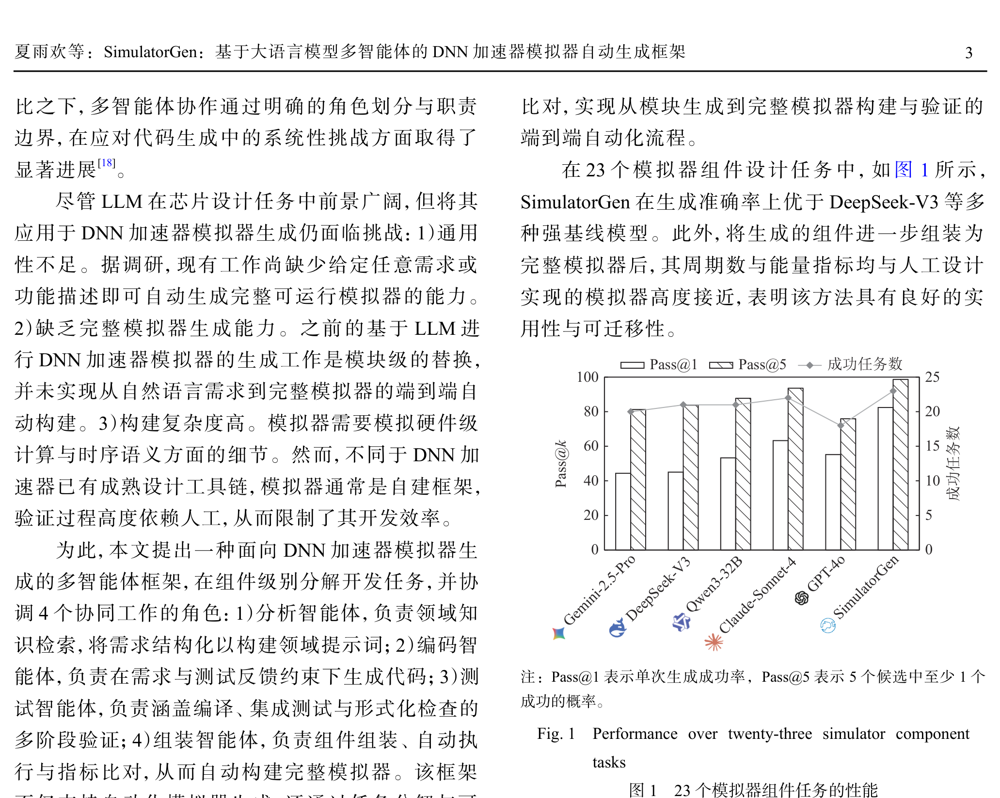
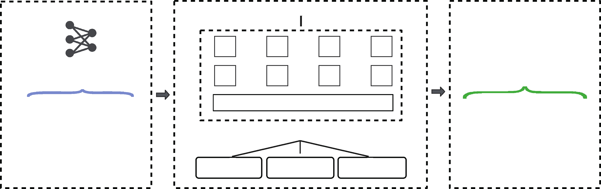
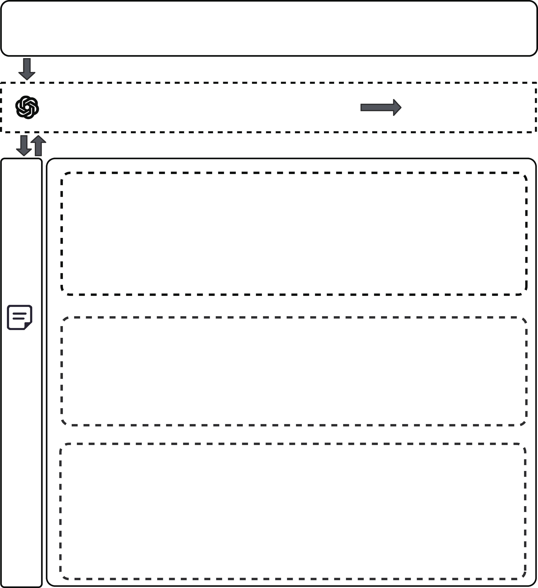
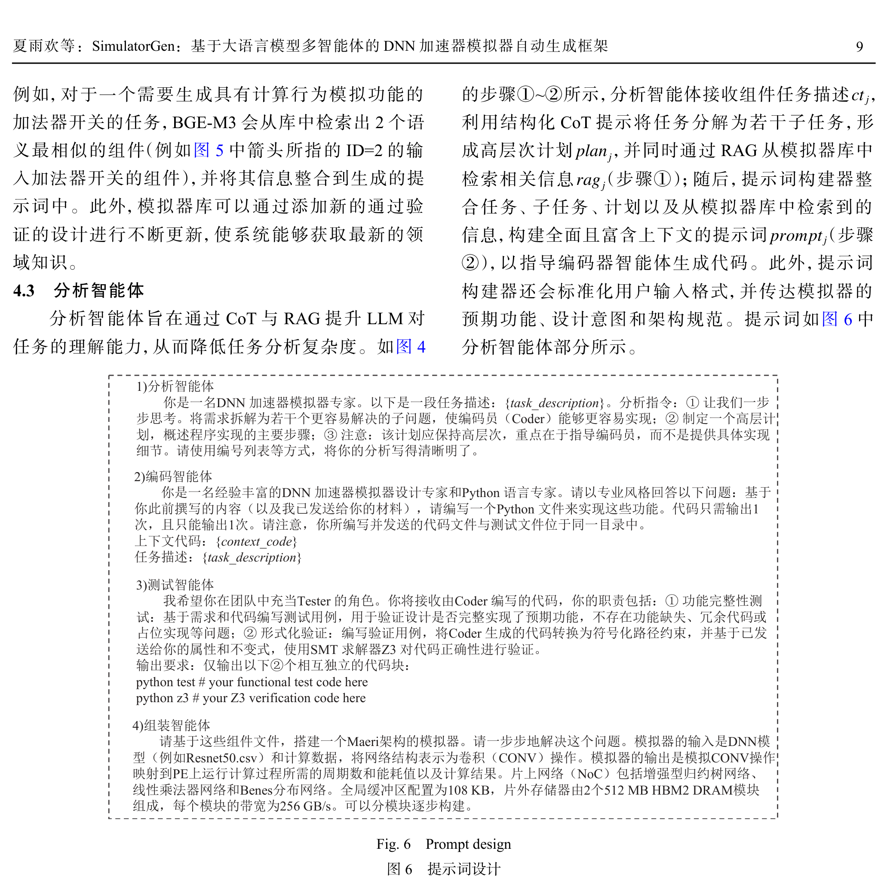

# SimulatorGen：基于大语言模型多智能体的 DNN 加速器模拟器自动生成框架

## SimulatorGen: An LLM-Based Multi-Agent Framework for Automatic Generation of DNN Accelerator Simulators

---

**Metadata:**

| Field | Value |
|-------|-------|
| Chinese Title | SimulatorGen：基于大语言模型多智能体的 DNN 加速器模拟器自动生成框架 |
| English Title | SimulatorGen: An LLM-Based Multi-Agent Framework for Automatic Generation of DNN Accelerator Simulators |
| Authors (Chinese) | 夏雨欢 李暾 周贤发 赵文博 张瑞瑜 郭阳 |
| Authors (English) | Xia Yuhuan, Li Tun, Zhou Xianfa, Zhao Wenbo, Zhang Ruiyu, and Guo Yang |
| Affiliation | 国防科技大学计算机学院 (College of Computer, National University of Defense Technology), Changsha 410073 |
| Journal | 计算机研究与发展 (Journal of Computer Research and Development) |
| Volume/Issue | 63(6): 1-17, 2026 |
| DOI | 10.7544/issn1000-1239.202660116 |
| CSTR | 32373.14.issn1000-1239.202660116 |
| Corresponding Author | 李暾 (tunli@nudt.edu.cn) |
| Funding | 国家自然科学基金项目 (92473115) / National Natural Science Foundation of China (92473115) |
| Received | 2026-03-12 |
| Revised | 2026-05-06 |
| CLC Number | TP391; TP303 |

---

## 目录索引 (Page/Section Index)

| Section | Title | Page |
|---------|-------|------|
| — | Abstract (English) | p.1 |
| — | 摘要 (Chinese Abstract) | p.2 |
| — | Introduction (引言) | p.1–3 |
| 1 | 相关工作 (Related Work) | p.3–4 |
| 1.1 | LLM 代码生成 (LLM Code Generation) | p.3–4 |
| 1.2 | 多智能体系统 (Multi-Agent Systems) | p.4 |
| 1.3 | 模拟器生成 (Simulator Generation) | p.4 |
| 2 | 方法概述 (Method Overview) | p.4–5 |
| 3 | 模拟器架构抽象和模块组件划分 | p.5–7 |
| 3.1 | 模拟器架构抽象 (Simulator Architecture Abstraction) | p.5–6 |
| 3.2 | 模拟器模块与组件划分 (Module and Component Division) | p.6–7 |
| 4 | 多智能体框架 (Multi-Agent Framework) | p.7–10 |
| 4.1 | 框架概述 (Framework Overview) | p.7–8 |
| 4.2 | 模拟器库 (Simulator Library) | p.8–9 |
| 4.3 | 分析智能体 (Analyst Agent) | p.9 |
| 4.4 | 编码智能体 (Coder Agent) | p.9 |
| 4.5 | 测试智能体 (Tester Agent) | p.9–10 |
| 4.6 | 组装智能体 (Assembly Agent) | p.10 |
| 5 | 实验 (Experiments) | p.10–11 |
| 5.1 | 实验设计 (Experimental Design) | p.10–11 |
| 5.2 | 评估指标 (Evaluation Metrics) | p.11 |
| 5.3 | 基线 LLMs (Baseline LLMs) | p.11 |
| 5.4 | 基准任务 (Benchmark Tasks) | p.11 |
| 5.5 | 实现细节 (Implementation Details) | p.11 |
| 6 | 评估结果 (Evaluation Results) | p.11–14 |
| 6.1 | RQ1: 准确性与通用性 (RQ1: Accuracy and Generality) | p.11–12 |
| 6.2 | RQ2: 消融实验 (RQ2: Ablation Study) | p.12–13 |
| 6.3 | RQ3: 性能对比 (RQ3: Performance Comparison) | p.13–14 |
| 6.4 | RQ4: 端到端能力 (RQ4: End-to-End Capability) | p.14–15 |

---

## Abstract

**Source:** p.1 S001

**原文 (Original Chinese):** [Abstract is in English only — see below.]

**English:** With the rapid development of deep neural network (DNN) accelerators, building simulators for new architectures is costly and time-consuming. Although advances in large language models (LLMs) have opened possibilities for automated simulator generation, existing approaches suffer from limited generality, inability to construct complete systems, and high construction complexity. To address these challenges, we propose SimulatorGen, a multi-agent framework that generates DNN accelerator simulator code from natural language descriptions. First, we abstract the architecture of DNN accelerator simulators and extract twenty-three component specifications. Based on this abstraction, four collaborative agents are introduced to accomplish generation: the analyst agent retrieves domain knowledge from the simulator library via retrieval-augmented generation (RAG) and constructs structured prompts by leveraging chain-of-thought (CoT) reasoning; the coder agent generates or refines code using prompts and test feedback; the tester agent performs syntax checking, functional testing, and formal verification using the Z3 solver based on properties extracted from specifications; and the assembly agent conducts component integration, automated execution, and metric comparison to enable end-to-end construction. We evaluate SimulatorGen on twenty-three generation tasks covering diverse DNN accelerator modules and architectures. Experimental results show that SimulatorGen built on GPT-4o outperforms LLM baselines, including Claude-Sonnet-4, achieving a Pass@1 score of 82.39%. Furthermore, using the successfully generated components, we construct runnable simulators for tensor processing unit (TPU) and MAERI architectures. Compared with STONNE, the simulators built by SimulatorGen achieve relative errors ranging from 1.31% to 7.34% in energy, latency, and energy-delay product (EDP) across multiple DNN models, while maintaining functional consistency verified through testing and execution, demonstrating faithful modeling of accelerator behavior. In contrast to the single-agent SimulatorCoder, which only supports module replacement, SimulatorGen enables end-to-end generation of complete simulators, further validating the effectiveness of the proposed approach.

**Source:** p.1 S002

**原文 (Original Chinese):** [Keywords are in English only — see below.]

**English:** **Key words** — DNN accelerator simulator; large language model; multi-agent; code generation; retrieval-augmented generation (RAG)

---

## 摘要 (Chinese Abstract)

**Source:** p.2 S003

**原文 (Original Chinese):** 随着深度神经网络（DNN）加速器的快速发展，为新架构构建模拟器的成本高、周期长。尽管大语言模型（LLM）的进展为模拟器生成带来了新的可能性，但现有方法仍存在通用性不足、难以生成完整系统以及构建复杂度高等问题。为此，提出 SimulatorGen，一种多智能体框架，其基于自然语言描述生成 DNN 加速器模拟器代码。首先，对通用 DNN 加速器模拟器架构进行抽象并提取 23 条组件规范；在此基础上，引入 4 类协同智能体完成生成过程：分析智能体通过检索增强生成（RAG）从模拟器库中检索领域知识，并结合思维链（CoT）构建结构化提示词；编码智能体根据提示词生成代码，或基于测试反馈修复错误代码；测试智能体基于从规范中提取的属性，执行语法检查、功能测试以及使用 Z3 求解器的形式化验证；组装智能体负责组件组装、自动执行与指标比对，实现完整模拟器的自动构建。在覆盖多样化 DNN 加速器模块与架构的 23 个生成任务上对 SimulatorGen 进行评估，实验结果表明，基于 GPT-4o 构建的 SimulatorGen 的表现优于包括 Claude-Sonnet-4 在内的 LLM 基线，Pass@1 达到 82.39%。在成功设计的组件基础上，进一步使用 SimulatorGen 构建了可运行的张量处理单元（TPU）和 MAERI 架构的模拟器。与 STONNE 相比，SimulatorGen 构建的模拟器在多个 DNN 模型上的能量、时延和能量时延乘积（EDP）指标相对误差范围为 1.31%~7.34%，且功能行为通过测试与执行验证保持一致，表明其具备准确建模加速器行为的能力。同时，相比于仅支持模块替换的单智能体 SimulatorCoder，SimulatorGen 具备端到端生成完整模拟器的能力，进一步验证了所提方法的有效性。

**English:** With the rapid development of deep neural network (DNN) accelerators, building simulators for new architectures is costly and time-consuming. Although advances in large language models (LLMs) have opened possibilities for automated simulator generation, existing approaches suffer from limited generality, inability to construct complete systems, and high construction complexity. To address these challenges, we propose SimulatorGen, a multi-agent framework that generates DNN accelerator simulator code from natural language descriptions. First, we abstract the architecture of DNN accelerator simulators and extract twenty-three component specifications. Based on this abstraction, four collaborative agents are introduced to accomplish generation: the analyst agent retrieves domain knowledge from the simulator library via retrieval-augmented generation (RAG) and constructs structured prompts by leveraging chain-of-thought (CoT) reasoning; the coder agent generates or refines code using prompts and test feedback; the tester agent performs syntax checking, functional testing, and formal verification using the Z3 solver based on properties extracted from specifications; and the assembly agent conducts component integration, automated execution, and metric comparison to enable end-to-end construction. We evaluate SimulatorGen on twenty-three generation tasks covering diverse DNN accelerator modules and architectures. Experimental results show that SimulatorGen built on GPT-4o outperforms LLM baselines, including Claude-Sonnet-4, achieving a Pass@1 score of 82.39%. Furthermore, using the successfully generated components, we construct runnable simulators for tensor processing unit (TPU) and MAERI architectures. Compared with STONNE, the simulators built by SimulatorGen achieve relative errors ranging from 1.31% to 7.34% in energy, latency, and energy-delay product (EDP) across multiple DNN models, while maintaining functional consistency verified through testing and execution, demonstrating faithful modeling of accelerator behavior. In contrast to the single-agent SimulatorCoder, which only supports module replacement, SimulatorGen enables end-to-end generation of complete simulators, further validating the effectiveness of the proposed approach.

**Source:** p.2 S004

**原文 (Original Chinese):** 关键词 DNN 加速器模拟器；大语言模型；多智能体；代码生成；检索增强生成

**English:** **Key words** — DNN accelerator simulator; large language model; multi-agent; code generation; retrieval-augmented generation (RAG)

---

## Introduction (引言)

**Source:** p.2 S005

**原文 (Original Chinese):** 随着人工智能的快速发展，深度神经网络（deep neural network, DNN）加速器已广泛应用于云计算和边缘推理等重要而复杂的场景中[1]。为满足高吞吐、低功耗和高容错的需求，出现了各种面向 DNN 的加速器，如脉动阵列和空间加速器结构[2]。然而，这些加速器的设计空间迅速扩展，涉及计算、存储、调度和互连等多方面因素。设计过程日益复杂，单纯依赖人工评估已难以支持快速迭代。

**English:** With the rapid development of artificial intelligence, deep neural network (DNN) accelerators have been widely applied in important and complex scenarios such as cloud computing and edge inference [1]. To meet the demands of high throughput, low power consumption, and high fault tolerance, various DNN-oriented accelerators have emerged, such as systolic arrays and spatial accelerator architectures [2]. However, the design space of these accelerators has rapidly expanded, involving multiple aspects including computation, storage, scheduling, and interconnection. The design process has become increasingly complex, making it difficult to support rapid iteration relying solely on manual evaluation.

**Source:** p.2 S006

**原文 (Original Chinese):** 随着 DNN 加速器设计复杂度的提升，研究人员需要在开发早期能够快速而准确地探索设计空间和评估架构改进效果的工具[3]。当前的加速器评估方法主要基于分析模型[4-5]或模拟器[6-8]。分析模型通过数学公式与简化来快速估计不同配置下的性能，但往往无法捕捉细微的执行行为，导致在许多场景中结果不够准确。随着架构变得更加复杂和灵活，分析模型的准确性与可靠性显著下降。为了提供更准确的评估，周期级模拟器（例如 STONNE[6]）被视为不可或缺的工具。但是为每一种新的 DNN 加速器构建专用的模拟器既耗时又资源密集，如表 1 所示，广泛使用的开源模拟器往往包含数万行代码，这在一定程度上限制了设计空间的高效探索。

**English:** As the design complexity of DNN accelerators increases, researchers need tools that can quickly and accurately explore the design space and evaluate the effects of architectural improvements in the early stages of development [3]. Current accelerator evaluation methods are primarily based on analytical models [4-5] or simulators [6-8]. Analytical models rapidly estimate performance under different configurations through mathematical formulas and simplifications, but often fail to capture subtle execution behaviors, leading to inaccurate results in many scenarios. As architectures become more complex and flexible, the accuracy and reliability of analytical models decline significantly. To provide more accurate evaluation, cycle-level simulators (e.g., STONNE [6]) are regarded as indispensable tools. However, building dedicated simulators for each new DNN accelerator is both time-consuming and resource-intensive. As shown in Table 1, widely-used open-source simulators often contain tens of thousands of lines of code, which to some extent limits efficient design space exploration.

### Table 1. DNN Accelerator Simulators Proposed in Our Work / 本文提出的 DNN 加速器模拟器

**Placed near:** p.2 S006
**Source:** p.2 C001

**原文图注 (Original caption):** 表 1 本文提出的 DNN 加速器模拟器

**English caption:** Table 1 DNN Accelerator Simulators Proposed in Our Work

| Simulator | Computation Type | Lines of Code |
|-----------|-----------------|---------------|
| STONNE [6] | Multiply-accumulate | 19,383 |
| SIAM [7] | In-memory computing | 26,797 |
| SMAUG [9] | Systolic array | 22,851 |
| NoCDAS [10] | Network-on-chip | 29,747 |

**Source:** p.2–3 S007

**原文 (Original Chinese):** 大语言模型（large language model, LLM）的出现为自动化芯片设计带来了新的机遇。已有研究开始探索利用自然语言驱动 AI 芯片设计，并取得了初步成果[11-12]。在诸多开发活动中，代码生成因其降低开发成本、缩短迭代周期的潜力而备受关注[13]。诸如思维链（chain-of-thought, CoT）[14]与检索增强生成（retrieval-augmented generation, RAG）[15]等 LLM 技术已被证明可以提升生成质量与鲁棒性。随着工具链和实践的快速演进，LLM 正逐渐成为芯片设计开发流程中的关键组成部分[16]。基于 LLM 的智能体逐渐在众多 LLM 技术中脱颖而出。智能体是一个具备环境感知、决策制定及动作执行能力的自主算法系统，是可定制的 LLM 实例，能够在工程工作流中复现并执行面向特定目标的离散任务[16]。有研究[17]探索了利用 LLM 自动生成与优化 DNN 加速器模拟器的方法，开发了单智能体 SimulatorCoder，通过引入结合思维链推理和多轮反馈机制以提升代码生成的正确性。相关工作主要面向二维脉动阵列结构开展验证，且仅进行模块替换。然而，使用单个 LLM 或单智能体的研究存在显著局限性，往往难以胜任复杂任务[18]。

**English:** The emergence of large language models (LLMs) has brought new opportunities for automated chip design. Researchers have begun exploring the use of natural language to drive AI chip design and have achieved initial results [11-12]. Among various development activities, code generation has attracted considerable attention due to its potential to reduce development costs and shorten iteration cycles [13]. LLM techniques such as chain-of-thought (CoT) [14] and retrieval-augmented generation (RAG) [15] have been proven to improve generation quality and robustness. With the rapid evolution of toolchains and practices, LLMs are gradually becoming a key component in chip design and development workflows [16]. LLM-based agents have gradually distinguished themselves among numerous LLM technologies. An agent is an autonomous algorithmic system with capabilities of environmental perception, decision-making, and action execution; it is a customizable LLM instance capable of reproducing and executing discrete tasks oriented toward specific goals within engineering workflows [16]. Some research [17] has explored methods for automatically generating and optimizing DNN accelerator simulators using LLMs, developing the single-agent SimulatorCoder, which introduces chain-of-thought reasoning combined with multi-round feedback mechanisms to improve code generation correctness. Related work primarily validates against two-dimensional systolic array architectures and only performs module replacement. However, research using a single LLM or single agent has significant limitations and often struggles with complex tasks [18].

**Source:** p.2–3 S008

**原文 (Original Chinese):** 相比之下，多智能体协作通过明确的角色划分与职责边界，在应对代码生成中的系统性挑战方面取得了显著进展[18]。

**English:** In contrast, multi-agent collaboration has achieved significant progress in addressing systemic challenges in code generation through clear role division and responsibility boundaries [18].

**Source:** p.3 S009

**原文 (Original Chinese):** 尽管 LLM 在芯片设计任务中前景广阔，但将其应用于 DNN 加速器模拟器生成仍面临挑战：1）通用性不足。据调研，现有工作尚缺少给定任意需求或功能描述即可自动生成完整可运行模拟器的能力。2）缺乏完整模拟器生成能力。之前的基于 LLM 进行 DNN 加速器模拟器的生成工作是模块级的替换，并未实现从自然语言需求到完整模拟器的端到端自动构建。3）构建复杂度高。模拟器需要模拟硬件级计算与时序语义方面的细节。然而，不同于 DNN 加速器已有成熟设计工具链，模拟器通常是自建框架，验证过程高度依赖人工，从而限制了其开发效率。

**English:** Although LLMs hold great promise for chip design tasks, applying them to DNN accelerator simulator generation still faces challenges: 1) Insufficient generality. According to our investigation, existing work still lacks the capability to automatically generate a complete, runnable simulator given arbitrary requirements or functional descriptions. 2) Lack of complete simulator generation capability. Previous LLM-based DNN accelerator simulator generation work involves module-level replacement and has not achieved end-to-end automatic construction from natural language requirements to complete simulators. 3) High construction complexity. Simulators need to simulate details of hardware-level computation and timing semantics. However, unlike DNN accelerators which have mature design toolchains, simulators are typically self-built frameworks, and the verification process is highly dependent on manual effort, thereby limiting development efficiency.

**Source:** p.3 S010

**原文 (Original Chinese):** 为此，本文提出一种面向 DNN 加速器模拟器生成的多智能体框架，在组件级别分解开发任务，并协调 4 个协同工作的角色：1）分析智能体，负责领域知识检索，将需求结构化以构建领域提示词；2）编码智能体，负责在需求与测试反馈约束下生成代码；3）测试智能体，负责涵盖编译、集成测试与形式化检查的多阶段验证；4）组装智能体，负责组件组装、自动执行与指标比对，从而自动构建完整模拟器。该框架不仅支持自动化模拟器生成，还通过任务分解与可追踪的验证反馈机制促进对生成系统的程序理解。

**English:** To this end, this paper proposes a multi-agent framework for DNN accelerator simulator generation, which decomposes development tasks at the component level and coordinates four collaborating roles: 1) Analyst Agent, responsible for domain knowledge retrieval and structuring requirements to construct domain prompts; 2) Coder Agent, responsible for generating code under the constraints of requirements and test feedback; 3) Tester Agent, responsible for multi-stage verification covering compilation, integration testing, and formal checking; 4) Assembly Agent, responsible for component assembly, automated execution, and metric comparison, thereby automatically constructing a complete simulator. The framework not only supports automated simulator generation but also promotes program understanding of the generated system through task decomposition and traceable verification feedback mechanisms.

**Source:** p.3 S011

**原文 (Original Chinese):** 本文的主要贡献包括 3 个方面：
1）架构抽象和规范提取。对 DNN 加速器模拟器的通用体系结构进行系统性抽象，总结并提取了模拟器的自然语言功能规范，为后续基于自然语言驱动的自动生成奠定了统一描述基础。
2）整体模拟器生成。本文基于 LLM 提出了一种面向整体 DNN 加速器模拟器系统的自动生成方法，实现了从高层自然语言描述到完整可运行模拟器的端到端构建。
3）多智能体生成框架。提出一种无需微调、基于自然语言功能规范的多智能体 LLM 框架，用于 DNN 加速器模拟器生成。该框架通过定义智能体角色并进行组件级任务分解，构建模拟器组件库与任务基准；结合 CoT 与 RAG 设计上下文提示模板，引导 LLM 生成语义正确、结构完整的模块；进行迭代反馈验证，建立了一种基于反馈的测试机制，将语法与编译检查、功能测试以及基于 Z3 的形式化验证相结合，通过在测试反馈的驱动下对代码进行迭代式修正，从而显著提升了生成代码的正确性与可靠性；同时进行组件代码的系统化组装、自动执行与指标比对，实现从模块生成到完整模拟器构建与验证的端到端自动化流程。

**English:** The main contributions of this paper include three aspects:
1) Architecture abstraction and specification extraction. We systematically abstract the general architecture of DNN accelerator simulators, summarize and extract natural language functional specifications of simulators, laying a unified descriptive foundation for subsequent natural-language-driven automatic generation.
2) Complete simulator generation. Based on LLMs, this paper proposes an automatic generation method for complete DNN accelerator simulator systems, achieving end-to-end construction from high-level natural language descriptions to fully runnable simulators.
3) Multi-agent generation framework. We propose a multi-agent LLM framework that requires no fine-tuning and is based on natural language functional specifications, for DNN accelerator simulator generation. The framework defines agent roles and performs component-level task decomposition, constructs a simulator component library and task benchmarks; designs contextual prompt templates combining CoT and RAG to guide LLMs in generating semantically correct and structurally complete modules; performs iterative feedback verification, establishing a feedback-based testing mechanism that combines syntax and compilation checking, functional testing, and Z3-based formal verification, iteratively correcting code driven by test feedback, thereby significantly improving the correctness and reliability of generated code; simultaneously conducts systematic assembly of component code, automated execution, and metric comparison, achieving end-to-end automation from module generation to complete simulator construction and verification.

**Source:** p.3 S012

**原文 (Original Chinese):** 在 23 个模拟器组件设计任务中，如图 1 所示，SimulatorGen 在生成准确率上优于 DeepSeek-V3 等多种强基线模型。此外，将生成的组件进一步组装为完整模拟器后，其周期数与能量指标均与人工设计实现的模拟器高度接近，表明该方法具有良好的实用性与可迁移性。

**English:** In 23 simulator component design tasks, as shown in Fig. 1, SimulatorGen outperforms multiple strong baseline models such as DeepSeek-V3 in generation accuracy. Furthermore, after assembling the generated components into complete simulators, their cycle counts and energy metrics are highly close to those of manually designed and implemented simulators, indicating that the method has good practicality and transferability.

### Fig. 1. Performance over twenty-three simulator component tasks / 23 个模拟器组件任务的性能

**Placed near:** p.3 S012
**Source:** p.3 C002

**原文图注 (Original caption):** 图 1 23 个模拟器组件任务的性能（注：Pass@1 表示单次生成成功率，Pass@5 表示 5 个候选中至少 1 个成功的概率。）

**English caption:** Fig. 1 Performance over twenty-three simulator component tasks (Note: Pass@1 indicates the success rate of a single generation, Pass@5 indicates the probability of at least 1 success among 5 candidates.)

---

## 1 相关工作 (Related Work)

### 1.1 LLM 代码生成 (LLM Code Generation)

**Source:** p.3 S013

**原文 (Original Chinese):** 代码生成（或程序合成）是指通过自动化技术自主构建软件或编写代码的过程[13]。LLM 可以根据自然语言描述生成源代码，这一过程通常被称为"自然语言到代码"任务。

**English:** Code generation (or program synthesis) refers to the process of autonomously constructing software or writing code through automated techniques [13]. LLMs can generate source code based on natural language descriptions, a process commonly referred to as the "natural language to code" task.

**Source:** p.3–4 S014

**原文 (Original Chinese):** 为提升基于 LLM 的代码生成准确性，已有大量方法被提出，包括提示工程[15]、RAG[15]、微调（fine-tuning）[19]、程序验证与自我修复[20]，以及基于人类反馈的强化学习（reinforcement learning from human feedback, RLHF）[21]。提示词工程技术包括上下文学习（in-context learning, ICL）[22]、CoT[14]等。RAG 是指一种在响应查询时，首先从文档库中检索相关信息，然后将检索结果与原始查询相结合以提升响应质量和准确性的方法，其通过引入外部知识库扩展了传统 LLM 的能力，有助于缓解模型生成内容中的幻觉问题。同时，微调和 RLHF 等方法通常需要准备专门的数据集用于训练模型，消耗更多计算资源，且在实践中往往不如性能强大的开源模型有效[23]。

**English:** To improve the accuracy of LLM-based code generation, numerous methods have been proposed, including prompt engineering [15], RAG [15], fine-tuning [19], program verification and self-repair [20], and reinforcement learning from human feedback (RLHF) [21]. Prompt engineering techniques include in-context learning (ICL) [22], CoT [14], etc. RAG refers to a method that, when responding to a query, first retrieves relevant information from a document repository and then combines the retrieval results with the original query to improve response quality and accuracy. It extends the capabilities of traditional LLMs through the introduction of external knowledge bases, helping to mitigate hallucination problems in model-generated content. Meanwhile, methods such as fine-tuning and RLHF typically require the preparation of specialized datasets for model training, consume more computational resources, and in practice are often less effective than powerful open-source models [23].

**Source:** p.3–4 S015

**原文 (Original Chinese):** 在本工作中，则利用未经训练的 LLM 自动生成模拟器代码。

**English:** In this work, we utilize untrained LLMs to automatically generate simulator code.

### 1.2 多智能体系统 (Multi-Agent Systems)

**Source:** p.4 S016

**原文 (Original Chinese):** 多智能体协作是指在多智能体系统框架下，多个可交互的智能体围绕共同目标进行协调与分工。通过信息交换与联合决策，它们能够完成单个智能体难以甚至无法完成的复杂任务[24]。

**English:** Multi-agent collaboration refers to the coordination and division of labor among multiple interactive agents around common goals within a multi-agent system framework. Through information exchange and joint decision-making, they can accomplish complex tasks that are difficult or even impossible for a single agent to complete [24].

**Source:** p.4 S017

**原文 (Original Chinese):** 单智能体在多次迭代中需要在不同子任务之间切换上下文，在硬件设计过程中采用单个智能体处理所有这些任务会导致次优结果，因为它们必须在每次交互中处理如此复杂的上下文，并通过冗长的对话历史保持一致性。相比之下，多智能体系统将任务分配给具有独立对话历史的智能体，支持专门的任务处理和更高的模块化程度。

**English:** A single agent needs to switch context between different subtasks across multiple iterations. Employing a single agent to handle all these tasks in the hardware design process leads to suboptimal results, because they must process such complex context in each interaction and maintain consistency through lengthy conversation histories. In contrast, multi-agent systems distribute tasks to agents with independent conversation histories, supporting specialized task processing and higher degrees of modularity.

**Source:** p.4 S018

**原文 (Original Chinese):** Lin 等人[25]提出了一种利用多个 LLM 智能体来模拟软件过程模型的代码生成框架，为 LLM 智能体分配对应日常开发活动的角色，包括需求工程师、架构师、开发人员等，同时利用 CoT、提示组合和持续自我优化的方式协同工作，以提高代码质量。但该方法仅应用于公开基准（如 HumanEval）测试，尚未涉及完整软件系统的生成。Dong 等人[26]提出了一种基于 LLM 的协作式代码生成框架，通过角色分配与团队协作显著提升了代码生成的准确性，并为 LLM 在复杂任务中的应用提供了新的视角。然而，该框架在测试阶段是通过大模型直接评估生成报告，而非执行真实代码，尽管能够识别大多数逻辑错误，但无法在真实执行过程中对正确性进行充分验证。该框架将自我协作代码生成应用于复杂的游戏开发需求，并开发了天气预报网站。相比之下，本文的方法采用了更为严格、以实际执行为驱动的反馈测试机制，从而更有效地保证了代码的正确性，同时，研究对时序和功能等模拟正确性要求更高的模拟器代码生成。

**English:** Lin et al. [25] proposed a code generation framework that uses multiple LLM agents to simulate software process models, assigning LLM agents roles corresponding to daily development activities, including requirements engineers, architects, developers, etc., while leveraging CoT, prompt composition, and continuous self-optimization to work collaboratively to improve code quality. However, this method was only applied to public benchmarks (such as HumanEval) and has not yet addressed the generation of complete software systems. Dong et al. [26] proposed an LLM-based collaborative code generation framework, which significantly improved the accuracy of code generation through role assignment and team collaboration, and provided new perspectives for the application of LLMs in complex tasks. However, this framework evaluates generated reports directly through large models in the testing phase rather than executing real code; although it can identify most logical errors, it cannot fully verify correctness during real execution. The framework applied self-collaborative code generation to complex game development requirements and developed a weather forecast website. In contrast, the method in this paper employs a more rigorous, actual-execution-driven feedback testing mechanism, thereby more effectively ensuring code correctness, while also studying simulator code generation with higher requirements for simulation correctness in terms of timing and functionality.

### 1.3 模拟器生成 (Simulator Generation)

**Source:** p.4 S019

**原文 (Original Chinese):** 机器学习、大模型等人工智能技术为赋能芯片设计带来了新的机遇[27]。目前多数工作集中于手动生成模拟器或者构建模拟架构。Muñoz-Martínez 等人[6]提出 STONNE，一个具有可重构数据流模式的 DNN 加速器周期精确模拟器，支持 TPU 等架构。Ritik 等人[8]提出 SCALE-Sim，一个周期精确的模拟器框架，提供可配置的脉动阵列设计，凭借它用户可以定义一个配置文件来描述选择的架构。林涵越等人[28]提出一种通用网络处理器的结构模拟和性能仿真框架 Neptune，采用同步图模拟和混合事件与时间驱动的方法以保障模拟器准确性和高效性。

**English:** Artificial intelligence technologies such as machine learning and large models have brought new opportunities for empowering chip design [27]. Currently, most work focuses on manually generating simulators or constructing simulation architectures. Munoz-Martinez et al. [6] proposed STONNE, a cycle-accurate DNN accelerator simulator with reconfigurable dataflow modes, supporting architectures such as TPU. Ritik et al. [8] proposed SCALE-Sim, a cycle-accurate simulator framework that provides configurable systolic array design, allowing users to define a configuration file to describe the selected architecture. Lin Hanyue et al. [28] proposed Neptune, a structural simulation and performance emulation framework for general network processors, employing synchronous graph simulation and a hybrid event- and time-driven approach to ensure simulator accuracy and efficiency.

**Source:** p.4 S020

**原文 (Original Chinese):** 在 DNN 加速器及其模拟器生成方面，已有一些相关研究工作。例如，Fu 等人[11]提出了一种对 LLM 友好的硬件模板以及一种结合示例增强的提示词生成方法，用于自动化 AI 加速器设计。Vungarala 等人[12]提出了 TPU-Gen，旨在实现基于 LLM 的 TPU 精确与近似生成流程自动化，重点关注脉动阵列的微体系结构设计。文献 [29] 提出了体系结构描述方法，以支持基于分析模型的 DNN 加速器性能建模。Nayak 等人[30]提出了 TeAAL，一种用于简洁、精确地规范和评估稀疏张量代数加速器的语言和模拟器生成器。但其仅支持对稀疏张量代数加速器进行建模和评估，且使用分析建模。文献 [17] 提出了 SimulatorCoder，说明 LLM 具备生成 DNN 加速器模拟器函数级代码的能力。相比之下，本文进一步关注更复杂的架构场景，采用基于 LLM 的多智能体协同框架，所研究的目标架构涵盖典型的二维脉动阵列加速器以及可重构数据流加速器等体系结构，且进行整体模拟器生成。

**English:** In the area of DNN accelerator and simulator generation, there have been some related research efforts. For example, Fu et al. [11] proposed an LLM-friendly hardware template and a prompt generation method combined with example augmentation for automated AI accelerator design. Vungarala et al. [12] proposed TPU-Gen, aiming to automate LLM-based TPU exact and approximate generation flows, focusing on the microarchitecture design of systolic arrays. Reference [29] proposed an architecture description method to support DNN accelerator performance modeling based on analytical models. Nayak et al. [30] proposed TeAAL, a language and simulator generator for concise and precise specification and evaluation of sparse tensor algebra accelerators. However, it only supports modeling and evaluation of sparse tensor algebra accelerators and uses analytical modeling. Reference [17] proposed SimulatorCoder, demonstrating that LLMs possess the capability to generate function-level code for DNN accelerator simulators. In contrast, this paper further focuses on more complex architectural scenarios, employing an LLM-based multi-agent collaborative framework, with the target architectures studied covering typical two-dimensional systolic array accelerators as well as reconfigurable dataflow accelerators, and conducting complete simulator generation.

**Source:** p.4 S021

**原文 (Original Chinese):** 在微处理器领域，模拟器生成同样受到关注，通过硬件描述语言或者体系结构描述语言定义语法描述硬件架构，然后由编译器解析描述生成中间表示，再编译为可执行文件运行。文献 [31] 使用模拟器生成器，以编写的处理器规格自动生成微处理器模拟器。与上述工作相比，本工作将基于 LLM 的多智能体框架应用于 DNN 加速器模拟器的生成。

**English:** In the microprocessor domain, simulator generation has also received attention, where hardware description languages or architecture description languages define grammatical descriptions of hardware architectures, which are then parsed by compilers to generate intermediate representations, and further compiled into executable files for execution. Reference [31] uses a simulator generator to automatically generate microprocessor simulators from written processor specifications. Compared with the above work, this work applies an LLM-based multi-agent framework to the generation of DNN accelerator simulators.

---

## 2 方法概述 (Method Overview)

**Source:** p.4–5 S022

**原文 (Original Chinese):** 本文提出一种面向 DNN 加速器模拟器自动生成的多智能体框架 SimulatorGen。通过对模拟器架构进行抽象与规范提取，将整体模拟器进行模块分解，将模拟器生成问题转化为一组可验证、可组合的模块和组件级生成问题。同时，引入多智能体协作机制，在统一的抽象模型与规范约束下协同完成生成过程，从而提升生成结果的正确性与可靠性。

**English:** This paper proposes SimulatorGen, a multi-agent framework for automatic generation of DNN accelerator simulators. By abstracting the simulator architecture and extracting specifications, the overall simulator is decomposed into modules, transforming the simulator generation problem into a set of verifiable, composable module- and component-level generation problems. Simultaneously, a multi-agent collaboration mechanism is introduced to collaboratively complete the generation process under a unified abstract model and specification constraints, thereby improving the correctness and reliability of the generated results.

**Source:** p.4–5 S023

**原文 (Original Chinese):** 具体而言，本文的方法主要包括 4 个步骤。
1）对 DNN 加速器模拟器的通用架构进行系统性抽象，将模拟器划分为输入、计算、存储、互连和输出模块，在此基础上，对各模块组件的功能、输入输出接口和关键行为特征进行总结，进一步提取自然语言功能规范，为后续自动生成提供统一描述基础。
2）基于上述抽象架构，将生成具体和整体模拟器的问题转化为在抽象模型上生成对应模块和组件并组装的问题。给定模拟需求，如目标加速器架构、数据流方式等，将需求映射到抽象模拟器架构中的模块上，从而明确需要生成的模块和组件集合及其功能要求。复杂的端到端模拟器生成过程被分解为模块级和组件级生成任务，最终通过组装构建完整模拟器。
3）为判断生成组件的正确性，本文基于抽象模拟器架构及其功能规范，利用 LLM 提取组件应满足的关键属性与约束条件，并据此构建相应的检查规则以提高生成结果的可靠性。
4）在上述模拟器架构抽象和模块组件划分的基础上引入 LLM，并设计多智能体协作的生成框架。通过对任务分析、代码生成、测试反馈与系统组装等职责进行角色分工，使多个智能体在统一的抽象模型与规范约束下协同工作，从而实现复杂 DNN 加速器模拟器的自动化生成。

**English:** Specifically, the method in this paper mainly includes four steps.
1) Systematically abstract the general architecture of DNN accelerator simulators, dividing the simulator into input, computation, storage, interconnection, and output modules. On this basis, summarize the functions, input-output interfaces, and key behavioral characteristics of each module component, and further extract natural language functional specifications, providing a unified descriptive foundation for subsequent automatic generation.
2) Based on the above abstract architecture, transform the problem of generating concrete and complete simulators into the problem of generating corresponding modules and components on the abstract model and assembling them. Given simulation requirements, such as the target accelerator architecture and dataflow mode, map the requirements onto modules in the abstract simulator architecture, thereby clarifying the set of modules and components to be generated and their functional requirements. The complex end-to-end simulator generation process is decomposed into module-level and component-level generation tasks, and finally a complete simulator is constructed through assembly.
3) To judge the correctness of generated components, this paper uses LLMs to extract key properties and constraint conditions that components should satisfy based on the abstract simulator architecture and its functional specifications, and constructs corresponding checking rules accordingly to improve the reliability of generated results.
4) Introduce LLMs on the basis of the above simulator architecture abstraction and module-component division, and design a multi-agent collaborative generation framework. By role-dividing responsibilities such as task analysis, code generation, test feedback, and system assembly, multiple agents work collaboratively under a unified abstract model and specification constraints, thereby achieving automated generation of complex DNN accelerator simulators.

---

## 3 模拟器架构抽象和模块组件划分 (Simulator Architecture Abstraction and Module/Component Division)

### 3.1 模拟器架构抽象 (Simulator Architecture Abstraction)

**Source:** p.5 S024

**原文 (Original Chinese):** DNN 加速器模拟器在早期架构探索与设计优化中发挥关键作用，其通过准确模拟真实硬件的功能行为与性能特征来支持评估。与物理硬件实现不同，模拟器允许设计人员迭代和验证不同的架构配置，而无需承担实际制造的高昂成本。

**English:** DNN accelerator simulators play a key role in early architecture exploration and design optimization, supporting evaluation by accurately simulating the functional behavior and performance characteristics of real hardware. Unlike physical hardware implementation, simulators allow designers to iterate and validate different architectural configurations without bearing the high cost of actual manufacturing.

**Source:** p.5 S025

**原文 (Original Chinese):** 基于对现有模拟器[6-10]的系统调研与分析，如图 2 所示，本文对 DNN 加速器模拟器的通用架构进行了抽象。如图 2 左图所示，模拟器的输入包括 DNN 模型，例如 ResNet50[32] 和 VGG16[33]；加速器架构参数，用于实例化 DNN 模型中各算子的数值操作，以驱动加速器在功能与时序层面的硬件行为建模。如图 2 中间图所示，模拟器接收这些输入，将 DNN 模型映射到 PE 阵列上，并执行功能模拟、时序模拟以及功耗、性能与面积（power, performance, and area, PPA）估计。

**English:** Based on systematic investigation and analysis of existing simulators [6-10], as shown in Fig. 2, this paper abstracts the general architecture of DNN accelerator simulators. As shown in the left part of Fig. 2, the inputs to the simulator include DNN models, such as ResNet50 [32] and VGG16 [33]; and accelerator architecture parameters, used to instantiate the numerical operations of various operators in the DNN model to drive the hardware behavior modeling of the accelerator at the functional and timing levels. As shown in the middle part of Fig. 2, the simulator receives these inputs, maps the DNN model onto the PE array, and performs functional simulation, timing simulation, and power, performance, and area (PPA) estimation.

**Source:** p.5 S026

**原文 (Original Chinese):** 功能模拟刻画加速器在执行乘加计算（multiply-accumulate, MAC）、数据路由与存储访问等操作时的行为；时序模拟提供关键架构，设计选择如何影响吞吐与延迟的周期级视角；PPA 估计则对能耗、性能与面积等关键指标进行量化评估。准确的 PPA 建模需要将微架构参数与组件级能耗模型及缓冲区延迟等相结合，例如根据存储读写事件、计算周期与片上数据移动来估算能耗。最终，模拟器输出包括 PPA、总体吞吐量等性能指标以及计算结果（图 2 右图），其中计算结果用于对功能模拟阶段的执行正确性进行验证以及指标计算。

**English:** Functional simulation characterizes the accelerator's behavior when performing operations such as multiply-accumulate (MAC), data routing, and memory access; timing simulation provides a cycle-level perspective on how key architectural design choices affect throughput and latency; PPA estimation provides quantitative evaluation of key metrics such as energy consumption, performance, and area. Accurate PPA modeling requires combining microarchitecture parameters with component-level energy models and buffer latencies, for example estimating energy consumption based on memory read/write events, computation cycles, and on-chip data movement. Ultimately, the simulator output includes performance metrics such as PPA and overall throughput, as well as computation results (right part of Fig. 2), where the computation results are used to verify the execution correctness of the functional simulation stage and for metric calculation.

### Fig. 2. Overview of DNN accelerator simulator / DNN 加速器模拟器概览

**Placed near:** p.5 S025–S026
**Source:** p.5 C003

**原文图注 (Original caption):** 图 2 DNN 加速器模拟器概览

**English caption:** Fig. 2 Overview of DNN accelerator simulator

**Source:** p.5–6 S027

**原文 (Original Chinese):** 模拟器需要对 DNN 加速器架构进行建模。图 3 中总结了一种通用的模块化建模框架。这种模块化建模方法包括可配置的分发网络、乘法器网络与归约网络，以及其关联的存储与互连子系统。每个网络由多个交换机组成，这些交换机可以通过各种拓扑结构互连形成不同类型的网络。通过组合不同网络，模拟器可灵活建模多种 DNN 加速器架构。图 3（d）与 3（e）分别展示了代表性架构 MAERI[34] 与 TPU[35]。

**English:** The simulator needs to model DNN accelerator architectures. Fig. 3 summarizes a general modular modeling framework. This modular modeling approach includes configurable distribution networks, multiplier networks, and reduction networks, along with their associated storage and interconnection subsystems. Each network consists of multiple switches, which can be interconnected through various topologies to form different types of networks. By combining different networks, the simulator can flexibly model various DNN accelerator architectures. Fig. 3(d) and 3(e) respectively show the representative architectures MAERI [34] and TPU [35].

**Source:** p.5–6 S028

**原文 (Original Chinese):** 从 DNN 加速器架构与执行方式的角度出发，现有模拟器通常覆盖不同类型的计算组织方式，包括以乘加运算为核心的执行模型、基于脉动阵列的空间计算架构，以及面向稀疏计算优化的加速器设计。第 1 代 DNN 加速器通常针对单一主流工作负载进行高度定制，例如 TPU 采用脉动阵列微架构，并在设计阶段固化其数据流，以高效支持密集矩阵乘加运算。随着神经网络模型和工作负载特性的不断演进，下一代 DNN 加速器逐渐转向可重构架构，允许通过软件方式灵活调整数据流和计算映射策略，从而在执行周期数和能耗等方面获得更优的效率。MAERI 是一种由模块化、可配置构建块组成的 DNN 加速器架构。通过为乘法器和加法器配备小型开关，并通过新型可配置互连网络将它们连接起来，该互连网络支持任意尺寸的神经元，MAERI 能够轻松支持多种 DNN 分区和映射方式。

**English:** From the perspective of DNN accelerator architecture and execution methods, existing simulators typically cover different types of computation organization, including execution models centered on multiply-accumulate operations, spatial computing architectures based on systolic arrays, and accelerator designs optimized for sparse computation. First-generation DNN accelerators were typically highly customized for a single mainstream workload; for example, TPU employs a systolic array microarchitecture and hardwires its dataflow at design time to efficiently support dense matrix multiply-accumulate operations. With the continuous evolution of neural network models and workload characteristics, next-generation DNN accelerators have gradually shifted to reconfigurable architectures, allowing flexible adjustment of dataflow and computation mapping strategies through software, thereby achieving better efficiency in terms of execution cycles and energy consumption. MAERI is a DNN accelerator architecture composed of modular, configurable building blocks. By equipping multipliers and adders with small switches and connecting them through a novel configurable interconnection network that supports neurons of arbitrary sizes, MAERI can easily support various DNN partitioning and mapping methods.

### Fig. 3. Example for DNN accelerator simulation / DNN 加速器模拟实例

**Placed near:** p.6 S027–S028
**Source:** p.6 C004

**原文图注 (Original caption):** 图 3 DNN 加速器模拟实例

**English caption:** Fig. 3 Example for DNN accelerator simulation

### 3.2 模拟器模块与组件划分 (Module and Component Division)

**Source:** p.6 S029

**原文 (Original Chinese):** 基于抽象的 DNN 加速器模拟器架构，本文对核心模块进行自顶向下的模块化分解，并为各类模块构建统一模板的自然语言功能规范。

**English:** Based on the abstract DNN accelerator simulator architecture, this paper performs a top-down modular decomposition of the core modules and constructs natural language functional specifications with unified templates for each type of module.

**Source:** p.6 S030

**原文 (Original Chinese):** 具体而言，将模拟器核心功能划分为存储、计算与互连三大模块。其中，存储模块模拟本地与外部存储，同时负责读写和传输操作；计算模块模拟每个 PE 内的乘法与加法等运算；互连模块负责存储与计算模块之间的通信与同步。

**English:** Specifically, the core functions of the simulator are divided into three major modules: storage, computation, and interconnection. The storage module simulates local and external memory while also being responsible for read, write, and transfer operations; the computation module simulates operations such as multiplication and addition within each PE; the interconnection module is responsible for communication and synchronization between the storage and computation modules.

**Source:** p.6 S031

**原文 (Original Chinese):** 在每个模块内部，进一步定义若干组件。组件是模拟器中可独立建模与生成的功能单元，例如缓冲结构、乘法单元、加法网络或路由节点等。每个模块通常包含多个组件，共同完成该模块所承担的功能职责。每个组件均通过结构化字段描述其输入输出接口、内部行为逻辑以及与性能与能量相关的语义约束，从而在抽象层面刻画其行为特征，为后续基于 LLM 的组件自动生成与组合提供了统一、可推理的功能描述基础。每条组件规范包含以下字段：
1）Component Name：组件名称。
2）Description：用自然语言概括组件的核心功能与使用场景，说明该组件在模拟器中承担的语义角色，例如作为可传输的数据单元、缓冲结构或算术执行单元等。
3）Inputs：说明组件的输入参数或初始化字段，给出名称与语义解释。
4）Outputs：说明组件对外提供的可见信息及其访问方式，明确哪些字段会被外部模块读取，以及这些信息在路由、调度或处理过程中的用途。
5）Functions：对外函数接口列表，并逐条描述每个函数的职责、触发条件与对状态或输出的影响。
6）Energy Model：当组件涉及能量评估时，在规范中给出其能量模型的参数项，说明能量与哪些事件或操作相关，例如读写、转发、乘加、累加等。

**English:** Within each module, several components are further defined. A component is a functional unit in the simulator that can be independently modeled and generated, such as buffer structures, multiplication units, addition networks, or routing nodes. Each module typically contains multiple components that jointly fulfill the functional responsibilities of that module. Each component describes its input-output interfaces, internal behavioral logic, and semantic constraints related to performance and energy through structured fields, thereby characterizing its behavioral features at the abstract level and providing a unified, inferable functional description foundation for subsequent LLM-based automatic component generation and composition. Each component specification contains the following fields:
1) Component Name: the name of the component.
2) Description: summarizes the core function and usage scenarios of the component in natural language, explaining the semantic role the component plays in the simulator, e.g., as a transmittable data unit, buffer structure, or arithmetic execution unit.
3) Inputs: specifies the input parameters or initialization fields of the component, providing names and semantic interpretations.
4) Outputs: specifies the externally visible information provided by the component and its access methods, clarifying which fields will be read by external modules and the uses of this information in routing, scheduling, or processing.
5) Functions: a list of external function interfaces, with each function's responsibility, trigger conditions, and impact on state or output described one by one.
6) Energy Model: when a component involves energy evaluation, the parameter items of its energy model are provided in the specification, indicating which events or operations (e.g., read/write, forwarding, multiply-accumulate, accumulation) are related to energy.

**Source:** p.6 S032

**原文 (Original Chinese):** 组件规范模板的设计原则是一方面保证规格描述足够明确以约束代码生成，另一方面避免引入过多实现细节以保持跨架构可迁移性。通过模板化规范，后续代码生成过程可以稳定地对齐组件接口与行为语义并支持多模块组装。如表 2 所示，本文提取了 23 条组件规范，给出了每条组件规范的名称、所属模块类别及其简要描述。

**English:** The design principle of the component specification template is, on one hand, to ensure that the specification description is sufficiently explicit to constrain code generation, and on the other hand, to avoid introducing excessive implementation details to maintain cross-architecture transferability. Through templated specifications, the subsequent code generation process can stably align component interfaces and behavioral semantics and support multi-module assembly. As shown in Table 2, this paper extracts 23 component specifications, providing for each the component specification name, its module category, and a brief description.

### Table 2. Overview of Module Component Specifications / 模块组件规范概述

**Placed near:** p.7 S032
**Source:** p.7 C005

**原文图注 (Original caption):** 表 2 模块组件规范概述

**English caption:** Table 2 Overview of Module Component Specifications

| Task ID | Component | Module | Description | Task ID | Component | Module | Description |
|---------|-----------|--------|-------------|---------|-----------|--------|-------------|
| 1 | DataPackage | Storage | Transmittable data unit | 13 | ASwitch | Computing | Partial-sum accumulation exchange unit |
| 2 | Connection | Interconnect | Connection structure between components | 14 | MultiplierOS | Computing | Multiply-accumulate operation module |
| 3 | FIFO | Storage | FIFO buffer for data packets | 15 | TemporalRN | Computing | Temporal reduction network |
| 4 | CollectionBusLine | Interconnect | Multi-input data arbitration | 16 | DSwitch | Interconnect | Binary-tree-structured data router |
| 5 | CollectionBus | Interconnect | Hierarchical data aggregation | 17 | DSNetwork | Interconnect | Hierarchical data distribution network |
| 6 | Look-up Table | Computing | Lookup-table-based activation operation | 18 | MSNetwork | Computing | Multiplication and forwarding exchange network |
| 7 | Accumulator | Computing | Cycle-accurate partial-sum accumulation | 19 | ASNetwork | Computing | Tree-structured partial-sum reduction network |
| 8 | AccumulationBuffer | Storage | Multi-accumulator coordination mechanism | 20 | DSNetworkTop | Interconnect | Distribution controller |
| 9 | route_1_1_plus_fw | Interconnect | Parity-based data routing | 21 | FENetwork | Computing | Flexible accumulation exchange network |
| 10 | route_2_1 | Interconnect | Conditional partial-sum reduction | 22 | SDMemory | Storage | On-chip scratchpad memory |
| 11 | FEASwitch | Interconnect | Flexible accumulation and routing mechanism | 23 | OSMeshMN | Interconnect | 2D Mesh multiplier network |
| 12 | MSwitch | Computing | Multiplication and forwarding unit | — | — | — | — |

**Source:** p.6–7 S033

**原文 (Original Chinese):** 在模拟器架构抽象与规范提取过程中，在完成对模拟器结构的自顶向下分解基础上，进一步体现了该过程带来的可复用性与可参数化优势。首先，对模拟器进行架构抽象，提升了跨架构复用能力。本文将 DNN 加速器模拟器统一抽象为存储、互连与计算等功能模块及其交互接口，明确各模块的职责边界，使得同类模块能够在不同目标架构间复用，从而降低新架构适配时的重复开发成本。其次，组件规范提取可以形成可实例化的参数化模板。本文为每个模块组件提取结构化自然语言规范，其中关键字段以参数的形式保留，可根据待生成模拟器的具体需求填入不同取值，实现同一规范对不同实例的覆盖。例如，互连组件可通过拓扑类型、端口规模与路由模式等参数实例化；存储组件可通过容量和带宽等参数实例化；计算组件可通过阵列规模和数据流策略等参数实例化。

**English:** In the process of simulator architecture abstraction and specification extraction, on the basis of completing the top-down decomposition of the simulator structure, the reusability and parameterizability advantages brought by this process are further reflected. First, abstracting the simulator architecture enhances cross-architecture reuse capability. This paper uniformly abstracts DNN accelerator simulators into functional modules such as storage, interconnection, and computation, along with their interaction interfaces, clarifying the responsibility boundaries of each module, so that similar modules can be reused across different target architectures, thereby reducing the cost of repetitive development when adapting to new architectures. Second, component specification extraction can form instantiable parameterized templates. This paper extracts structured natural language specifications for each module component, where key fields are retained as parameters that can be filled with different values according to the specific requirements of the simulator to be generated, achieving coverage of different instances by the same specification. For example, interconnection components can be instantiated through parameters such as topology type, port scale, and routing mode; storage components can be instantiated through parameters such as capacity and bandwidth; computation components can be instantiated through parameters such as array size and dataflow strategy.

**Source:** p.7 S034

**原文 (Original Chinese):** 架构抽象与参数化规范共同将生成完整模拟器的复杂问题转化为在统一抽象上实例化并生成模块的问题，为后续引入多智能体进行模块生成、接口对接与系统组装奠定基础，增强了方法的扩展性。

**English:** The architecture abstraction and parameterized specifications together transform the complex problem of generating a complete simulator into the problem of instantiating and generating modules on a unified abstraction, laying the foundation for subsequently introducing multiple agents for module generation, interface connection, and system assembly, and enhancing the scalability of the method.

---

## 4 多智能体框架 (Multi-Agent Framework)

**Source:** p.7 S035

**原文 (Original Chinese):** 设计模拟器需要解决若干关键挑战，例如实现准确的周期级模拟准确度、高效集成细粒度且可扩展的能量模型，以及在多样化 DNN 工作负载与加速器配置下确保正确性与灵活性。SimulatorGen 则通过相关 LLM 代码生成技术来针对性解决这些问题。

**English:** Designing a simulator requires addressing several key challenges, such as achieving accurate cycle-level simulation precision, efficiently integrating fine-grained and scalable energy models, and ensuring correctness and flexibility under diverse DNN workloads and accelerator configurations. SimulatorGen addresses these issues through relevant LLM code generation techniques.

### 4.1 框架概述 (Framework Overview)

**Source:** p.7 S036

**原文 (Original Chinese):** SimulatorGen 是一个基于 LLM 的多智能体代码生成框架，旨在将自然语言形式表达的功能需求准确转换为 DNN 加速器模拟器代码。图 4 展示了 SimulatorGen 的核心框架，包含 4 个关键智能体：
1）分析智能体（Analyst Agent）。分析任务，基于 CoT 分解任务，同时基于检索增强构建领域提示词。
2）编码智能体（Coder Agent）。根据提示词生成代码或基于测试反馈修复并重新生成代码。
3）测试智能体（Tester Agent）。测试代码准确性并提供迭代改进反馈测试报告。
4）组装智能体（Assembly Agent）。进行组件代码组装，自动执行模拟并完成指标对比，实现完整模拟器的构建。
智能体相互协作，整体流程如算法 1 所示。

**English:** SimulatorGen is an LLM-based multi-agent code generation framework designed to accurately convert functional requirements expressed in natural language into DNN accelerator simulator code. Fig. 4 shows the core framework of SimulatorGen, which includes four key agents:
1) Analyst Agent. Analyzes tasks, decomposes tasks based on CoT, and constructs domain prompts based on retrieval augmentation.
2) Coder Agent. Generates code according to prompts or fixes and regenerates code based on test feedback.
3) Tester Agent. Tests code correctness and provides test reports with iterative improvement feedback.
4) Assembly Agent. Assembles component code, automatically executes simulation, and completes metric comparison, achieving the construction of a complete simulator.
The agents collaborate with each other, and the overall process is shown in Algorithm 1.

### Fig. 4. Overview of SimulatorGen framework / SimulatorGen 框架概览

**Placed near:** p.7 S036
**Source:** p.7 C006

**原文图注 (Original caption):** 图 4 SimulatorGen 框架概览

**English caption:** Fig. 4 Overview of SimulatorGen framework

**Source:** p.8 S037

**原文 (Original Chinese):** 算法 1. 多智能体框架。
输入：组件生成任务 CT，整体模拟器生成任务 ST，模拟器 RAG 知识库 SD，任务属性和不变式 PI；
输出：完整模拟器 SC。
① 使用控制指令为 LLMs 初始化角色集合 {R_i}^4_{i=1}，初始化嵌入模型 EM；
② while 代码设计任务尚未完成 do
③   R1（Analyst）：给定任务 ct_j，生成计划 plan_j；使用 EM 和点积从 SD 中检索相关数据 rag_j；并构造提示词 prompt_j = ct_j + plan_j + rag_j；
④   R2（Coder）：生成代码 C_j；
⑤   R3（Tester）：基于 PI_j 生成测试报告 TR_j；
⑥   while attempts1 小于最大尝试次数 do
⑦     while attempts2 小于最大尝试次数 do
⑧         if TR_j 的测试代码有效 then
⑨             保存模拟器组件代码 C_j 到全局组件代码 C，保存报告到全局报告 TR，标记 ct_j 完成；
⑩         else
⑪             R3：TR_j ← NewTR_j；/*更新测试报告*/
⑫         end if
⑬     end while
⑭     R2：C_j ← NewC_j；/*更新编码智能体生成的代码*/
⑮   end while
⑯ end while
⑰ while attempts3 小于最大尝试次数 do
⑱    R4（Assembly）：给定任务 ST，代码 C，生成整体模拟器 SC，并运行模拟器生成模拟器指标；
⑲    if 模拟器指标在预期内 then
⑳       返回模拟器代码 SC；
㉑    else
㉒       continue；
㉓    end if
㉔ end while

**English:** Algorithm 1. Multi-Agent Framework.
Input: Component generation task CT, overall simulator generation task ST, simulator RAG knowledge base SD, task properties and invariants PI;
Output: Complete simulator SC.
① Initialize role set {R_i}^4_{i=1} for LLMs using control instructions, initialize embedding model EM;
② while code design tasks are not yet complete do
③   R1 (Analyst): Given task ct_j, generate plan plan_j; use EM and dot product to retrieve relevant data rag_j from SD; construct prompt prompt_j = ct_j + plan_j + rag_j;
④   R2 (Coder): Generate code C_j;
⑤   R3 (Tester): Generate test report TR_j based on PI_j;
⑥   while attempts1 < max attempts do
⑦     while attempts2 < max attempts do
⑧         if the test code of TR_j is valid then
⑨             Save simulator component code C_j to global component code C, save report to global report TR, mark ct_j as complete;
⑩         else
⑪             R3: TR_j ← NewTR_j; /*update test report*/
⑫         end if
⑬     end while
⑭     R2: C_j ← NewC_j; /*update code generated by coder agent*/
⑮   end while
⑯ end while
⑰ while attempts3 < max attempts do
⑱    R4 (Assembly): Given task ST, code C, generate overall simulator SC, and run simulator to generate simulator metrics;
⑲    if simulator metrics are within expected range then
⑳        Return simulator code SC;
㉑    else
㉒       continue;
㉓    end if
㉔ end while

**Source:** p.8 S038

**原文 (Original Chinese):** 算法 1 中，一个任务 CT 对应 1 个或多个代码设计任务 ct，即 CT = {ct_j | j = 1, …}。

**English:** In Algorithm 1, one task CT corresponds to one or more code design tasks ct, i.e., CT = {ct_j | j = 1, ...}.

### 4.2 模拟器库 (Simulator Library)

**Source:** p.8 S039

**原文 (Original Chinese):** 针对复杂的模拟器设计任务 T，LLM 往往需要获取领域知识。本文构建了一个模拟器 RAG 知识库并进行相似度检索，通过嵌入索引语料实现高效检索与排序，使编码智能体在生成代码前即可获得领域知识。模拟器库存储模拟器的基础组件信息，每个组件条目包括模块类型、功能描述、输入、输出以及代码。为保证评估公平性，模拟器库中的组件与评估任务中使用的组件不同。

**English:** For complex simulator design tasks T, LLMs often need to acquire domain knowledge. This paper constructs a simulator RAG knowledge base and performs similarity retrieval, achieving efficient retrieval and ranking through embedding-indexed corpora, enabling the coder agent to obtain domain knowledge before generating code. The simulator library stores basic component information of simulators, with each component entry including module type, functional description, inputs, outputs, and code. To ensure fairness in evaluation, the components in the simulator library are different from those used in the evaluation tasks.

**Source:** p.8 S040

**原文 (Original Chinese):** 模拟器库的使用流程如图 5 所示。首先，使用嵌入模型 EM 对模拟器库中的文本和代码进行编码，构建基于 FAISS 的向量库；然后，使用相同的嵌入模型 EM 将任务描述编码为查询向量，用于从库中进行相似度检索。本文选择 BGE-M3[36] 对模拟器库进行向量化处理，因为它在多粒度文本嵌入方面表现出色。

**English:** The usage flow of the simulator library is shown in Fig. 5. First, the embedding model EM is used to encode the text and code in the simulator library, constructing a FAISS-based vector library; then, the same embedding model EM is used to encode the task description as a query vector for similarity retrieval from the library. This paper selects BGE-M3 [36] for vectorization processing of the simulator library, because of its excellent performance in multi-granularity text embedding.

### Fig. 5. Simulator library and prompt construction / 模拟器库和提示构建

**Placed near:** p.8 S040
**Source:** p.8 C007

**原文图注 (Original caption):** 图 5 模拟器库和提示构建

**English caption:** Fig. 5 Simulator library and prompt construction

**Source:** p.9 S041

**原文 (Original Chinese):** 例如，对于一个需要生成具有计算行为模拟功能的加法器开关的任务，BGE-M3 会从库中检索出 2 个语义最相似的组件（例如图 5 中箭头所指的 ID=2 的输入加法器开关的组件），并将其信息整合到生成的提示词中。此外，模拟器库可以通过添加新的通过验证的设计进行不断更新，使系统能够获取最新的领域知识。

**English:** For example, for a task that requires generating an adder switch with computation behavior simulation functionality, BGE-M3 will retrieve the two most semantically similar components from the library (e.g., the component with ID=2 for the input adder switch pointed to by the arrow in Fig. 5), and integrate their information into the generated prompt. Furthermore, the simulator library can be continuously updated by adding new verified designs, enabling the system to acquire the latest domain knowledge.

### 4.3 分析智能体 (Analyst Agent)

**Source:** p.9 S042

**原文 (Original Chinese):** 分析智能体旨在通过 CoT 与 RAG 提升 LLM 对任务的理解能力，从而降低任务分析复杂度。如图 4 中的步骤①~②所示，分析智能体接收组件任务描述 ct_j，利用结构化 CoT 提示将任务分解为若干子任务，形成高层次计划 plan_j，并同时通过 RAG 从模拟器库中检索相关信息 rag_j（步骤①）；随后，提示词构建器整合任务、子任务、计划以及从模拟器库中检索到的信息，构建全面且富含上下文的提示词 prompt_j（步骤②），以指导编码器智能体生成代码。此外，提示词构建器还会标准化用户输入格式，并传达模拟器的预期功能、设计意图和架构规范。提示词如图 6 中分析智能体部分所示。

**English:** The analyst agent aims to enhance LLMs' understanding of tasks through CoT and RAG, thereby reducing the complexity of task analysis. As shown in steps ①~② in Fig. 4, the analyst agent receives the component task description ct_j, uses structured CoT prompts to decompose the task into several subtasks, forming a high-level plan plan_j, while simultaneously retrieving relevant information rag_j from the simulator library through RAG (step ①); subsequently, the prompt builder integrates the task, subtasks, plan, and information retrieved from the simulator library to construct a comprehensive and context-rich prompt prompt_j (step ②) to guide the coder agent in generating code. Additionally, the prompt builder standardizes the user input format and conveys the expected functionality, design intent, and architectural specifications of the simulator. The prompt is shown in the analyst agent section of Fig. 6.

### 4.4 编码智能体 (Coder Agent)

**Source:** p.9 S043

**原文 (Original Chinese):** 编码智能体在分析智能体和测试智能体的协助与监督下负责编写正确的代码 C_j。如图 4 中的步骤③和步骤⑦所示，其代码生成过程包含 2 个关键阶段，以迭代循环的方式执行：1）基于分析智能体提供的提示词，生成满足指定功能需求的代码（步骤③）；2）整合测试智能体报告中的错误反馈，对代码进行优化，修正错误并提升质量（步骤⑦）。LLM 的任务是生成 Python 代码，这得益于其在 Python 编程方面已被证实的有效性[37]。编码器能优先生成可读性强、模块化且易于维护的代码，这类代码需符合模拟器架构要求，并确保功能正确性。提示词如图 6 中编码智能体部分所示。编码智能体在每次生成代码时，其上下文包括任务规范（如 Connection 组件生成规范，包含基于 CoT 生成的任务计划，以及 RAG 检索内容）、依赖组件的源码上下文（DataPackage.py）以及最近一轮测试与形式化验证产生的错误日志，重试时只更新错误日志。

**English:** The coder agent is responsible for writing correct code C_j with the assistance and supervision of the analyst agent and tester agent. As shown in steps ③ and ⑦ in Fig. 4, its code generation process consists of two key stages, executed in an iterative loop: 1) Based on the prompt provided by the analyst agent, generate code that satisfies the specified functional requirements (step ③); 2) Integrate the error feedback from the tester agent's report to optimize the code, fix errors, and improve quality (step ⑦). The LLM's task is to generate Python code, benefiting from its proven effectiveness in Python programming [37]. The coder can preferentially generate code that is highly readable, modular, and easy to maintain, which must conform to simulator architecture requirements and ensure functional correctness. The prompt is shown in the coder agent section of Fig. 6. Each time the coder agent generates code, its context includes the task specification (e.g., Connection component generation specification, including the task plan generated based on CoT and RAG retrieval content), source code context of dependent components (DataPackage.py), and the error logs from the most recent round of testing and formal verification; only the error logs are updated during retries.

### 4.5 测试智能体 (Tester Agent)

**Source:** p.9–10 S044

**原文 (Original Chinese):** LLM 生成的代码通常包含各类错误。基于相关研究，通过错误反馈引导 LLM 修正这些问题至关重要。测试智能体负责测试代码的正确性并生成测试报告 TR_j，具体流程如图 4 中的步骤④~⑧所示。提示词如图 6 中测试智能体部分所示。

**English:** LLM-generated code typically contains various types of errors. Based on related research, it is crucial to guide LLMs to correct these problems through error feedback. The tester agent is responsible for testing code correctness and generating test reports TR_j. The specific process is shown in steps ④~⑧ in Fig. 4. The prompt is shown in the tester agent section of Fig. 6.

**Source:** p.9–10 S045

**原文 (Original Chinese):** 1）代码评估。测试智能体通过多阶段过程验证生成代码的正确性（步骤④）。如图 7 所示：①语法正确性检查。通过调用 Python 内置的 compile() 函数对生成代码进行编译级检查，以验证其语法正确性。②功能正确性测试。基于组件输入输出规范，调用 LLM 自动生成专门用于功能验证的测试用例，以检查是否满足任务需求及功能模拟是否完整。③形式化验证。首先调用 LLM 从任务级自然语言功能规范中自动提取属性约束与不变式条件，平均每个任务可生成约 5 条属性约束和 10 条不变式，提示词是："你是一位形式化验证专家，从规范中提取需求和不变变量"。然后，利用 LLM 将编码智能体生成的代码语义转换为符号路径约束，并将这些约束与属性、不变式一同提交至 Z3 求解器[38]进行验证，从而提高代码正确性。

**English:** 1) Code evaluation. The tester agent verifies the correctness of the generated code through a multi-stage process (step ④). As shown in Fig. 7: ① Syntax correctness checking. By calling Python's built-in compile() function, a compilation-level check is performed on the generated code to verify its syntactic correctness. ② Functional correctness testing. Based on component input-output specifications, LLMs are called to automatically generate test cases specifically for functional verification, to check whether task requirements are satisfied and functional simulation is complete. ③ Formal verification. First, LLMs are called to automatically extract property constraints and invariant conditions from task-level natural language functional specifications; on average, approximately 5 property constraints and 10 invariants can be generated per task, with the prompt being: "You are a formal verification expert. Extract requirements and invariants from the specification." Then, LLMs are used to convert the semantics of the code generated by the coder agent into symbolic path constraints, and these constraints are submitted together with the properties and invariants to the Z3 solver [38] for verification, thereby improving code correctness.

### Fig. 7. Code testing stages / 代码测试阶段

**Placed near:** p.10 S045
**Source:** p.10 C008

**原文图注 (Original caption):** 图 7 代码测试阶段

**English caption:** Fig. 7 Code testing stages

**Source:** p.10 S046

**原文 (Original Chinese):** 测试报告 TR_j 记录语法错误信息、功能测试失败案例、违反的属性或不变式条件以及形式化验证结果等内容。值得注意的是，任务规范说明还包含对时序模拟和 PPA 估计的要求及参考数据，这对于确保生成模拟器的行为和性能准确性至关重要。测试智能体会生成测试代码，生成成功测试代码的最大尝试次数为 3，即算法 1 中的 attempts2 ≤ 3。

**English:** The test report TR_j records content such as syntax error information, functional test failure cases, violated properties or invariant conditions, and formal verification results. It is worth noting that the task specification also includes requirements and reference data for timing simulation and PPA estimation, which is crucial for ensuring the behavioral and performance accuracy of the generated simulator. The tester agent generates test code, with the maximum number of attempts to generate successful test code being 3, i.e., attempts2 ≤ 3 in Algorithm 1.

**Source:** p.10 S047

**原文 (Original Chinese):** 2）反馈自修复。如果评估结果有效（步骤⑤），则将生成的正确代码作为输出。否则（步骤⑥），LLM 接收测试反馈以优化并重新生成代码（步骤⑦）。如果 LLM 的代码生成尝试次数超过允许的最大值（步骤⑧），则终止生成过程，并丢弃错误代码。在本文的实验中，该最大值设定为 3。即算法 1 中的 attempts1 ≤ 3。

**English:** 2) Feedback self-repair. If the evaluation result is valid (step ⑤), the generated correct code is output. Otherwise (step ⑥), the LLM receives test feedback to optimize and regenerate the code (step ⑦). If the number of LLM code generation attempts exceeds the allowed maximum (step ⑧), the generation process is terminated and the erroneous code is discarded. In the experiments of this paper, this maximum value is set to 3, i.e., attempts1 ≤ 3 in Algorithm 1.

### Fig. 6. Prompt design / 提示词设计

**Placed near:** p.9 S042–S047
**Source:** p.9 C009

**原文图注 (Original caption):** 图 6 提示词设计

**English caption:** Fig. 6 Prompt design

> The figure shows four prompt templates:
> 1) Analyst Agent: "你是一名DNN 加速器模拟器专家。以下是一段任务描述：{task_description}。分析指令：① 让我们一步步思考。将需求拆解为若干个更容易解决的子问题，使编码员（Coder）能够更容易实现..."
> 2) Coder Agent: "你是一名经验丰富的DNN 加速器模拟器设计专家和Python 语言专家。请以专业风格回答以下问题..."
> 3) Tester Agent: "我希望你在团队中充当Tester 的角色。你将接收由Coder 编写的代码，你的职责包括：① 功能完整性测试...② 形式化验证..."
> 4) Assembly Agent: "请基于这些组件文件，搭建一个Maeri架构的模拟器。请一步步地解决这个问题..."

### 4.6 组装智能体 (Assembly Agent)

**Source:** p.10 S048

**原文 (Original Chinese):** 在完成各组件代码生成与验证后，系统仍需将多个独立组件整合为可运行的完整模拟器。本文设计了组装智能体，负责组件组装、自动执行与指标比对，从而实现完整模拟器的自动构建与验证。提示词如图 6 中组装智能体部分所示。

**English:** After completing the generation and verification of each component code, the system still needs to integrate multiple independent components into a runnable complete simulator. This paper designs an assembly agent responsible for component assembly, automated execution, and metric comparison, thereby achieving automatic construction and verification of a complete simulator. The prompt is shown in the assembly agent section of Fig. 6.

**Source:** p.10 S049

**原文 (Original Chinese):** 如图 4 中的步骤⑨所示，组装智能体负责：1）组件组装。组装智能体接收模拟任务 ST、由编码智能体生成的组件代码文件 C，调用 LLM 生成完整的模拟器组装代码，包括主入口函数、模块实例化逻辑以及跨组件接口对接代码，实现从离散组件到完整系统结构的转换。2）自动执行。组装智能体将生成的组装代码与组件文件整合为完整工程结构，并自动调用运行脚本执行模拟任务。该过程支持不同网络模型与不同参数配置的批量测试，实现端到端自动模拟。3）指标比对。组装智能体自动收集模拟器输出的关键性能指标（如周期数、能量与计算结果等），并与预期基准结果进行对比分析。当各项指标在预设误差内时，判定系统组装成功；否则将偏差信息反馈进行修正。本文将生成组装代码的最大尝试次数设为 20，即算法 1 中的 attempts3 ≤ 20。最后，由组装智能体输出任务目标模拟器 SC（步骤⑩）。

**English:** As shown in step ⑨ in Fig. 4, the assembly agent is responsible for: 1) Component assembly. The assembly agent receives the simulation task ST and the component code files C generated by the coder agent, calls the LLM to generate complete simulator assembly code, including the main entry function, module instantiation logic, and cross-component interface connection code, achieving the transformation from discrete components to a complete system structure. 2) Automated execution. The assembly agent integrates the generated assembly code with the component files into a complete project structure, and automatically invokes execution scripts to perform simulation tasks. This process supports batch testing with different network models and different parameter configurations, achieving end-to-end automated simulation. 3) Metric comparison. The assembly agent automatically collects key performance metrics output by the simulator (such as cycle count, energy, and computation results) and compares them with expected baseline results. When all metrics are within the preset error range, the system assembly is judged as successful; otherwise, the deviation information is fed back for correction. This paper sets the maximum number of attempts for generating assembly code to 20, i.e., attempts3 ≤ 20 in Algorithm 1. Finally, the assembly agent outputs the target simulator SC (step ⑩).

**Source:** p.10 S050

**原文 (Original Chinese):** 通过组件组装、自动执行、指标比对的闭环流程，组装智能体不仅验证组件接口的一致性，还确保整体架构在功能语义与性能指标上的合理性，使 SimulatorGen 具备从模块生成到系统级验证的完整自动化能力。

**English:** Through the closed-loop process of component assembly, automated execution, and metric comparison, the assembly agent not only verifies the consistency of component interfaces but also ensures the rationality of the overall architecture in terms of functional semantics and performance metrics, enabling SimulatorGen to possess complete automation capability from module generation to system-level verification.

---

## 5 实验 (Experiments)

### 5.1 实验设计 (Experimental Design)

**Source:** p.10–11 S051

**原文 (Original Chinese):** 本文通过解决以下研究问题来探索 SimulatorGen 生成 DNN 加速器模拟器代码的能力。
RQ1：SimulatorGen 框架在生成正确且可执行的 DNN 加速器模拟器代码方面的准确性和通用性如何？
RQ2：提示词设计与测试反馈策略如何影响为 DNN 加速器生成的模拟器代码的准确性？
RQ3：基于 SimulatorGen 构建的模拟器性能与人工实现相比如何？
RQ4：与单智能体 SimulatorCoder 相比，SimulatorGen 是否支持端到端系统构建能力？

**English:** This paper explores SimulatorGen's capability in generating DNN accelerator simulator code by addressing the following research questions.
RQ1: How accurate and general is the SimulatorGen framework in generating correct and executable DNN accelerator simulator code?
RQ2: How do prompt design and test feedback strategies affect the accuracy of simulator code generated for DNN accelerators?
RQ3: How does the performance of simulators built by SimulatorGen compare with manual implementations?
RQ4: Compared with the single-agent SimulatorCoder, does SimulatorGen support end-to-end system construction capability?

**Source:** p.11 S052

**原文 (Original Chinese):** 为了研究 RQ1，本文设计了一个自定义基线，在 4 个广泛使用且具有不同参数量和能力的 LLM 上评估 SimulatorGen，指标包括在重复独立试验中的单元测试通过率和端到端任务成功率和运行时间。对于 RQ2，运行提示设计和测试反馈策略的控制变量实验，并通过代码生成结果分析准确率。对于 RQ3，本文将 SimulatorGen 生成的模拟器与手动实现的模拟器进行比较，比较不同工作负载上的能量（energy）和延迟（latency）以及它们的乘积（EDP）指标。对于 RQ4，基于 SimulatorCoder 的需求，调用 SimulatorGen 的多智能体框架，查看 SimulatorGen 是否可以生成整体的和 SCALE-Sim 等价的完整模拟器。

**English:** To investigate RQ1, this paper designs a custom baseline, evaluating SimulatorGen on four widely-used LLMs with different parameter sizes and capabilities, with metrics including unit test pass rate, end-to-end task success rate, and runtime across repeated independent trials. For RQ2, controlled variable experiments on prompt design and test feedback strategies are conducted, and accuracy is analyzed through code generation results. For RQ3, this paper compares the simulators generated by SimulatorGen with manually implemented simulators, comparing energy, latency, and their product (EDP) metrics across different workloads. For RQ4, based on the requirements of SimulatorCoder, the multi-agent framework of SimulatorGen is invoked to see whether SimulatorGen can generate a complete simulator equivalent to SCALE-Sim.

### 5.2 评估指标 (Evaluation Metrics)

**Source:** p.11 S053

**原文 (Original Chinese):** 遵循先前的代码生成研究[39]，使用 Pass@k 作为评估指标。具体来说，给定一个需求，允许 LLM 生成 k 个程序。如果任何生成的程序通过了所有测试用例，则认为该需求已得到解决。本文进行 n 次试验，并计算 Pass@k = 1 − [(n−c) choose k] / [n choose k]，其中 c 是成功的试验次数。在本文中，n = 20，k ∈ {1, 2, …, 5}。成功任务数量报告有多少个独立任务在至少 1 次试验中获得了成功的模拟器组件设计。

**English:** Following previous code generation research [39], Pass@k is used as the evaluation metric. Specifically, given a requirement, the LLM is allowed to generate k programs. If any generated program passes all test cases, the requirement is considered resolved. This paper conducts n trials and computes Pass@k = 1 − C(n−c, k) / C(n, k), where c is the number of successful trials. In this paper, n = 20, k ∈ {1, 2, ..., 5}. The number of successful tasks reports how many independent tasks achieved successful simulator component design in at least one trial.

### 5.3 基线 LLMs (Baseline LLMs)

**Source:** p.11 S054

**原文 (Original Chinese):** 本文对 LLM 在 DNN 加速器模拟器代码生成方面进行了全面评估。SimulatorGen 框架的分析、编码和测试智能体基于 GPT-4o[40] 构建，进行组件生成，组装智能体则基于 GPT-5.2[41] 构建，由于其在代码理解与生成任务中的出色表现。为评估该方法的相对有效性，选取 4 种被广泛认可的 LLM 作为对比基线：Qwen3-32B[42]、Gemini-2.5-Pro[43]、Claude-Sonnet-4-5-20250929[44] 和 DeepSeek-V3[45]。其中，Qwen3 与 Claude 是具备较强推理能力的指令遵循模型；Gemini 是由 Google 公司开发的闭源 LLM；而 DeepSeek-V3 在代码合成基准测试中已表现出良好的性能水平。本文通过 API 访问这些模型，包括：Qwen3-Omni-30B-A3B-Instruct、Gemini-2.5-Pro、Claude-Sonnet-4-20250514、GPT-4o、GPT-5.2 和 DeepSeek-V3。本文对 GPT-4o 测试了 2 种温度设置（0.2 与 1.0），并基于 3 个代表性的模拟器生成任务（任务 1、14 和 17）的 Pass@1 表现进行评估。结果表明，温度设置为 0.2 时可获得最高的平均 Pass@1 分数，在最终实验中采用该设置。所有其他 LLM 的参数均保持为其默认值。提示词如图 6 中基线 LLMs 部分所示。

**English:** This paper conducts a comprehensive evaluation of LLMs in DNN accelerator simulator code generation. The analyst, coder, and tester agents of the SimulatorGen framework are built on GPT-4o [40] for component generation, while the assembly agent is built on GPT-5.2 [41] due to its outstanding performance in code understanding and generation tasks. To evaluate the relative effectiveness of the method, four widely-recognized LLMs are selected as comparison baselines: Qwen3-32B [42], Gemini-2.5-Pro [43], Claude-Sonnet-4-5-20250929 [44], and DeepSeek-V3 [45]. Among them, Qwen3 and Claude are instruction-following models with strong reasoning capabilities; Gemini is a closed-source LLM developed by Google; and DeepSeek-V3 has demonstrated good performance levels in code synthesis benchmarks. This paper accesses these models via API, including: Qwen3-Omni-30B-A3B-Instruct, Gemini-2.5-Pro, Claude-Sonnet-4-20250514, GPT-4o, GPT-5.2, and DeepSeek-V3. This paper tested two temperature settings (0.2 and 1.0) on GPT-4o and evaluated them based on the Pass@1 performance of three representative simulator generation tasks (Tasks 1, 14, and 17). The results show that the temperature setting of 0.2 yields the highest average Pass@1 score, and this setting was adopted in the final experiment. The parameters of all other LLMs were kept at their default values. The prompts are shown in the baseline LLMs section of Fig. 6.

### 5.4 基准任务 (Benchmark Tasks)

**Source:** p.11 S055

**原文 (Original Chinese):** 为支持上述评估，基于提取的模拟器的自然语言功能规范，构建了一个同样包含 23 个任务的综合测试基准以支持 TPU 和 MAERI 架构。如表 2 所示，23 个任务对应 23 个组件的生成，任务难度依据功能复杂性及依赖关系被划分为 3 个等级：低难度（ID 1~8）、中难度（ID 9~15）和高难度（ID 16~23）。高难度任务的生成代码行数更多，功能更复杂，同时难度等级高的任务依赖于等级低的任务，如 ID 为 18 的任务依赖于 ID 为 1、2、3 和 12 的任务。每个组件均包含组件名称、功能描述、输入、输出、函数定义、能量模型（如果存在）以及测试用例。为确保评估的公平性，任务基准中所使用的组件与模拟器库使用的组件是相互独立的。

**English:** To support the above evaluation, a comprehensive test benchmark also containing 23 tasks was constructed based on the extracted natural language functional specifications of the simulator to support TPU and MAERI architectures. As shown in Table 2, the 23 tasks correspond to the generation of 23 components, and the task difficulty is divided into three levels based on functional complexity and dependency relationships: low difficulty (ID 1~8), medium difficulty (ID 9~15), and high difficulty (ID 16~23). High-difficulty tasks generate more lines of code with more complex functionality; additionally, higher-difficulty tasks depend on lower-difficulty tasks, e.g., the task with ID 18 depends on tasks with IDs 1, 2, 3, and 12. Each component includes the component name, functional description, inputs, outputs, function definitions, energy model (if present), and test cases. To ensure fairness in evaluation, the components used in the task benchmark are independent of those used in the simulator library.

### 5.5 实现细节 (Implementation Details)

**Source:** p.11 S056

**原文 (Original Chinese):** 模拟器库构建自开源的、周期精确的模拟器[6,8]。具体而言，将这些模拟器拆分为互连、存储和计算 3 类模块，从每个模块中提取关键代码，并将其人工提取为功能描述及其对应的 Python 实现，如第 4.2 节所示。最终得到的模拟器库包含 23 个条目，总计约 6 097 个英文单词和 891 行代码。实验结果显示，在算法 1 中将 attempts1 和 attempts2 的取值设置为 3 或 5，对 SimulatorGen 的整体 Pass@k 性能影响很小，因此，最终将二者均设定为 3。实验配置为 Intel(R) CPU、32 GB 内存，并运行 64 位 Windows 操作系统。实验环境为 Python3.12.4，主要依赖 requests2.32.3、sentence-transformers4.1.0、faiss-cpu1.11.0 和 z3-solver4.15.1.0。

**English:** The simulator library is built from open-source, cycle-accurate simulators [6,8]. Specifically, these simulators are divided into three types of modules: interconnection, storage, and computation; key code is extracted from each module and manually extracted as functional descriptions and their corresponding Python implementations, as described in Section 4.2. The final simulator library contains 23 entries, totaling approximately 6,097 English words and 891 lines of code. Experimental results show that setting the values of attempts1 and attempts2 in Algorithm 1 to 3 or 5 has very little impact on the overall Pass@k performance of SimulatorGen; therefore, both are finally set to 3. The experimental configuration is Intel(R) CPU, 32 GB memory, running a 64-bit Windows operating system. The experimental environment is Python 3.12.4, with main dependencies including requests 2.32.3, sentence-transformers 4.1.0, faiss-cpu 1.11.0, and z3-solver 4.15.1.0.

---

## 6 评估结果 (Evaluation Results)

### 6.1 RQ1: Accuracy and Generality (准确性与通用性)

**Source:** p.11–12 S057

**原文 (Original Chinese):** 本文将 SimulatorGen 框架分别部署于多种基线 LLMs 之上，以评估其在不同模型下的通用性。同时，本文还评估了在去除分析与测试反馈策略后，仅使用 GPT-4o 模型的性能表现。表 3 展示了 SimulatorGen 与所选基线模型在 Pass@k 和成功任务数量指标上的对比结果。实验结果表明，SimulatorGen 能够适配不同 LLMs，并在多种模型上生成可执行的模拟器代码，体现出一定的跨模型适配能力。基于 GPT-4o 构建的 SimulatorGen 在整体代码生成准确率方面取得最佳性能，在 Pass@1 和 Pass@5 指标上相较于单独使用 GPT-4o 分别实现了约 49.20% 和 29.96% 的相对提升，成功解决的任务数量增加了 5 个。此外，不同基线模型之间在模拟器设计能力上存在差异。例如，Claude-Sonnet-4 整体表现优于 Gemini-2.5-Pro 等模型，但与 GPT-4o 相比仍存在一定差距。

**English:** This paper deploys the SimulatorGen framework on multiple baseline LLMs to evaluate its generality across different models. At the same time, this paper also evaluates the performance of using only the GPT-4o model after removing the analyst and test feedback strategies. Table 3 shows the comparison results between SimulatorGen and the selected baseline models on Pass@k and successful task count metrics. Experimental results show that SimulatorGen can adapt to different LLMs and generate executable simulator code on multiple models, demonstrating a certain degree of cross-model adaptability. SimulatorGen built on GPT-4o achieves the best performance in overall code generation accuracy, with relative improvements of approximately 49.20% and 29.96% on Pass@1 and Pass@5 metrics respectively compared to using GPT-4o alone, and the number of successfully solved tasks increased by 5. In addition, there are differences in simulator design capabilities among different baseline models. For example, Claude-Sonnet-4 generally outperforms models such as Gemini-2.5-Pro, but still has a certain gap compared with GPT-4o.

### Table 3. Performance of SimulatorGen Framework Across Different Large Language Models / SimulatorGen 框架在不同大语言模型上的性能表现

**Placed near:** p.12 S057
**Source:** p.12 C010

**原文图注 (Original caption):** 表 3 SimulatorGen 框架在不同大语言模型上的性能表现（注：GPT-4o*表示单独使用的 GPT-4o 模型，其余模型均结合 SimulatorGen 框架进行评估，Time 表示对 n 次实验中成功生成的 23 个组件的平均运行时间之和，单位为小时。黑体数值表示最优值。）

**English caption:** Table 3 Performance of SimulatorGen Framework Across Different Large Language Models (Note: GPT-4o* indicates the GPT-4o model used alone; all other models are evaluated in combination with the SimulatorGen framework. Time represents the sum of average runtimes for successfully generating 23 components across n experiments, in hours. Bold values indicate the best results.)

> [Full table data with 23 tasks, comparing Gemini-2.5-Pro, DeepSeek-V3, Qwen3-32B, Claude-Sonnet-4, GPT-4o*, and SimulatorGen on Pass@1 and Pass@5]
> Key results: Average Pass@1: Gemini-2.5-Pro 44.35%, DeepSeek-V3 45.00%, Qwen3-32B 53.26%, Claude-Sonnet-4 63.26%, GPT-4o* 55.22%, SimulatorGen 82.39%
> Average Pass@5: Gemini-2.5-Pro 81.30%, DeepSeek-V3 83.80%, Qwen3-32B 87.79%, Claude-Sonnet-4 93.61%, GPT-4o* 75.93%, SimulatorGen 98.68%
> Successful tasks: SimulatorGen 23, Claude-Sonnet-4 22, Gemini-2.5-Pro 20, DeepSeek-V3 21, Qwen3-32B 21, GPT-4o* 18
> Average time (hours): SimulatorGen 2.01, Claude-Sonnet-4 2.55, GPT-4o* 2.90, DeepSeek-V3 2.91, Gemini-2.5-Pro 3.72, Qwen3-32B 5.1

**Source:** p.12 S058

**原文 (Original Chinese):** 针对 RQ1 的回答：SimulatorGen 不仅能够生成在功能上正确的模拟器代码，而且在整体性能上优于 4 种基线 LLM，成功解决的任务数量最多，平均运行时间最短。尽管不同基线模型之间存在性能差异，SimulatorGen 在多种模型上均能够生成可执行的模拟器代码，并在部分模型（如 GPT-4o）上显著提升性能，体现出一定的通用性与适配能力。

**English:** Answer to RQ1: SimulatorGen can not only generate functionally correct simulator code, but also outperforms four baseline LLMs in overall performance, solves the highest number of tasks, and has the shortest average runtime. Although there are performance differences among different baseline models, SimulatorGen can generate executable simulator code on multiple models and significantly improves performance on some models (such as GPT-4o), demonstrating a certain degree of generality and adaptability.

### 6.2 RQ2: Ablation Study (消融实验)

**Source:** p.12–13 S059

**原文 (Original Chinese):** 为了探究提示词设计与反馈策略对代码生成准确性的影响，本文开展了消融实验，本文评估了 4 种消融设置，其结果如表 4 所示。

**English:** To investigate the impact of prompt design and feedback strategies on code generation accuracy, this paper conducted an ablation study, evaluating four ablation settings, with results shown in Table 4.

**Source:** p.12 S060

**原文 (Original Chinese):** 1）SimulatorGen w/o Tester。为评估 Tester 模块的贡献，在 SimulatorGen 中移除了测试反馈模块。如表 4 所示，代码生成准确率出现显著下降，其中 Pass@1 下降了 13.26 个百分点，Pass@5 下降了 12.37 个百分点，该模块的作用在高难度任务上更为显著。这表明，迭代式测试反馈机制能够有效提升 LLM 的代码生成准确性。

**English:** 1) SimulatorGen w/o Tester. To evaluate the contribution of the Tester module, the test feedback module was removed from SimulatorGen. As shown in Table 4, there was a significant decline in code generation accuracy, with Pass@1 dropping by 13.26 percentage points and Pass@5 dropping by 12.37 percentage points; the role of this module is even more pronounced on high-difficulty tasks. This indicates that the iterative test feedback mechanism can effectively improve the code generation accuracy of LLMs.

**Source:** p.12 S061

**原文 (Original Chinese):** 2）SimulatorGen w/o Analyst。移除 Analyst 模块，即禁用基于 RAG 的模拟器组件库以及任务分解功能后，性能相较于 SimulatorGen 明显下降：Pass@1 下降 10.43 个百分点，Pass@5 下降 2.20 个百分点，Analyst 模块对高难度任务的影响更为显著。这一结果显示结构化 CoT 提示和 RAG 策略的重要性。

**English:** 2) SimulatorGen w/o Analyst. After removing the Analyst module, i.e., disabling the RAG-based simulator component library and task decomposition functionality, the performance clearly dropped compared with SimulatorGen: Pass@1 decreased by 10.43 percentage points, Pass@5 decreased by 2.20 percentage points, and the Analyst module's impact is even more significant on high-difficulty tasks. This result demonstrates the importance of structured CoT prompts and RAG strategies.

**Source:** p.12 S062

**原文 (Original Chinese):** 3）SimulatorGen w/o RAG。在保持其他模块不变的情况下，仅移除 RAG 检索机制，会导致性能相对于 SimulatorGen 下降：Pass@1 降低 8.04 个百分点，Pass@5 降低 1.04 个百分点，同时 RAG 模块对中高难度任务的影响更为显著。这表明基于 RAG 的检索在提升代码 Pass@1 方面有明显优势。

**English:** 3) SimulatorGen w/o RAG. With other modules unchanged, removing only the RAG retrieval mechanism leads to performance degradation relative to SimulatorGen: Pass@1 decreases by 8.04 percentage points, Pass@5 decreases by 1.04 percentage points, and the RAG module's impact is more significant on medium- and high-difficulty tasks. This indicates that RAG-based retrieval has clear advantages in improving code Pass@1.

**Source:** p.13 S063

**原文 (Original Chinese):** 4）GPT-4o。在该实验中，移除了上述所有组件，仅评估 GPT-4o 的原始性能。如表 4 所示，其性能相较于 SimulatorGen 大幅下降：Pass@1 下降 27.17 个百分点，Pass@5 下降 22.75 个百分点，同时该性能差距在高难度任务中最为显著。这些结果进一步强调了各组件在提升代码准确性方面的重要作用。

**English:** 4) GPT-4o. In this experiment, all of the above components were removed, evaluating only the raw performance of GPT-4o. As shown in Table 4, its performance dropped substantially compared with SimulatorGen: Pass@1 decreased by 27.17 percentage points, Pass@5 decreased by 22.75 percentage points, and this performance gap is most pronounced on high-difficulty tasks. These results further emphasize the important role of each component in improving code accuracy.

### Table 4. Ablation Study of SimulatorGen / SimulatorGen 的消融实验

**Placed near:** p.13 S059–S063
**Source:** p.13 C011

**原文图注 (Original caption):** 表 4 SimulatorGen 的消融实验（注：最后一行报告 SimulatorGen 相对于 GPT-4o 在各难度级别上的提升百分点。"w/o"表示变量不包含指定模块。）

**English caption:** Table 4 Ablation Study of SimulatorGen (Note: The last row reports the improvement of SimulatorGen relative to GPT-4o in percentage points across difficulty levels. "w/o" indicates that the variable does not include the specified module.)

> Key results by model and difficulty:
> GPT-4o: Low Pass@1 78.75% / Pass@5 87.48%, Medium Pass@1 69.29% / Pass@5 99.73%, High Pass@1 19.38% / Pass@5 43.56%, Avg Pass@1 55.22% / Pass@5 75.93%
> SimulatorGen w/o Tester: Avg Pass@1 69.13% / Pass@5 86.31%
> SimulatorGen w/o Analyst: Avg Pass@1 71.96% / Pass@5 96.48%
> SimulatorGen w/o RAG: Avg Pass@1 74.35% / Pass@5 97.64%
> SimulatorGen: Low Pass@1 97.50% / Pass@5 100.00%, Medium Pass@1 92.86% / Pass@5 100.00%, High Pass@1 58.13% / Pass@5 96.20%, Avg Pass@1 82.39% / Pass@5 98.68%
> Relative improvement: 23.81% (Low), 34.02% (Medium), 199.95% (High), 49.20% (Avg) on Pass@1

**Source:** p.13 S064

**原文 (Original Chinese):** RQ2 的回答：实验结果表明，将结构化的 CoT 提示、基于模拟器库的 RAG 策略以及迭代式测试反馈机制相结合，在提升 SimulatorGen 生成代码的准确性方面发挥了关键作用。随着任务复杂度的提升，各模块的作用愈发明显。在低难度任务中，基础模型已具备一定的生成能力，各模块带来的增益相对有限；而在中/高难度任务中，结构化提示、外部知识支持和迭代反馈机制共同作用，提升了代码生成的成功率。

**English:** Answer to RQ2: The experimental results show that combining structured CoT prompts, the RAG strategy based on the simulator library, and the iterative test feedback mechanism plays a key role in improving the accuracy of code generated by SimulatorGen. As task complexity increases, the role of each module becomes increasingly apparent. In low-difficulty tasks, the base model already possesses a certain generation capability, and the gains brought by each module are relatively limited; whereas in medium- and high-difficulty tasks, structured prompts, external knowledge support, and iterative feedback mechanisms work together to improve the success rate of code generation.

### 6.3 RQ3: Performance Comparison with Manual Implementation (性能对比)

**Source:** p.13 S065

**原文 (Original Chinese):** 实验表明，直接以端到端方式要求 LLM 生成完全可运行的模拟器具有较高难度。在此基础上，本文利用 SimulatorGen 成功生成各个组件，构建组装智能体，引导模型对组件进行迭代式互连，在组装过程中逐步解决接口不匹配与集成问题，最终成功构建出完整可运行的 TPU 和 MAERI 架构的模拟器。其中，TPU 架构模拟器代码规模为 2 385 行，MAERI 架构模拟器代码规模为 6 207 行。

**English:** Experiments show that directly requiring LLMs to generate a fully runnable simulator in an end-to-end manner is highly challenging. On this basis, this paper uses SimulatorGen to successfully generate individual components, constructs an assembly agent, guides the model to iteratively interconnect the components, gradually resolving interface mismatches and integration issues during the assembly process, and ultimately successfully constructs complete, runnable simulators for TPU and MAERI architectures. Among them, the TPU architecture simulator code size is 2,385 lines, and the MAERI architecture simulator code size is 6,207 lines.

**Source:** p.13 S066

**原文 (Original Chinese):** 在 TPU 架构模拟器中，采用了 weight-stationary 数据流，并配置了一个 16 × 16 的 PE 阵列。片上网络（NoC）由点到点分发网络、线性乘法器网络和线性归约网络组成。在 MAERI 架构模拟器中，PE 配置为 256 个并行计算单元，由 256 个乘法器与 256 个加法器组成，片上网络由增强型归约树网络、线性乘法器网络以及采用 Benes 拓扑的分发网络组成。全局缓冲区配置为 108 KB，片外存储由 2 个 512 MB 的 HBM2 DRAM 模块构成，每个模块的带宽为 256 GB/s。

**English:** In the TPU architecture simulator, a weight-stationary dataflow is adopted, and a 16 × 16 PE array is configured. The network-on-chip (NoC) consists of a point-to-point distribution network, a linear multiplier network, and a linear reduction network. In the MAERI architecture simulator, the PE is configured with 256 parallel computation units, consisting of 256 multipliers and 256 adders; the NoC consists of an enhanced reduction tree network, a linear multiplier network, and a distribution network using Benes topology. The global buffer is configured as 108 KB, and the off-chip memory consists of two 512 MB HBM2 DRAM modules, each with a bandwidth of 256 GB/s.

**Source:** p.13 S067

**原文 (Original Chinese):** 此外，为每个组件分配了能量与面积模型，以支持精确的 PPA 评估。鉴于模拟器的面积主要由全局缓冲区的 SRAM 结构所主导，将模拟器的面积固定为 2.4 × 10^6 μm^2。随后，在 4 个具有代表性的模型上，对 SimulatorGen 构建的模拟器与 STONNE 进行了延迟（latency）、能量（energy）以及能量-延迟乘积（EDP）的对比分析，这 4 个模型分别为 AlexNet[46]、MobileNetV1[47]、ResNet50[32] 和 VGG16[33]。

**English:** Additionally, energy and area models are assigned to each component to support accurate PPA evaluation. Given that the area of the simulator is mainly dominated by the SRAM structure of the global buffer, the area of the simulator is fixed at 2.4 × 10^6 μm^2. Subsequently, on four representative models, a comparative analysis of latency, energy, and energy-delay product (EDP) was conducted between the simulators constructed by SimulatorGen and STONNE; these four models are AlexNet [46], MobileNetV1 [47], ResNet50 [32], and VGG16 [33].

**Source:** p.13 S068

**原文 (Original Chinese):** 如表 5 所示，在基于 TPU 和 MAERI 架构分别执行 4 层神经网络模拟时，SimulatorGen 生成的模拟器与基于 RTL 的参考实现[6]在执行周期数上的误差在 7% 以内，整体上表现出较高的一致性。其中 M、N、K 值表示矩阵乘（GEMM）的维度参数[48]。

**English:** As shown in Table 5, when executing four-layer neural network simulations based on TPU and MAERI architectures respectively, the simulators generated by SimulatorGen and the RTL-based reference implementation [6] have errors within 7% in execution cycle counts, demonstrating high consistency overall. Here, the M, N, K values represent the dimension parameters of matrix multiplication (GEMM) [48].

### Table 5. Latency and Its Errors Comparison Between RTL and SimulatorGen on TPU and MAERI Layers / 比较 RTL 和 SimulatorGen 在 TPU 和 MAERI 层上的模拟延迟与其误差

**Placed near:** p.13 S068
**Source:** p.13 C012

**原文图注 (Original caption):** 表 5 比较 RTL 和 SimulatorGen 在 TPU 和 MAERI 层上的模拟延迟与其误差

**English caption:** Table 5 Latency and Its Errors Comparison Between RTL and SimulatorGen on TPU and MAERI Layers

> Selected data: TPU1 (M=16,N=16,K=32): RTL 66, SimulatorGen 68, Error 3.03%. TPU4 (M=64,N=64,K=32): RTL 1,056, SimulatorGen 1,008, Error 4.55%. MAERI2 (M=20,N=25,K=180): RTL 16,120, SimulatorGen 15,006, Error 6.91%.

**Source:** p.13 S069

**原文 (Original Chinese):** 在延迟方面，如表 6 和表 7 所示，SimulatorGen 构建的模拟器与 STONNE 的结果高度一致，TPU 架构和 MAERI 架构模拟器误差在 1%~4%，表明其具有较强的准确性与稳定性。在能量方面，如表 8 和表 9 所示，SimulatorGen 在 4 个模型上的能量结果均略低于 STONNE，TPU 架构模拟器误差为 1%~3%，MAERI 架构模拟器误差在 1%~6%，说明在保持延迟精度的同时，其能量估计与参考结果仍然较为接近。

**English:** In terms of latency, as shown in Tables 6 and 7, the simulators constructed by SimulatorGen and STONNE are highly consistent, with errors of 1%~4% for TPU architecture and MAERI architecture simulators, indicating strong accuracy and stability. In terms of energy, as shown in Tables 8 and 9, the energy results of SimulatorGen on four models are all slightly lower than STONNE, with errors of 1%~3% for TPU architecture simulators and 1%~6% for MAERI architecture simulators, indicating that while maintaining latency accuracy, its energy estimation remains relatively close to the reference results.

### Table 6. Latency and Its Errors Comparison Between SimulatorGen and STONNE on TPU Architecture / SimulatorGen 与 STONNE 在 TPU 架构上的延迟与其误差对比

**Placed near:** p.14 S069
**Source:** p.14 C013

**原文图注 (Original caption):** 表 6 SimulatorGen 与 STONNE 在 TPU 架构上的延迟与其误差对比

**English caption:** Table 6 Latency and Its Errors Comparison Between SimulatorGen and STONNE on TPU Architecture

> Data: AlexNet SimulatorGen 6.23E+06 / STONNE 6.43E+06 Error 3.18%; MobileNetV1 SimulatorGen 6.15E+06 / STONNE 6.23E+06 Error 1.32%; ResNet50 SimulatorGen 1.75E+07 / STONNE 1.79E+07 Error 2.26%; VGG16 SimulatorGen 6.74E+07 / STONNE 6.99E+07 Error 3.50%

### Table 7. Latency and Its Errors Comparison Between SimulatorGen and STONNE on MAERI Architecture / SimulatorGen 与 STONNE 在 MAERI 架构上的延迟与其误差对比

**Placed near:** p.14 S069
**Source:** p.14 C014

**原文图注 (Original caption):** 表 7 SimulatorGen 与 STONNE 在 MAERI 架构上的延迟与其误差对比

**English caption:** Table 7 Latency and Its Errors Comparison Between SimulatorGen and STONNE on MAERI Architecture

> Data: AlexNet SimulatorGen 3.54E+06 / STONNE 3.69E+06 Error 3.89%; MobileNetV1 SimulatorGen 2.73E+06 / STONNE 2.70E+06 Error 1.09%; ResNet50 SimulatorGen 1.59E+07 / STONNE 1.64E+07 Error 3.14%; VGG16 SimulatorGen 6.14E+07 / STONNE 6.12E+07 Error 0.30%

### Table 8. Energy and Its Errors Comparison Between SimulatorGen and STONNE on TPU Architecture / SimulatorGen 与 STONNE 在 TPU 架构上的能量与其误差对比

**Placed near:** p.14 S069
**Source:** p.14 C015

**原文图注 (Original caption):** 表 8 SimulatorGen 与 STONNE 在 TPU 架构上的能量与其误差对比

**English caption:** Table 8 Energy and Its Errors Comparison Between SimulatorGen and STONNE on TPU Architecture

> Data (Energy/PJ): AlexNet SimulatorGen 102.49 / STONNE 104.11 Error 1.56%; MobileNetV1 SimulatorGen 77.34 / STONNE 79.24 Error 2.40%; ResNet50 SimulatorGen 507.22 / STONNE 514.24 Error 1.37%; VGG16 SimulatorGen 2,022.81 / STONNE 2,064.09 Error 2.00%

### Table 9. Energy and Its Errors Comparison Between SimulatorGen and STONNE on MAERI Architecture / SimulatorGen 与 STONNE 在 MAERI 架构上的能量与其误差对比

**Placed near:** p.14 S069
**Source:** p.14 C016

**原文图注 (Original caption):** 表 9 SimulatorGen 与 STONNE 在 MAERI 架构上的能量与其误差对比

**English caption:** Table 9 Energy and Its Errors Comparison Between SimulatorGen and STONNE on MAERI Architecture

> Data (Energy/PJ): AlexNet SimulatorGen 112.69 / STONNE 116.88 Error 3.58%; MobileNetV1 SimulatorGen 112.75 / STONNE 119.81 Error 5.89%; ResNet50 SimulatorGen 788.73 / STONNE 797.65 Error 1.12%; VGG16 SimulatorGen 3,142.70 / STONNE 3,194.09 Error 1.61%

**Source:** p.14 S070

**原文 (Original Chinese):** 如表 10 所示，当将能量与延迟结合为 EDP，SimulatorGen 在不同模型上的 EDP 结果均低于 STONNE，相对误差范围为 1.31%~7.34%，进一步验证了所生成模拟器的准确性。TPU 架构下 EDP 误差在 3.60%~5.43%，MAERI 架构下 EDP 误差在 1.31%~7.34%。

**English:** As shown in Table 10, when combining energy and latency into EDP, the EDP results of SimulatorGen across different models are all lower than STONNE, with relative errors ranging from 1.31% to 7.34%, further validating the accuracy of the generated simulators. Under the TPU architecture, EDP errors range from 3.60% to 5.43%; under the MAERI architecture, EDP errors range from 1.31% to 7.34%.

### Table 10. Comparison of SimulatorGen and STONNE for Simulation EDP and Error Across Different DNN models / SimulatorGen 与 STONNE 在不同 DNN 模型上的仿真 EDP 及其误差对比

**Placed near:** p.14 S070
**Source:** p.14 C017

**原文图注 (Original caption):** 表 10 SimulatorGen 与 STONNE 在不同 DNN 模型上的仿真 EDP 及其误差对比

**English caption:** Table 10 Comparison of SimulatorGen and STONNE for Simulation EDP and Error Across Different DNN models

> Data (EDP / PJ·cycle): AlexNet TPU SimulatorGen 6.38E+8 / STONNE 6.70E+8 Error 4.69%, MAERI SimulatorGen 3.99E+8 / STONNE 4.31E+8 Error 7.34%; MobileNetV1 TPU SimulatorGen 4.75E+8 / STONNE 4.94E+8 Error 3.68%, MAERI SimulatorGen 3.07E+8 / STONNE 3.23E+8 Error 4.87%; ResNet50 TPU SimulatorGen 8.86E+9 / STONNE 9.19E+9 Error 3.60%, MAERI SimulatorGen 1.26E+10 / STONNE 1.31E+10 Error 4.23%; VGG16 TPU SimulatorGen 1.36E+11 / STONNE 1.44E+11 Error 5.43%, MAERI SimulatorGen 1.93E+11 / STONNE 1.95E+11 Error 1.31%

**Source:** p.14 S071

**原文 (Original Chinese):** RQ3 的回答：由 SimulatorGen 生成的 TPU 和 MAERI 架构模拟器在精度上接近人工实现：在 AlexNet、MobileNetV1、ResNet50 和 VGG16 四个模型上，其延迟误差控制在 7% 以内，能量误差在 6% 以内，EDP 相对误差为 1.31%~7.34%。结果表明 SimulatorGen 生成的模拟器具备准确建模真实加速器行为的潜力。

**English:** Answer to RQ3: The TPU and MAERI architecture simulators generated by SimulatorGen are close to manual implementations in terms of accuracy: across the four models AlexNet, MobileNetV1, ResNet50, and VGG16, their latency error is controlled within 7%, energy error within 6%, and EDP relative error ranges from 1.31% to 7.34%. The results indicate that the simulators generated by SimulatorGen have the potential to accurately model real accelerator behavior.

### 6.4 RQ4: End-to-End System Construction Capability (端到端系统构建能力)

**Source:** p.14–15 S072

**原文 (Original Chinese):** [从提取文本中，RQ4部分的详细内容在第14-15页，部分文本由于PDF提取原因不完整。以下基于可提取内容构建。] 与单智能体 SimulatorCoder 相比，SimulatorGen 具备端到端生成完整模拟器的能力，进一步验证了所提方法的有效性。SimulatorGen 能够实现从自然语言需求到完整可运行 DNN 加速器模拟器的端到端自动构建，而 SimulatorCoder 仅支持模块级替换。在组装过程中，对失败的原因进行了分类，集成的主要挑战来源于跨组件交互问题，包括接口不匹配、数据格式不一致、执行流程错误以及性能指标汇总不完整等。其中，接口不匹配主要表现为函数签名不一致、字段命名差异，以及时序模型不统一等情况。这些问题通常需要通过多轮迭代对组件接口与执行逻辑进行对齐与修正。

**English:** [Note: The detailed content of the RQ4 section on pages 14-15 is partially incomplete due to PDF extraction limitations. The following is constructed based on extractable content.] Compared with the single-agent SimulatorCoder, SimulatorGen possesses the capability for end-to-end generation of complete simulators, further validating the effectiveness of the proposed method. SimulatorGen can achieve end-to-end automatic construction from natural language requirements to complete, runnable DNN accelerator simulators, while SimulatorCoder only supports module-level replacement. During the assembly process, the causes of failures were categorized: the main challenges of integration stem from cross-component interaction issues, including interface mismatches, data format inconsistencies, execution flow errors, and incomplete performance metric aggregation, among others. Among these, interface mismatches primarily manifest as inconsistent function signatures, field naming differences, and non-uniform timing models. These issues typically require multiple rounds of iteration to align and correct component interfaces and execution logic.

---

## 阅读提示 (Reading Notes)

### 核心要点 (Key Takeaways)

1. **多智能体协作的本质优势**：SimulatorGen 将复杂的模拟器生成问题分解为 4 类角色 -- Analyst（分析）、Coder（编码）、Tester（测试）、Assembly（组装），通过分工协作有效解决了单智能体在复杂硬件系统代码生成中的上下文切换和一致性问题。

2. **三层验证机制是成功的关键**：语法正确性检查（compile()）、功能正确性测试（LLM 自动生成测试用例）、形式化验证（Z3 求解器）三者结合，构成了一个递进的代码质量保证体系，在消融实验中移除 Tester 模块导致 Pass@1 下降 13.26 个百分点。

3. **架构抽象优先于代码生成**：论文首先对 DNN 加速器模拟器进行系统性抽象（5 大模块 + 23 条组件规范），建立了统一的自然语言功能规范模板，这为后续多智能体协作提供了形式化的描述基础。

4. **RAG 是领域知识迁移的关键**：通过构建模拟器 RAG 知识库并使用 BGE-M3 嵌入，使 LLM 能够在不进行微调的情况下获取领域知识，对中高难度任务的提升尤为显著。

5. **实验结果的实际意义**：EDP 相对误差 1.31%~7.34% 表明 SimulatorGen 生成的模拟器已接近人工实现水平，但需要注意的是，在高难度任务上 Pass@1 仅为 58.13%，说明复杂组件生成仍是瓶颈。

### 适用读者 (Target Audience)

- 芯片设计与 EDA 工具开发者
- LLM 代码生成研究者
- 多智能体系统设计者
- 计算机体系结构研究人员

### 相关背景知识 (Prerequisite Knowledge)

建议读者对以下概念有一定了解：
- DNN 加速器基本架构（脉动阵列、数据流、PE 阵列）
- LLM 基础知识（提示工程、RAG、CoT）
- 模拟器基本原理（周期精确模拟、PPA 估计）
- Z3 SMT 求解器的基本概念

### 论文局限与讨论 (Limitations and Discussion)

1. **高复杂度任务的挑战**：在高难度任务上，即使是最优配置的 Pass@1 也仅为 58.13%，反映出复杂硬件组件生成仍是重大挑战。

2. **计算资源依赖**：组装智能体基于 GPT-5.2，说明完整系统可能需要更强大的模型支持。

3. **能量估计的偏差**：生成的模拟器在能量指标上始终略低于 STONNE，这可能是由于能量模型参数的差异，需要在部署前进行校准。

4. **通用性边界**：论文虽然提及了 TPU 和 MAERI 两种架构，但更多类型的加速器架构（如存内计算架构 SIAM）上的适用性有待进一步验证。

---

## 术语对照表 (Terminology Table)

| 中文术语 | English Term | Abbreviation |
|---------|--------------|--------------|
| 大语言模型 | Large Language Model | LLM |
| 多智能体 | Multi-Agent | — |
| 深度神经网络 | Deep Neural Network | DNN |
| 代码生成 | Code Generation | — |
| 检索增强生成 | Retrieval-Augmented Generation | RAG |
| 思维链 | Chain-of-Thought | CoT |
| 模拟器 | Simulator | — |
| 加速器 | Accelerator | — |
| 脉动阵列 | Systolic Array | — |
| 张量处理单元 | Tensor Processing Unit | TPU |
| 处理单元 | Processing Element | PE |
| 片上网络 | Network-on-Chip | NoC |
| 功耗、性能与面积 | Power, Performance, and Area | PPA |
| 能量-延迟乘积 | Energy-Delay Product | EDP |
| 乘加计算 | Multiply-Accumulate | MAC |
| 周期精确 | Cycle-Accurate | — |
| 形式化验证 | Formal Verification | — |
| 微调 | Fine-Tuning | — |
| 提示工程 | Prompt Engineering | — |
| 上下文学习 | In-Context Learning | ICL |
| 基于人类反馈的强化学习 | Reinforcement Learning from Human Feedback | RLHF |
| 规格/规范 | Specification | — |
| 功能模拟 | Functional Simulation | — |
| 时序模拟 | Timing Simulation | — |
| 数据流 | Dataflow | — |
| 抽象语法树 | Abstract Syntax Tree | AST |
| 寄存器传输级 | Register Transfer Level | RTL |
| 分析智能体 | Analyst Agent | — |
| 编码智能体 | Coder Agent | — |
| 测试智能体 | Tester Agent | — |
| 组装智能体 | Assembly Agent | — |
| 不变式 | Invariant | — |
| 属性约束 | Property Constraint | — |
| 消融实验 | Ablation Study | — |
| 高带宽存储器 | High Bandwidth Memory | HBM |
| 静态随机存取存储器 | Static Random Access Memory | SRAM |

---

## 参考文献 (References)

[1] — [Refer to original paper for full reference list; key citations noted in text]

[2] — Spatial accelerator architectures

[3] — Design space exploration tools for accelerators

[4-5] — Analytical models for accelerator evaluation

[6] Munoz-Martinez et al. STONNE: A cycle-accurate DNN accelerator simulator with reconfigurable dataflow modes

[7] SIAM: In-memory computing simulator

[8] Ritik et al. SCALE-Sim: A cycle-accurate simulator framework with configurable systolic array design

[9] SMAUG: Systolic array simulator

[10] NoCDAS: Network-on-chip simulator

[11] Fu et al. LLM-friendly hardware template with example-augmented prompt generation for automated AI accelerator design

[12] Vungarala et al. TPU-Gen: LLM-based TPU exact and approximate generation flow automation

[13] — Code generation / program synthesis

[14] — Chain-of-Thought (CoT)

[15] — Retrieval-Augmented Generation (RAG)

[16] — LLM-based agents in engineering workflows

[17] SimulatorCoder: Single-agent LLM for DNN accelerator simulator function-level code generation

[18] — Multi-agent collaboration for code generation challenges

[19] — Fine-tuning

[20] — Program verification and self-repair

[21] — RLHF (Reinforcement Learning from Human Feedback)

[22] — In-Context Learning (ICL)

[23] — Open-source LLM effectiveness vs. fine-tuning

[24] — Multi-agent system framework

[25] Lin et al. Multi-agent LLM framework simulating software process models

[26] Dong et al. LLM-based collaborative code generation framework

[27] — AI for chip design

[28] 林涵越 et al. Neptune: Structural simulation and performance emulation framework for general network processors

[29] — Architecture description method for analytical model-based DNN accelerator performance modeling

[30] Nayak et al. TeAAL: Language and simulator generator for sparse tensor algebra accelerators

[31] — Simulator generator for microprocessor simulators from processor specifications

[32] ResNet50

[33] VGG16

[34] MAERI architecture

[35] TPU architecture

[36] BGE-M3: Multi-granularity text embedding model

[37] — Effectiveness of LLMs in Python programming

[38] Z3 solver

[39] — Pass@k evaluation metric in code generation

[40] GPT-4o

[41] GPT-5.2

[42] Qwen3-32B

[43] Gemini-2.5-Pro

[44] Claude-Sonnet-4

[45] DeepSeek-V3

[46] AlexNet

[47] MobileNetV1

[48] — GEMM dimension parameters (M, N, K)

---

*Paper reader generated on 2026-05-30. Source: 计算机研究与发展 (Journal of Computer Research and Development), 63(6): 1-17, 2026.*
*DOI: 10.7544/issn1000-1239.202660116*
*CSTR: 32373.14.issn1000-1239.202660116*
